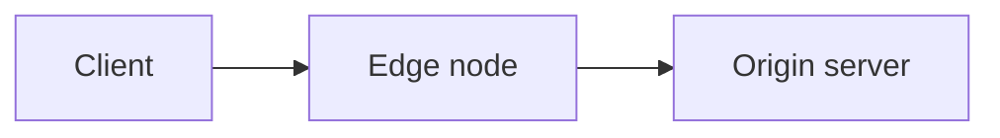

Documentation pages are MDX, and this page is the whole component vocabulary. A component absent from this page is not available: an invented import fails the build, and the legacy components that do resolve are banned in the next section, with the reasons.

## Do not use these components

These render, but they are not part of this site's vocabulary — legacy from the Astro docs fork, unmaintained, several styled with theme variables this site no longer defines:

`Card` · `Badge` · `FileTree` · `Checklist` · `Spoiler` · `Since` · `Button` · `TabBox` · `Breadcrumb`

All nine compile and emit markup, so nothing fails at build when one slips in. The concrete hazards: `FileTree` injects a nested `<html><body>` block into the page; `Since` fetches the npm registry at render time and reports Astro release versions; `TabBox` carries hardcoded npm and yarn content; `Card` calls an external screenshot service; `Button` duplicates `LinkButton` without its conventions. If you need what one of these would have done, use a table, an aside, or `LinkButton`.

## Asides

No import needed. Asides are written as remark directives, and they are the most common construct after links.

```mdx
:::note
Bucket names must be unique across all existing buckets.
:::

:::tip
**Increase limits** <br></br>
Contact [technical support](/en/documentation/services/support/) to request a higher limit for your plan.
:::

:::caution[important]
You are viewing the latest version. For accounts that are not migrated, refer to the [legacy reference](/en/documentation/products/build/edge-application/v3/).
:::
```

Valid types: `note`, `tip`, `caution`, `danger`.

**`:::warning` is not valid** and does not render as intended. Use `:::caution`.

The bracket text overrides the auto-translated title. In Portuguese pages, localize it: `:::note[nota]`, `:::tip[dica]`, `:::caution[Atenção]`.

## LinkButton

The house call to action.

```mdx
import LinkButton from 'azion-webkit/linkbutton'

<LinkButton severity="secondary" label="Real-Time Purge reference" link="/en/documentation/products/build/applications/real-time-purge/" />
```

Props in use: `link`, `label`, `severity="secondary"`, `outlined`, `icon`, `iconPos`.

## Code

Wrapper around expressive-code. Gives a copy button.

```mdx
import Code from '~/components/Code/Code.astro'

<Code lang="bash" code={`azion deploy --local`} />
```

Accepts only `code` and `lang`.

**The value is a JavaScript template literal.** Backticks and `${` inside it must be escaped, and a line continuation needs a doubled backslash. When a snippet contains either, that is a reason to use `<Code>` rather than a fence, because you control the escaping.

Fenced blocks are also house style. Use a fence for output the reader reads, and `<Code>` for input the reader copies.

Language tags in use: `bash`, `sh`, `json`, `javascript`, `js`, `typescript`, `ts`, `hcl`, `graphql`, `shell`, `text`, `plaintext`. Terraform is `hcl`, not `terraform`.

---

## Tabs and Fragment

The multi-interface pattern: one task, one panel per interface.

```mdx
import Tabs from '~/components/tabs/Tabs'
import Code from '~/components/Code/Code.astro'

<Tabs client:visible>
    <Fragment slot="tab.console">Console</Fragment>
    <Fragment slot="tab.api">API</Fragment>

<Fragment slot="panel.console">

1. Access [Azion Console](https://console.azion.com/) > **Object Storage**.
2. Select **+ Bucket**.

</Fragment>

<Fragment slot="panel.api">

<Code lang="bash" code={`curl ...`} />

</Fragment>

</Tabs>
```

- `client:visible` is mandatory. Without it the tabs render and do not switch.
- Every `tab.x` needs a matching `panel.x`.
- **Blank lines around markdown inside a Fragment are mandatory**, or the markdown renders as one literal paragraph.
- First panel is the default; put Console first unless there is a reason not to.
- Canonical keys: `tab.console`, `tab.api`, `tab.cli`, plus `tab.apiv3` / `tab.apiv4` for versioned APIs.
- Optional `sharedStore="package-managers"` syncs selection across tab groups on a page.

## Tag

Status badges.

```mdx
import Tag from 'primevue/tag';

<Tag severity="info" client:only="vue" value="Preview" />
```

`client:only="vue"` is mandatory. Without it the badge renders and does not hydrate.

## Video

No import needed. Emits the iframe plus schema.org `VideoObject` metadata.

```mdx
<Video
  src="https://www.youtube.com/embed/BV4jRPpADw8"
  title="Local development with Azion CLI"
  description="How the CLI supports local debugging and faster workflows."
  uploadDate="2023-10-17"
/>
```

`src` must be a YouTube **embed** URL. `src` and `title` are required.

## Mermaid diagrams

A diagram is a `mermaid` code fence, not an image. The text reaches an agent fetching the markdown twin; an image reference does not.

````md

````

Label every node and edge in words, and never rely on color alone to carry a distinction. A diagram never stands alone: architecture and use-case pages keep the numbered dataflow beneath it.

---

## Shared snippets

Reusable blocks under `~/includes/snippets/`, each with an `en/` and a `pt/` variant. Note the Portuguese folder is `pt/`, not `pt-br/`.

```mdx
import Apiv4Rollout from '~/includes/snippets/apiv4Rollout/en/snippet.mdx'

<Apiv4Rollout />
```

Available: `apiv4Rollout`, `JourneyAPI`, `InterfaceNote`, `LetsEncryptExpiration`, `RulesEngineExecution`.

## SectionBasicContent

Hero block, used on template showcase pages. Takes `description` and a `buttons` array, with content in a `<Fragment slot="content">`. Read an existing showcase page before using it.

## GuidesTable

Renders the Guides and tutorials hub as a table of name, last updated, and difficulty. Used on the hub page of a product section, and nowhere else.

```mdx
import GuidesTable from '~/components/GuidesTable.astro'

<GuidesTable
  lang="en"
  prefixes={['/documentation/build/cache/guides/', '/documentation/build/cache/tutorials/']}
  exclude={['/documentation/build/cache/guides/']}
/>
```

- `prefixes` — permalink prefixes whose pages fill the table. `exclude` drops the hub page itself.
- The date comes from the file's last git commit, read at build time. Never write it by hand. An uncommitted or shallow-cloned file shows a dash.
- Difficulty comes from the optional `difficulty` frontmatter field: `Beginner`, `Intermediate`, or `Advanced`. The value stays English on both language pages; the component localizes the label.
- Rows sort newest first, then by title.
- The same prefixes go in the menu row's `covers` field, so the pages pass the sidebar ownership check.

---

## GlossaryFilter

Client-side filter over a glossary table. Used on a product's Glossary page, and nowhere else.

```mdx
import GlossaryFilter from '~/components/GlossaryFilter.astro'

<GlossaryFilter lang="en">

| Term | Definition |
| --- | --- |
| cache key | The identifier an edge node builds from a request to decide whether two requests match the same cached object. |

</GlossaryFilter>
```

- The child is one GFM pipe table, `| Term | Definition |`. Blank lines around it are mandatory.
- `lang` localizes the filter placeholder and the empty-state message: `en` or `pt-br`.
- Each body row gets an anchor id from its term, ASCII-folded (`ação múltipla` → `#acao-multipla`), so a definition is deep-linkable. Ids are set at render time, so anchors work without JavaScript.
- Filtering is a progressive enhancement: without JavaScript the full table renders. Matching is case- and accent-insensitive, against the whole row.

## Tables and line breaks

Tables are plain GFM pipe tables. Horizontal scrolling is added automatically; do not wrap them yourself.

`<br />` or `<br></br>`. **Bare `<br>` breaks the build** — MDX requires every tag closed.

## MDX rules that break builds

- Bare `<` and `{` in prose are parsed as JSX. Escape them or use backticks.
- Every tag must be closed or self-closing.
- No H1 in the body; `title` renders it.
- `---` between major sections is house style, roughly three per page. Never immediately after the frontmatter block.
- Imports go directly after the frontmatter block, before any prose.

## Related resources

- [Code](/en/documentation/style-guide/formatting/code/) - when a fence carries output and a `<Code>` block carries input.
- [Text formatting](/en/documentation/style-guide/formatting/text/) - links, bold, italics, and monospace around the components.
- [Choose a content type](/en/documentation/style-guide/content/choose-a-content-type/) - the page kinds these components serve.
