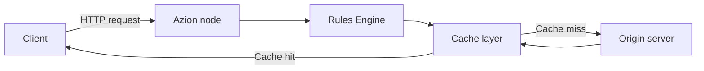

## Purpose

An architecture page shows how several products combine into one design. The reader wants to understand the shape of a solution before building it.

It applies the **explanation** base form, the same form as a [concept page](/en/documentation/style-guide/content/concept/). The difference is the subject: a concept page explains one thing, an architecture page explains how many things fit together.

## When to use

Write an architecture page when:

- A solution needs more than one product, and the relationship between them is the point.
- The reader must see the order of a request or a dataflow to understand the design.
- A guide keeps redrawing the same system in prose.

Do not write an architecture page when:

- The subject is one product or one idea. Write a [concept page](/en/documentation/style-guide/content/concept/).
- The reader wants to build the thing. Write a [multi-product guide](/en/documentation/style-guide/content/multi-product-guides/) and link it from here.
- The design cannot be drawn. A design you cannot draw is one you do not yet understand well enough to publish.

## Register

Descriptive: 25 words per sentence, active voice, passive only when the actor is unknown. Tone: explanatory, plain, systematic. [Sentence structure](/en/documentation/style-guide/writing/sentence-structure/) holds the rules.

## Structure

The title names the design as a noun phrase: `Content delivery on a distributed network`. The opening paragraph states what problem the design solves and for whom.

**Required sections, in order**

- **`## Architecture diagram`**: the diagram as a `mermaid` code fence, then a paragraph that reads it.
- **`### Dataflow`**: a numbered walkthrough of what moves where, with six items at most.
- **`## Components`**: what each part does and why it is there.
- **`## Implementation`**: links to the how-tos, and only links.
- **`## Related resources`**: the closing section, as bulleted links, each with its reason.

## Template

````md
<What problem this design solves, and for whom.>

## Architecture diagram

```mermaid
flowchart LR
  <the design, as text an agent can read>
```

<A paragraph that reads the diagram: what to look at first, and what depends on what.>

### Dataflow

1. <What moves first, and where it goes.>
2. <What the platform does with it.>
3. <Where the flow ends.>

## Components

- **<Component name>**: <what it does and why it is there>.
- **<Component name>**: <what it does and why it is there>.

## Implementation

- [<How-to that implements this design>](<guide URL>) - <why the reader follows it>.

## Related resources

- [<Related page>](<page URL>) - <what the reader gets there>.
````

## Rules

- **Draw the diagram in `mermaid`.** The diagram is text, so an agent fetching the markdown twin reads the design itself instead of an image reference. Do not use an image for an architecture diagram.
- **The diagram never stands alone.** The numbered dataflow carries the meaning, and it stays even when the diagram renders.
- **Label every node and edge in words**, and never rely on color alone to carry a distinction.
- **Name every component and say why it is there.** A list of product names is a parts list.
- **Link the implementation, do not inline it.** Steps belong in a [multi-product guide](/en/documentation/style-guide/content/multi-product-guides/).
- **Write only the sections you can confirm.** A required section whose content you cannot confirm with the team that owns the product is left out until you can, never filled with a guess.

## Examples

- [Deploy Jamstack websites on a distributed network](/en/documentation/architectures/jamstack/deploy-jamstack-applications/): a diagram, a numbered dataflow, the components involved, and links out to the implementation.

This trimmed excerpt shows the opening, the diagram section, and the dataflow:

````mdx
This design delivers a site's content from locations close to users. It reduces latency and the load on the origin infrastructure. Use it when your team delivers static-heavy sites and applications.

## Architecture diagram



The diagram shows the path of a request and its response through an application on Azion's distributed network. A client request reaches a node on Azion's distributed network, where Rules Engine and the cache layer process it. Content that is not in the cache comes from the origin server, and the response returns to the client through the same node.

### Dataflow

A request moves through the design in this order:

1. A client sends an HTTP or HTTPS request to a domain associated with an application.
2. At the Azion node, Rules Engine processes the request. It applies cache policies and image optimization behaviors in the request phase.
3. The cache layer evaluates the request. On a cache-key match, the node delivers the object from the cache.
4. On a cache miss, the node forwards the request to the origin server. The origin responds, and the node caches the content.
5. Before the response returns to the client, Rules Engine processes the response-phase policies. The node then delivers the content to the user.
````

## Related

- [Concept pages](/en/documentation/style-guide/content/concept/): the same base form, for one idea rather than a system.
- [Multi-product guides](/en/documentation/style-guide/content/multi-product-guides/): the page that builds what this one describes.
- [Images](/en/documentation/style-guide/formatting/images/): alt text and asset paths.
- [Choose a content type](/en/documentation/style-guide/content/choose-a-content-type/): the full catalogue of page kinds.
