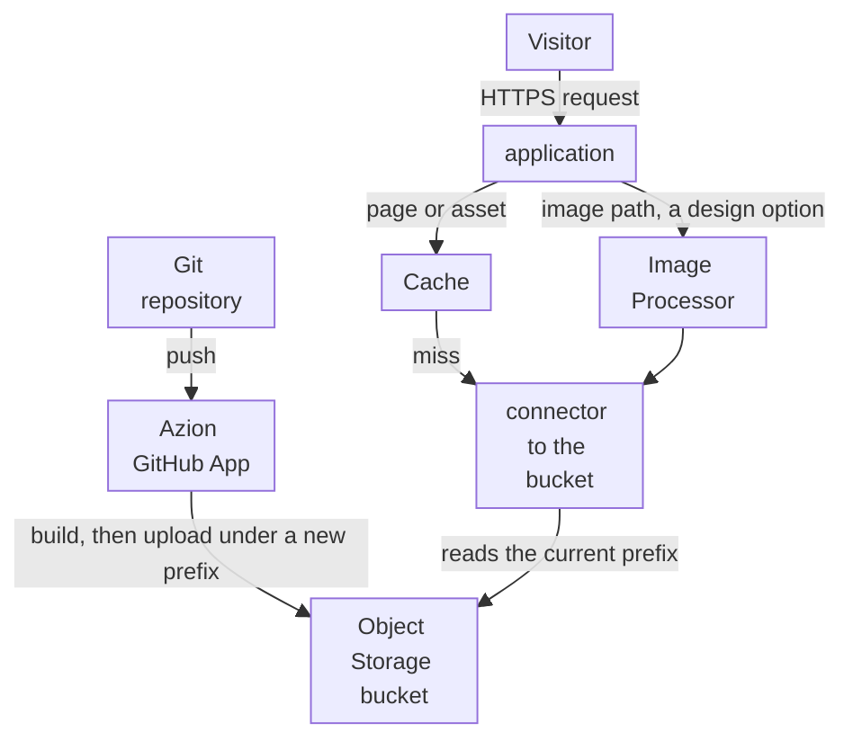
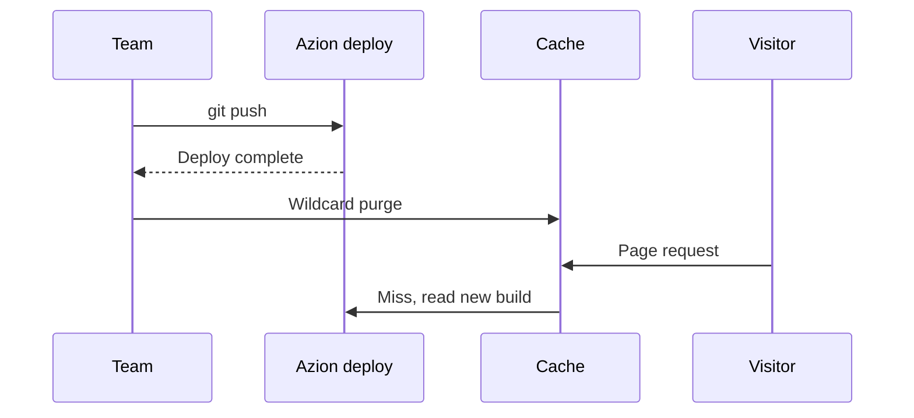

import DocCardGroup from '@aziontech/webkit/doc-card-group'
import DocCard from '@aziontech/webkit/doc-card'
import DocSteps from '@aziontech/webkit/doc-steps'
import DocStep from '@aziontech/webkit/doc-step'

A marketing, content, or web team owns the company's marketing site, campaign pages, or docs portal, and wants each change live quickly for visitors everywhere. The team builds the site with a framework and keeps its pages and content in a GitHub repository. This page connects the repository so that every push builds the site and deploys it to Object Storage, serves it through Cache, and purges the site after each deploy so the change reaches every location at once. The result is measured by time to first byte for visitors in every region, the time from a content change to a live page, and the share of requests answered from cache.

This use case does not cover e-commerce storefronts, which [Build e-commerce storefronts](/en/documentation/use-cases/build-and-run-applications/build-e-commerce-storefronts/) covers, or feature layers such as forms and A/B testing.

## Prerequisites

- An Azion account connected to your GitHub account through the Azion GitHub App. To connect it, refer to [Manage the Azion GitHub App](/en/documentation/guides/application-development/automation/azion-github-app/).
- Azion CLI installed and logged in, to create the project and send the purge from the terminal. To set it up, refer to [Azion CLI quickstart](/en/documentation/devtools/cli/quickstart/).
- Node.js 18 or later, and npm.
- A personal token, for the purge through the API. To create one, refer to [Personal tokens](/en/documentation/guides/platform/account-and-billing/personal-tokens/).
- The names this page uses: `example-site` for the repository, the project, and the application, `/about/` for a page of the site, and `www.example.com` for the domain. The deploy returns a `xxxxxxxxxx.map.azionedge.net` domain; to serve the site on your own domain, refer to [Add a custom domain to a workload](/en/documentation/guides/platform/migration/configure-a-domain/). Replace each value with yours in every step.

---

## Required products

| The site needs | Which means | Product | Documented in |
| --- | --- | --- | --- |
| Pages built from the repository on every push | A bucket the deploy creates and fills with the build output, under a new prefix for each deploy | Object Storage | [How Azion CLI works](/en/documentation/devtools/cli/how-it-works/#from-a-project-to-a-deployment) |
| Pages and assets that answer from cache | The cache setting and the rules the Astro preset generates for the application | Cache | [Build with Astro](/en/documentation/guides/application-development/frameworks/astro/) |
| A change that reaches every location once it is deployed | A wildcard purge for the site's domain after each deploy | Cache | [Purge pages when the origin publishes a change](/en/documentation/guides/application-performance/cache-and-purge/purge-on-publish/) |
| Images at the size and format each page asks for | Image Processor on the application, applied by a rule on image paths | Image Processor | [Image Processor quickstart](/en/documentation/platform/applications/image-processor/quickstart/) |

---

## Reference architecture

This page builds the *Git-driven static website*: every push to the repository builds the site, and an application serves the prebuilt files from Object Storage through Cache.



The diagram carries two flows that meet only at the bucket. The publish flow, at the top, runs from the repository through the Azion GitHub App and moves only when someone pushes. The request flow runs from the visitor through the application, where Cache answers from its copy and a miss reads a prebuilt file from the bucket. Nothing in the request flow builds or renders a page, so a visitor's request never waits on a build.

### Dataflow

1. A push to the connected repository starts a deploy, and the Azion GitHub App builds the site with the framework preset of the project, Astro on this page.
2. The deploy uploads the build output to the project's Object Storage bucket under a new storage prefix, and points the connector at that prefix. The files of earlier deploys stay in the bucket under their own prefixes.
3. A visitor's request reaches the workload on the site's domain, which hands it to the application, and the application's rules apply the cache setting the Astro preset generated.
4. Cache answers from its copy when it holds one. On a miss, the application reads the prebuilt file from the bucket through the connector, and Cache stores it for its Max Age.
5. When Image Processor is on, an image request is resized or converted from the original in the bucket, and Cache keeps each variation.
6. Once the deploy completes, a wildcard purge removes every page of the domain from Cache, and the next request for each page reads the new build from the bucket.

### Components

- **Azion GitHub App**: the integration that connects the GitHub account to Azion. It deploys every push to a connected repository, so publishing a change is a push and nothing else.
- **Object Storage**: holds the build output. Each deploy writes its files under its own prefix, which is what keeps an earlier build available for a rollback.
- **application**: the Platform Resource that delivers the site. Its connector reads the bucket, and its rules apply the cache setting that the project's configuration declares.
- **Cache**: stores pages and assets, so repeated requests never reach the bucket. Its Max Age bounds how long a page stays stale after a deploy that no purge follows.
- **Image Processor**: a design option that resizes and converts images on request, so the repository keeps one original per image.

### Other designs for this use case

- *Statically generated headless CMS website*: for teams whose editors work in a headless CMS such as ButterCMS, Cosmic, or Sanity. A static site generator reads the CMS API at build time, so publishing depends on a CMS event instead of a push, while visitors still read prebuilt files.
- *Server-rendered headless CMS website*: for teams that need content changes live without a rebuild, or pages that vary per request. Functions render each page on request with content from the CMS API, so the request and failure flows include a function and the CMS API, and freshness is a caching decision instead of a build.
- *Directly uploaded static website*: for teams that build the site in their own CI or export it from a tool. No build runs on Azion: the built files are uploaded to Object Storage with the CLI or the S3-compatible API, so versioning and invalidation decisions move to the team's own tooling.
- *Origin-hosted CMS website*: for teams that keep a CMS such as WordPress on their own servers. The CMS keeps rendering every page and the request flow reaches it on every miss, so cache bypass by path and session cookie, purge on publish, and WAF rules on the login and admin paths become the design decisions.

---

## Configure deploy on push

The site is an Astro project at the root of the repository, imported in Azion Console so that every push deploys it. Azion runs an Astro site as a static application: the build writes the site to `./dist`, and the deploy uploads that folder to a bucket the application serves. Astro is one of the presets the import form offers; the others are Next.js, Angular, Hexo, React, and Vue. The project must sit at the root of the repository, because the import reads it from there.

To create the project, run `azion init`, select the _Astro_ preset and a template, then build it once so the project carries its configuration file:

```bash
azion init --name example-site --auto -y
cd example-site
azion build
```

The build ends with these lines, and the folder now holds `azion.config.mjs`, the configuration the preset generated, with the bucket, the cache setting, and the rules of the site:

```text
[Azion] [IaC] › ✔  success   Manifest generated successfully at <project-dir>/example-site/.edge/manifest.json
Your Application was built successfully
```

Push the folder to the `example-site` repository on GitHub. Then, to import the repository:

<DocSteps>
  <DocStep title="Open Import from GitHub">

  Access [Azion Console](https://console.azion.com/) > **Create** > **Import from GitHub**, then select the card in the **Import from GitHub** tab.

  </DocStep>
  <DocStep title="Select the repository">

  Select the **Git Scope** of your GitHub account, then the `example-site` **Repository**.

  </DocStep>
  <DocStep title="Name the application">

  In **General**, keep `example-site` as the **Application Name**. The storage bucket takes the same name.

  </DocStep>
  <DocStep title="Select the Astro preset">

  Set **Preset** to _Astro_.

  </DocStep>
  <DocStep title="Keep the root directory">

  In **Root Directory**, keep `/`.

  </DocStep>
  <DocStep title="Enter the install command">

  In **Install Command**, enter `npm install`.

  </DocStep>
  <DocStep title="Select Deploy" />
</DocSteps>

The deploy page shows the **Deploy Log** while the site builds, then **Successfully created!** and the domain URL. The repository stays connected: every push to it deploys the site again. For every field of the form, refer to [Import a project from GitHub](/en/documentation/guides/application-development/automation/import-an-existing-project-from-github/).

---

## Configure the purge after each deploy

A deploy uploads the new build under a new prefix, and pages already in cache keep the old build until their Max Age ends. One wildcard purge for the whole domain, sent once the deploy completes, makes every page read the new build. A wildcard fits because a build can change any page, and one purge per deploy stays far below the 2,000 wildcard requests Azion accepts in a 24-hour interval. Send it once the deploy of the push completes: a purge sent while the deploy still runs can refill the cache from the old build.



1. The team pushes a change, and the deploy builds and uploads the new files.
2. The deploy completes, and the bucket holds the new build.
3. The team sends the wildcard purge for `www.example.com/*`.
4. The next request for each page misses the cache and reads the new build from the bucket.

The team sends the wildcard purge as [Purge pages when the origin publishes a change](/en/documentation/guides/application-performance/cache-and-purge/purge-on-publish/#purge-image-variants-when-an-image-changes) describes for a wildcard, from Azion Console, the API, or the Azion CLI, with the site's values:

- **Expression**: `www.example.com/*`, every page of the domain, on the Cache layer. In the API, the body of `POST /v4/workspace/purge/wildcard` is `{"items":["www.example.com/*"]}`. In the CLI, the command is `azion purge --wildcard "www.example.com/*"`.
- **When**: once per push, after its deploy completes.

Every page of `www.example.com` leaves the cache once the purge propagates, and the next request for each one reads the new build. To confirm a purge completed, find it in the purge history, as [Confirm the purge completed](/en/documentation/guides/application-performance/cache-and-purge/purge-on-publish/#confirm-the-purge-completed) describes.

---

## Verify the setup

Each check sends a request with the `Pragma: azion-debug-cache` header, which makes the response carry the `x-cache` header. For how to read it, refer to [Check the cache status of a response](/en/documentation/guides/application-performance/cache-and-purge/check-page-cache-time/).

- **The site answers on its domain.** Open `https://www.example.com/` in a browser. A first deploy that answers with a `404` page reading `There's nothing here yet` has not reached that location yet; wait a few minutes and retry.

- **Pages answer from cache.** Request a page twice:

  ```bash
  curl -sI -H "Pragma: azion-debug-cache" https://www.example.com/about/
  ```

  The second response carries `x-cache: HIT`. The first can carry `MISS`, while Azion reads the page from the bucket.

- **A push reaches the page.** Change the text of the `/about/` page, commit, and push. Wait for the deploy to complete, send the wildcard purge, and request the page again. The response carries `x-cache: MISS` and the new text, and the request after it carries `HIT`.

- **Images are processed**, when Image Processor is on. Request an image with an `ims` query string, such as `https://www.example.com/images/hero.jpg?ims=400x`. The response carries `x-ims: Enabled`.

---

## Measuring results

| Metric | Where to read it | What working looks like |
| --- | --- | --- |
| Time to first byte for visitors in every region | The `ttfb` field of Edge Pulse measurements, taken in the visitors' browsers by a tag the site's pages carry. Refer to [Edge Pulse quickstart](/en/documentation/platform/edge-pulse/quickstart/) | Low and comparable across regions, because every page is a prebuilt file in cache |
| Time from a content change to a live page | The time of each commit on GitHub, against the purge history of **Real-Time Purge**, which lists each purge when it is complete. Refer to [Real-Time Purge](/en/documentation/platform/applications/cache/real-time-purge/#confirmation) | The purge after each push completes, and no page waits for its Max Age to expire |
| Share of requests answered from cache | **Requests Offloaded** in Real-Time Metrics, filtered to the site's domain. Refer to [Measure cache offload for a domain](/en/documentation/guides/platform/observability/measure-cache-offload/) | High between deploys, with a short dip after each purge. A miss reads the bucket, never a server the team runs |

---

## Best practices

- **Roll back with a revert, not a hotfix in the Console.** Every push deploys the site, so a commit that reverts the change deploys the earlier content again through the same build, and the repository keeps the history. For a project deployed with the Azion CLI, `azion rollback` serves the files of an earlier deploy from the bucket instead. For its flags, refer to [Azion CLI rollback](/en/documentation/devtools/cli/rollback/).
- **Purge after each deploy instead of shortening Max Age.** A short Max Age sends more requests to the bucket and still leaves a stale window after every push. The purge refreshes every page once, and Max Age stays a safety bound for a missed purge.
- **Keep one original per image.** Image Processor resizes and converts on request, so the repository needs no copy per size. For the rule and the cache setting that keep each variation, refer to [Image Processor quickstart](/en/documentation/platform/applications/image-processor/quickstart/).

---

## Guides in this use case

<DocCardGroup cols={2}>
  <DocCard title="Purge pages when the origin publishes a change" href="/en/documentation/guides/application-performance/cache-and-purge/purge-on-publish/" label="Sends the wildcard purge after each deploy, and confirms it completed." />
</DocCardGroup>
