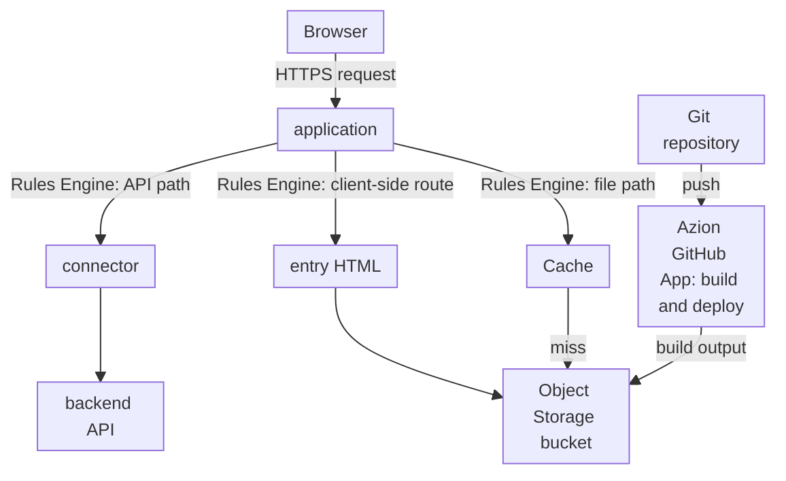

import DocCardGroup from '@aziontech/webkit/doc-card-group'
import DocCard from '@aziontech/webkit/doc-card'

A front-end team builds the web interface of a product whose backend already runs elsewhere, in a cloud region, a data center, or a SaaS API. The interface is a single-page application built with a framework such as React, Vue, or Angular, and the backend stays where it is. This page serves the compiled interface from Azion, falls back to the entry HTML for client-side routes, and sends every request under `/api/` through a connector to the existing backend, on the same domain. The result is measured by interface load time per region, the time from a commit to a live change, and the latency the routing adds to API calls.

This use case does not cover applications whose backend also runs on Azion. For that, refer to [Deploy full-stack applications globally](/en/documentation/use-cases/build-and-run-applications/deploy-full-stack-applications-globally/).

## Prerequisites

- A single-page application deployed to Azion with the Azion CLI and its framework preset, from a project folder that holds its `azion.config.cjs` file. The deploy creates the bucket, the application, and the workload that serve the interface. For the React route, refer to [Deploy a React app](/en/documentation/guides/application-development/frameworks/react/). Vue and Angular follow the same route with their own preset.
- The [Azion CLI](/en/documentation/devtools/cli/quickstart/), installed and logged in, in that project folder.
- A backend that answers HTTPS on port `443` under its own hostname.
- The values of your interface. This page uses `api.example.com` for the backend, `/api/` for the path prefix of every API call the interface makes, `/api/health` for one backend path the checks request, and `<workload-domain>` for the domain the deploy printed. Replace each value with yours in every step.

---

## Required products

| The interface needs | Which means | Product | Documented in |
| --- | --- | --- | --- |
| Interface files stored on Azion | The build output, uploaded by `azion deploy` to a bucket that workloads can only read | Object Storage | [Deploy a React app](/en/documentation/guides/application-development/frameworks/react/) |
| Interface files served from cache | The cache setting the preset's `Deliver Static Assets and Set Cache Policy` rule applies | Cache | [Azion CLI deploy](/en/documentation/devtools/cli/deploy/) |
| Client-side routes that load the interface | The preset's `Redirect to index.html` rule, which rewrites route requests to `/index.html` | Application Accelerator | [Rewrite Request](/en/documentation/platform/applications/rules-engine/#rewrite-request) |
| API calls that reach the existing backend | A connector to the backend, and a rule that sends `/api/` to it before any other rule runs | Connectors | [Route an API path to a backend from azion.config](/en/documentation/guides/application-development/automation/route-an-api-path-to-a-backend/) |

---

## Reference architecture

This page builds the *Client-rendered frontend over origin APIs*: the browser renders the interface from static files, and every data call crosses Azion to the existing backend.



The diagram carries two flows. The publish flow runs from the repository to the bucket, and it moves only when the team deploys a change. The request flow starts at the browser, and the application's rules split it three ways: API paths cross to the backend, files of the build come from Cache or the bucket, and every client-side route returns the entry HTML. Only the first path leaves Azion, so a page load reads static files, and every data call reaches the backend origin.

### Dataflow

1. A push to the repository, or `azion deploy` from the project folder, builds the interface and uploads the build output to the bucket.
2. A browser's request reaches the workload on the interface's domain, and the application runs its request rules in order.
3. A request under `/api/` matches the first rule, which sends it through the backend connector and ends the request phase, so no later rule rewrites or caches it.
4. The backend answers the API call, and the browser renders the data into the interface.
5. A request for a file of the build, such as a script or a stylesheet, is answered from Cache. On a miss, the application reads the file from the bucket and caches it.
6. A request for a client-side route, such as `/orders/42`, is rewritten to `/index.html`, and the router in the browser renders that route.

### Components

- **Object Storage**: holds the compiled interface in a bucket that workloads can only read. The interface has no server of its own, so the bucket is its origin.
- **Cache**: keeps the files of the build near the browsers that request them, so repeated page loads read the files from Cache instead of the bucket.
- **application**: the Platform Resource that serves the interface's domain and holds the rules that split files, routes, and API calls.
- **Rules Engine**: the Feature of the application that routes API paths to the connector and rewrites client-side routes to the entry HTML. The API rule runs first and ends the Request Phase, because every matching rule runs in order and a later rule could rewrite an API call.
- **connector**: the Platform Resource that reaches the backend. It sends the backend's own name in the `Host` header, so a backend that serves several sites answers for it.
- **backend API**: the integration that is the existing origin. It stays where it runs, and every data call of the interface reaches it.
- **Azion GitHub App**: the integration that imports the repository and deploys every push to it, so the interface on Azion follows the repository.

### Other designs for this use case

- *Server-rendered frontend over origin APIs*: for interfaces that need server rendering, such as search-indexed or personalized pages. Functions render each page on request with a framework such as Next.js or Nuxt and call the backend's APIs, so the backend sits in the request flow and the failure flow of every page that Cache does not hold.

---

## Configure the API route

The API route is a connector to the backend and a rule that sends every `/api/` request to it. Both go in the project's `azion.config.cjs`, the file that `azion deploy` applies to the application, so the route ships with every deploy of the interface.

The rule is the first entry of the request rules, and it ends the request phase. The preset's `Redirect to index.html` rule rewrites route requests to `/index.html`, and every matching rule of the phase runs, in order. Without a stop, a later rule could rewrite an API call's path or apply the cache setting of the interface files to it. **Finish Request Phase** ends the phase, so the rules after it never see an API call.

The project's `azion.config.cjs` declares the route as [Route an API path to a backend from azion.config](/en/documentation/guides/application-development/automation/route-an-api-path-to-a-backend/) describes, with these values, and `azion deploy` in the project folder applies it:

| Entry | Value | Why |
| --- | --- | --- |
| Connector `name` | `api-backend` | The name the rule's `set_connector` behavior names. The connector sits beside the storage connector the preset declared |
| Connector address | `api.example.com` | The backend's own hostname |
| `connectionOptions.transportPolicy` | `force_https` | The backend answers HTTPS on port `443` only |
| `connectionOptions.host` | `api.example.com` | The default `${host}` would send the interface's domain, which a backend that routes requests by name may not answer for |
| Rule position | The first entry of `rules.request`, before the rules the preset generated | So the preset's `Redirect to index.html` rule never sees an API call |
| Rule criterion | `${uri}` `starts_with` `/api/` | Every API call the interface makes |
| Rule behaviors | `set_connector` with `api-backend`, then `finish_request_phase` | The backend receives the call, and no later rule rewrites or caches it |

Requests under `/api/` reach `api.example.com` with their own path, and every other request keeps the preset's behavior. A new rule takes a few minutes to reach every data center.

---

## Verify the setup

- **The interface loads.** Request the root of the domain:

  ```bash
  curl -s -D - -o /dev/null https://<workload-domain>/
  ```

  The response carries `200`. Until the deploy reaches a location, the domain answers `404` with a page that reads `There's nothing here yet`. Wait and request it again.

- **A client-side route loads the interface.** Request a route the interface handles, such as `/orders/42`:

  ```bash
  curl -s https://<workload-domain>/orders/42
  ```

  The body is the same entry HTML that `/` returns. The router in the browser then renders the route.

- **Interface files come from cache.** Request a script of the build twice, with the debug header. Take its path from a `<script>` tag of the entry HTML:

  ```bash
  curl -sI -H "Pragma: azion-debug-cache" https://<workload-domain>/<script-path>
  ```

  The second response carries `x-cache: HIT`. For how to read the header, refer to [Check the cache status of a response](/en/documentation/guides/application-performance/cache-and-purge/check-page-cache-time/).

- **API calls reach the backend.** Request a backend path:

  ```bash
  curl -s -D - https://<workload-domain>/api/health
  ```

  The response is the backend's own answer for `/api/health`, not the entry HTML. When it is the entry HTML, the API rule is not the first request rule, or it has not propagated yet.

To see which rules ran on a request, turn on [Debug Rules](/en/documentation/platform/applications/main-settings/#debug-rules).

---

## Measuring results

| Metric | Where to read it | What working looks like |
| --- | --- | --- |
| Interface load time per region | The `pageloadtime` field of Edge Pulse measurements, taken in the visitors' browsers, refer to [Edge Pulse quickstart](/en/documentation/platform/edge-pulse/quickstart/). For the share Azion serves, the `requestTime` of `workloadMetrics` grouped by `geolocCountryName`, refer to [Real-Time Metrics GraphQL fields](/en/documentation/devtools/graphql/gql-real-time-metrics-fields/#workloadmetrics) | Page loads stay close across regions, because every location serves the same cached files |
| Time from a commit to a live change | The Console page that follows each deploy, which `azion deploy` opens. Refer to [Azion CLI deploy](/en/documentation/devtools/cli/deploy/) | A later deploy answers in about two minutes, after the first one has reached every location |
| Latency the routing adds to API calls | The **Request Time** and **Upstream Response Time** of HTTP Requests records in Real-Time Events, filtered with `request_uri like '/api/%'`. Refer to [Data sources](/en/documentation/platform/real-time-events/data-sources/#http-requests) | The gap between the two values stays small next to the backend's own response time |

---

## Best practices

- **Call the API with relative paths.** An interface that calls `/api/orders` reaches the backend through the same domain that served it, so the backend's hostname appears only in the connector, and moving the backend changes one connector instead of the interface code.
- **Keep the API rule first, and end the request phase in it.** A later rule can still rewrite or cache what an earlier rule routed, because every matching rule runs. **Finish Request Phase** is what keeps the rewrite and the interface cache off the API path. For how rules run in order, refer to [How Applications works](/en/documentation/platform/applications/how-it-works/#how-rules-run).
- **Declare the route in the configuration file.** `azion deploy` applies the rules the file declares to the application. A rule kept in one place goes out with every deploy of the interface.
- **Send the backend's own name in the Host header.** A backend that serves several sites picks the site by `Host`. For when to send `${host}` and when a literal name, refer to [Set the Host header to a name your origin answers for](/en/documentation/platform/connectors/best-practices/#set-the-host-header-to-a-name-your-origin-answers-for).

---

## Guides in this use case

<DocCardGroup cols={2}>
  <DocCard title="Route an API path to a backend from azion.config" href="/en/documentation/guides/application-development/automation/route-an-api-path-to-a-backend/" label="Declares the api-backend connector and the first request rule that sends every /api/ call to the backend." />
</DocCardGroup>
