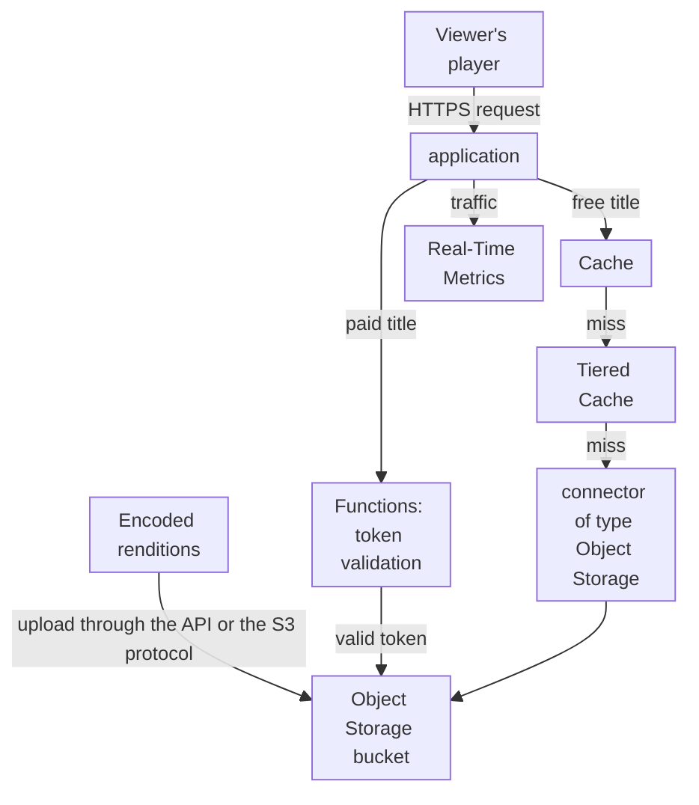
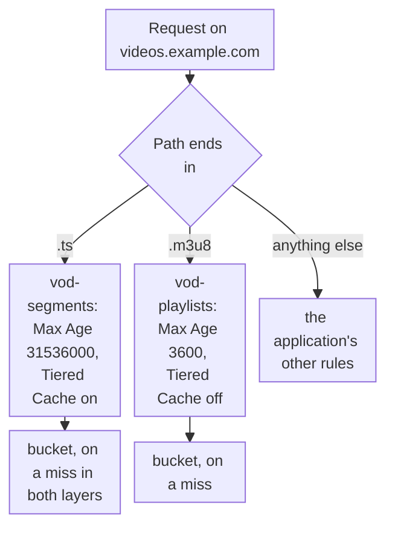

import DocCardGroup from '@aziontech/webkit/doc-card-group'
import DocCard from '@aziontech/webkit/doc-card'

A media, e-learning, or streaming team serves a library of on-demand videos, already encoded in HLS. Every title is a set of playlists and thousands of segments, the same files for every viewer, and a title in demand is requested by many viewers at once. A segment never changes once it is encoded, while a playlist can be rewritten when a title is re-published. This page stores the encoded library in Object Storage and configures an application that caches segments for a long time, with Tiered Cache, and playlists for a shorter time. The result is measured by the share of playlist and segment requests answered from cache, and by the share of misses that the Tiered Cache layer answers without reading the bucket.

This use case does not cover encoding the videos, which happens before delivery.

## Prerequisites

- A bucket for the library, with **Workloads Access** set to _Read Only_. To create one, refer to [Create a bucket](/en/documentation/guides/application-development/data/create-and-modify-bucket/).
- An application that serves the bucket through a connector of type Object Storage with the prefix `/vod`, and a rule that sends every path to it. To create both, refer to [Use a bucket as an application origin](/en/documentation/guides/application-development/data/use-bucket-as-origin/).
- A hostname for the library that points at the workload of the application. To create the record, refer to [Point a domain to a workload](/en/documentation/guides/platform/migration/point-domain-to-azion/).
- A personal token, for the API procedures. To create one, refer to [Personal tokens](/en/documentation/guides/platform/account-and-billing/personal-tokens/).
- The encoded HLS files of each title, as your packager wrote them: a main playlist, one playlist per rendition, and the segments.
- The values of your library. This page uses `video-library` for the bucket, `videos.example.com` for the hostname, and `course-101` for a title, with the files `master.m3u8`, `720p/index.m3u8`, and `720p/segment-00001.ts`. Replace each value with yours in every step.

---

## Required products

| The video library needs | Which means | Product | Documented in |
| --- | --- | --- | --- |
| The encoded renditions stored on Azion, with no origin of the team's own | A bucket that holds every playlist and segment under one prefix, read by the application through a connector | Object Storage | [Use a bucket as an application origin](/en/documentation/guides/application-development/data/use-bucket-as-origin/) |
| Segments that answer from cache close to viewers | A cache setting with a long Max Age and Tiered Cache, applied by a rule on the `.ts` extension | Cache | [Cache an on-demand HLS library by file extension](/en/documentation/guides/media-and-streaming/streaming/cache-an-on-demand-hls-library-by-file-extension/) |
| Playlists that answer from cache and still pick up a re-published title | A cache setting with a shorter Max Age, applied by a rule on the `.m3u8` extension | Cache | [Real-Time Purge](/en/documentation/platform/applications/cache/real-time-purge/) |
| Paid titles that only a viewer with a valid token receives | A function in front of the bucket that validates a JSON Web Token on the paid paths | Functions | [Authenticate requests with Functions](/en/documentation/guides/application-development/data/auth-layer-object-storage-functions/) |
| The share of requests answered from cache | The **Requests Offloaded** and **Tiered Cache Offload** charts, filtered to the library's hostname | Real-Time Metrics | [Measure cache offload for a domain](/en/documentation/guides/platform/observability/measure-cache-offload/) |

---

## Reference architecture

This page builds the *Object storage-hosted video library*: the encoded library moves to Object Storage, and an application serves it through Cache and Tiered Cache.



The diagram carries two flows. The upload flow runs from the team to the bucket, and it moves only when a title is added or re-encoded: the library lives on Azion, so the control flow carries this step instead of a customer origin. The request flow runs from the viewer's player through the application, where the cache layers answer most requests, and only a miss in both layers reads the bucket. A paid title takes the function's path, which reads the bucket only for a request with a valid token.

### Dataflow

1. The team uploads the encoded playlists and segments of each title to the bucket, under the `vod/` prefix, with the content type of each file.
2. A viewer's player requests a title's main playlist from the workload on `videos.example.com`, which hands the request to the application.
3. A rule matches the file extension and applies a cache setting: a long Max Age with Tiered Cache for segments, a shorter one for playlists.
4. Cache answers from its copy. A segment missing in Cache is asked of the Tiered Cache layer, and only a miss in every layer is read from the bucket through the connector and cached for the next viewer.
5. For a paid title, a function validates the viewer's token and reads the object from the bucket only when the token is valid.
6. The player reads the rendition playlist and fetches its segments the same way, and Real-Time Metrics reports the requests and the data that each cache layer answered.

### Components

- **Object Storage**: holds the library, every playlist and segment under a prefix of one bucket. The bucket gives the platform read-only access, and the team writes to it through the API or the S3 protocol.
- **application**: the Platform Resource that delivers the library. A connector to the bucket and a rule with _Set Connector_ make the bucket its source, and rules by file extension apply a cache setting to each kind of file.
- **Cache**: keeps the segments and the playlists close to viewers. A segment under its key never changes, so it can stay cached for a long time, while a playlist that can be rewritten takes a shorter Max Age.
- **Tiered Cache**: the Feature that adds a second cache layer, shared by every data center, between Cache and the bucket. It concentrates the misses of all data centers, so the bucket is read rarely for each segment.
- **Functions**: validate an access token before a paid title leaves the bucket, a design option for gated content. A request without a valid token never reads the bucket.
- **Real-Time Metrics**: reports the requests and the data that Cache and the Tiered Cache layer answered, filtered to the library's hostname.

### Other designs for this use case

- *Origin-hosted video library*: for teams that keep the library in their own cloud bucket or media origin. The application fetches each segment through a connector on a miss and caches it with a long TTL and Tiered Cache, so the origin serves each segment rarely, while its egress and its availability stay in the data flow and the failure flow.

---

## Configure the library upload

The library upload puts each title in the bucket under keys that the connector serves unchanged. The connector's prefix is `/vod`, so the object `vod/course-101/master.m3u8` answers at `/course-101/master.m3u8`. Upload every file under the same relative path the packager wrote, so the paths inside each playlist still point at the files they list.

Each upload sends `Content-Type`, because the stored type is the one this header carries and it is returned on every read. Without the header, Azion detects the type, which is not guaranteed for every file. This page uses `application/vnd.apple.mpegurl` for playlists, the type the [HLS specification](https://datatracker.ietf.org/doc/html/rfc8216#section-4) names for them, and `video/mp2t` for MPEG-2 transport stream segments.

To upload the main playlist of the title:

```bash
curl --request POST \
  --url https://api.azion.com/v4/workspace/storage/buckets/video-library/objects/vod/course-101/master.m3u8 \
  --header 'Accept: application/json' \
  --header 'Authorization: Token <personal-token>' \
  --header 'Content-Type: application/vnd.apple.mpegurl' \
  --data-binary '@./course-101/master.m3u8'
```

The API answers `201` with the key the object is stored under:

```json
{
  "state": "executed",
  "data": {
    "object_key": "vod/course-101/master.m3u8"
  }
}
```

To upload a segment, send the same request with its key and its type:

```bash
curl --request POST \
  --url https://api.azion.com/v4/workspace/storage/buckets/video-library/objects/vod/course-101/720p/segment-00001.ts \
  --header 'Accept: application/json' \
  --header 'Authorization: Token <personal-token>' \
  --header 'Content-Type: video/mp2t' \
  --data-binary '@./course-101/720p/segment-00001.ts'
```

The API answers `201` with `"object_key": "vod/course-101/720p/segment-00001.ts"`. Upload the rendition playlist, `720p/index.m3u8`, and every other segment of the title the same way. For a library of many files, an S3 client such as s3cmd uploads them with a credential scoped to `video-library`, as [Use S3-compatible tools with Object Storage](/en/documentation/guides/application-development/data/use-s3-compatible-tools-with-object-storage/) shows. Azion Console refuses a single file larger than 300 MB, a bound that the API and the S3 protocol do not have.

When a title is re-encoded, upload it under a new key, such as `vod/course-101-v2/`, instead of replacing the files in place. An upload to a key in use replaces the object with no version history, and a key that never serves different content is what lets its segments stay cached for a long time.

The bucket holds every file of `course-101` under `vod/course-101/`, and the application can serve it at `https://videos.example.com/course-101/master.m3u8`.

---

## Configure the cache for playlists and segments

The library cache is two cache settings and two rules that apply them by file extension, because a segment and a playlist change at different rates.

- **Segments**: **Max Age** is `31536000` seconds, the highest value the field accepts. A segment under its key never changes, since a re-encoded title gets new keys, so nothing forces it out of the cache. Tiered Cache is on, with the `nearest-region` topology, so a segment missing in one data center is answered from the second layer instead of the bucket.
- **Playlists**: **Max Age** is `3600` seconds. A main playlist can be rewritten in place to point at a re-encoded title, so one hour bounds how long a viewer can receive the old one. Tiered Cache stays off for playlists, because a URL purge does not reach the Tiered Cache layer, and a rewritten playlist should leave the cache with one URL purge.
- **Both**: the browser cache is overridden to `0` seconds. A copy in the viewer's browser cannot be purged, so a withdrawn title would stay playable there until it expired.



1. A path that ends in `.ts` takes the `vod-segments` cache setting.
2. A path that ends in `.m3u8` takes the `vod-playlists` cache setting.
3. Any other path is left to the application's other rules.
4. A miss reaches the bucket through the connector, and the response is cached under the setting its path took.

Create both cache settings and both rules as [Cache an on-demand HLS library by file extension](/en/documentation/guides/media-and-streaming/streaming/cache-an-on-demand-hls-library-by-file-extension/) describes, with these values:

| File type | Cache setting | Max Age | Tiered Cache | Browser cache | Rule | Argument of `${uri}` _matches_ |
| --- | --- | --- | --- | --- | --- | --- |
| Segments | `vod-segments` | `31536000` | On, `nearest-region` | Override, `0` | `vod - cache segments` | `\.ts$` |
| Playlists | `vod-playlists` | `3600` | Off | Override, `0` | `vod - cache playlists` | `\.m3u8$` |

In a JSON body, for the API or the CLI, the arguments are written `"\\.ts$"` and `"\\.m3u8$"`.

Segments are cached for 31,536,000 seconds in Cache and in the Tiered Cache layer, and playlists for 3,600 seconds in Cache. Browsers keep neither. A new rule takes a few minutes to propagate.

---

## Verify the setup

Each cache check sends a request with the `Pragma: azion-debug-cache` header, which makes the response carry the `x-cache` header. For how to read it, refer to [Check the cache status of a response](/en/documentation/guides/application-performance/cache-and-purge/check-page-cache-time/).

- **The library is served from the bucket with its type.** Request the main playlist:

  ```bash
  curl -sI https://videos.example.com/course-101/master.m3u8
  ```

  The response carries `200` and `content-type: application/vnd.apple.mpegurl`, the type stored at upload.

- **Segments answer from cache.** Request a segment twice:

  ```bash
  curl -sI -H "Pragma: azion-debug-cache" https://videos.example.com/course-101/720p/segment-00001.ts
  ```

  The second response carries `x-cache: HIT`. The first can carry `MISS`, while the application reads the segment from the bucket.

- **Playlists answer from cache.** Request the main playlist twice with the same header. The second response carries `x-cache: HIT`.

- **A rewritten playlist leaves the cache.** Send a URL purge for `https://videos.example.com/course-101/master.m3u8`, as [Purge cached content](/en/documentation/guides/application-performance/cache-and-purge/purge-cached-content/) shows. Once it appears in the purge history, the next request carries `x-cache: MISS`.

- **Paid titles refuse a request without a token.** When a function guards the paid paths, a request without a token receives HTTP `401`, as [Authenticate requests with Functions](/en/documentation/guides/application-development/data/auth-layer-object-storage-functions/) shows.

A rule that seems to have no effect may still be propagating. When it persists after a few minutes, turn on [Debug Rules](/en/documentation/platform/applications/main-settings/#debug-rules) to see which rules ran on the request.

---

## Measuring results

| Metric | Where to read it | What working looks like |
| --- | --- | --- |
| Share of requests answered from cache | **Requests Offloaded** in Real-Time Metrics, filtered to `videos.example.com`. Refer to [Measure cache offload for a domain](/en/documentation/guides/platform/observability/measure-cache-offload/) | Rises as each title is watched, because a segment is read from the bucket only when no cache layer holds it |
| Share of data delivered from cache | **Edge Offload** on the **Data Transferred** dashboard, filtered to `videos.example.com` | Follows Requests Offloaded, weighted by the size of the segments |
| Misses answered by the Tiered Cache layer | The **Tiered Cache Offload** chart of the **Tiered Cache** tab. Refer to [Find what reached the origin](/en/documentation/guides/platform/observability/measure-cache-offload/#find-what-reached-the-origin) | Most segment misses in a data center are answered by the second layer, not by the bucket |

---

## Best practices

- **Version a re-encoded title instead of replacing it.** A key that never serves different content can stay cached for the full **Max Age**, and both versions exist while viewers move to the new one. Only the main playlist, which the site embeds, is rewritten in place:

  ```text
  vod/course-101/master.m3u8
  vod/course-101/720p/segment-00001.ts
  vod/course-101-v2/720p/segment-00001.ts
  ```

  The cost is that old keys accumulate, so remove the ones no playlist references.
- **Purge Tiered Cache first when you withdraw a title.** Deleting an object from the bucket does not remove its cached copies. Purge each segment from the Tiered Cache layer by cache key, then from Cache, or the first layer refills from the second. For the purge order, refer to [Tiered Cache](/en/documentation/platform/applications/cache/tiered-cache/#purge).
- **Keep viewers off the S3 endpoint.** A pre-signed URL handed to a player sends every request to a management interface, with no cache, and requests that reach objects without an application are subject to rate limits. Serve the library only through the application. For the reasoning, refer to [Object Storage best practices](/en/documentation/platform/object-storage/best-practices/#serve-objects-to-end-users-through-an-application).
- **Scope the upload credential to the library bucket.** A credential created without `buckets` reaches every bucket in the account, and its secret key is returned only once. Name `video-library` in `buckets`, and grant only the capabilities the upload uses. For the fields, refer to [Object Storage best practices](/en/documentation/platform/object-storage/best-practices/#scope-an-s3-credential-to-the-buckets-and-capabilities-it-needs).

---

## Guides in this use case

<DocCardGroup cols={2}>
  <DocCard title="Cache an on-demand HLS library by file extension" href="/en/documentation/guides/media-and-streaming/streaming/cache-an-on-demand-hls-library-by-file-extension/" label="Creates the vod-segments and vod-playlists cache settings and the rules that apply them by file extension." />
</DocCardGroup>
