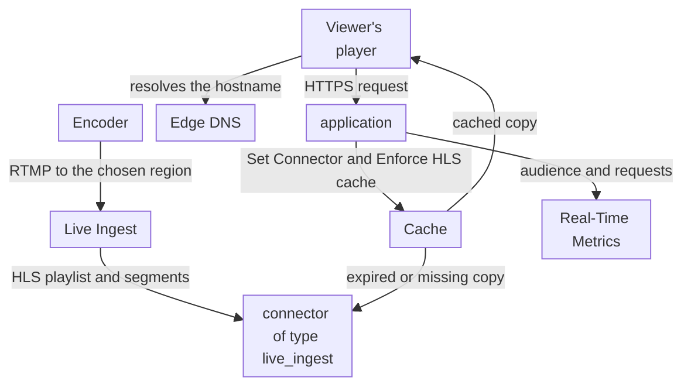
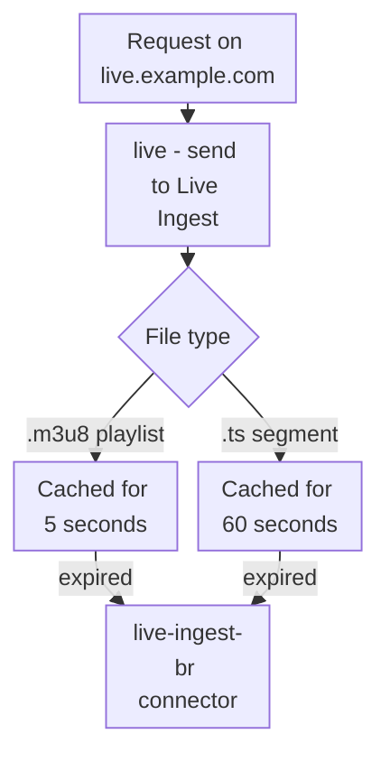

import DocCardGroup from '@aziontech/webkit/doc-card-group'
import DocCard from '@aziontech/webkit/doc-card'

A broadcaster, sports, or events team streams a live event to an audience that grows from thousands to millions of viewers in minutes, as an example. The team has an encoder at the venue and no streaming origin of its own. Every viewer fetches the same playlist and the same segments at almost the same moment, and the playlist changes every few seconds while each segment never changes. This page connects the encoder to Live Ingest, which converts the stream to HLS, and configures an application that serves the playlist and the segments from cache to every viewer. The result is measured by the requests that reach Live Ingest per connected viewer during the peak, and by the share of requests answered from cache.

This use case does not cover on-demand libraries, ad insertion, or DRM. For on-demand video, refer to [Deliver an on-demand video library](/en/documentation/use-cases/deliver-media-and-streaming/deliver-an-on-demand-video-library/).

## Prerequisites

- An application that serves only the stream, behind a workload. To create both, refer to [Applications quickstart](/en/documentation/platform/applications/quickstart/).
- A hostname for the stream that points at the workload. To create the record, in Edge DNS or at your DNS provider, refer to [Point a domain to a workload](/en/documentation/guides/platform/migration/point-domain-to-azion/).
- An encoder that pushes RTMP with username and password authentication, and the ingest URLs and credentials Azion provides for a primary and a backup endpoint. For the requirement, refer to [Ingestion](/en/documentation/platform/connectors/live-ingest/ingestion-and-delivery/#ingestion).
- A personal token, for the API procedure and the GraphQL queries. To create one, refer to [Personal tokens](/en/documentation/guides/platform/account-and-billing/personal-tokens/).
- The values of your event. This page uses `live.example.com` for the hostname of the stream, `/<stream>.m3u8` for the path of its playlist, and `br-east-1` for the region, for an encoder at a venue in Brazil. Replace each value with yours in every step.

---

## Required products

| The live event needs | Which means | Product | Documented in |
| --- | --- | --- | --- |
| The stream reaches Azion from the encoder and becomes HLS | A connector of type `live_ingest` in the region closest to the encoder, which takes the stream over RTMP and converts it to HLS | Live Ingest | [Deliver a live stream from Live Ingest](/en/documentation/guides/media-and-streaming/streaming/deliver-a-live-stream-from-live-ingest/) |
| Playlists and segments that answer every viewer from cache | A rule whose _Set Connector_ behavior names the connector, which Azion gives the _Enforce HLS cache_ behavior | Cache | [Enforce HLS cache](/en/documentation/platform/applications/rules-engine/#enforce-hls-cache) |
| Viewers reach the stream on the event's hostname | A record that points the hostname at the workload, in an Edge DNS zone or at your DNS provider | Edge DNS | [Point a domain to a workload](/en/documentation/guides/platform/migration/point-domain-to-azion/) |
| The size of the audience and the requests that reach Live Ingest | The `connectedUsersMetrics` and `httpMetrics` datasets of the GraphQL API | Real-Time Metrics | [Query Live Ingest connected users](/en/documentation/guides/platform/observability/query-connected-users-data-with-graphql/) |

---

## Reference architecture

This page builds the *Live stream ingested on Azion*: the encoder pushes the stream to Live Ingest, and an application delivers it, with no streaming origin of your own.



Read the diagram as two flows that meet at the connector. The ingest flow starts at the encoder, not at an origin: ingestion and packaging happen on Azion, so no server of the team sits in the path. The request flow starts at the viewer's player and ends in Cache whenever a valid copy exists. Only an expired or missing copy travels through the connector to Live Ingest.

### Dataflow

1. The encoder pushes the stream over RTMP to Live Ingest, in the region of the connector of type `live_ingest`, which is `br-east-1` on this page.
2. Live Ingest converts the stream to HLS: a playlist, `.m3u8`, and the segments it lists, `.ts`.
3. A viewer's player resolves `live.example.com` through Edge DNS and requests the playlist from the workload, which hands the request to the application.
4. The application's rule names the Live Ingest connector with _Set Connector_, and Azion adds the _Enforce HLS cache_ behavior, which caches each playlist for 5 seconds and each segment for 60 seconds.
5. While a cached copy is valid, Cache answers every viewer from it, and only an expired or missing copy is fetched through the connector. The player reads the playlist again to find the new segments, and fetches each one the same way.
6. Real-Time Metrics counts the connected users of the stream and the requests the application answered.

### Components

- **Live Ingest**: the Product that receives the encoder's RTMP stream in one region and converts it to HLS. The region is the attribute of a connector of type `live_ingest`, and it decides where the stream enters Azion, not where viewers connect.
- **application**: the Platform Resource that delivers the stream. Its rule with _Set Connector_ sends viewers' requests to the Live Ingest connector, and it is reached through the hostname of a workload.
- **Cache**: keeps the playlist and the segments under the live cache policy of _Enforce HLS cache_, which bypasses the application's own cache settings. The playlist changes as the stream advances, so its copy lives for seconds; a segment never changes, so its copy lives longer.
- **Edge DNS**: resolves the stream's hostname to the workload, including an apex domain through an `ANAME` record.
- **Real-Time Metrics**: carries the audience in the `connectedUsersMetrics` dataset and the share of requests answered from cache in the `httpMetrics` dataset.

### Other designs for this use case

- *Live stream from a customer packaging origin*: for teams that already run a media server or packager. The application fetches the manifests and segments from that origin through a connector and caches them, with Tiered Cache, so packaging stays on the customer origin, which sits in the request flow and the failure flow, and the cache rules per manifest and per segment become design decisions.

---

## Configure the Live Ingest connector

The Live Ingest connector is where the stream enters Azion. It carries one setting, the region, and the region decides where the encoder sends the stream, not where viewers connect. This page uses `br-east-1` because the encoder is at a venue in Brazil: the region closest to the encoder shortens the path the stream travels before Azion receives it. The region accepts `us-east-1`, `us-east-2`, `br-east-1`, `br-east-2`, and `br-east-3`.

Create the connector as [Deliver a live stream from Live Ingest](/en/documentation/guides/media-and-streaming/streaming/deliver-a-live-stream-from-live-ingest/#create-the-live-ingest-connector) describes, with these values:

- **Name**: `live-ingest-br`, which the delivery rule selects.
- **Type**: _Live Ingest_, `live_ingest` in the API.
- **Region**: `br-east-1`, the region closest to the venue.

In the API, the body of `POST /v4/workspace/connectors` is:

```json
{"name":"live-ingest-br","type":"live_ingest","attributes":{"region":"br-east-1"}}
```

The API answers `202` with `"state": "pending"`. The connector exists in your account in `br-east-1`, and no viewer request reaches it until a rule of the application names it.

---

## Configure delivery from Live Ingest

The delivery rule sends the viewers' requests to the Live Ingest connector. The application on `live.example.com` serves only the stream, so the rule matches every path. When the rule names a Live Ingest connector, Azion adds the _Enforce HLS cache_ behavior to it. That behavior bypasses the cache settings of the application and applies the cache policy Azion defines for live HLS: the playlist and the segments get different cache times, because one changes and the other does not.



1. Every request on `live.example.com` matches the `live - send to Live Ingest` rule.
2. A playlist is cached for 5 seconds, so every viewer stays within seconds of what the encoder has written.
3. A segment is cached for 60 seconds, because it is written once and never changes.
4. When a copy expires, the next request fetches the file through the connector, and one copy again answers every viewer.

Create the rule as [Deliver a live stream from Live Ingest](/en/documentation/guides/media-and-streaming/streaming/deliver-a-live-stream-from-live-ingest/#send-the-viewers-requests-to-the-connector) describes, with these values:

- **Name**: `live - send to Live Ingest`, in the Request Phase.
- **Criterion**: `${uri}` starts with `/`, because the application on `live.example.com` serves only the stream.
- **Behavior**: _Set Connector_, naming `live-ingest-br`.

The rule carries _Set Connector_ and _Enforce HLS cache_. Do not add _Set Cache Policy_ to it: _Enforce HLS cache_ bypasses the cache settings of the application, so a cache setting on these requests has no effect. A new rule takes a few minutes to propagate.

---

## Configure the encoder

The encoder settings decide which players can play the stream and how the HLS output is cut into segments. Live Ingest takes the stream over RTMP with username and password authentication, so only an encoder that holds the credentials publishes to the endpoint. The stream the encoder pushes is the source of every file the viewers fetch.

Set the encoder to these values:

| Setting | Value | Why |
| --- | --- | --- |
| Protocol | RTMP, with username and password authentication | The only protocol Live Ingest receives |
| Primary ingest URL and credentials | The ones Azion provides for the primary endpoint | The endpoint that receives the stream |
| Backup ingest URL and credentials | The ones Azion provides for the backup endpoint | It takes over the transmission if the primary fails |
| Video codec | H.264 | Wide compatibility with players |
| Audio codec | AAC | Wide playback |
| Keyframe interval | 2 seconds | Suits the HLS output viewers receive |
| Bitrate | The bitrate your audience's connections can sustain | It trades quality against the viewers who can play the stream |

Azion may require a supported or approved encoder, configuration, and endpoint. Confirm with [Azion support](/en/documentation/support/) that your encoder qualifies before the event.

Start the encoder. The stream enters Live Ingest in `br-east-1`, and the application on `live.example.com` serves its playlist and segments to viewers.

---

## Verify the setup

Each cache check sends a request with the `Pragma: azion-debug-cache` header, which makes the response carry the `x-cache` header. For how to read it, refer to [Check the cache status of a response](/en/documentation/guides/application-performance/cache-and-purge/check-page-cache-time/). Run the checks while the encoder is streaming.

- **The hostname resolves to the workload.** Query the stream's hostname:

  ```bash
  dig +short live.example.com
  ```

  Once resolvers pick up a `CNAME` record, the answer lists the workload domain you entered as its value.

- **The delivery rule carries the live cache policy.** Open the `live - send to Live Ingest` rule in the **Rules Engine** tab. Its behaviors are _Set Connector_, naming `live-ingest-br`, and _Enforce HLS cache_.

- **The playlist answers from cache.** Request the playlist twice within 5 seconds:

  ```bash
  curl -sI -H "Pragma: azion-debug-cache" https://live.example.com/<stream>.m3u8
  ```

  The second response carries `x-cache: HIT`. The first can carry `MISS`, while the application fetches the playlist through the connector.

- **A segment answers from cache.** Take the name of a segment from the playlist body, and request it twice within 60 seconds:

  ```bash
  curl -sI -H "Pragma: azion-debug-cache" https://live.example.com/<segment>.ts
  ```

  The second response carries `x-cache: HIT`.

- **Viewers can play the stream.** Load `https://live.example.com/<stream>.m3u8` in an HLS player, such as the hls.js configuration in [Connectors best practices](/en/documentation/platform/connectors/best-practices/#give-the-player-a-fallback-for-load-errors). The player starts the stream and keeps advancing as the encoder pushes it.

- **The audience is counted.** Query the `connectedUsersMetrics` dataset for `live.example.com`, as [Query Live Ingest connected users](/en/documentation/guides/platform/observability/query-connected-users-data-with-graphql/) shows. The API answers `200`, and `data.connectedUsersMetrics` carries rows for the time the player was connected.

A rule that seems to have no effect may still be propagating. When it persists after a few minutes, turn on [Debug Rules](/en/documentation/platform/applications/main-settings/#debug-rules) to see which rules ran on the request.

---

## Measuring results

| Metric | Where to read it | What working looks like |
| --- | --- | --- |
| Requests that reach Live Ingest per connected viewer | `missedRequests` of the `httpMetrics` dataset, filtered to `live.example.com`, as [Measure cache offload for a domain](/en/documentation/guides/platform/observability/measure-cache-offload/) shows, divided by the unique sessions of `connectedUsersMetrics` over the same interval | Falls as the audience grows, because one cached copy answers more viewers |
| Share of requests answered from cache | **Requests Offloaded** in Real-Time Metrics, filtered to `live.example.com`. Refer to [Measure cache offload for a domain](/en/documentation/guides/platform/observability/measure-cache-offload/) | Stays high through the peak, with the playlist misses that its 5-second cache time causes |
| Size of the audience | The unique sessions of `connectedUsersMetrics`, per host. Refer to [Query Live Ingest connected users](/en/documentation/guides/platform/observability/query-connected-users-data-with-graphql/) | Follows the audience you expect, without a sudden drop |

---

## Best practices

- **Send the stream to a primary and a backup endpoint in different regions.** A broadcast with one endpoint stops when that endpoint fails, and two endpoints in one region share a localized failure. Put the primary in the region closest to the venue and the backup in another region with equivalent connectivity. Before the event, send a test transmission to each endpoint and confirm that each one accepts it. For the reasoning, refer to [Connectors best practices](/en/documentation/platform/connectors/best-practices/#send-the-stream-to-a-primary-and-a-backup-endpoint-in-different-regions).
- **Leave the cache of the stream to Enforce HLS cache.** The behavior bypasses the cache settings of the application, so a cache setting with a different TTL on the stream's paths changes nothing and misleads the next person who reads the rules.
- **Give the player a fallback for load errors.** The player is the last link of the delivery chain, and a viewer sees every failure it does not handle. Configure it to retry a failed playlist or segment load with exponential backoff, as the hls.js example in [Connectors best practices](/en/documentation/platform/connectors/best-practices/#give-the-player-a-fallback-for-load-errors) does.
- **Alert on a drop in connected users.** A sudden drop in `connectedUsersMetrics` can mean the transmission failed, and an alert is often the first sign of it. Tune the threshold to your audience, so the alert fires on a failure and not on normal variation.
- **Load-test the configuration before a high-demand event.** The audience meets the peak all at once, with no time to fix a setting. Start a test transmission and simulate the expected number of viewers with a load testing tool. A test transmission is ingested like a real one, and Live Ingest is billed on Data Ingestion, as [Connectors limits](/en/documentation/platform/connectors/limits/#live-ingest) states.

---

## Guides in this use case

<DocCardGroup cols={2}>
  <DocCard title="Deliver a live stream from Live Ingest" href="/en/documentation/guides/media-and-streaming/streaming/deliver-a-live-stream-from-live-ingest/" label="Creates the live-ingest-br connector and the rule that sends the viewers' requests to it." />
</DocCardGroup>
