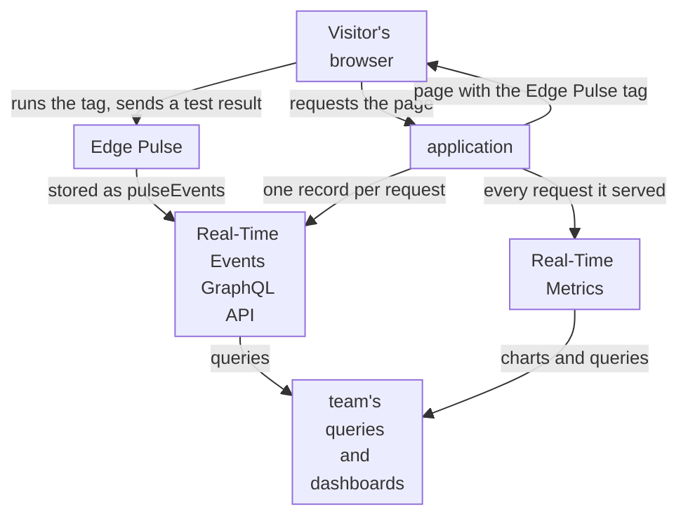
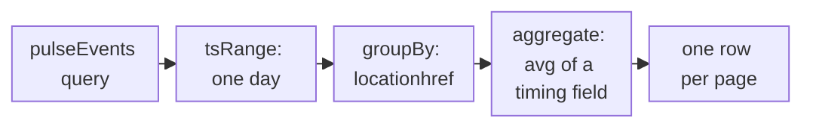

import DocCardGroup from '@aziontech/webkit/doc-card-group'
import DocCard from '@aziontech/webkit/doc-card'
import DocSteps from '@aziontech/webkit/doc-steps'
import DocStep from '@aziontech/webkit/doc-step'

An SRE, performance, or web team runs a website and its APIs behind Azion, and needs to see how fast pages are for real visitors and where errors come from, without installing agents on its servers. The visitor's device, network, and browser decide what a page load feels like, and none of them is visible from the server. This page puts the Edge Pulse tag on the pages that matter, queries the measurements that visitors' browsers send, and reads Azion's side of the same domain in Real-Time Metrics and Real-Time Events. The result is measured by the page load time of each tagged page over time, by the share of tagged pages that report measurements, and by the error rate of the domain.

This use case does not cover security event analysis or tracing inside your backend.

## Prerequisites

- An application that serves your site through a workload. To create them, refer to [Applications quickstart](/en/documentation/platform/applications/quickstart/).
- Access to edit and publish the HTML of the pages you monitor, or to the tag management system that publishes scripts on them.
- A personal token, for the GraphQL queries. To create one, refer to [Personal tokens](/en/documentation/guides/platform/account-and-billing/personal-tokens/).
- The domain and pages you monitor. This page uses `www.example.com` for the domain, and the home page `/` and the search page `/search` as the two pages whose load time matters most. Replace each value with yours in every step.

---

## Required products

| The team needs | Which means | Product | Documented in |
| --- | --- | --- | --- |
| Load times measured in the browsers of real visitors | The Edge Pulse JavaScript tag on each monitored page | Edge Pulse | [Edge Pulse JavaScript tag](/en/documentation/platform/edge-pulse/javascript-tag/) |
| Those measurements read per page, over time | GraphQL queries on the `pulseEvents` dataset of the Real-Time Events API | Real-Time Events | [Query Edge Pulse measurements with GraphQL](/en/documentation/guides/platform/observability/query-edge-pulse-measurements-with-graphql/) |
| Azion's side of the same traffic: request time and errors | The **Requests** and **Status Codes** dashboards, filtered to the domain | Real-Time Metrics | [Build dashboards](/en/documentation/platform/real-time-metrics/build-dashboards/#requests) |
| One slow or failed request traced to its cause | The HTTP Requests records of the domain, with the origin's response time and status | Real-Time Events | [Data sources](/en/documentation/platform/real-time-events/data-sources/#http-requests) |

---

## Reference architecture

This page builds the *Real-user monitoring pipeline*: the Edge Pulse tag in the pages, with the measurements read through GraphQL and compared with what Azion served.

Read the diagram from the visitor's browser. The application delivers the page, and the page carries the Edge Pulse tag, so the measurement starts in the browser rather than on a server. Two streams of data leave the design: the browser's test results, kept by Edge Pulse, and the requests the application served, counted by Real-Time Metrics and recorded one by one in Real-Time Events. Both are read through GraphQL, which is where the team's queries and dashboards join them. The browser's data measures the visitor's experience, including the device, the network, and the scripts on the page, and not the server's view of the request.

### Dataflow

1. A visitor requests a tagged page, and the application serves it with the Edge Pulse tag before the closing `body` tag.
2. The visitor's browser runs the tag, which measures the page load and tests three addresses of Azion's distributed infrastructure.
3. The browser sends the result to Azion, and Edge Pulse stores it in the `pulseEvents` dataset. That browser is tested again only after 30 minutes.
4. Real-Time Metrics counts every request the application served for the same domain, with its request time and status code.
5. The team queries `pulseEvents` from the Real-Time Events GraphQL endpoint, grouped by page, and the request metrics from the Real-Time Metrics GraphQL endpoint.
6. When a page slows down or fails, the HTTP Requests records of Real-Time Events show each request, the origin's response time, and the origin's status code.

### Components

- **Edge Pulse**: collects the browser measurements. Its tag runs in the visitor's browser after the loading event, or before it with the **Pre-loading Tag**, and the measurements, such as `pageloadtime`, `ttfb`, and `locationhref`, are kept in the `pulseEvents` dataset of the Real-Time Events GraphQL API for 7 days.
- **Real-Time Events**: holds the `pulseEvents` dataset, and its GraphQL API is the only place the browser measurements are read from.
- **Real-Time Metrics**: charts the requests the application served and serves them through GraphQL. It holds Azion's side of the same traffic, such as **Average Request Time** and the status codes, which the browser's view is compared with.
- **Grafana**: the integration that draws the team's dashboards, a design option. The Azion plugin reads Real-Time Metrics and Real-Time Events through the GraphQL API.
- **application**: the Platform Resource that serves the monitored site. It delivers the pages that carry the tag, and its requests are what Real-Time Metrics counts.

### Other designs for this use case

- *Delivery log pipeline to an observability platform*: for teams that analyze and alert in their own tools, such as Datadog, Splunk, or Elasticsearch. Data Stream sends Azion's log of every request to that platform, so the data comes from Azion's side of each request, and retention, alerting, and correlation decisions move to the team's platform.

---

## Configure the Edge Pulse tag on the monitored pages

Edge Pulse measures a page only when that page carries the tag, and a page without it produces no measurement. For this site, the tag goes on the home page `/` and the search page `/search`. The tag has no settings: no sampling rate, no field to exclude, and no way to leave your own traffic out.

Choose the tag by the page, not by preference. The **Default Tag** runs after the loading event completes, so it never delays the load it measures. The **Pre-loading Tag** runs before the load event fires, and it exists for pages whose Content Security Policy rules out inline JavaScript. A visitor who leaves before the loading event completes is never measured by the **Default Tag**.

To add the tag to the monitored pages:

<DocSteps>
  <DocStep title="Open Edge Pulse">

  Access [Azion Console](https://console.azion.com/) > **Products menu** > **Observe** > **Edge Pulse**.

  </DocStep>
  <DocStep title="Select the tag your pages need">

  Select the **Default Tag**, or the **Pre-loading Tag** when the pages block inline JavaScript.

  </DocStep>
  <DocStep title="Select Copy to Clipboard" />
  <DocStep title="Paste the tag into each monitored page">

  In the HTML of `/` and of `/search`, paste the tag immediately before the closing `body` tag. Paste it in the template that renders each page, so every page built from that template carries it.

  </DocStep>
  <DocStep title="Publish the pages" />
</DocSteps>

Every visit to `/` and `/search` now produces a measurement. The first results follow your traffic, not the moment you published: nothing is collected until a visitor loads a tagged page. The tag reports no error when it cannot run, so a page that collects nothing looks the same as a page that collects normally.

A single-page application is measured once per full page load. The tag does not watch route changes, so its numbers describe the entry into the application.

---

## Configure the queries for real-user measurements

No page in Azion Console charts Edge Pulse measurements. They are read with GraphQL queries on the `pulseEvents` dataset, at the Real-Time Events endpoint `https://api.azion.com/v4/events/graphql`. A query groups the measurements by `locationhref`, the address of the page they were taken on, and averages one timing field. Real-Time Events keeps a record for 7 days, so a query reaches back 7 days at most.

1. The query bounds the period with `tsRange`.
2. It groups the measurements of that period by the page address.
3. It averages one field, such as `pageloadtime`, inside each group, and returns one row per page.

Run the queries as [Query Edge Pulse measurements with GraphQL](/en/documentation/guides/platform/observability/query-edge-pulse-measurements-with-graphql/) describes, with these values:

| Query | `aggregate` | `groupBy` | `filter`, besides `tsRange` | Why |
| --- | --- | --- | --- | --- |
| Page load time per page | `{ avg: pageloadtime }` | `[locationhref]` | None | The daily reading for `https://www.example.com/` and `https://www.example.com/search` |
| Time to first byte per page | `{ avg: ttfb, count: rows }` | `[locationhref]` | None | The time until the first byte of each page arrived, one part of its load time |
| Home page load time per connection | `{ avg: pageloadtime, count: rows }` | `[effectivetype]` | `locationhref: "https://www.example.com/"` | Shows whether one class of connection makes the home page slower |

Each query reads one day, with `tsRange` from `2026-10-04T00:00:00` to `2026-10-05T00:00:00` for the day you read, and `limit: 100`, which keeps every page of a site with up to 100 tagged addresses. The API answers `200` with one row per group in `data.pulseEvents`. A page that is tagged and missing from the rows had no measured visit in the range.

To chart these queries next to Real-Time Metrics, the Azion plugin for Grafana reads both Real-Time Metrics and Real-Time Events through the GraphQL API. To install it and create the data source, refer to [Install the Azion plugin for Grafana](/en/documentation/guides/platform/observability/integrate-grafana/).

---

## Verify the setup

- **The pages carry the tag.** Open `https://www.example.com/` in a browser and view the page source. The Edge Pulse tag you copied sits before the closing `body` tag. Repeat for `/search`.
- **Visitors' browsers send measurements.** After the pages receive visits, run the `pulseEvents` query for the current day. The rows include a `locationhref` for `https://www.example.com/` and one for `https://www.example.com/search`. A tagged page with traffic and no row means the tag does not run on it, because the tag reports no error of its own.
- **Azion's side of the domain is readable.** Access [Azion Console](https://console.azion.com/) > **Real-Time Metrics**, add the filter **Host** **Equals** `www.example.com`, and select the **Requests** dashboard. **Average Request Time** shows the average time Azion took to answer the domain's requests. For the filter steps, refer to [Measure cache offload for a domain](/en/documentation/guides/platform/observability/measure-cache-offload/).
- **One request can be traced.** Access **Real-Time Events**, select the _HTTP Requests_ data source, and enter `host='www.example.com'` in **Filter by**. Each record carries **Request Time**, **Upstream Response Time**, the time the origin took to answer, and **Upstream Status**, the status the origin returned. For the filter syntax, refer to [Filter events](/en/documentation/guides/platform/observability/add-filters-events/).

---

## Measuring results

| Metric | Where to read it | What working looks like |
| --- | --- | --- |
| Page load time of each tagged page | The `avg` of `pageloadtime` per `locationhref` in `pulseEvents`, one query per day | Stable from day to day on each page; a rise on one page after a release points at that release |
| Share of tagged pages that report measurements | The pages in the `pulseEvents` rows, compared with the list of pages you tagged | Every tagged page with traffic appears in the rows |
| Error rate of the domain | The **Status Codes** dashboard of Real-Time Metrics, filtered to the host, and its **Requests by Status and Upstream Status** table | 5XX responses stay rare, and the table shows whether an error came from the origin or from Azion. Refer to [Build dashboards](/en/documentation/platform/real-time-metrics/build-dashboards/#status-codes) |
| Time Azion takes to answer, next to what visitors measure | **Average Request Time** on the **Requests** dashboard, filtered to the host | Moves with the visitors' load time when the cause is on the server side; stays flat when the cause is on the visitors' side |

---

## Best practices

- **Tag the templates, not single pages.** Edge Pulse measures only the pages that carry the tag, and the tag is not inherited from a parent path. Putting it in the template that renders a page type covers every page of that type, including the ones published later.
- **Read a missing page as a missing tag before you read it as missing traffic.** The tag reports no error when it cannot run. A tagged page with visits and no `pulseEvents` row is the only signal that something blocks the tag, such as a Content Security Policy that needs the **Pre-loading Tag**.
- **Compare the browser's view with the server's view before you act.** A slower `pageloadtime` with a flat **Average Request Time** places the cause on the visitors' side, such as their network or a script on the page. Both rising together places it on the server side, and Real-Time Events shows whether the origin's response time rose with them.
- **Query a narrow range.** Real-Time Events bounds the rows a query reads, and a search over the full 7 days with no filter is the common way to reach that bound. Query one day at a time, and add a filter when you can. For the bound, refer to [Real-Time Events limits](/en/documentation/platform/real-time-events/limits/).

---

## Guides in this use case

<DocCardGroup cols={2}>
  <DocCard title="Query Edge Pulse measurements with GraphQL" href="/en/documentation/guides/platform/observability/query-edge-pulse-measurements-with-graphql/" label="Runs the pulseEvents queries that read the load time of each tagged page." />
</DocCardGroup>
