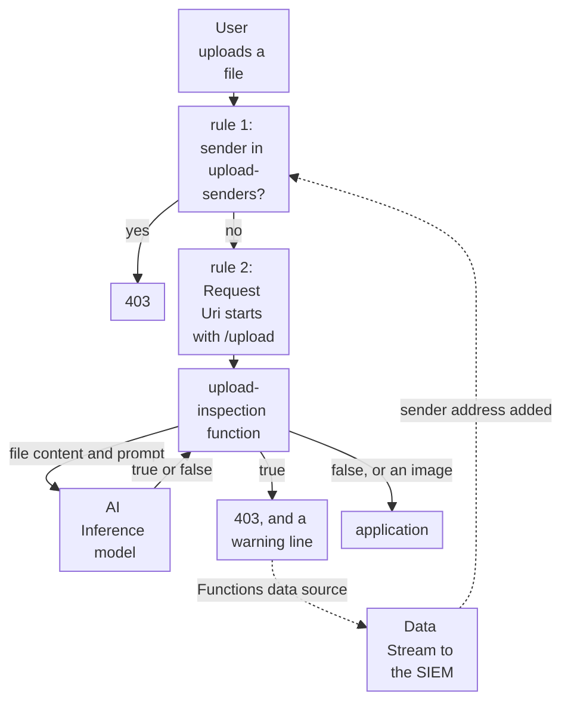

import DocCardGroup from '@aziontech/webkit/doc-card-group'
import DocCard from '@aziontech/webkit/doc-card'
import DocSteps from '@aziontech/webkit/doc-steps'
import DocStep from '@aziontech/webkit/doc-step'
import Tabs from '~/components/webkit/Tabs.vue'

An application team accepts documents from users, such as PDFs in onboarding, claims, or support flows. A file can carry a malicious payload, or text written to manipulate the AI systems that read it later, and a rule that reads only the request's envelope sees none of it. This page configures a function on the firewall that sends each upload to a model on AI Inference and denies the files the model flags, a network list that blocks their senders, and the stream that carries each verdict to the SIEM. The result is measured by the malicious uploads blocked before the application, the latency added per upload, and the false-positive rate.

This use case does not cover antivirus scanning of stored files, or general WAF protection, which [Protect web applications from OWASP Top 10 and zero-day attacks](/en/documentation/use-cases/secure-applications-and-networks/protect-web-applications-from-owasp-top-10-and-zero-day-attacks/) covers.

## Prerequisites

- An application that serves the upload route through a connector and a workload. To create them, refer to [Applications quickstart](/en/documentation/platform/applications/quickstart/).
- A firewall bound to that workload's deployment, with Functions and Network Shield turned on in **Main Settings** › **Modules**. To bind it, refer to [Bind a firewall to a workload](/en/documentation/guides/application-security/firewall-and-waf/firewall-protect-your-domain/).
- Mistral 3 Small, whose id is `casperhansen-mistral-small-24b-instruct-2501-awq`, available to the account. For the models AI Inference runs, refer to [AI models](/en/documentation/platform/ai-inference/models/).
- A personal token, for the API tab. To create one, refer to [Personal tokens](/en/documentation/guides/platform/account-and-billing/personal-tokens/).
- The values of your application. This page uses `www.example.com` for the domain, `/upload` for the route that receives files, `198.51.100.42` for the address of a sender the model flagged, and `upload` as the prefix of every object it creates. Replace each value with yours in every step.

---

## Required products

| The upload route needs | Which means | Product | Documented in |
| --- | --- | --- | --- |
| Each upload read before the application receives it | A firewall function, run by a rule on the upload route, that reads the request body | Functions | [Functions for Firewall](/en/documentation/platform/firewall/functions/) |
| A verdict on the content of each file | A call to a model through `Azion.AI.run`, with a prompt that asks for `true` or `false` | AI Inference | [Model invocation](/en/documentation/platform/ai-inference/model-invocation/) |
| The senders of malicious files refused on every route | A network list that a deny rule reads through the _Network_ criterion | Network Shield | [Network Lists](/en/documentation/platform/firewall/network-shield/network-lists/) |
| Each verdict in the team's SIEM | A stream of the _Functions_ data source, which carries the lines the function logs, to the SIEM's endpoint | Data Stream | [Debug functions with Data Stream](/en/documentation/guides/platform/observability/debugging-functions-data-stream/) |

---

## Reference architecture

This page builds the *AI-assisted upload inspection pipeline*: the firewall sends each upload to a function that asks a model whether it is malicious, and applies the verdict in the same request.



Read the diagram at the function. The rules before it are ordinary firewall decisions, made from the request's envelope: the sender's address and the route. The function is where the design reads the file itself, and the model's verdict is the one new dependency the design adds to the request path. Everything after the function follows from that verdict, and the dotted loop through Data Stream turns one malicious file into a block on its sender.

### Dataflow

1. A user sends a file to `/upload`. The first firewall rule compares the user's address with `upload-senders`, and a listed sender receives `403` on every route.
2. The second rule runs the `upload-inspection` function on every request to `/upload`.
3. The function reads the request body and sends it to the model through `Azion.AI.run`, with a prompt that asks for `true` when the content is malicious. A file whose `Content-Type` starts with `image/` continues without a model call.
4. When the model answers `true`, the function writes a warning line and denies the request with `403`, before the application receives it. Otherwise the upload continues to the application.
5. Data Stream sends the function's lines to the SIEM.
6. A verdict's request ID leads to the sender's address, which is then added to `upload-senders`, the list the first rule reads.

### Components

- **firewall**: the Platform Resource that routes uploads to the function. One rule runs the function on the upload route, and another denies the senders in the network list on every route.
- **Functions**: runs the inspection function in the `firewall` execution environment. It extracts the content from the request, calls the model, and applies the verdict in the same request, so a refused file stays outside the application.
- **AI Inference**: runs the model that classifies the content. The prompt in the function's arguments sets what the model treats as malicious, so the policy changes without new code.
- **Object Storage**: holds a quarantine bucket, where a refused upload can be kept for an analyst to review instead of disappearing. The function on this page denies the file and writes it to no bucket.
- **Network Shield**: holds the sender blocklist, the network list whose deny rule refuses a flagged sender on every route.
- **Data Stream**: sends the function's verdict lines to the endpoint the SIEM reads.
- **SIEM**: the integration that correlates the verdicts with the request records and the team's other sources, and that turns a verdict into a blocklist entry.

---

## Configure the inspection function

The function registers a `firewall` handler, so it runs on the firewall, before the request reaches the application. It reads the body as text and sends it to the model as the user message, with the prompt from the instance's arguments as the system message. `temperature` is `0` and `max_tokens` is `1024`, the values the scan-uploads guide runs: the verdict is one word, so the call asks for no variation. The function compares the answer with the string `true`, so the prompt tells the model to answer with `true` or `false` alone.

The function handles three cases by itself. A `Content-Type` that starts with `image/` continues with no model call. A `Content-Type` that names base64 is decoded before the call. Any error, in the call or in the parsing, writes an error line and lets the request continue, so the route keeps working when the model does not answer.

To create the function:

<DocSteps>
  <DocStep title="Open the Functions page">

  Access [Azion Console](https://console.azion.com/) > **Products Menu** > **Libraries** > **Functions**.

  </DocStep>
  <DocStep title="Select + Function" />
  <DocStep title="Name the function">

  Enter `upload-inspection`.

  </DocStep>
  <DocStep title="Paste the code">

  In the **Code** tab, paste the function:

  ```js
  async function handleRequest(event) {
    try {
      const requestBody = await event.request.text();
      const { model, action, prompt } = event.args;
      const contentType = event.request.headers.get("content-type");

      // Allows images
      if (contentType && contentType.startsWith("image/")) {
        event.continue();
        return;
      }

      // Decodes the content if it's base64
      const decodedBody = contentType && contentType.includes("base64")
        ? atob(requestBody.split(",")[1])
        : requestBody;

      // Calls the model via Azion.AI.run
      const modelResponse = await Azion.AI.run(model, {
        stream: false,
        seed: 42,
        temperature: 0,
        max_tokens: 1024,
        messages: [
          { role: "system", content: `${prompt}` },
          { role: "user", content: decodedBody }
        ]
      });

      // Extracts the model's response
      const result = modelResponse?.choices?.[0]?.message?.content?.trim();

      if (result === "true") {
        event.console.warn(`[AI] ${result}`);
        event[action]();
        return;
      }
    } catch (err) {
      event.console.error("Error handling request:", err.message);
      event.continue();
      return;
    }

    event.continue(); // If not malicious, let it pass
  }

  addEventListener("firewall", event => {
    event.waitUntil(handleRequest(event));
  });
  ```

  </DocStep>
  <DocStep title="Paste the arguments">

  In the **Arguments** tab, paste the model, the action, and the prompt:

  ```json
  {
    "model": "casperhansen-mistral-small-24b-instruct-2501-awq",
    "prompt": "You are a security assistant specialized in detecting malicious PDF files. Analyze the provided content carefully and return 'true' only if you identify malicious content, such as embedded scripts, suspicious patterns, or known vulnerabilities. Do not classify a file as malicious based solely on its structure or the presence of a PDF header. If the content is safe or does not contain clear malicious indicators, return 'false'. Do not provide any additional explanation or output.",
    "action": "deny"
  }
  ```

  </DocStep>
  <DocStep title="Select Save" />
</DocSteps>

The function is saved and available to instance on a firewall. `action` names the event method the function calls on a malicious file: `deny` answers `403`, and `drop` would close the request with no answer. For every field `Azion.AI.run` accepts, refer to [Model invocation](/en/documentation/platform/ai-inference/model-invocation/).

---

## Configure the function on the upload route

The function runs only where a rule runs its instance, so the rule matches `${request_uri}` _starts with_ `/upload`. Every other route skips the model call, which keeps the latency and the AI Inference usage on the uploads alone. Create this rule after the sender rule in the next section, or move it below that rule, so a listed sender is refused before the model reads its file.

To instance the function and run it:

<DocSteps>
  <DocStep title="Open the Functions Instances tab">

  Access [Azion Console](https://console.azion.com/) > **Firewalls**, select the firewall, then go to the **Functions Instances** tab.

  </DocStep>
  <DocStep title="Select + Function Instance" />
  <DocStep title="Name the instance">

  Enter `upload-inspection`, and select the `upload-inspection` function.

  </DocStep>
  <DocStep title="Select Save" />
  <DocStep title="Go to the Rules Engine tab and select + Rule" />
  <DocStep title="Name the rule">

  Enter `upload - inspect files`.

  </DocStep>
  <DocStep title="Match the upload route">

  In the **Criteria** section, select `Request Uri`, _starts with_, and `/upload`.

  </DocStep>
  <DocStep title="Add the Run Function behavior">

  In the **Behaviors** section, select **Run Function**, then the `upload-inspection` instance.

  </DocStep>
  <DocStep title="Select Save" />
</DocSteps>

Every request whose URI starts with `/upload` is read by the model before the application receives it. A new rule reaches traffic 6 to 10 minutes after it is saved.

---

## Configure the sender blocklist

A sender whose file the model flagged is refused on every route of the workload, `/upload` included, by a deny rule that reads the `upload-senders` list. The function logs the verdict, not the address. In Data Stream, each line of the _Functions_ data source carries the request's `$request_id`, and the _Applications_ data source carries `$remote_addr` for the same `$request_id`. A person or the SIEM joins the two and adds the address to the list.

Each entry carries a due date and a comment. The due date, 7 days after the upload, ends the block for an address that a different user may hold later. The comment names the request ID, so an analyst finds the verdict behind the block. A due date takes effect only at the next write of the list's items, as [Block addresses until a date](/en/documentation/guides/application-security/bots-and-network/temporary-block/) explains.

<Tabs client:visible sharedStore="interface">
<Fragment slot="tab.console">Console</Fragment>
<Fragment slot="tab.api">API</Fragment>

<Fragment slot="panel.console">

To create the list:

<DocSteps>
  <DocStep title="Open the Network Lists page">

  Access [Azion Console](https://console.azion.com/) > **Edge Libraries** > **Network Lists**, and select **Network List**.

  </DocStep>
  <DocStep title="Name the list and select the IP/CIDR type">

  Enter `upload-senders` as the **Name**, and select _IP/CIDR_ in the **Network List Settings** section.

  </DocStep>
  <DocStep title="Enter the flagged sender">

  In the **List** field, enter `198.51.100.42 --LT2030-01-01T00:00:00Z #<request-id>`, with the date 7 days after the upload in place of `2030-01-01T00:00:00Z`.

  </DocStep>
  <DocStep title="Select Save" />
</DocSteps>

To create the rule that reads it:

<DocSteps>
  <DocStep title="Open the firewall's Rules Engine tab">

  Access **Firewalls**, select the firewall, go to the **Rules Engine** tab, and select **Rule**.

  </DocStep>
  <DocStep title="Name the rule">

  Enter `upload - deny flagged senders`.

  </DocStep>
  <DocStep title="Match the list">

  In the **Criteria** section, select the _Network_ variable and the _matches_ operator, then `upload-senders` in **Select a Network**.

  </DocStep>
  <DocStep title="In the Behaviors section, select Deny (403 Forbidden)" />
  <DocStep title="Select Save" />
</DocSteps>

</Fragment>

<Fragment slot="panel.api">

To create the list with the first flagged sender, with the date 7 days after the upload in place of `2030-01-01T00:00:00Z`:

```bash
curl --request POST \
  --url https://api.azion.com/v4/workspace/network_lists \
  --header 'Authorization: Token <personal-token>' \
  --header 'Content-Type: application/json' \
  --data '{"name":"upload-senders","type":"ip_cidr","items":["198.51.100.42 --LT2030-01-01T00:00:00Z #<request-id>"]}'
```

The API answers `201` with a `state` of `executed`. Keep the list's `id`:

```json
{"state":"executed","data":{"id":<network-list-id>,"name":"upload-senders","type":"ip_cidr","items":["198.51.100.42 --LT2030-01-01T00:00:00Z #<request-id>"],...}}
```

To create the rule that reads it:

```bash
curl --request POST \
  --url https://api.azion.com/v4/workspace/firewalls/<firewall-id>/request_rules \
  --header 'Authorization: Token <personal-token>' \
  --header 'Content-Type: application/json' \
  --data '{
  "name": "upload - deny flagged senders",
  "active": true,
  "criteria": [
    [{ "variable": "${network}", "conditional": "if", "operator": "is_in_list", "argument": <network-list-id> }]
  ],
  "behaviors": [{ "type": "deny" }]
}'
```

The API answers `202` with a `state` of `pending`. To add a later sender, read `upload-senders` and write it back with the new entry, as [Update a network list from an automation](/en/documentation/guides/application-security/bots-and-network/update-network-list-from-automation/#add-an-entry-to-the-list) describes. The new entry is `<sender-address> --LT<upload-date-plus-7-days> #<request-id>`.

</Fragment>
</Tabs>

A listed sender receives `403` on every route of the workload. A later change to the items reaches traffic in about 100 seconds, with no change to the rule. To let the SIEM write the list, refer to [Block attackers automatically from SIEM detections](/en/documentation/use-cases/secure-applications-and-networks/block-attackers-automatically-from-siem-detections/).

---

## Verify the setup

A new rule reaches traffic 6 to 10 minutes after it is saved, and a change to a list's items in about 100 seconds. Repeat each request until the answer holds.

- **A clean file reaches the application.** Upload a document you know is safe:

  ```bash
  curl -s -o /dev/null -w '%{http_code}\n' -X POST --data-binary @safe.pdf -H "Content-Type: application/pdf" https://www.example.com/upload
  ```

  The command prints the status your application answers for an upload.

- **A malicious file is denied.** Upload a test file built to carry a malicious indicator, such as an embedded script:

  ```bash
  curl -s -o /dev/null -w '%{http_code}\n' -X POST --data-binary @test-malicious.pdf -H "Content-Type: application/pdf" https://www.example.com/upload
  ```

  When the model answers `true`, the command prints `403`, and the `functionConsoleEvents` dataset of Real-Time Events holds a warning line that reads `[AI] true`.

- **Other routes skip the model.** Request a page outside `/upload`. No line from `upload-inspection` appears for it.

- **A flagged sender is refused everywhere.** From an address in `upload-senders`, request the home page:

  ```bash
  curl -s -o /dev/null -w '%{http_code}\n' https://www.example.com/
  ```

  The command prints `403`.

- **Verdicts reach the SIEM.** In Real-Time Events, the _Data Stream_ data source lists each send of the _Functions_ stream, and a **Status Code** of `200` means the SIEM's endpoint accepted the batch.

---

## Measuring results

| Metric | Where to read it | What working looks like |
| --- | --- | --- |
| Malicious uploads blocked before the application | The warning lines that read `[AI] true`, in the `functionConsoleEvents` dataset of Real-Time Events or in the SIEM | Each blocked upload has a line, and no flagged file appears in the application's own storage |
| Latency added per upload | **Request Time** of the requests to `/upload`, in the [HTTP Requests](/en/documentation/platform/real-time-events/data-sources/#http-requests) data source, against the same route before the rule | Stays within what the upload flow tolerates, under the AI Inference [limits](/en/documentation/platform/ai-inference/limits/) |
| False-positive rate | The blocked uploads that the team's analysts review and label as safe, against all blocked uploads | Falls as the prompt in the instance's arguments is tuned on the labeled files |

---

## Best practices

- **Watch the error lines, because the function fails open.** On any error, the function writes an error line and lets the upload continue. A model that stops answering therefore shows as error lines, not as blocked uploads. Alert on lines that read `Error handling request:`.
- **Remove the image branch when the route accepts no images.** The function lets any request whose `Content-Type` starts with `image/` continue without a model call, and the client sets that header. A route that receives only documents loses nothing when the branch goes.
- **Keep a WAF rule in Blocking off the upload route.** WAF parses a request body only up to 131,072 bytes and refuses a larger one with `400` in _Blocking_, so a WAF rule on `/upload` refuses every file larger than 128 KiB before the model reads it. For the bound, refer to [Request body parsing](/en/documentation/platform/firewall/waf/scoring-and-modes/#request-body-parsing).
- **Tune the prompt, not the code.** The prompt lives in the instance's arguments, so a change to it reaches traffic in about 105 seconds, with no new function. Feed the files the analysts label back into the prompt.
- **Put a due date on every sender entry.** An address can pass to another user, and a block with no end refuses that user too.

---

## Guides in this use case

<DocCardGroup cols={2}>
  <DocCard title="Update a network list from an automation" href="/en/documentation/guides/application-security/bots-and-network/update-network-list-from-automation/" label="Add each later flagged sender to the list from a script or a SIEM playbook." />
</DocCardGroup>
