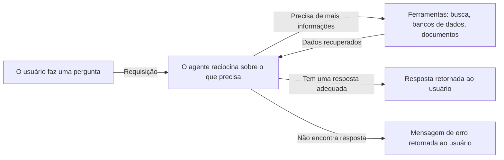
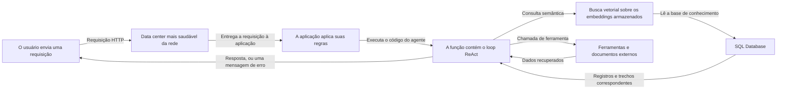

import FrameBox from '@aziontech/webkit/frame-box'
import ItemList from '@aziontech/webkit/item-list'
import DocItem from '@aziontech/webkit/doc-item'

Um copilot é um assistente que fica dentro de um produto e responde perguntas sobre ele em linguagem comum. Ele conduz o usuário por uma tarefa complexa em vez de devolver uma lista de resultados de busca. O que ele responde depende do que esse usuário está fazendo. Esta arquitetura constrói um copilot sobre um agente ReAct, que raciocina sobre cada requisição e então age chamando uma ferramenta. Use-a quando as respostas estão nos seus próprios documentos e dados, e não no conjunto de treinamento de um modelo.

ReAct vem de *reasoning and acting*: raciocinar e agir. O agente não responde apenas a partir do prompt. Ele lê a requisição, decide se já consegue responder e chama uma ferramenta quando não consegue. Cada chamada de ferramenta retorna dados que o agente lê antes de decidir de novo. O loop termina quando o agente tem uma resposta adequada, ou quando esgota as formas de encontrar uma e retorna um erro.

Esse loop é um padrão, não uma arquitetura da Azion, e tem a mesma forma onde quer que execute.

---

## Diagrama da arquitetura

O diagrama coloca esse loop na Azion, nomeando cada parte por que a requisição passa:

Leia o diagrama a partir da função, para os dois lados: tudo à esquerda dela é o caminho que qualquer aplicação na Azion percorre. A requisição chega ao data center mais saudável da rede, e a aplicação aplica suas regras antes que o código do agente execute. Tudo à direita dela é o trabalho do próprio agente. As setas para os armazenamentos e as ferramentas vão nos dois sentidos porque o agente lê deles uma vez a cada passagem pelo loop. Quantas passagens uma requisição leva é decidido pelo agente, não fixado na implantação.

### Fluxo de dados

Uma requisição percorre a arquitetura nesta ordem:

1. O usuário envia uma requisição à aplicação que hospeda o copilot.
2. O data center mais saudável da rede atende à requisição.
3. A aplicação a processa, executando qualquer regra configurada nela.
4. A aplicação chama a função que contém a lógica do agente de AI, e o loop de raciocínio começa.
5. O agente analisa o contexto da consulta e recorre às suas ferramentas e recursos externos: mecanismos de busca semântica ou vetorial, bancos de dados e documentos. Ele continua recuperando dados até que os dados que tem sejam relevantes o suficiente para responder.
6. Uma resposta adequada volta ao usuário pelo mesmo caminho. Quando o agente não encontra nenhuma, o fluxo termina com uma mensagem de erro que informa o problema ao usuário.

---

## Componentes

- [Applications](/pt-br/documentacao/plataforma/applications/): constrói e hospeda a aplicação que responde à requisição do usuário a partir da infraestrutura distribuída da Azion. As regras que você configura aqui executam antes do agente, então uma requisição pode ser autenticada ou rejeitada antes de alcançar o seu código.
- [Functions](/pt-br/documentacao/build/functions/): executa código próximo ao usuário final, que é onde ficam o loop de raciocínio e a lógica personalizada de tratamento de requisições e respostas. Uma única execução contém o loop inteiro, então o prompt, as chamadas de ferramenta e a decisão de parar ficam todos no mesmo lugar.
- [SQL Database](/pt-br/documentacao/store/sql-database/): uma solução SQL projetada para aplicações serverless. Ela contém a base de conhecimento que o agente lê. É isso que mantém as respostas presas aos seus próprios dados, e não ao que o modelo aprendeu no treinamento.
- [Vector Search](/pt-br/documentacao/store/sql-database/vector-search/): permite implementar mecanismos de busca semântica sobre os registros do SQL Database. Aqui, uma pergunta e um trecho correspondem quando significam a mesma coisa, então o agente recupera contexto que uma consulta por palavra-chave não encontraria.
- **Infraestrutura distribuída da Azion**: a arquitetura altamente distribuída em que todas as partes acima executam. O copilot não tem região a escolher, porque quem responde é o data center mais saudável.

---

## Implementação

- [Criar uma aplicação](/pt-br/documentacao/guias/desenvolvimento-de-aplicacoes/primeiros-passos/criar-uma-aplicacao/) - cria a aplicação que recebe a requisição.
- [Criar um banco de dados](/pt-br/documentacao/guias/desenvolvimento-de-aplicacoes/dados/criar-banco-de-dados/) - cria o SQL Database que o agente consulta.
- [Primeiros passos com Functions](/pt-br/documentacao/build/functions/primeiros-passos/) - escreve a função que carrega a lógica do agente.
- [Instanciar uma função](/pt-br/documentacao/guias/desenvolvimento-de-aplicacoes/primeiros-passos/instanciar-functions/) - anexa essa função à aplicação.
- [Guia do Vector Search](/pt-br/documentacao/guias/desenvolvimento-de-aplicacoes/dados/edge-sql-vector-search/) - constrói as consultas semânticas que o agente executa sobre a base de conhecimento.

---

## Recursos relacionados

<FrameBox>
<ItemList>
  <DocItem title="AI Inference" href="/pt-br/documentacao/build/ai-inference/">Os modelos que Azion executa, para a etapa de raciocínio de que o agente depende.</DocItem>
  <DocItem title="Invocação de modelos" href="/pt-br/documentacao/build/ai-inference/invocacao-de-modelos/">O corpo da requisição que uma função envia ao chamar um modelo.</DocItem>
  <DocItem title="SQL Database" href="/pt-br/documentacao/store/sql-database/">O armazenamento que contém a base de conhecimento e seus embeddings.</DocItem>
  <DocItem title="Real-Time Metrics" href="/pt-br/documentacao/plataforma/real-time-metrics/">O tráfego e a performance da aplicação que serve o copilot.</DocItem>
  <DocItem title="Real-Time Events" href="/pt-br/documentacao/observe/real-time-events/">As requisições individuais e os logs a consultar quando uma resposta volta errada.</DocItem>
</ItemList>
</FrameBox>
