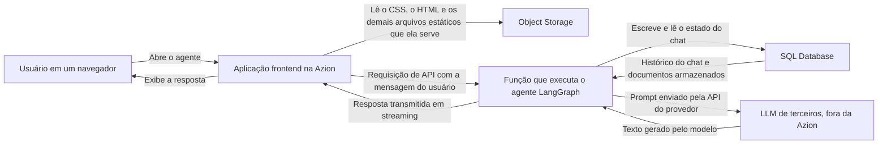

import FrameBox from '@aziontech/webkit/frame-box'
import ItemList from '@aziontech/webkit/item-list'
import DocItem from '@aziontech/webkit/doc-item'

Um agente responde dentro de uma conversa, então cada turno paga pela chamada ao modelo e por tudo o que o agente faz em volta dela. Esta arquitetura coloca na Azion tudo o que está em volta da chamada: a interface, a lógica do agente e o estado do chat executam aqui, perto do usuário. O modelo não é um deles. Ele executa em um provedor de terceiros, como OpenAI ou Anthropic, e o agente o alcança pela API desse provedor, com a sua chave.

Use esta arquitetura quando o provedor já estiver escolhido. O que você quer perto do usuário é o próprio agente, o seu histórico e os documentos que ele lê. [AI Inference](/pt-br/documentacao/build/ai-inference/) descreve a arquitetura em que Azion executa o modelo.

---

## Diagrama de arquitetura

O diagrama percorre um turno da conversa, do navegador até o provedor e de volta:

Leia o diagrama a partir da função, de dentro para fora. Todo nó dele executa na Azion, menos um: o LLM de terceiros está fora, e a seta que chega até ele é a única que sai. A função é onde a arquitetura converge, porque ela contém o agente, é dona das leituras e escritas do estado do chat e faz a chamada ao modelo. Object Storage fica fora desse caminho. Ele serve os arquivos estáticos que compõem a interface e os documentos que o agente usa depois para responder.

### Fluxo de dados

Uma requisição atravessa a arquitetura nesta ordem:

1. Uma requisição chega à Azion.
2. A aplicação frontend serve a interface do usuário, com os arquivos estáticos vindos do Object Storage.
3. A aplicação frontend envia uma requisição de API para a função de backend.
4. A função de backend lê e escreve o estado do chat no SQL Database, para persistência e contexto. Em seguida, ela executa o agente LangGraph e transmite a resposta para o cliente.
5. O agente chama o LLM de terceiros, usa os dados do banco de dados para formar uma resposta e a envia de volta pelo mesmo caminho.
6. A aplicação frontend exibe a resposta para o usuário.

---

## Componentes

- [Applications](/pt-br/documentacao/plataforma/applications/): hospeda o agente de AI na Azion. É o endereço com o qual o navegador se comunica, e roteia a interface e a requisição de API para o lugar certo, atrás de um único domínio.
- [Functions](/pt-br/documentacao/build/functions/): contém a lógica do agente de AI. O seu código não executa em nenhum outro lugar desta arquitetura, então o grafo do LangGraph, a chamada ao provedor e o streaming da resposta ficam todos em uma única execução.
- [Object Storage](/pt-br/documentacao/store/object-storage/): armazena os dados que o agente usa para responder às perguntas e os arquivos estáticos que a interface carrega. Nenhum dos dois vem de um servidor que você mantém no ar.
- [SQL Database](/pt-br/documentacao/store/sql-database/): armazena o estado do chat e os documentos. É o que torna um turno contextual, porque o agente lê daqui as mensagens anteriores e os documentos correspondentes antes de escrever um prompt.
- **LLM de terceiros**: o serviço externo que executa o modelo, como OpenAI ou Anthropic. É a única parte que Azion não opera, então a disponibilidade, os limites de taxa e a cobrança dele ficam com o provedor.

:::note[nota]
Uma implantação desta arquitetura usa [Application Accelerator](/pt-br/documentacao/build/application-accelerator/), [Functions](/pt-br/documentacao/build/functions/) e [SQL Database](/pt-br/documentacao/store/sql-database/), e pode gerar custos relacionados ao uso. Consulte a [página de preços](/pt-br/documentacao/fundamentos/precos/) para obter mais informações.
:::

---

## Implementação

- [Como implantar o LangGraph AI Agent Boilerplate](/pt-br/documentacao/guias/desenvolvimento-de-aplicacoes/frameworks/langgraph-ai-agent-boilerplate/) - cria o frontend, a função e o banco de dados que esta página descreve, e traz o carregador de documentos que os preenche.
- [Azion GitHub App](/pt-br/documentacao/guias/desenvolvimento-de-aplicacoes/automacao/azion-github-app/) - conecta o repositório para o qual essa implantação envia o código, uma conexão que o guia exige antes de começar.

---

## Recursos relacionados

<FrameBox>
<ItemList>
  <DocItem title="AI Inference" href="/pt-br/documentacao/build/ai-inference/">A arquitetura em que Azion executa o modelo, em vez de chamar um provedor de terceiros.</DocItem>
  <DocItem title="Vector Search" href="/pt-br/documentacao/store/sql-database/vector-search/">Como SQL Database responde a uma consulta por embeddings, o mecanismo sobre o qual a recuperação de documentos se apoia.</DocItem>
  <DocItem title="Vector Search com SQL Database" href="/pt-br/documentacao/guias/desenvolvimento-de-aplicacoes/dados/edge-sql-vector-search/">Constrói e consulta um repositório de embeddings diretamente, fora de um template.</DocItem>
  <DocItem title="SQL Database" href="/pt-br/documentacao/store/sql-database/">O repositório que guarda o estado do chat e os documentos.</DocItem>
  <DocItem title="Object Storage" href="/pt-br/documentacao/store/object-storage/">O repositório de onde vêm os arquivos estáticos e os documentos que o agente usa como fonte.</DocItem>
</ItemList>
</FrameBox>
