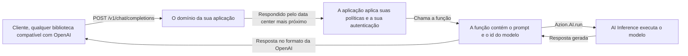

import FrameBox from '@aziontech/webkit/frame-box'
import ItemList from '@aziontech/webkit/item-list'
import DocItem from '@aziontech/webkit/doc-item'

Um cliente que chama um modelo precisa de um endereço para o qual enviar a requisição e de um formato de resposta para ler. Esta arquitetura coloca esse endereço em uma aplicação que você implanta: a aplicação é o endpoint de inferência, e o modelo executa atrás dela. Use-a quando seu time já serve uma API HTTP e quer que a inferência seja mais um caminho nela. O domínio é seu, e nenhum servidor de inferência fica em execução.

[Como AI Inference funciona](/pt-br/documentacao/build/ai-inference/como-funciona/) cobre as passagens dentro de uma única chamada. Esta página descreve a forma que você implanta em torno delas.

---

## Diagrama da arquitetura

O diagrama traça uma requisição pela arquitetura implantada, do cliente até o modelo e de volta:

Leia o diagrama a partir do domínio da aplicação, para fora. À esquerda dele está um cliente que não sabe nada sobre a Azion. Ele envia JSON para uma URL e lê JSON de volta, como faria com qualquer serviço compatível com OpenAI. Atrás do domínio, uma única execução faz o resto: a aplicação chama a função, e a função mantém a requisição aberta até o modelo responder. Nenhuma seta sai em direção a um host de inferência, porque a função não configura nenhuma URL base e não nomeia nenhum host. Ela passa um id de modelo, e Azion faz a chamada.

### Fluxo de dados

Uma requisição percorre a arquitetura nesta ordem:

1. Um cliente envia uma requisição compatível com OpenAI para `/v1/chat/completions` no domínio da aplicação.
2. O data center mais próximo recebe a requisição e a entrega à aplicação.
3. A aplicação aplica suas políticas, verifica a autenticação que você configurou e chama a função.
4. A função pré-processa a entrada e chama o modelo com `Azion.AI.run`, que alcança AI Inference através da API do Azion Cells.
5. AI Inference executa o modelo e retorna a resposta gerada à função.
6. A função formata essa resposta e a retorna ao cliente pelo mesmo caminho.

---

## Componentes

- [Applications](/pt-br/documentacao/plataforma/applications/): recebe a requisição no seu domínio e aplica suas políticas antes que qualquer código seu execute. É o que torna o endpoint seu, porque o domínio, o caminho e a autenticação à frente da função são todos configurados aqui. Azion não emite nenhuma credencial para uma chamada de modelo, então um endpoint sem verificação própria responde a qualquer um que o encontre.
- [Functions](/pt-br/documentacao/build/functions/): contém a lógica de inferência e emite a chamada de modelo. Seu código não executa em nenhum outro lugar desta arquitetura, então o prompt, o id do modelo, o contexto recuperado de um armazenamento e qualquer serviço externo de que a chamada precise ficam todos em uma única execução.
- [AI Inference](/pt-br/documentacao/build/ai-inference/): executa o modelo, que é o que remove o servidor de inferência desta arquitetura. Você não carrega nenhum modelo e não dimensiona nenhum cluster, e o id em [Modelos de AI](/pt-br/documentacao/build/ai-inference/modelos/) é o único endereço de que a função precisa.
- [Orchestrator](/pt-br/documentacao/build/orchestrator/): gerencia as requisições para a execução no Azion Cells. `Azion.AI.run` alcança um modelo através da API do Azion Cells, que é a parte do Orchestrator de que esta arquitetura depende.
- **A infraestrutura distribuída da Azion**: executa todas as partes acima. É por isso que esta arquitetura não tem região a escolher. O data center mais próximo do cliente responde a requisição, e você não seleciona nenhum deles.
- [Real-Time Metrics](/pt-br/documentacao/plataforma/real-time-metrics/): reporta o tráfego e a performance da aplicação que serve o endpoint. Uma arquitetura sem servidor de inferência próprio ainda precisa de uma visão do que o endpoint transportou.
- [Real-Time Events](/pt-br/documentacao/observe/real-time-events/): rastreia requisições individuais, dados brutos e logs. Quando uma resposta está errada, a requisição que a produziu é o que você lê aqui.

:::note[nota]
Azion Cells é uma funcionalidade avançada que faz parte do Orchestrator. Para ativá-lo, entre em contato com a equipe de vendas da Azion para verificar os requisitos e habilitar o produto na sua conta.
:::

---

## Implementação

- [Primeiros passos com AI Inference](/pt-br/documentacao/build/ai-inference/primeiros-passos/) - implanta esta arquitetura e envia uma primeira requisição a um modelo no domínio que ela atribui.
- [Como implementar o template AI Inference Starter Kit](/pt-br/documentacao/guias/desenvolvimento-de-aplicacoes/frameworks/ai-inference-starter-kit/) - cria a aplicação, a função e o domínio que esta página descreve, em uma única implantação.
- [Invocação de modelos](/pt-br/documentacao/build/ai-inference/invocacao-de-modelos/) - traz o corpo da requisição que as duas interfaces aceitam e a forma em `curl` para o endpoint HTTP.

---

## Recursos relacionados

<FrameBox>
<ItemList>
  <DocItem title="Como AI Inference funciona" href="/pt-br/documentacao/build/ai-inference/como-funciona/">A cadeia de invocação passagem por passagem, e onde termina a parte da Azion.</DocItem>
  <DocItem title="Modelos de AI" href="/pt-br/documentacao/build/ai-inference/modelos/">O id a passar e o que cada modelo aceita.</DocItem>
  <DocItem title="Limites do AI Inference" href="/pt-br/documentacao/build/ai-inference/limites/">Os tetos que uma chamada de modelo encontra, e quando Azion desprovisiona um modelo.</DocItem>
  <DocItem title="SQL Database" href="/pt-br/documentacao/store/sql-database/">O armazenamento de onde uma função lê contexto antes de chamar um modelo.</DocItem>
  <DocItem title="Vector Search" href="/pt-br/documentacao/store/sql-database/vector-search/">As consultas de embeddings que constroem o contexto que um prompt carrega.</DocItem>
</ItemList>
</FrameBox>
