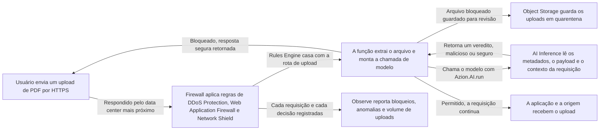

import FrameBox from '@aziontech/webkit/frame-box'
import ItemList from '@aziontech/webkit/item-list'
import DocItem from '@aziontech/webkit/doc-item'

Um endpoint de upload aceita um arquivo que ninguém leu. O PDF é o caso difícil. O formato é um contêiner, então um cabeçalho válido pode estar na frente de código embutido, macros ou links maliciosos. Regras que casam com a requisição não veem nada disso, porque a evidência está dentro do payload.

Esta arquitetura lê o payload antes da origem. Uma função em execução no Firewall extrai o arquivo enviado, chama um modelo através de AI Inference e aplica o veredito na mesma requisição. O modelo atua como um co-processador de segurança. Ele lê o conteúdo e o contexto do upload em tempo real, e um arquivo que não passa na verificação nunca chega à aplicação.

A inspeção de PDF é um exemplo prático de análise de arquivos. A mesma forma, uma função no Firewall que chama um modelo e age sobre a resposta, cobre outros cenários de segurança autônoma. Ela serve sempre que uma decisão depende do que a requisição carrega, e não de onde ela veio.

[Como AI Inference funciona](/pt-br/documentacao/build/ai-inference/como-funciona/) cobre uma única chamada de modelo. Esta página descreve a arquitetura de segurança construída em torno de uma dessas chamadas.

---

## Diagrama de arquitetura

O diagrama acompanha um upload do usuário até o veredito e de volta:

Leia o diagrama a partir da função no centro. Tudo à esquerda dela é uma política de firewall comum, decidida pelo envelope da requisição: de onde ela veio, os cabeçalhos, a taxa. A função é onde a arquitetura para de ler o envelope e começa a ler o arquivo. Tudo à direita dela decorre de uma única resposta, então a chamada de modelo é a única dependência nova que esta arquitetura acrescenta ao caminho da requisição. Um upload bloqueado nunca chega à origem, então a origem não recebe nada do tráfego que a política rejeita.

### Fluxo de dados

Uma requisição percorre a arquitetura nesta ordem:

1. Um usuário envia uma requisição HTTPS com um upload de PDF. O data center mais próximo dele responde a requisição.
2. Firewall processa a requisição. Ele aplica regras de DDoS Protection e, onde você as configurou, regras de Web Application Firewall e Network Shield Protection.
3. Antes que a requisição chegue à origem, uma regra do Rules Engine na rota de upload aciona a função de segurança. A função extrai o arquivo e monta a chamada de modelo.
4. AI Inference inspeciona o upload. Ele verifica os metadados do arquivo: tamanho, tipo e estrutura interna. Em seguida, lê o payload em busca de objetos suspeitos, código embutido, padrões de PDF Injection, scripts, macros, links maliciosos e inconsistências estruturais que indiquem tentativa de exploração. Ele correlaciona o resultado com o contexto da requisição e com as políticas que você definiu.
5. A função aplica o veredito. Ela bloqueia um upload malicioso e retorna uma resposta segura, como um erro genérico ou uma mensagem de arquivo inválido. Um upload seguro segue para a aplicação e depois para a origem.
6. Firewall registra cada requisição e cada decisão, e os produtos Observe carregam esse registro.

---

## Componentes

- [Firewall](/pt-br/documentacao/plataforma/firewall/): aplica a política de segurança pela qual um upload passa antes de qualquer inspeção. DDoS Protection absorve ataques volumétricos, e Web Application Firewall cobre o OWASP Top 10, incluindo vetores de upload e de manipulação de conteúdo. Network Shield bloqueia origens suspeitas por IP, ASN ou geolocalização. As verificações baratas executam primeiro, então o modelo só vê requisições que a política já aceitou.
- [Functions no Firewall](/pt-br/documentacao/plataforma/firewall/functions/): executa a função que carrega a decisão. Ela recebe a requisição, extrai o PDF, invoca o modelo e aplica o resultado: permitir, bloquear, colocar em quarentena ou responder de forma customizada. A decisão fica aqui, e não na aplicação de origem, e é isso que mantém um arquivo rejeitado fora da sua própria infraestrutura.
- [AI Inference](/pt-br/documentacao/build/ai-inference/): reúne os modelos e a lógica de decisão. Executa em tempo real sobre a estrutura e o conteúdo do PDF e aplica políticas de risco alinhadas aos requisitos de GRC da sua organização. Também aprende com feedback humano e eventos passados, e é isso que reduz a taxa de falsos positivos ao longo do tempo.
- [Applications](/pt-br/documentacao/plataforma/applications/) (opcional): hospeda a aplicação web que consome os uploads e expõe os endpoints HTTP e HTTPS. Está marcado como opcional porque a inspeção executa no Firewall, antes que a requisição chegue a quem serve o endpoint de upload.
- [Object Storage](/pt-br/documentacao/store/object-storage/) (opcional): armazena os arquivos mantidos em quarentena, para que um upload bloqueado possa ser reexaminado em vez de desaparecer. Também guarda as amostras de treinamento que alimentam a melhoria posterior do modelo.
- [Real-Time Metrics](/pt-br/documentacao/plataforma/real-time-metrics/) e [Real-Time Events](/pt-br/documentacao/observe/real-time-events/): reportam bloqueios, anomalias e volume de uploads, até a requisição individual. Uma política que decide com um modelo precisa de um registro do que decidiu, porque um falso positivo é invisível de fora. Data Stream leva os logs detalhados para um SIEM, um data lake ou uma plataforma de fraude. A GraphQL API responde às consultas de correlação que uma investigação faz.

---

## Implementação

- [Analise uploads de arquivos com uma função de firewall do AI Inference](/pt-br/documentacao/guias/ai/inferencia/analisar-uploads-com-ai-inference/) - constrói a função, a instancia no Firewall e configura a regra do Rules Engine que a aciona na rota de upload.
- [Modelos de AI](/pt-br/documentacao/build/ai-inference/modelos/) - os ids que a função pode passar e o que cada modelo aceita.
- [Invocação de modelos](/pt-br/documentacao/build/ai-inference/invocacao-de-modelos/) - o corpo da requisição que a função envia e o formato em que a resposta retorna.

---

## Recursos relacionados

<FrameBox>
<ItemList>
  <DocItem title="Como AI Inference funciona" href="/pt-br/documentacao/build/ai-inference/como-funciona/">A cadeia de invocação por trás da chamada de modelo que esta arquitetura coloca no caminho da requisição.</DocItem>
  <DocItem title="Limites do AI Inference" href="/pt-br/documentacao/build/ai-inference/limites/">Os tetos contra os quais uma chamada de modelo executa.</DocItem>
  <DocItem title="Functions" href="/pt-br/documentacao/build/functions/">O runtime em que a função de segurança executa, e o que o código dela pode fazer.</DocItem>
  <DocItem title="Object Storage" href="/pt-br/documentacao/store/object-storage/">O bucket em que um upload em quarentena é gravado, e como lê-lo de volta.</DocItem>
</ItemList>
</FrameBox>
