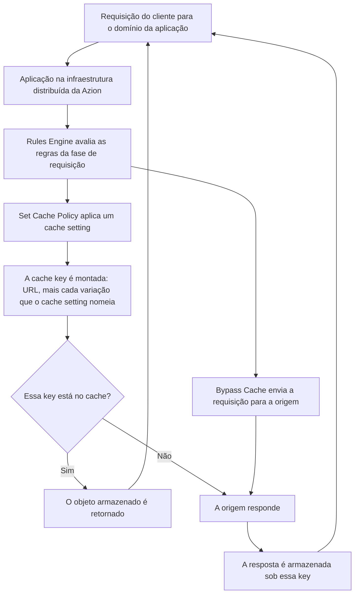

import FrameBox from '@aziontech/webkit/frame-box'
import ItemList from '@aziontech/webkit/item-list'
import DocItem from '@aziontech/webkit/doc-item'

Este desenho atende uma aplicação cujas respostas dependem de mais do que a URL: uma API que responde de forma diferente por query string, um catálogo que difere por dispositivo, uma página que varia por sessão. [Application Accelerator](/pt-br/documentacao/build/application-accelerator/) coloca essas entradas na cache key, então o cache consegue distinguir duas respostas corretas, em vez de entregar uma delas a todos ou não armazenar nenhuma.

Ele serve a times cujos caminhos dinâmicos chegam à origem a cada requisição porque um cache indexado apenas pela URL não representa o que torna essas requisições diferentes.

---

## O caminho da requisição

1. Um cliente requisita um domínio associado à aplicação. [Workloads](/pt-br/documentacao/plataforma/workloads/) registra esse domínio na Azion.
2. A aplicação recebe a requisição no data center mais próximo e [Rules Engine](/pt-br/documentacao/plataforma/applications/rules-engine/) avalia as regras da fase de requisição.
3. Uma regra decide o que acontece com o cache. **Set Cache Policy** aplica um cache setting; **Bypass Cache** envia a requisição para a origem e não armazena nada em cache.
4. A cache key é montada a partir da URL, mais cada variação que o cache setting nomeia: os argumentos de query string permitidos, os cookies nomeados, o device group e, para um `POST` ou `OPTIONS` em cache, o hash MD5 do corpo da requisição.
5. Uma key que já está no cache é respondida a partir do objeto armazenado. Uma key que não está chega à origem, e a resposta é armazenada sob essa key pelo TTL que o cache setting carrega.
6. Uma requisição que carrega o header `Pragma: azion-debug-cache` recebe a key de volta no header de resposta `X-Cache-Key`, que é como você confirma que a variação é a que você configurou.

Dois behaviors alteram o formato desse caminho, e não os seus passos. Um **Max Age** de 0 segundos mantém a requisição no caminho do cache e agrupa requisições simultâneas em uma única requisição à origem, enquanto **Bypass Cache** sai do caminho do cache por completo. Para essa diferença, e para o que cada variação custa, consulte [Como Application Accelerator funciona](/pt-br/documentacao/build/application-accelerator/como-funciona/).

---

## Componentes

- **[Applications](/pt-br/documentacao/plataforma/applications/)** contém a configuração de entrega, os cache settings e as regras, e é onde o módulo Application Accelerator é ativado.
- **[Cache](/pt-br/documentacao/build/cache/)** contém os objetos e é dono do formato da cache key ao qual cada variação acrescenta.
- **[Rules Engine](/pt-br/documentacao/plataforma/applications/rules-engine/)** decide quais requisições um cache setting alcança e carrega os behaviors que este módulo libera.
- **[Application Accelerator](/pt-br/documentacao/build/application-accelerator/)** fornece a variação de cache, o cache de respostas `POST` e `OPTIONS` e o TTL de cache abaixo de 60 segundos.
- **[Workloads](/pt-br/documentacao/plataforma/workloads/)** registra o domínio que serve a aplicação.

---

## Implementação

1. Crie uma aplicação, em [Azion Console](https://console.azion.com), pela [Azion API](https://api.azion.com/) ou com [Azion CLI](/pt-br/documentacao/devtools/cli/). Para os passos, consulte [Criar uma aplicação](/pt-br/documentacao/guias/desenvolvimento-de-aplicacoes/primeiros-passos/criar-uma-aplicacao/).
2. Registre o domínio que a serve. Para os passos, consulte [Como configurar um domínio](/pt-br/documentacao/guias/plataforma/migracao/configurar-dominio/).
3. Ative Application Accelerator e crie um cache setting que varia pelo atributo do qual as suas respostas dependem. Para uma query string ou um cookie, consulte [Configure a Advanced Cache Key para uma aplicação](/pt-br/documentacao/guias/performance-e-confiabilidade/cache-e-purge/advanced-cache-key/). Para uma resposta `POST`, consulte [Armazene em cache respostas de POST e OPTIONS](/pt-br/documentacao/guias/performance-e-confiabilidade/cache-e-purge/cache-de-respostas-post-e-options/).
4. Aplique o cache setting com uma regra do Rules Engine e acrescente qualquer regra de bypass ou de encaminhamento de cookies que o desenho exija. Para os passos, consulte [Configure políticas de cache para uma aplicação](/pt-br/documentacao/guias/performance-e-confiabilidade/cache-e-purge/cache-settings/).
5. Aponte o registro CNAME do seu domínio para o endpoint da Azion desse domínio.
6. Confirme a variação com o header `Pragma: azion-debug-cache`, depois acompanhe o status do cache sobre o tráfego real e ajuste a variação, e não o TTL, quando o número de objetos em cache crescer mais rápido do que o conteúdo.

Planeje o purge junto com a variação. Um purge por URL não alcança os objetos que variam por cookie ou por device group, então esses objetos precisam de um purge por cache key ou de um purge por wildcard. Para os tipos de purge, consulte [Real-Time Purge](/pt-br/documentacao/build/cache/real-time-purge/#purgue-conteudo-que-varia).

---

## Recursos relacionados

<FrameBox>
<ItemList>
  <DocItem title="Application Accelerator" href="/pt-br/documentacao/build/application-accelerator/">O que o módulo é, o que ele libera e onde estão os seus limites.</DocItem>
  <DocItem title="Como Application Accelerator funciona" href="/pt-br/documentacao/build/application-accelerator/como-funciona/">O que cada variação acrescenta à cache key e o que uma variação custa.</DocItem>
  <DocItem title="Configurações do Application Accelerator" href="/pt-br/documentacao/build/application-accelerator/configuracoes/">O campo, o enum e o valor padrão por trás de cada escolha deste desenho.</DocItem>
  <DocItem title="Primeiros passos com Application Accelerator" href="/pt-br/documentacao/build/application-accelerator/primeiros-passos/">Construa uma versão menor deste desenho em uma única sessão.</DocItem>
  <DocItem title="Cache" href="/pt-br/documentacao/build/cache/">O formato da cache key, os status de cache e os limites de um objeto em cache.</DocItem>
</ItemList>
</FrameBox>
