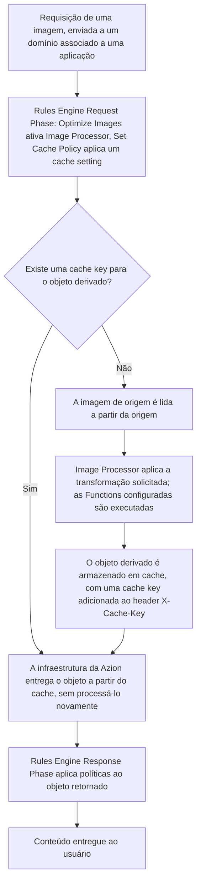

import DocButton from '~/components/webkit/DocButton.vue'
import FrameBox from '@aziontech/webkit/frame-box'
import ItemList from '@aziontech/webkit/item-list'
import DocItem from '@aziontech/webkit/doc-item'

Servir uma imagem no tamanho e formato originais custa tempo de carregamento e armazenamento. Todo dispositivo recebe o mesmo arquivo independentemente do tamanho da tela, e todo tamanho ou formato que uma aplicação precisa deve ser produzido e armazenado com antecedência.

[Image Processor](/pt-br/documentacao/build/image-processor/) remove essa necessidade. Uma requisição de imagem pode carregar uma query string que descreve uma transformação. A transformação pode redimensionar ou recortar a imagem, converter o formato dela ou aplicar um filtro como uma marca d'água. Image Processor retorna uma imagem derivada, construída a partir de uma única imagem de origem, na origem. A imagem de origem nunca é modificada, e a imagem derivada nunca é armazenada como um asset separado.

---

## Diagrama de arquitetura

O diagrama traça uma requisição a partir do domínio configurado para a aplicação, passando pelas duas fases do [Rules Engine](/pt-br/documentacao/plataforma/applications/rules-engine/), até a entrega. Entre as fases, Image Processor deriva a imagem quando nenhuma cache key já contém uma, e a infraestrutura distribuída da Azion armazena o resultado em cache para a próxima requisição correspondente.

### Fluxo de dados

1. Um usuário requisita uma imagem através do domínio associado à aplicação.
2. A **Request Phase** do Rules Engine processa a requisição. O behavior **Optimize Images** ativa Image Processor, e um behavior **Set Cache Policy** aplica o cache setting configurado para arquivos de imagem.
3. Cache determina se já existe uma key para o objeto derivado. Em uma correspondência, a Azion entrega o objeto em cache diretamente, e Image Processor não é executado: uma imagem servida a partir do cache sem processamento não conta contra o medidor de Images.
4. Em uma falta de cache, a imagem de origem é lida a partir da origem, Image Processor aplica a transformação solicitada, e quaisquer [Functions](/pt-br/documentacao/build/functions/) configuradas são executadas. A Azion armazena o resultado em cache e adiciona uma cache key ao header de resposta `X-Cache-Key`.
5. O objeto retorna à camada de aplicação, onde a **Response Phase** do Rules Engine impõe quaisquer políticas configuradas para objetos retornados da origem.
6. A Azion entrega o conteúdo ao usuário.

---

## Componentes

- [Applications](/pt-br/documentacao/plataforma/applications/) mantém a configuração de entrega e cache de uma requisição, e é o recurso da plataforma ao qual Image Processor, Cache e Rules Engine pertencem como módulos.
- Rules Engine avalia a requisição em relação aos critérios configurados e aplica behaviors por fase. Neste caminho, o behavior **Optimize Images** ativa Image Processor, e um behavior **Set Cache Policy** aplica o cache setting para arquivos de imagem.
- Image Processor lê a query string `ims` de uma requisição e retorna uma imagem derivada construída a partir da imagem de origem, na origem, sem modificar a imagem de origem nem armazenar a imagem derivada como um asset separado.
- [Cache](/pt-br/documentacao/build/cache/) armazena a imagem derivada após a primeira requisição, indexada por uma key que inclui a query string `ims`, então uma requisição correspondente posterior ignora Image Processor e a origem.
- [Workloads](/pt-br/documentacao/plataforma/workloads/) registra o domínio que recebe a requisição e a roteia até a aplicação.

---

## Implementação

- [Criar uma aplicação](/pt-br/documentacao/guias/desenvolvimento-de-aplicacoes/primeiros-passos/criar-uma-aplicacao/) - crie a aplicação sobre a qual Rules Engine e Image Processor operam, usando [Azion Console](https://console.azion.com/), Azion API ou [Azion CLI](/pt-br/documentacao/devtools/cli/).
- [Template Image Optimization](/pt-br/documentacao/guias/desenvolvimento-de-aplicacoes/frameworks/image-optimization-template/) - implante uma aplicação pré-configurada com Image Processor ativado.

<DocButton
  label="Implantar o template Image Optimization"
  href="https://console.azion.com/create/azion/image-optimization"
  icon="ai ai-azion"
  target="_blank"
  size="medium"
/>

- [Configurar um domínio](/pt-br/documentacao/guias/plataforma/migracao/configurar-dominio/) - registre o domínio que recebe as requisições para a aplicação.
- [Migre seus nameservers para a Azion](/pt-br/documentacao/guias/plataforma/migracao/migrar-ns-para-a-azion/) - aponte o domínio para a Azion para que as requisições alcancem a aplicação.
- [Configure políticas de cache](/pt-br/documentacao/guias/performance-e-confiabilidade/cache-e-purge/cache-settings/) - crie um cache setting para arquivos de imagem, com um TTL longo.
- [Cache Settings](/pt-br/documentacao/build/cache/cache-settings/) - a referência de campos para o teto de TTL que um cache setting aceita.
- [Crie regras de requisição e resposta](/pt-br/documentacao/guias/desenvolvimento-de-aplicacoes/primeiros-passos/rules-engine/) - adicione uma regra que aplica o behavior **Optimize Images** e um behavior **Set Cache Policy** às requisições de imagem.
- [Parâmetros de URL do Image Processor](/pt-br/documentacao/build/image-processor/parametros-de-url/) - a sintaxe da query string `ims` que solicita uma transformação.
- [Real-Time Metrics](/pt-br/documentacao/plataforma/real-time-metrics/) - acompanhe o tráfego de imagens e a economia de banda depois do deploy.

---

## Recursos relacionados

<FrameBox>
<ItemList>
  <DocItem title="Primeiros passos com Image Processor" href="/pt-br/documentacao/build/image-processor/primeiros-passos/">Ative Image Processor e processe a primeira imagem.</DocItem>
  <DocItem title="Como Image Processor funciona" href="/pt-br/documentacao/build/image-processor/como-funciona/">O mecanismo por trás de uma transformação, em detalhe.</DocItem>
  <DocItem title="Configurações do Image Processor" href="/pt-br/documentacao/build/image-processor/configuracoes/">Os nomes de campo, tipos e padrões por trás de cada configuração deste caminho.</DocItem>
  <DocItem title="Limites" href="/pt-br/documentacao/build/image-processor/limites/">Os limites de tamanho e dimensão que uma imagem derivada respeita.</DocItem>
  <DocItem title="Boas práticas" href="/pt-br/documentacao/build/image-processor/boas-praticas/">Configurações recomendadas de cache e regras para a entrega de imagens.</DocItem>
  <DocItem title="Configure Image Processor em uma aplicação" href="/pt-br/documentacao/guias/performance-e-confiabilidade/otimizacao-de-entrega/processar-imagens/">As etapas que configuram Image Processor e a política de cache dele.</DocItem>
</ItemList>
</FrameBox>
