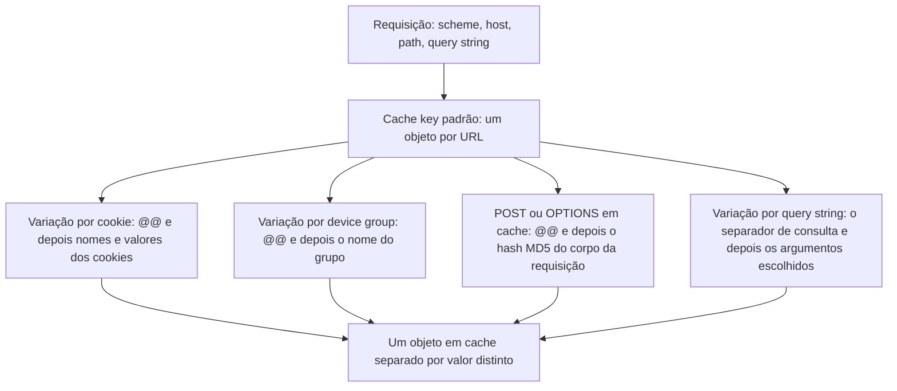

import FrameBox from '@aziontech/webkit/frame-box'
import ItemList from '@aziontech/webkit/item-list'
import DocItem from '@aziontech/webkit/doc-item'

Um cache armazena uma resposta e atende as requisições seguintes pelo mesmo objeto a partir dessa cópia. Ele encontra a cópia pela URL, o que pressupõe que uma URL tem uma única resposta correta. Conteúdo dinâmico quebra essa premissa. Sob uma única URL, um visitante autenticado vê o próprio carrinho, uma listagem se reordena a partir de um filtro e um layout muda no celular.

Application Accelerator é o módulo de [Applications](/pt-br/documentacao/plataforma/applications/) que remove essa premissa. Um único switch na aplicação o ativa, e esse switch altera quatro coisas de uma vez. Cada uma das quatro existe pelo mesmo motivo: uma requisição cuja resposta depende de mais do que a própria URL não pode ser armazenada em cache apenas pela URL.

Esta página trata dos mecanismos, não dos valores. Os nomes dos campos, os tipos e os valores padrão estão em [Configurações do Application Accelerator](/pt-br/documentacao/build/application-accelerator/configuracoes/), e os tetos estão em [Limites](/pt-br/documentacao/build/application-accelerator/limites/). O formato completo da cache key pertence a [Cache](/pt-br/documentacao/build/cache/), que é o módulo dono dele.

As seções abaixo tratam do que o módulo libera, de como uma variação altera a cache key e do que uma variação custa. As duas últimas tratam de como um purge alcança um objeto que varia e de como um TTL de cache igual a zero difere de Bypass Cache.

---

## O que Application Accelerator libera

Application Accelerator é um único switch, e ele pertence a uma aplicação. Ativá-lo libera quatro capacidades que parecem não ter relação entre si até você ver o que elas têm em comum:

- Variação de cache além da URL, por query string, por cookie e por device group. A funcionalidade é [Advanced Cache Key](/pt-br/documentacao/build/cache/cache-settings/#application-accelerator).
- Cache de respostas `POST` e `OPTIONS`, além dos métodos `GET` e `HEAD` que uma aplicação armazena em cache nativamente.
- Um TTL de cache que pode chegar a 0 segundos.
- Mais sete behaviors do [Rules Engine](/pt-br/documentacao/plataforma/applications/rules-engine/) e a variável `${device_group}` nos critérios de uma regra.

O que as quatro têm em comum é conteúdo dinâmico. A variação de cache dá ao índice do cache o dado extra de que ele precisa para distinguir duas respostas corretas. O cache de `POST` e `OPTIONS` traz os métodos que carregam esse dado no corpo da requisição. Um TTL abaixo de um minuto serve ao conteúdo que deixa de ser correto antes de um minuto passar. Vários dos behaviors liberados agem justamente sobre os cookies e os paths que carregam essa diferença.

O switch entrega as quatro capacidades ou nenhuma. Uma aplicação não recebe a variação de cache sem receber também os métodos extras e os behaviors extras, e ativar o switch não altera nenhum tráfego por si só. Todo controle de variação começa configurado para ignorar a variação, e um cache setting alcança uma requisição apenas quando um behavior [Set Cache Policy](/pt-br/documentacao/plataforma/applications/rules-engine/#set-cache-policy) em uma regra o aplica. Ativar um módulo também pode gerar custos relacionados ao uso. Para mais informações, consulte [Preços](/pt-br/documentacao/fundamentos/precos/#application-accelerator).

---

## A cache key e suas variações

Uma cache key é a entrada de índice de um objeto em cache. Por padrão, a Azion monta essa entrada a partir do scheme, do host, do path e da query string da requisição, então cada URL é um objeto distinto em cache. Application Accelerator acrescenta mais um dado a essa cache key, e cada tipo de variação acrescenta o próprio marcador.

A variação por cookie acrescenta o separador `@@`, depois os nomes dos cookies e os seus valores, cada um seguido de `;`. A variação por device group acrescenta `@@` e o nome do grupo. Uma resposta `POST` ou `OPTIONS` em cache acrescenta `@@` e o hash MD5 do corpo da requisição, então dois corpos diferentes enviados para um mesmo path são dois objetos. A variação por query string é a exceção, porque os argumentos já fazem parte da URL. A cache key carrega o separador de consulta e os argumentos escolhidos, na ordem em que foram submetidos. Uma requisição que usa qualquer método diferente de `GET` ou `HEAD` é uma requisição complexa, e a cache key dela carrega o método como prefixo.

O diagrama mostra a partir do que a cache key padrão é montada e o que cada variação acrescenta a ela:

Uma variação por cookie sobre o cookie `user` produz uma cache key no formato `httpwww.example.com/@@user=user;`, e um `POST` em cache produz uma no formato `httpsdynamic.example.com/path@@md5_of_post_arguments`. A cache key conta a história inteira: duas requisições compartilham um objeto em cache quando produzem a mesma cache key, e recebem objetos separados quando não produzem. Para o formato completo e cada dado que uma cache key carrega, consulte [Formato da cache key](/pt-br/documentacao/build/cache/cache-keys/#formato-da-key).

---

## O custo de uma variação

A variação de cache tem um custo, e ele decorre de como a cache key é montada: cada valor distinto de um atributo que varia produz um objeto em cache separado. Isso torna a escolha do atributo pelo qual variar mais consequente do que a escolha de variar. Um cookie cujo valor é único por visitante dá a cada visitante uma cópia do objeto. O cache continua funcionando, mas deixa de servir uma resposta armazenada para muitas requisições. O número de objetos cresce com a audiência, e não com o conteúdo.

Uma allowlist é o controle desse custo. O behavior `allowlist` nomeia os argumentos de query string ou os cookies que alteram a resposta, de modo que um atributo que ninguém nomeou não pode criar outro objeto. O behavior `all` varia por todo atributo que chega, inclusive os que a aplicação ignora. Por exemplo, um link que chega com um argumento de campanha ganha o próprio objeto em cache sob `all`. Sob uma allowlist que não nomeia esse argumento, o mesmo link aponta para o objeto compartilhado.

A ordenação de query string aplica a mesma economia à ordem dos argumentos. Os argumentos escolhidos entram na cache key na ordem em que foram submetidos, então `?a=1&b=2` e `?b=2&a=1` são dois objetos que guardam uma resposta. Com a ordenação ativada, essas variações se agrupam sob uma única cache key, ordenadas alfabeticamente. O custo da ordenação é que a cache key deixa de corresponder à URL como o cliente a escreveu, o que importa na hora do purge.

---

## Variação de cache e purges

Um purge remove um objeto do cache e encontra esse objeto pela cache key dele. Um purge por URL converte a URL que recebe em uma cache key sem considerar a variação de conteúdo. Toda variação que a URL não carrega, portanto, sobrevive a ele. As variações por cookie e as variações por device group não expiram com um purge por URL, e as cópias delas permanecem no cache.

Dois tipos de purge alcançam essas cópias. Um purge por cache key nomeia cada variação individualmente, e um purge por wildcard encerra a cache key com `@@*`. As variações por query string são a exceção outra vez, porque a query string faz parte da URL. Um purge por URL alcança essas variações quando os argumentos são enviados na ordem em que foram apresentados, e em ordem alfabética quando a ordenação de query string está ativada.

As variações que você configura são também os objetos que um purge precisa alcançar. Uma variação de alta cardinalidade custa, portanto, tanto na hora do purge quanto em armazenamento. Para os tipos de purge e os passos para executar cada um, consulte [Real-Time Purge](/pt-br/documentacao/build/cache/real-time-purge/#purgue-conteudo-que-varia).

---

## Um TTL de cache igual a zero e Bypass Cache

Sem Application Accelerator, o TTL de cache mais curto que uma aplicação aceita é de 60 segundos. O módulo remove esse piso e permite 0. Um TTL de cache de 0 segundos não é o mesmo que não armazenar em cache, e a diferença entre os dois é a razão de ambos existirem.

O behavior [Bypass Cache](/pt-br/documentacao/plataforma/applications/rules-engine/#bypass-cache) envia toda requisição HTTP e HTTPS para a origem, e a Azion não armazena nada em cache. Ele não altera o cache do navegador, que um behavior Set Cache Policy define. Use-o quando cada requisição precisa receber um conteúdo diferente.

Um **Max Age** de 0 segundos mantém a requisição no caminho do cache. Várias requisições paralelas pelo mesmo objeto são enviadas para a origem como uma requisição única, e a Azion valida as alterações com uma requisição `If-Modified-Since`. Um objeto que não mudou não é transferido de novo. Use 0 quando o conteúdo dinâmico pode ser entregue de forma idêntica a todos que o requisitam no mesmo momento.

A troca é entre uma resposta atualizada a cada requisição e a carga sobre a origem. Bypass Cache dá a cada requisição a própria resposta, e abre mão tanto da requisição única à origem para requisições paralelas quanto da revalidação que dispensa a transferência de um objeto que não mudou. Um TTL de 0 mantém as duas coisas, e abre mão da capacidade de responder de forma diferente a duas requisições simultâneas.

---

## Recursos relacionados

<FrameBox>
<ItemList>
  <DocItem title="Primeiros passos com Application Accelerator" href="/pt-br/documentacao/build/application-accelerator/primeiros-passos/">Ative o módulo e crie um cache setting que varia a cache key.</DocItem>
  <DocItem title="Configurações do Application Accelerator" href="/pt-br/documentacao/build/application-accelerator/configuracoes/">Os nomes dos campos, os tipos e os valores padrão por trás de cada mecanismo desta página.</DocItem>
  <DocItem title="Limites" href="/pt-br/documentacao/build/application-accelerator/limites/">Os valores que delimitam um cache setting, incluindo o piso e o teto do TTL.</DocItem>
  <DocItem title="Cache" href="/pt-br/documentacao/build/cache/">O formato completo da cache key ao qual cada variação acrescenta o próprio marcador.</DocItem>
  <DocItem title="Real-Time Purge" href="/pt-br/documentacao/build/cache/real-time-purge/">Como fazer purge de um objeto que varia por cookie, query string ou device group.</DocItem>
  <DocItem title="Configurar Advanced Cache Key" href="/pt-br/documentacao/guias/performance-e-confiabilidade/cache-e-purge/advanced-cache-key/">Os passos que configuram a variação de cache em um cache setting.</DocItem>
</ItemList>
</FrameBox>
