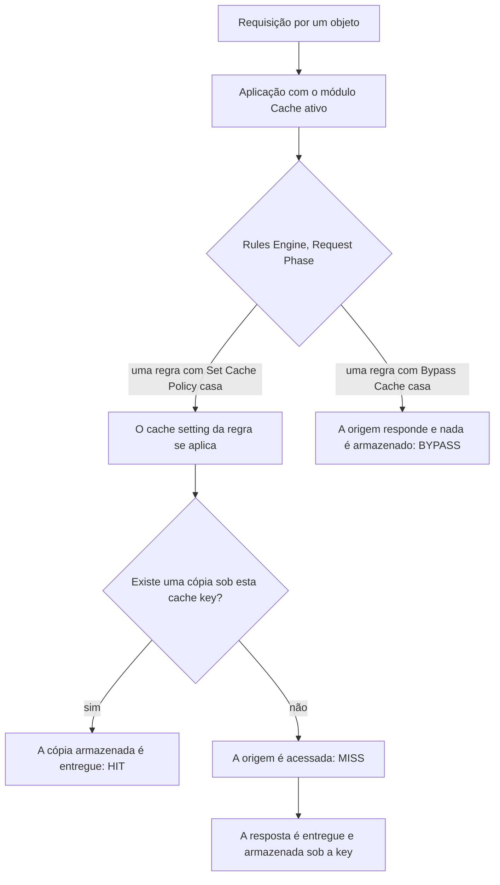

import FrameBox from '@aziontech/webkit/frame-box'
import ItemList from '@aziontech/webkit/item-list'
import DocItem from '@aziontech/webkit/doc-item'

Um cache mantém uma cópia de uma resposta da origem no data center que a buscou. As requisições seguintes pelo mesmo objeto são respondidas por essa cópia, e a origem não é acessada novamente. A cópia é indexada por uma cache key montada a partir da requisição, e é mantida por um tempo de vida, o TTL. Quando o TTL termina, a cópia expira e a requisição seguinte verifica a origem.

Na Azion, a cópia pertence ao módulo Cache de uma aplicação, e o módulo está ativo em cada aplicação que você cria em [Applications](/pt-br/documentacao/plataforma/applications/). Um cache setting carrega os TTLs e as regras de variação. Uma regra do [Rules Engine](/pt-br/documentacao/plataforma/applications/rules-engine/) com o behavior **Set Cache Policy** aplica esse setting às requisições que ela casa. Uma regra com **Bypass Cache** envia a requisição para fora do cache.

Esta página cobre os mecanismos, não os valores. O formato completo da key está em [Cache keys](/pt-br/documentacao/build/cache/cache-keys/), e os campos com seus padrões estão em [Cache settings](/pt-br/documentacao/build/cache/cache-settings/). A variação de cache por query string e por cookie pertence ao [Application Accelerator](/pt-br/documentacao/build/application-accelerator/). As seções abaixo cobrem o caminho da requisição, o TTL e a expiração, o stale cache, o Large File Optimization, a variação de cache, o Tiered Cache e o purge.

---

## O caminho da requisição

Uma requisição chega a uma cópia em cache por uma cadeia de objetos. O diagrama mostra essa cadeia, da requisição até a cópia armazenada ou até a origem:

Um cache setting não faz nada enquanto uma regra não o aplicar. O módulo Cache está ativo em cada aplicação, mas uma aplicação nova não tem cache settings nem regras. A cadeia começa quando você cria um setting na aba **Cache Settings** e uma regra de **Request Phase** com **Set Cache Policy** o nomeia. Cada requisição que a regra casa é então buscada pela sua cache key. Quando existe uma cópia armazenada, o data center que recebeu a requisição responde por ela, e a resposta informa `HIT`. Caso contrário, a requisição vai à origem, a resposta informa `MISS`, e a Azion pode armazenar a resposta para as requisições seguintes. Uma regra com o behavior **Bypass Cache** envia suas requisições à origem, nada é armazenado, e a resposta informa `BYPASS`.

Em um miss, a plataforma limita o que a origem precisa fazer. Quando várias requisições pelo mesmo objeto fora do cache chegam ao mesmo tempo, a Azion abre uma conexão com a origem para todas elas. Quando possível, a Azion também mantém abertas as suas conexões com a origem entre as buscas, em vez de abrir uma nova a cada vez. Sob uma rajada de requisições por um objeto fora do cache, a origem vê então uma busca por data center, não uma por visitante. Para a key que a busca usa e o header que informa o status, consulte [Cache keys](/pt-br/documentacao/build/cache/cache-keys/).

---

## TTL e expiração

Uma cópia em cache é válida pelo seu tempo de vida, o TTL, e um cache setting carrega dois deles. O TTL de browser controla por quanto tempo o browser de um visitante mantém a sua cópia, e o TTL de cache controla por quanto tempo a Azion mantém a dela. Uma requisição que o browser responde pela sua cópia nunca chega à Azion, e uma requisição que a Azion responde pela cópia dela nunca chega à origem.

De onde vem cada TTL depende do comportamento que o setting seleciona. Sob _Honor cache policies_, a Azion mantém os headers `Cache-Control` e `Expires` enviados pela origem e os repassa ao browser. A origem decide por quanto tempo o seu conteúdo vive. Sob _Override cache behavior_, o campo **Max Age** substitui esses headers para o cache da Azion. A seção **Browser Cache** carrega a sua própria escolha entre honrar e sobrescrever, para a cópia do browser. Quando a origem não envia TTL sob _Honor cache policies_, a cópia é mantida por um TTL padrão, como o Console informa nessa opção.

A cópia expira quando o TTL de cache termina, e a requisição seguinte pelo objeto vai à origem. Quando a origem retorna o objeto, essa resposta atualiza a cópia, e a resposta informa `EXPIRED`. Uma verificação com headers condicionais também pode encontrar a cópia inalterada: a resposta então informa `REVALIDATED`, e a origem não transmite o objeto novamente.

O TTL é uma troca entre a carga da origem e a idade do que o visitante vê. Um TTL longo responde mais requisições pela cópia e acessa menos a origem. O preço é que o conteúdo que a origem já alterou permanece na cópia até ela expirar. Um TTL curto mantém a cópia próxima da versão da origem, ao preço de mais buscas na origem. Por exemplo, uma aplicação pode manter dois cache settings, cada um aplicado pela sua própria regra. Imagens que raramente mudam recebem um TTL de um dia, e uma listagem que muda ao longo do dia recebe um TTL de alguns minutos. O TTL de cache tem um piso que o Application Accelerator eleva, e um teto. Para os dois valores, consulte [Limites do Cache](/pt-br/documentacao/build/cache/limites/).

### Bypass Cache e um TTL de 0

Existem duas formas de impedir que uma cópia seja entregue, e elas diferem no que a origem vê. O behavior **Bypass Cache** envia à origem cada requisição que ele casa e não armazena nada em cache. Ele mantém as otimizações de protocolo e, quando possível, uma conexão keep-alive com a origem. Use-o quando cada requisição precisa receber conteúdo diferente. Ele não altera o browser cache, que o **Set Cache Policy** governa.

Um **Max Age** de 0 segundos mantém a requisição no caminho do cache, e exige o Application Accelerator porque o módulo eleva o piso do TTL. Requisições paralelas pelo mesmo objeto chegam à origem como uma requisição. A Azion valida o objeto com uma requisição `If-Modified-Since`, então um objeto inalterado não é transferido novamente. Use-o quando o conteúdo dinâmico pode ser entregue de forma idêntica a todos que o requisitam no mesmo momento.

Cada escolha custa o que a outra mantém. O Bypass Cache responde cada requisição pela origem, então nenhuma requisição é combinada e nenhum objeto é revalidado. Um TTL de 0 combina requisições simultâneas e revalida o objeto, então dois visitantes que perguntam no mesmo momento recebem a mesma resposta.

---

## Stale cache

Uma cópia além do seu TTL ainda tem utilidade. Com o **Stale cache** ativo no cache setting, a Azion pode reutilizar uma cópia expirada quando uma tentativa de revalidação falha por um de quatro motivos:

- A origem retorna um erro `5xx`.
- A conexão excede o tempo limite, ou a origem está inacessível.
- Os headers de cache-control da origem são inválidos ou estão ausentes.
- O objeto está em atualização, com uma revalidação em andamento.

Por quanto tempo a cópia expirada pode ser entregue é a janela de stale. Sob _Honor cache policies_, a Azion lê a diretiva `stale-while-revalidate=<ttl>` que a origem fornece, e esse valor é a janela. Sob _Override cache behavior_, ou quando a origem omite a diretiva, a janela é de 300 segundos. Durante a janela, o data center entrega a cópia expirada de imediato e busca uma versão atual em background. Quando o novo objeto é armazenado, as requisições seguintes recebem o conteúdo atualizado.

A resposta diz qual caso se aplica. Uma resposta entregue por uma cópia expirada porque a origem não respondeu informa `STALE`. Uma entregue enquanto a versão atual está a caminho da origem informa `UPDATING`.

A consequência é que uma indisponibilidade da origem mostra ao visitante uma página antiga em vez de uma página de erro, pelo tempo que a janela durar. O custo é a atualidade: um visitante dentro da janela pode receber conteúdo que a origem já substituiu. Uma alteração que cada visitante precisa ver de imediato é, portanto, um caso para um purge, e não para a expiração. Se um setting novo começa com o toggle ativo depende da interface. Um setting criado pela API ou pela CLI tem o stale cache desativado, e o Console o ativa em um setting novo. Para o campo, consulte [Cache settings](/pt-br/documentacao/build/cache/cache-settings/).

---

## Large File Optimization

Um objeto grande é armazenado em cache em fragmentos, e não como uma peça única. Com o **Large file optimization** ativo no cache setting, a Azion divide o arquivo em fragmentos de 1.024 kB. Cada fragmento é entregue conforme o usuário o consome e colocado em cache sob demanda, no momento em que é requisitado. A cache key de um fragmento termina em `@@bytes=` e no intervalo de bytes que o fragmento carrega, então cada fragmento é um objeto próprio. Por exemplo, um vídeo de 2.097.151 bytes em `https://static.example.com/media/file.mp4` gera dois fragmentos, armazenados sob `httpsstatic.example.com/media/file.mp4@@bytes=0-1048575` e `httpsstatic.example.com/media/file.mp4@@bytes=1048576-2097151`.

Como um fragmento é buscado apenas quando um usuário chega a ele, um download interrompido no meio deixa os fragmentos seguintes sem busca. Os fragmentos buscados permanecem em cache para a requisição seguinte. A fragmentação se aplica ao cache da Azion e à camada do Tiered Cache quando o setting tem esse toggle ativo.

O custo aparece no purge. Um arquivo se torna muitas keys, então um purge lista a key de cada fragmento ou usa um wildcard que termina o path do arquivo com `*`. Um purge que remove alguns fragmentos e não outros deixa uma mistura de fragmentos novos e antigos no cache. Para os tipos de purge, consulte [Real-Time Purge](/pt-br/documentacao/build/cache/real-time-purge/).

---

## Variação de cache

Uma variação é uma segunda cópia de uma URL, armazenada sob uma cache key diferente. A Azion monta a key padrão a partir do scheme, do host, do path e da query string da requisição, então uma URL é um objeto armazenado. Quando algo além da URL altera a resposta, o cache setting o nomeia, e a key carrega um marcador para cada entrada nomeada. Quatro entradas podem variar uma cópia: um cookie, um argumento de query string, o device group em que a requisição se encaixa e o método da requisição. Uma quinta, o formato da imagem, é acrescentada quando o [Image Processor](/pt-br/documentacao/build/image-processor/) converte uma imagem.

Os device groups vêm de [Device Groups](/pt-br/documentacao/plataforma/applications/device-groups/). Um setting entrega uma versão única independentemente do dispositivo, ou mantém uma cópia por grupo que ele nomeia. O método também é uma variação. Requisições `GET` e `HEAD` são colocadas em cache nativamente, e respostas `POST` e `OPTIONS` somente com o Application Accelerator ativo. O corpo da requisição então passa a fazer parte da key como um hash MD5, então dois corpos diferentes enviados a um path são dois objetos.

Cada valor distinto é um objeto armazenado separado, então uma variação divide as requisições por uma URL entre várias cópias. Menos requisições encontram uma cópia já presente, e um purge precisa alcançar cada cópia. Por exemplo, uma página de listagem que varia por um argumento `page` armazena uma cópia por número de página. Um purge da listagem precisa nomear cada uma delas. Para o formato de cada marcador, consulte [Cache keys](/pt-br/documentacao/build/cache/cache-keys/). Os controles que ativam uma variação estão em [Configurações do Application Accelerator](/pt-br/documentacao/build/application-accelerator/configuracoes/).

---

## Tiered Cache

O [Tiered Cache](/pt-br/documentacao/build/cache/tiered-cache/) adiciona uma segunda camada de cache entre o cache da Azion e a origem. Quando o data center que recebeu a requisição não tem uma cópia válida, ele consulta a camada do Tiered Cache antes de consultar a origem. Um miss na primeira camada pode, portanto, ainda ser respondido pelo cache. A segunda camada mantém objetos por mais tempo do que a primeira, em uma região mais próxima dos seus usuários.

A camada é ativada por cache setting com o toggle **Tiered Cache**, e está incluída em todos os planos. O setting nomeia uma de três topologies: `nearest-region`, `br-east-1` ou `us-east-1`. O Tiered Cache também exige _Override cache behavior_, porque a API o rejeita sob _Honor cache policies_.

A troca é um salto extra e um piso no TTL. Um miss na primeira camada percorre até a segunda antes de chegar à origem. Um setting com o Tiered Cache ativo também precisa carregar um TTL mínimo, porque a camada é feita para objetos que permanecem em cache por muito tempo. Em troca, menos requisições chegam à origem. Para o mínimo, consulte [Limites do Cache](/pt-br/documentacao/build/cache/limites/).

Uma regra com **Bypass Cache** afeta o cache da Azion, e não a camada do Tiered Cache. Uma aplicação com cache settings de Tiered Cache ativos continua a armazenar em cache nessa camada pelo TTL mínimo. Quando você purga um objeto mantido nas duas camadas, purgue primeiro a camada do Tiered Cache e depois o Cache. Caso contrário, a primeira camada é reabastecida com conteúdo desatualizado do Tiered Cache. A camada do Tiered Cache é purgada por cache key.

---

## Purge

Um purge remove uma cópia armazenada antes do fim do seu TTL. A requisição seguinte pelo objeto não encontra cópia, vai à origem e armazena a versão que a origem retorna, e essa resposta informa `MISS`. Um purge é colocado em fila depois da sua confirmação, porque o resultado leva tempo para propagar. Ele aparece no histórico de purges quando termina na infraestrutura da Azion.

Um purge encontra um objeto pela sua cache key, e é por isso que o tipo de purge importa para um objeto que varia. Um purge por URL converte cada URL em uma cache key sem considerar a variação de conteúdo. Uma cópia que varia por cookie, device group ou formato de imagem, portanto, sobrevive a ele. Um purge por cache key nomeia cada variação, e um purge por wildcard alcança cada key que casa com uma expressão com `*`. As variações por query string são a exceção que um purge por URL alcança. Os argumentos precisam estar na ordem em que foram apresentados, ou em ordem alfabética quando o **Sort** está ativo.

Remover um objeto com o método HTTP `DEL` em vez de um purge também faz a primeira requisição `GET` do usuário ir à origem. A diferença é a rede de proteção. O método impede que a Azion entregue uma cópia desatualizada quando a origem está inacessível, e uma página de erro é entregue no lugar. Três casos se adequam a ele:

- O conteúdo saiu da origem e precisa sair do cache também.
- Um conteúdo cujo timestamp não é confiável precisa de uma remoção forçada e de uma atualização posterior.
- Uma página de erro é preferível a uma cópia desatualizada enquanto a origem está inacessível.

Um purge é a ferramenta para uma alteração que não pode esperar o TTL. O seu custo é a busca na origem que reabastece cada key purgada. Quanto mais keys um objeto tem, por variações ou por fragmentos, mais um purge precisa nomear. Para os tipos de purge e seus argumentos, consulte [Real-Time Purge](/pt-br/documentacao/build/cache/real-time-purge/). Os passos estão em [Purgue conteúdo em cache](/pt-br/documentacao/guias/performance-e-confiabilidade/cache-e-purge/purgar-conteudo-em-cache/).

---

## Recursos relacionados

<FrameBox>
<ItemList>
  <DocItem title="Cache settings" href="/pt-br/documentacao/build/cache/cache-settings/">Todos os campos de um cache setting, com o seu tipo e o seu padrão por interface.</DocItem>
  <DocItem title="Cache keys" href="/pt-br/documentacao/build/cache/cache-keys/">O formato completo da key, os headers de debug e cada status de cache nomeado nesta página.</DocItem>
  <DocItem title="Real-Time Purge" href="/pt-br/documentacao/build/cache/real-time-purge/">Os três tipos de purge e como cada um alcança um objeto que varia.</DocItem>
  <DocItem title="Tiered Cache" href="/pt-br/documentacao/build/cache/tiered-cache/">A segunda camada de cache, suas topologies e a ordem de purge que ela exige.</DocItem>
  <DocItem title="Limites do Cache" href="/pt-br/documentacao/build/cache/limites/">O piso e o teto do TTL, o tamanho do fragmento e as quotas de purge.</DocItem>
  <DocItem title="Boas práticas" href="/pt-br/documentacao/build/cache/boas-praticas/">As recomendações que seguem destes mecanismos, uma seção por prática.</DocItem>
  <DocItem title="Configurações do Application Accelerator" href="/pt-br/documentacao/build/application-accelerator/configuracoes/">Os controles por trás da variação de cache, do cache de POST e OPTIONS e de um TTL abaixo do piso.</DocItem>
  <DocItem title="Primeiros passos com Cache" href="/pt-br/documentacao/build/cache/primeiros-passos/">Crie um cache setting, aplique-o com uma regra e leia o status de cache da primeira resposta.</DocItem>
</ItemList>
</FrameBox>
