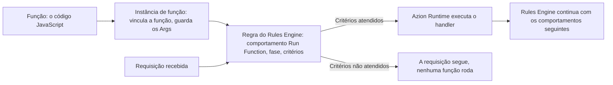
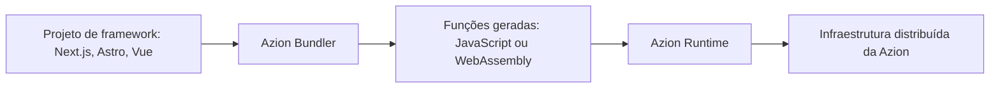

import Code from '~/components/Code/Code.astro'
import FrameBox from '@aziontech/webkit/frame-box'
import ItemList from '@aziontech/webkit/item-list'
import DocItem from '@aziontech/webkit/doc-item'

Um código que roda junto ao usuário responde a uma requisição perto de onde ela começa, em vez de em um servidor distante até o qual a requisição precisa viajar. Esse código não parte sozinho. Algo no caminho da requisição precisa decidir, a cada requisição, que aquele é o momento de chamá-lo.

Na Azion, três objetos distintos carregam essa decisão. Uma função guarda o código JavaScript. Uma instância de função vincula essa função a uma aplicação ou a um firewall. A instância carrega os Args, um objeto JSON passado para o contexto de execução da função. Uma regra do [Rules Engine](/pt-br/documentacao/plataforma/applications/rules-engine/) nomeia a instância, a fase em que ela roda e os critérios que a disparam.

Criar uma função não a executa. Uma função para a qual nenhuma regra aponta nunca é executada, por mais correto que seja o seu código.

As APIs que o código chama estão documentadas na árvore do [Azion Runtime](/pt-br/documentacao/devtools/runtime/), e não aqui, e o valor de cada limite citado abaixo está em [Limites](/pt-br/documentacao/build/functions/limites/). Os mecanismos são os três objetos, a cadeia de invocação, as fases de execução e seus critérios, os dois contextos de execução, os Args e o que Azion Runtime oferece.

---

## A função, a instância e a regra

Functions mantém três objetos separados, e cada um deles é dono de uma decisão diferente.

A _função_ é o código. Você a escreve em JavaScript, e ela pertence a Functions, não a uma aplicação específica. A mesma função pode servir a várias aplicações, e é por isso que o código vive separado dos lugares que o executam.

Uma _instância de função_ vincula uma função a uma aplicação ou a um firewall. A instanciação não abre o código para edição. A única coisa que uma instância define são os Args, os argumentos passados para o contexto de execução da função em formato JSON. Uma função pode, portanto, ter muitas instâncias, cada uma configurada de um jeito.

Uma _regra do Rules Engine_ é o gatilho. O comportamento **Run Function** dela seleciona uma instância, e a regra carrega a fase de execução e os critérios que decidem quando o comportamento dispara. Nada mais invoca uma função.

A separação compra reúso: um único código, muitos vínculos, muitas configurações. Ela custa um terceiro objeto para acompanhar. Uma instância para a qual nenhuma regra aponta é inerte, e o mesmo vale para uma função correta sem instância.

Alterar o código o altera para todas as instâncias que o vinculam, porque uma instância nomeia a função em vez de guardar uma cópia dela. Para atualizar o código de uma função que já está no ar, consulte [Azion CLI update](/pt-br/documentacao/devtools/cli/update/#functions).

---

## A cadeia de invocação

O diagrama abaixo tem duas entradas que se encontram na regra. A cadeia na parte de cima é a configuração que você cria uma vez, nessa ordem. A seta que vem da esquerda é uma requisição real.

Quando uma requisição chega à Azion, Rules Engine avalia as regras da fase atual na ordem em que estão dispostas. Uma regra cujos critérios não correspondem não contribui com nada, e a requisição segue como se a regra não existisse. Uma regra cujos critérios correspondem roda os seus comportamentos em ordem. Quando um desses comportamentos é Run Function, ele resolve a instância que nomeia. Azion Runtime então executa o handler com a requisição e com os Args da instância. O controle volta para Rules Engine, que continua com os comportamentos seguintes.

Azion Traffic Router seleciona o nó que recebe a requisição, antes que qualquer parte dessa cadeia rode. Para o fluxo de dados em que a cadeia se encaixa, consulte [Implemente uma arquitetura serverless com a Azion](/pt-br/documentacao/guias/desenvolvimento-de-aplicacoes/functions-e-runtime/serverless-applications/#fluxo-de-dados).

A decisão é tomada por requisição, então os critérios são o único controle sobre a frequência com que o código roda. Critérios que correspondem de forma ampla invocam a função em toda requisição que corresponde.

---

## Fases de execução e critérios

Toda requisição a uma aplicação é processada em uma sequência fixa de duas fases. A **Request Phase** trata o que o usuário enviou. A **Response Phase** trata o que a aplicação devolve. Uma regra pertence a uma fase, e essa escolha decide o que os critérios dela podem ler: uma regra da Request Phase não pode usar variáveis que descrevem a resposta, porque a aplicação ainda não produziu a resposta.

Dentro da fase, os critérios decidem se a regra dispara. Um critério une uma variável a um operador de comparação, mais um argumento quando o operador aceita um: _is equal_, _is not equal_, _starts with_, _does not start with_, _matches_, _does not match_, _exists_ e _does not exist_. Os operadores lógicos `and` e `or` combinam vários critérios em uma única condição, e `and` tem precedência implícita sobre `or`. Uma regra cujo critério compara `${uri}` com _starts with_ contra o argumento `/api/` roda a sua função apenas em requisições sob esse path.

A ordem importa duas vezes. Os comportamentos rodam na ordem em que estão dispostos, e um comportamento que encerra o processamento para tudo o que vem depois dele. **Deny (403 Forbidden)**, **Deliver** e **Finish Request Phase** encerram a sequência, então um comportamento Run Function colocado depois de um deles nunca é executado.

O comportamento Run Function também requer o módulo [Application Accelerator](/pt-br/documentacao/build/application-accelerator/). Quando esse módulo está desligado, apenas algumas variáveis e comportamentos ficam disponíveis para uma regra.

Avaliar os critérios no Rules Engine mantém a invocação fora das requisições que não precisam dela. O preço é que o gatilho vive na regra e não no código: ler uma função diz o que ela faz e nunca quando ela roda.

---

## Os dois contextos de execução

Uma função roda em um de dois contextos, e o contexto decide qual handler o código exporta e o que a função pode fazer. Uma instância em uma aplicação roda a função dentro do caminho de tráfego dessa aplicação. Uma instância em um firewall a roda antes que a requisição chegue à aplicação.

### Functions em uma aplicação

O gatilho de uma instância em uma aplicação é uma regra do Rules Engine dessa aplicação. O comportamento Run Function está disponível tanto na **Request Phase** quanto na **Response Phase**. O código exporta um handler `fetch`:

<Code lang="javascript" code={`
export default {
  async fetch(request, env, ctx) {
    return new Response('Hello World!');
  },
};
`} />

O handler recebe `request`, o objeto da requisição HTTP; `env`, as variáveis de ambiente e os bindings; e `ctx`, o contexto de execução. `ctx.waitUntil(promise)` estende a duração da execução para além do ponto em que o handler retorna.

### Functions em um firewall

O gatilho de uma instância em um firewall é uma regra do Rules Engine desse firewall. Uma função em um firewall roda durante a fase de requisição, antes que a aplicação produza uma resposta. O código exporta um handler `firewall`:

<Code lang="javascript" code={`
export default {
  async firewall(request, env, ctx) {
    return new Response('Hello World!');
  },
};
`} />

Os parâmetros são os mesmos do handler fetch, com um acréscimo. `ctx.deny()` bloqueia a requisição imediatamente e existe apenas no padrão ES Modules. Quando o código não o chama, a requisição segue para o handler fetch.

O padrão Service Worker carrega as mesmas decisões como eventos em um listener `firewall`. Toda função em um firewall precisa chegar a um desfecho final. `event.continue()` deixa a requisição prosseguir, `event.deny()` a encerra com um 403 Forbidden e `event.drop()` fecha a requisição sem devolver uma resposta ao cliente. `event.respondWith()` devolve uma resposta personalizada no lugar, enquanto `event.addRequestHeader()` e `event.addResponseHeader()` acrescentam headers à requisição enviada à origem e à resposta enviada aos usuários. Para mais informações, consulte [Functions no Firewall](/pt-br/documentacao/plataforma/firewall/functions/).

Azion Runtime processa a função e devolve um desfecho, e Rules Engine do firewall retoma o processamento a partir do ponto em que o comportamento foi disparado. Uma função em um firewall também lê os [metadados](/pt-br/documentacao/devtools/runtime/api-reference/metadata/) da requisição sobre a qual está decidindo:

- A localização geográfica derivada do endereço IP do cliente.
- O endereço IP e a porta TCP do cliente.
- O protocolo da requisição, como HTTP/1.1.
- O cipher TLS e o protocolo TLS, quando a requisição chega por uma conexão segura.

Os dois contextos trocam em direções opostas. Uma função em um firewall decide se a requisição chega à aplicação, o que nenhuma função em uma aplicação consegue fazer. Uma função em uma aplicação é a única que roda na **Response Phase**.

---

## Args

Os Args são os argumentos que uma instância passa para o contexto de execução da função, escritos como um objeto JSON. Eles existem para que uma mesma função se comporte de forma diferente em cada lugar onde é instanciada, sem nenhuma edição no código. O código lê uma chave em tempo de execução; a instância decide o valor.

Uma função pode definir Args default próprios, e esses defaults são a base para toda instância dessa função. Os Args de uma instância sobrescrevem as chaves que repetem, e toda chave que a instância deixa de fora mantém o seu default. Uma função cujos defaults definem `threshold`, `action` e `log_level`, instanciada com Args que definem apenas as duas primeiras, é executada com estes valores:

| Chave | Default da função | Args da instância | Passado para a função |
| --- | --- | --- | --- |
| `threshold` | `100` | `50` | `50` |
| `action` | `"deny"` | `"block"` | `"block"` |
| `log_level` | `"info"` | não definido | `"info"` |

No padrão Service Worker, o código lê os Args do objeto `event.args`, uma propriedade por chave:

<Code lang="javascript" code={`
async function handleRequest(request, argValue) {
  return new Response(argValue, { status: 200 });
}

addEventListener("fetch", (event) => {
  event.respondWith(handleRequest(event.request, event.args.value));
});
`} />

Com `{"value": "hello_world"}` nos Args de uma instância, essa instância responde com `hello_world`. Uma segunda instância da mesma função responde com o que os Args dela carregarem.

O objeto Args tem um limite de tamanho, e um objeto acima dele faz a função falhar na instanciação, e não em tempo de execução. A configuração guardada nos Args também custa a você a capacidade de ler o comportamento a partir do código: duas instâncias de uma mesma função podem agir de forma diferente, e só os Args delas dizem como. Os Args são configuração por instância, então valores sensíveis como chaves de API, credenciais e tokens de acesso pertencem às [variáveis de ambiente](/pt-br/documentacao/build/functions/environment-variables/), que os mantêm fora da base de código.

---

## O que Azion Runtime oferece

Azion Runtime é o ambiente em que o handler é executado. Ele roda JavaScript construído sobre padrões Web, então o código chama Web APIs em vez de uma interface proprietária: rede, codificação e decodificação, Web Streams, padrões e primitivas do V8. O strict mode é o default e é obrigatório, o que transforma vários erros silenciosos do JavaScript em erros lançados e bloqueia sintaxes que versões posteriores do ECMAScript podem definir.

Cada contexto de execução é um isolate do V8, e o limite de memória se aplica a esse isolate. Mais dois limites moldam como o código é escrito para o runtime: uma função que excede o orçamento de CPU é encerrada, e o número de chamadas `fetch()` de saída em uma única invocação tem um teto. [Limites](/pt-br/documentacao/build/functions/limites/) traz os três valores.

O runtime também alcança os stores da própria Azion de dentro do handler. `Azion.KV` lê e escreve pares por meio da [API KV Store](/pt-br/documentacao/devtools/runtime/api-reference/kv-store/), e `Database.open()` abre uma conexão por meio da [SQL Database API](/pt-br/documentacao/devtools/runtime/api-reference/sql-database/). A classe `Storage` lê e escreve objetos em um bucket por meio da [Object Storage API](/pt-br/documentacao/devtools/runtime/api-reference/storage/). Essas interfaces alcançam os stores de dentro do runtime, e não por uma chamada de API externa.

Construir sobre padrões Web em vez de sobre Node.js é a troca que esse design faz. Um subconjunto das APIs do Node.js é suportado, e a referência [Compatibilidade entre o Azion Runtime e Node.js APIs](/pt-br/documentacao/devtools/runtime/node/) lista esse subconjunto junto com os polyfills que cobrem parte do restante. O módulo File System é um dos suportados nativamente, e a tabela de métodos dele está em [Suporte ao Módulo FileSystem (FS)](/pt-br/documentacao/devtools/runtime/node/#suporte-ao-modulo-filesystem-fs). As assinaturas dos handlers, a lista completa de Web APIs e o catálogo de metadados estão na árvore do [Azion Runtime](/pt-br/documentacao/devtools/runtime/).

---

## Builds de frameworks com Azion Bundler

Um projeto de framework não chega a Azion como os arquivos que você escreveu. O [Azion Bundler](https://github.com/aziontech/bundler), um adaptador de frameworks open source, transforma esse código em funções, e são essas funções geradas que a cadeia acima invoca.

O build acontece em quatro etapas:

1. **Detecção do framework.** Quando você inicializa um projeto com [Azion CLI](/pt-br/documentacao/devtools/cli/), o bundler identifica o framework e aplica o adaptador correspondente.
2. **Transformação do código.** O bundler converte a lógica de servidor, as rotas de API e os middlewares do framework em funções compatíveis com Azion Runtime.
3. **Geração das funções.** Cada rota, endpoint de API e componente de servidor vira uma função que é executada de forma independente.
4. **Deploy.** As funções são distribuídas pela infraestrutura da Azion e executadas mais perto dos usuários, sem cold start.

O build também escreve o `azion.config.js`, um arquivo de infraestrutura como código criado a partir do preset escolhido que passa a ser a fonte da verdade da configuração. Ele declara as instâncias de função e as regras que as vinculam, de modo que um deploy de framework cria os objetos que você criaria manualmente. Para os campos dele, consulte [azion.config.js](/pt-br/documentacao/devtools/cli/azion-config-js/).

O artefato publicado é, portanto, um conjunto de funções geradas, e não a sua árvore de arquivos. Isso tem duas consequências. Um deploy de framework é cobrado como qualquer função, por tempo de computação e por invocações, conforme [Preços](/pt-br/documentacao/fundamentos/precos/). E o código que você observa quando algo falha é a função gerada, não o arquivo que você editou, então as ferramentas em [Solução de problemas](/pt-br/documentacao/build/functions/solucao-de-problemas/) são as que mostram o comportamento.

Para os frameworks que o bundler suporta, consulte [Compatibilidade de frameworks](/pt-br/documentacao/devtools/runtime/frameworks/compatibilidade-frameworks/).

---

## Recursos relacionados

<FrameBox>
<ItemList>
  <DocItem title="Instâncias de função" href="/pt-br/documentacao/build/functions/functions-instances/">O objeto instância e os seus Args, em forma de referência.</DocItem>
  <DocItem title="Rules Engine" href="/pt-br/documentacao/plataforma/applications/rules-engine/">Cada variável, operador de comparação e comportamento que uma regra pode usar.</DocItem>
  <DocItem title="Handlers" href="/pt-br/documentacao/devtools/runtime/api-reference/handlers/">As assinaturas dos handlers fetch e firewall e seus parâmetros.</DocItem>
  <DocItem title="Azion Runtime" href="/pt-br/documentacao/devtools/runtime/">As Web APIs, os metadados e a lista de compatibilidade com Node.js.</DocItem>
  <DocItem title="Limites" href="/pt-br/documentacao/build/functions/limites/">O valor de cada limite que esta página cita.</DocItem>
  <DocItem title="Exemplos em JavaScript" href="/pt-br/documentacao/build/functions/javascript-exemplos/">Funções prontas que mostram essa cadeia carregando um caso real.</DocItem>
</ItemList>
</FrameBox>
