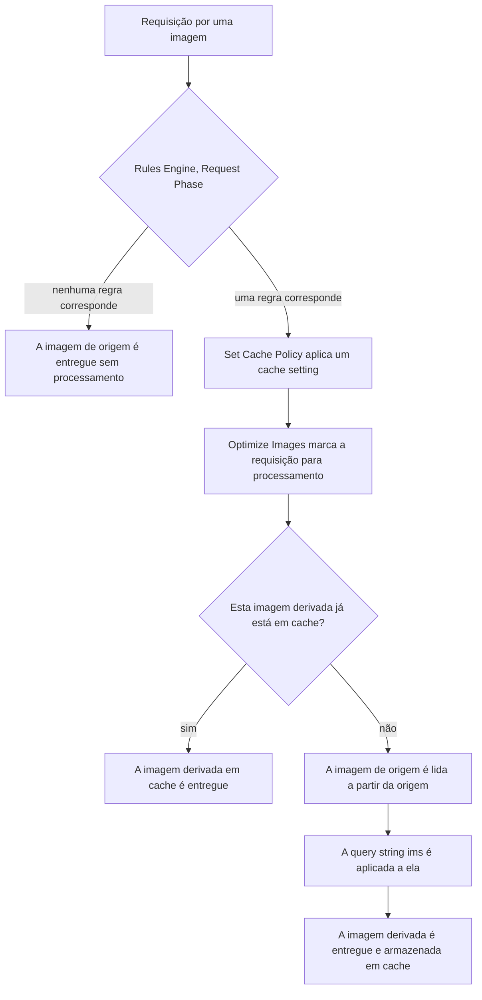

import FrameBox from '@aziontech/webkit/frame-box'
import ItemList from '@aziontech/webkit/item-list'
import DocItem from '@aziontech/webkit/doc-item'

Uma imagem derivada é construída no momento em que uma requisição a solicita. A URL carrega a descrição da transformação, e a plataforma lê essa descrição, aplica-a à **imagem de origem** no servidor de origem e retorna o resultado. A origem nunca é modificada, e a imagem derivada nunca é armazenada como um recurso próprio. Um único arquivo responde, portanto, a cada tamanho, recorte, qualidade e formato que uma página solicita, em vez de um arquivo armazenado por variante.

Esta página descreve os quatro mecanismos por trás disso: o caminho que uma requisição percorre antes de uma transformação acontecer, como o formato entregue é escolhido, como o cache diferencia uma imagem derivada de outra e onde estão os limites do módulo.

---

## O caminho da requisição

Uma transformação não acontece porque uma query string `ims` está presente. Ela acontece porque uma regra do [Rules Engine](/pt-br/documentacao/plataforma/applications/rules-engine/) rodou e aplicou o behavior **Optimize Images** à requisição. Ativar o módulo em **Main Settings** disponibiliza esse behavior; ele não processa nada sozinho.

A cadeia da requisição até a imagem derivada:

1. Uma requisição chega para um path que contém uma imagem.
2. Rules Engine avalia as regras da **Request Phase**. Uma regra para imagens corresponde a `${request_uri}` ou `${uri}` com um argumento como `\.(jpg|jpeg|gif|bmp|png|ico|webp|avif)`.
3. Uma regra correspondente aplica os seus behaviors. **Set Cache Policy** escolhe o cache setting, e **Optimize Images** marca a requisição para Image Processor.
4. Se a imagem derivada já está em cache, ela é entregue a partir do cache e nenhum processamento acontece.
5. Caso contrário, a imagem de origem é lida a partir da origem, a query string `ims` é aplicada a ela, e o resultado é entregue e armazenado.

Duas consequências decorrem do passo 2, e as duas surpreendem quem espera que a query string sozinha faça o trabalho. Uma requisição que nenhuma regra corresponde é entregue sem processamento, com o `ims` incluído. E uma regra que corresponde a um path sem nenhuma imagem roda do mesmo jeito, então são os critérios que decidem quais requisições alcançam o módulo.

---

## Negociação de formato

O formato entregue nem sempre é o formato da imagem de origem. Dois mecanismos o alteram, e eles se comportam de forma diferente.

O primeiro é explícito. Um filtro `filters:format()` na string `ims` pede um formato de saída nomeado. Converter para WEBP ou AVIF também exige que a requisição carregue `Accept: image/webp` ou `Accept: image/avif`, que é o que o behavior **Add Request Header** adiciona quando o navegador não o envia.

O segundo é automático e não precisa de nenhum parâmetro `ims`. Image Processor detecta se o navegador aceita WEBP e converte a imagem quando aceita, e imagens BMP são convertidas para JPEG ou WEBP dependendo do mesmo suporte. Um leitor que nunca escreve um filtro pode, portanto, ainda assim receber um formato diferente do que está na origem, e esse é o ponto: o formato que custa menos bytes para aquele navegador é o que é entregue.

A consequência para quem compara arquivos é que os bytes na origem e os bytes transmitidos são medidas diferentes, e a resposta informa isso. Uma resposta processada carrega `x-ims: Enabled`, e `x-original-image-size` carrega o tamanho da imagem de origem antes da transformação. Para os headers e o behavior que envia o header `Accept`, consulte [Configurações](/pt-br/documentacao/build/image-processor/configuracoes/).

---

## Uma entrada de cache por transformação

Uma imagem derivada só vale a pena construir uma vez. O cache diferencia duas imagens derivadas porque a cache key carrega a query string `ims`, e uma variação convertida para outro formato carrega o formato do arquivo depois do separador, como em `httpsstatic.yourdomain.com/static/images/image_1.jpg?ims=880x@@webp`.

Essa key não é gratuita. Variar o cache por uma query string é um campo de um cache setting que pertence a [Application Accelerator](/pt-br/documentacao/build/application-accelerator/), `cache_vary_by_querystring` em `modules.application_accelerator`, então variar o cache pelo `ims` exige esse módulo. Processar uma imagem não exige.

A troca é a cardinalidade. Toda string `ims` distinta é um objeto armazenado distinto, então uma página que pede larguras arbitrárias armazena um objeto por largura, enquanto uma página que pede quatro larguras fixas armazena quatro. Escolher um conjunto pequeno de tamanhos é, portanto, tanto uma decisão de cache quanto uma decisão de layout.

Também é uma decisão de billing, e esta é a parte que vale a pena ler duas vezes: uma imagem servida a partir do cache sem processamento **não** conta para o medidor mensal de Images. Uma imagem derivada bem armazenada em cache custa uma imagem processada, não importa quantos leitores a recebam. Para o que conta e a quantidade que cada plano inclui, consulte [Limites](/pt-br/documentacao/build/image-processor/limites/).

---

## Onde o módulo para

Image Processor lê uma imagem de origem e retorna uma derivada. Ele não armazena imagens, e não aceita uploads: a origem permanece onde já está, e nenhuma imagem derivada se torna um ativo que a conta possui. Um workflow que precisa manter um arquivo transformado precisa salvar a resposta por conta própria.

A transformação também é limitada pelo que a string `ims` pode expressar e pelo tamanho da imagem. As operações que a string aceita estão em [Parâmetros de URL](/pt-br/documentacao/build/image-processor/parametros-de-url/), e o tamanho e as dimensões máximas estão em [Limites](/pt-br/documentacao/build/image-processor/limites/).

Um limite vale a pena nomear, porque as duas superfícies compartilham um nome. **WASM Image Processor** é uma biblioteca WebAssembly que processa imagens dentro de uma função em [Functions](/pt-br/documentacao/build/functions/). É uma superfície diferente, com uma interface diferente, e nada nesta página a configura.

---

## Recursos relacionados

<FrameBox>
<ItemList>
  <DocItem title="Primeiros passos com Image Processor" href="/pt-br/documentacao/build/image-processor/primeiros-passos/">Ative o módulo e requisite uma imagem derivada pela primeira vez.</DocItem>
  <DocItem title="Parâmetros de URL do Image Processor" href="/pt-br/documentacao/build/image-processor/parametros-de-url/">Toda operação que a query string `ims` expressa, com os valores que cada uma aceita.</DocItem>
  <DocItem title="Configurações do Image Processor" href="/pt-br/documentacao/build/image-processor/configuracoes/">O switch do módulo, os behaviors do Rules Engine e os headers citados nesta página.</DocItem>
  <DocItem title="Limites do Image Processor" href="/pt-br/documentacao/build/image-processor/limites/">Os limites de uma imagem, e o que conta para o medidor mensal de Images.</DocItem>
  <DocItem title="Cache" href="/pt-br/documentacao/build/cache/">Como uma cache key é montada, e onde uma imagem derivada é mantida.</DocItem>
  <DocItem title="Rules Engine" href="/pt-br/documentacao/plataforma/applications/rules-engine/">Os critérios e behaviors que decidem quais requisições alcançam o módulo.</DocItem>
</ItemList>
</FrameBox>
