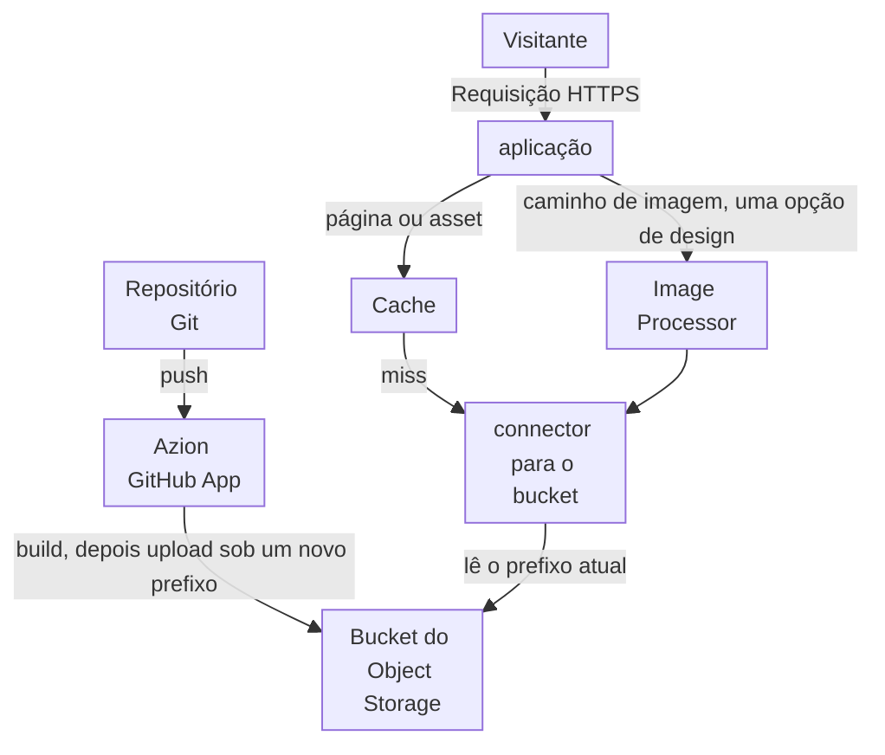
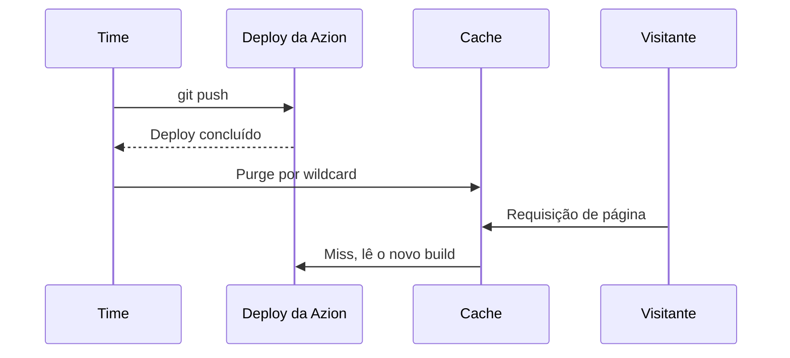

import DocCardGroup from '@aziontech/webkit/doc-card-group'
import DocCard from '@aziontech/webkit/doc-card'
import DocSteps from '@aziontech/webkit/doc-steps'
import DocStep from '@aziontech/webkit/doc-step'

Um time de marketing, de conteúdo ou de web é dono do site de marketing da empresa, das páginas de campanha ou do portal de documentação e quer cada mudança no ar rapidamente para visitantes em qualquer lugar. O time constrói o site com um framework e mantém as páginas e o conteúdo em um repositório do GitHub. Esta página conecta o repositório para que cada push construa o site e o implante no Object Storage, sirva o site pelo Cache e purgue o site depois de cada deploy, para que a mudança chegue a todas as localidades de uma vez. O resultado é medido pelo time to first byte para visitantes em todas as regiões, pelo tempo entre uma mudança de conteúdo e a página atualizada no ar e pela parcela das requisições respondidas pelo cache.

Este caso de uso não cobre vitrines de e-commerce, que [Criar vitrines de e-commerce](/pt-br/documentacao/casos-de-uso/construir-e-executar-aplicacoes/criar-vitrines-de-e-commerce/) cobre, nem camadas de funcionalidade como formulários e testes A/B.

## Pré-requisitos

- Uma conta Azion conectada à sua conta do GitHub pelo Azion GitHub App. Para conectá-la, consulte [Gerencie o Azion GitHub App](/pt-br/documentacao/guias/desenvolvimento-de-aplicacoes/automacao/azion-github-app/).
- A Azion CLI instalada e com login feito, para criar o projeto e enviar o purge pelo terminal. Para configurá-la, consulte [Primeiros passos com a Azion CLI](/pt-br/documentacao/devtools/cli/primeiros-passos/).
- Node.js 18 ou posterior, e npm.
- Um personal token, para o purge pela API. Para criar um, consulte [Personal tokens](/pt-br/documentacao/guias/plataforma/conta-e-billing/personal-tokens/).
- Os nomes que esta página usa: `example-site` para o repositório, o projeto e a aplicação, `/about/` para uma página do site e `www.example.com` para o domínio. O deploy retorna um domínio `xxxxxxxxxx.map.azionedge.net`; para servir o site no seu próprio domínio, consulte [Adicione um domínio a um workload](/pt-br/documentacao/guias/plataforma/migracao/configurar-dominio/). Substitua cada valor pelo seu em todos os passos.

---

## Produtos necessários

| O site precisa de | O que significa | Produto | Documentado em |
| --- | --- | --- | --- |
| Páginas construídas a partir do repositório a cada push | Um bucket que o deploy cria e preenche com o resultado do build, sob um novo prefixo a cada deploy | Object Storage | [Como a Azion CLI funciona](/pt-br/documentacao/devtools/cli/como-funciona/#de-um-projeto-a-um-deployment) |
| Páginas e assets respondidos do cache | A cache setting e as regras que o preset Astro gera para a aplicação | Cache | [Desenvolva com Astro](/pt-br/documentacao/guias/desenvolvimento-de-aplicacoes/frameworks/astro/) |
| Uma mudança que chega a todas as localidades assim que é implantada | Um purge por wildcard do domínio do site depois de cada deploy | Cache | [Purgue páginas quando a origem publica uma mudança](/pt-br/documentacao/guias/performance-e-confiabilidade/cache-e-purge/purgar-ao-publicar/) |
| Imagens no tamanho e no formato que cada página pede | Image Processor na aplicação, aplicado por uma regra nos caminhos de imagem | Image Processor | [Primeiros passos com Image Processor](/pt-br/documentacao/plataforma/applications/image-processor/primeiros-passos/) |

---

## Arquitetura de referência

Esta página constrói o *Site estático orientado por Git*: cada push no repositório constrói o site, e uma aplicação serve os arquivos pré-construídos do Object Storage pelo Cache.



O diagrama traz dois fluxos que só se encontram no bucket. O fluxo de publicação, no topo, vai do repositório pelo Azion GitHub App e só se move quando alguém faz um push. O fluxo de requisição vai do visitante pela aplicação, onde o Cache responde com a sua cópia e um miss lê um arquivo pré-construído do bucket. Nada no fluxo de requisição constrói ou renderiza uma página, então a requisição de um visitante nunca espera por um build.

### Fluxo de dados

1. Um push no repositório conectado inicia um deploy, e o Azion GitHub App constrói o site com o preset de framework do projeto, Astro nesta página.
2. O deploy envia o resultado do build para o bucket do Object Storage do projeto sob um novo prefixo de armazenamento e aponta o connector para esse prefixo. Os arquivos dos deploys anteriores continuam no bucket sob os seus próprios prefixos.
3. A requisição de um visitante chega ao workload no domínio do site, que a entrega à aplicação, e as regras da aplicação aplicam a cache setting que o preset Astro gerou.
4. O Cache responde com a sua cópia quando tem uma. Em um miss, a aplicação lê o arquivo pré-construído do bucket por meio do connector, e o Cache o guarda pelo Max Age dele.
5. Quando o Image Processor está ativo, uma requisição de imagem é redimensionada ou convertida a partir do original no bucket, e o Cache guarda cada variação.
6. Quando o deploy termina, um purge por wildcard remove do Cache todas as páginas do domínio, e a requisição seguinte por cada página lê o novo build do bucket.

### Componentes

- **Azion GitHub App**: a integração que conecta a conta do GitHub à Azion. Ela implanta cada push em um repositório conectado, então publicar uma mudança é um push e nada mais.
- **Object Storage**: guarda o resultado do build. Cada deploy grava os seus arquivos sob o seu próprio prefixo, e é isso que mantém um build anterior disponível para um rollback.
- **aplicação**: o Platform Resource que entrega o site. O connector dela lê o bucket, e as regras dela aplicam a cache setting que a configuração do projeto declara.
- **Cache**: guarda páginas e assets, para que requisições repetidas nunca cheguem ao bucket. O Max Age dele limita por quanto tempo uma página fica desatualizada depois de um deploy que nenhum purge segue.
- **Image Processor**: uma opção de design que redimensiona e converte imagens sob demanda, para que o repositório mantenha um único original por imagem.

### Outros designs para este caso de uso

- *Site com CMS headless gerado estaticamente*: para times cujos editores trabalham em um CMS headless como ButterCMS, Cosmic ou Sanity. Um gerador de sites estáticos lê a API do CMS no momento do build, então a publicação depende de um evento do CMS em vez de um push, enquanto os visitantes continuam lendo arquivos pré-construídos.
- *Site com CMS headless renderizado no servidor*: para times que precisam de mudanças de conteúdo no ar sem um novo build, ou de páginas que variam a cada requisição. Functions renderizam cada página a cada requisição com conteúdo da API do CMS, então os fluxos de requisição e de falha incluem uma function e a API do CMS, e a atualidade é uma decisão de cache em vez de um build.
- *Site estático enviado diretamente*: para times que constroem o site no próprio CI ou o exportam de uma ferramenta. Nenhum build roda na Azion: os arquivos construídos são enviados ao Object Storage com a CLI ou com a API compatível com S3, então as decisões de versionamento e de invalidação passam para as ferramentas do próprio time.
- *Site com CMS hospedado na origem*: para times que mantêm um CMS como WordPress nos próprios servidores. O CMS continua renderizando todas as páginas e o fluxo de requisição chega a ele em todo miss, então o bypass de cache por caminho e por cookie de sessão, o purge na publicação e as regras de WAF nos caminhos de login e de administração passam a ser as decisões de design.

---

## Configure o deploy a cada push

O site é um projeto Astro na raiz do repositório, importado no Azion Console para que cada push o implante. A Azion executa um site Astro como uma aplicação estática: o build grava o site em `./dist`, e o deploy envia essa pasta para um bucket que a aplicação serve. Astro é um dos presets que o formulário de importação oferece; os outros são Next.js, Angular, Hexo, React e Vue. O projeto precisa ficar na raiz do repositório, porque a importação o lê de lá.

Para criar o projeto, execute `azion init`, selecione o preset _Astro_ e um template e, depois, construa o projeto uma vez para que ele tenha o arquivo de configuração:

```bash
azion init --name example-site --auto -y
cd example-site
azion build
```

O build termina com estas linhas, e a pasta passa a ter o `azion.config.mjs`, a configuração que o preset gerou, com o bucket, a cache setting e as regras do site:

```text
[Azion] [IaC] › ✔  success   Manifest generated successfully at <project-dir>/example-site/.edge/manifest.json
Your Application was built successfully
```

Envie a pasta para o repositório `example-site` no GitHub. Depois, para importar o repositório:

<DocSteps>
  <DocStep title="Abra o Import from GitHub">

  Acesse [Azion Console](https://console.azion.com/) > **Create** > **Import from GitHub** e selecione o card na aba **Import from GitHub**.

  </DocStep>
  <DocStep title="Selecione o repositório">

  Selecione o **Git Scope** da sua conta do GitHub e, depois, o **Repository** `example-site`.

  </DocStep>
  <DocStep title="Dê um nome à aplicação">

  Em **General**, mantenha `example-site` como **Application Name**. O bucket de armazenamento recebe o mesmo nome.

  </DocStep>
  <DocStep title="Selecione o preset Astro">

  Defina **Preset** como _Astro_.

  </DocStep>
  <DocStep title="Mantenha o diretório raiz">

  Em **Root Directory**, mantenha `/`.

  </DocStep>
  <DocStep title="Insira o comando de instalação">

  Em **Install Command**, insira `npm install`.

  </DocStep>
  <DocStep title="Selecione Deploy" />
</DocSteps>

A página de deploy mostra o **Deploy Log** enquanto o site é construído e, depois, **Successfully created!** e a URL do domínio. O repositório continua conectado: cada push nele implanta o site de novo. Para todos os campos do formulário, consulte [Importe um projeto do GitHub](/pt-br/documentacao/guias/desenvolvimento-de-aplicacoes/automacao/importar-um-projeto-existente-do-github/).

---

## Configure o purge depois de cada deploy

Um deploy envia o novo build sob um novo prefixo, e as páginas que já estão em cache mantêm o build antigo até o Max Age delas terminar. Um único purge por wildcard do domínio inteiro, enviado assim que o deploy termina, faz todas as páginas lerem o novo build. Um wildcard serve porque um build pode mudar qualquer página, e um purge por deploy fica muito abaixo das 2.000 requisições por wildcard que a Azion aceita em um intervalo de 24 horas. Envie-o assim que o deploy do push terminar: um purge enviado enquanto o deploy ainda roda pode preencher o cache de novo com o build antigo.



1. O time faz o push de uma mudança, e o deploy constrói e envia os novos arquivos.
2. O deploy termina, e o bucket guarda o novo build.
3. O time envia o purge por wildcard de `www.example.com/*`.
4. A requisição seguinte por cada página não encontra o cache e lê o novo build do bucket.

O time envia o purge por wildcard como [Purgue páginas quando a origem publica uma mudança](/pt-br/documentacao/guias/performance-e-confiabilidade/cache-e-purge/purgar-ao-publicar/#purgue-as-variacoes-de-imagem-quando-uma-imagem-muda) descreve para um wildcard, pelo Azion Console, pela API ou pela Azion CLI, com os valores do site:

- **Expressão**: `www.example.com/*`, todas as páginas do domínio, na camada Cache. Na API, o corpo de `POST /v4/workspace/purge/wildcard` é `{"items":["www.example.com/*"]}`. Na CLI, o comando é `azion purge --wildcard "www.example.com/*"`.
- **Quando**: uma vez por push, depois que o deploy dele termina.

Todas as páginas de `www.example.com` saem do cache assim que o purge se propaga, e a requisição seguinte por cada uma lê o novo build. Para confirmar que um purge terminou, encontre-o no histórico de purges, como [Confirme que o purge terminou](/pt-br/documentacao/guias/performance-e-confiabilidade/cache-e-purge/purgar-ao-publicar/#confirme-que-o-purge-terminou) descreve.

---

## Verifique a configuração

Cada verificação envia uma requisição com o header `Pragma: azion-debug-cache`, que faz a resposta carregar o header `x-cache`. Para saber como lê-lo, consulte [Verifique o status de cache de uma resposta](/pt-br/documentacao/guias/performance-e-confiabilidade/cache-e-purge/verificar-tempo-de-cache-da-pagina/).

- **O site responde no seu domínio.** Abra `https://www.example.com/` em um navegador. Um primeiro deploy que responde com uma página `404` com o texto `There's nothing here yet` ainda não chegou àquela localidade; espere alguns minutos e tente de novo.

- **As páginas respondem do cache.** Requisite uma página duas vezes:

  ```bash
  curl -sI -H "Pragma: azion-debug-cache" https://www.example.com/about/
  ```

  A segunda resposta carrega `x-cache: HIT`. A primeira pode carregar `MISS`, enquanto a Azion lê a página do bucket.

- **Um push chega à página.** Mude o texto da página `/about/`, faça o commit e o push. Espere o deploy terminar, envie o purge por wildcard e requisite a página de novo. A resposta carrega `x-cache: MISS` e o novo texto, e a requisição seguinte carrega `HIT`.

- **As imagens são processadas**, quando o Image Processor está ativo. Requisite uma imagem com uma query string `ims`, como `https://www.example.com/images/hero.jpg?ims=400x`. A resposta carrega `x-ims: Enabled`.

---

## Medindo resultados

| Métrica | Onde ler | Como fica quando funciona |
| --- | --- | --- |
| Time to first byte para visitantes em todas as regiões | O campo `ttfb` das medições do Edge Pulse, feitas nos navegadores dos visitantes por uma tag que as páginas do site carregam. Consulte [Primeiros passos com Edge Pulse](/pt-br/documentacao/plataforma/edge-pulse/primeiros-passos/) | Baixo e comparável entre regiões, porque cada página é um arquivo pré-construído em cache |
| Tempo entre uma mudança de conteúdo e a página atualizada no ar | O horário de cada commit no GitHub, comparado ao histórico de purges do **Real-Time Purge**, que lista cada purge quando ele termina. Consulte [Real-Time Purge](/pt-br/documentacao/plataforma/applications/cache/real-time-purge/#confirmacao) | O purge depois de cada push termina, e nenhuma página espera o Max Age dela expirar |
| Parcela das requisições respondidas pelo cache | **Requests Offloaded** no Real-Time Metrics, filtrado pelo domínio do site. Consulte [Meça o offload de cache de um domínio](/pt-br/documentacao/guias/plataforma/observabilidade/medir-offload-de-cache/) | Alta entre deploys, com uma queda curta depois de cada purge. Um miss lê o bucket, nunca um servidor que o time opera |

---

## Boas práticas

- **Faça rollback com um revert, não com uma correção no Console.** Cada push implanta o site, então um commit que reverte a mudança implanta de novo o conteúdo anterior pelo mesmo build, e o repositório mantém o histórico. Para um projeto implantado com a Azion CLI, `azion rollback` serve os arquivos de um deploy anterior a partir do bucket. Para as flags do comando, consulte [Azion CLI rollback](/pt-br/documentacao/devtools/cli/rollback/).
- **Purgue depois de cada deploy em vez de encurtar o Max Age.** Um Max Age curto envia mais requisições ao bucket e ainda deixa uma janela de conteúdo desatualizado depois de cada push. O purge atualiza todas as páginas de uma vez, e o Max Age fica como limite de segurança para um purge não enviado.
- **Mantenha um único original por imagem.** O Image Processor redimensiona e converte sob demanda, então o repositório não precisa de uma cópia por tamanho. Para a regra e a cache setting que guardam cada variação, consulte [Primeiros passos com Image Processor](/pt-br/documentacao/plataforma/applications/image-processor/primeiros-passos/).

---

## Guias deste caso de uso

<DocCardGroup cols={2}>
  <DocCard title="Purgue páginas quando a origem publica uma mudança" href="/pt-br/documentacao/guias/performance-e-confiabilidade/cache-e-purge/purgar-ao-publicar/" label="Envia o purge por wildcard depois de cada deploy e confirma que ele terminou." />
</DocCardGroup>
