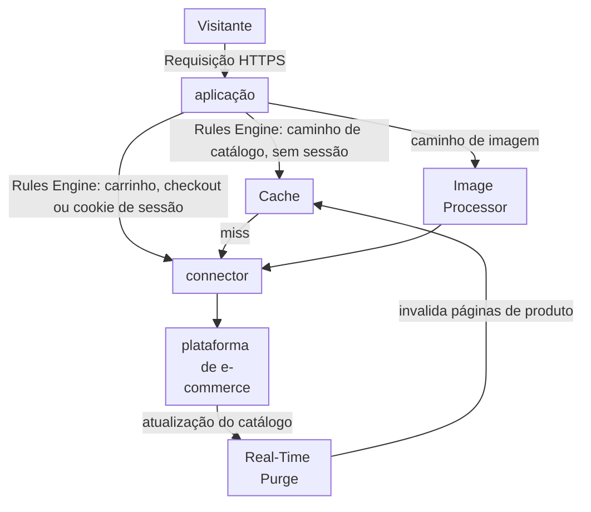
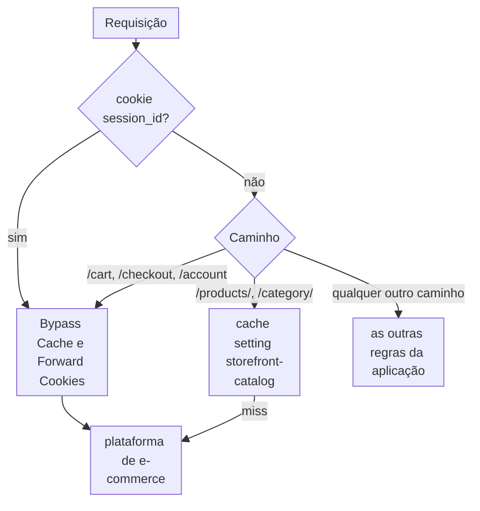
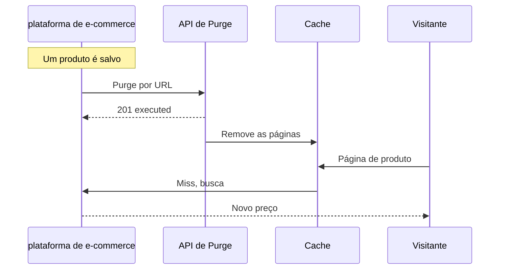

import DocCardGroup from '@aziontech/webkit/doc-card-group'
import DocCard from '@aziontech/webkit/doc-card'
import DocSteps from '@aziontech/webkit/doc-steps'
import DocStep from '@aziontech/webkit/doc-step'
import Tabs from '~/components/webkit/Tabs.vue'

Um time de comércio digital opera a vitrine de uma loja online em uma plataforma de e-commerce que ele mesmo opera, como Magento ou WooCommerce. As páginas de catálogo e de produto são as mesmas para todo visitante e precisam continuar rápidas durante picos de tráfego, enquanto preços e estoque mudam ao longo do dia. O carrinho, o checkout e as páginas de um visitante autenticado são diferentes para cada visitante e nunca podem vir de uma cópia compartilhada. Esta página configura uma aplicação na frente da loja que coloca o catálogo em cache, envia o tráfego de carrinho, checkout e sessão para a loja e purga uma página de produto quando ela muda. O resultado é medido pelo time to first byte nas páginas de catálogo e de produto, pelo tempo entre uma mudança de preço ou estoque e a página atualizada no ar e pela parcela das requisições de catálogo que nunca chega à plataforma de e-commerce.

Este caso de uso não cobre a proteção de login e checkout contra bots. Para isso, consulte [Bloquear account takeover em fluxos de login e checkout](/pt-br/documentacao/casos-de-uso/proteger-aplicacoes-e-redes/bloquear-account-takeover-em-fluxos-de-login-e-checkout/).

## Pré-requisitos

- Uma aplicação que serve a loja por meio de um connector e de um workload. Para criá-los, consulte [Primeiros passos com Applications](/pt-br/documentacao/plataforma/applications/primeiros-passos/).
- Application Accelerator ativo nessa aplicação, exigido pelos behaviors **Bypass Cache** e **Forward Cookies**. Para ativá-lo, consulte [Ative Application Accelerator](/pt-br/documentacao/guias/performance-e-confiabilidade/cache-e-purge/cache-settings/#ative-application-accelerator).
- Um personal token, para a API e para as chamadas de purge. Para criar um, consulte [Personal tokens](/pt-br/documentacao/guias/plataforma/conta-e-billing/personal-tokens/).
- Os caminhos e o cookie de sessão da sua loja. Esta página usa `/products/` e `/category/` para o catálogo, `/cart`, `/checkout` e `/account` para as páginas por visitante, `session_id` para o cookie que a loja define quando um visitante inicia uma sessão e `www.example.com` para o domínio. Substitua cada valor pelo da sua loja em todos os passos.

---

## Produtos necessários

| A vitrine precisa de | O que significa | Produto | Documentado em |
| --- | --- | --- | --- |
| Páginas de catálogo e de produto respondidas do cache | Uma cache setting aplicada por uma regra que casa com os caminhos do catálogo, para visitantes sem sessão | Cache | [Cache settings](/pt-br/documentacao/plataforma/applications/cache/cache-settings/) |
| Páginas de carrinho, checkout e sessão que nunca vêm de uma cópia compartilhada | Uma regra que ignora o cache por caminho e por cookie de sessão | Application Accelerator | [Bypass Cache](/pt-br/documentacao/plataforma/applications/rules-engine/#bypass-cache) |
| Páginas de produto que se atualizam quando o catálogo muda | Um purge por URL que a plataforma de e-commerce envia quando um produto muda | Cache | [Purgue páginas quando a origem publica uma mudança](/pt-br/documentacao/guias/performance-e-confiabilidade/cache-e-purge/purgar-ao-publicar/) |
| Imagens de produto no tamanho e no formato que cada página pede | Image Processor na aplicação, aplicado por uma regra nos caminhos de imagem | Image Processor | [Primeiros passos com Image Processor](/pt-br/documentacao/plataforma/applications/image-processor/primeiros-passos/) |

---

## Arquitetura de referência

Esta página constrói a *Vitrine de plataforma de e-commerce hospedada na origem*: uma aplicação na frente de uma loja que continua renderizando todas as páginas.



Leia o diagrama da aplicação para fora. Toda requisição passa pelas regras da aplicação, que a dividem em três caminhos: páginas de catálogo que o Cache pode responder, páginas por visitante que precisam chegar à loja e imagens que o Image Processor transforma. Os três caminhos terminam no mesmo connector, porque a plataforma de e-commerce continua sendo a única origem. O ciclo da loja de volta ao Cache é o purge, que mantém as páginas em cache em sincronia com o catálogo.

### Fluxo de dados

1. A requisição de um visitante chega ao workload no domínio da loja, que a entrega à aplicação, e o Rules Engine lê o caminho e o cookie `session_id` na Request Phase.
2. Uma página de catálogo ou de produto requisitada sem cookie de sessão é servida pelo Cache. Em um miss, a aplicação busca a página na loja por meio do connector e a coloca em cache.
3. Uma requisição de carrinho, checkout ou conta, ou qualquer requisição que carregue o cookie de sessão, ignora o cache e vai para a loja por meio do connector.
4. Uma requisição de imagem passa pelo Image Processor, que redimensiona ou converte o original buscado na loja, e o Cache guarda cada variação.
5. Quando um produto muda, a plataforma de e-commerce chama a API do Real-Time Purge, que remove do Cache as páginas de produto afetadas antes que o TTL delas termine.
6. A requisição seguinte por uma página purgada chega à loja, e a nova versão é colocada em cache.

### Componentes

- **aplicação**: o Platform Resource na frente da loja. Ela guarda as cache settings e as regras que decidem, requisição por requisição, se uma página é servida do cache ou ignora o cache.
- **Rules Engine**: a Feature da aplicação que casa caminhos e cookies. O bypass de cache para um visitante autenticado depende de uma condição de cookie, porque o mesmo caminho de produto é compartilhado para um visitante anônimo e privado para um visitante autenticado.
- **connector**: o Platform Resource que chega à loja. Todo caminho, em cache ou não, termina nele, porque a loja renderiza todas as páginas.
- **Cache**: guarda as páginas de catálogo e de produto, para que requisições repetidas por elas nunca cheguem à loja.
- **Real-Time Purge**: o Platform Resource que remove do Cache uma página de produto alterada antes que o TTL dela termine, para que uma mudança de preço ou estoque entre no ar sem esperar a página expirar.
- **Image Processor**: redimensiona e converte imagens de produto sob demanda, para que a loja mantenha um único original por imagem.
- **plataforma de e-commerce**: a integração que é a origem e a fonte do conteúdo. Ela renderiza todas as páginas, é dona do carrinho e do checkout e envia o purge quando o catálogo muda.

### Outros designs para este caso de uso

- *Vitrine headless de e-commerce gerada estaticamente*: para catálogos que mudam algumas vezes por dia, em que um gerador de sites busca os produtos na API da plataforma de e-commerce no momento do build. As páginas de catálogo são pré-construídas no Object Storage e servidas pelo Cache, então a atualidade de preço e estoque depende de novos builds, e só o carrinho e o checkout chegam à API de e-commerce.
- *Vitrine headless de e-commerce renderizada no servidor*: para catálogos com mudanças frequentes de preço e estoque ou com preços por região, em que functions renderizam as páginas com um framework como Next.js e chamam a API de e-commerce. As páginas são renderizadas a cada requisição, então a API de e-commerce está nos fluxos de requisição e de falha, e a atualidade é uma decisão de cache em vez de um novo build.

---

## Configure o cache do catálogo

O cache do catálogo é uma cache setting e a regra que a aplica. A regra casa com os caminhos do catálogo só para visitantes sem sessão, então um visitante autenticado nunca recebe uma cópia compartilhada.

A cache setting usa dois valores. **Max Age** é de `600` segundos: o purge configurado mais abaixo nesta página atualiza na hora uma página alterada, então o **Max Age** só limita por quanto tempo uma página fica desatualizada quando um purge não é enviado. O cache do navegador é sobrescrito para `0` segundos, porque uma cópia no navegador do visitante não pode ser purgada, e um preço desatualizado ficaria lá até expirar.

<Tabs client:visible sharedStore="interface">
<Fragment slot="tab.console">Console</Fragment>
<Fragment slot="tab.api">API</Fragment>

<Fragment slot="panel.console">

Para criar a cache setting:

<DocSteps>
  <DocStep title="Abra a aba Cache Settings">

  Acesse [Azion Console](https://console.azion.com/) > **Applications** > **sua aplicação** e vá para a aba **Cache Settings**.

  </DocStep>
  <DocStep title="Selecione + Cache" />
  <DocStep title="Dê um nome à cache setting">

  Em **Name**, insira `storefront-catalog`.

  </DocStep>
  <DocStep title="Defina o cache do navegador">

  Em **Browser Cache**, selecione _Override cache settings_ e defina a idade máxima como `0`.

  </DocStep>
  <DocStep title="Defina o Max Age">

  Em **Cache**, selecione _Override cache behavior_ e defina **Max Age** como `600`.

  </DocStep>
  <DocStep title="Selecione Save" />
</DocSteps>

A setting `storefront-catalog` aparece na aba **Cache Settings**. Para criar a regra que a aplica:

<DocSteps>
  <DocStep title="Vá para a aba Rules Engine" />
  <DocStep title="Selecione + Rule" />
  <DocStep title="Dê um nome à regra">

  Insira `storefront - catalog cache`.

  </DocStep>
  <DocStep title="Selecione Request Phase" />
  <DocStep title="Case os caminhos do catálogo">

  Na seção **Criteria**, defina o primeiro critério como `${uri}` _starts with_ `/products/`. Adicione um segundo critério unido por **Or**: `${uri}` _starts with_ `/category/`.

  </DocStep>
  <DocStep title="Exclua visitantes com sessão">

  Adicione um segundo grupo de critérios com um critério: `${cookie_session_id}` _does not exist_.

  </DocStep>
  <DocStep title="Na seção Behaviors, selecione Set Cache Policy" />
  <DocStep title="Selecione a cache setting storefront-catalog" />
  <DocStep title="Selecione Save" />
</DocSteps>

</Fragment>

<Fragment slot="panel.api">

Para criar a cache setting, envie o corpo dela para as cache settings da aplicação:

```bash
curl --request POST \
  --url https://api.azion.com/v4/workspace/applications/<application-id>/cache_settings \
  --header 'Authorization: Token <personal-token>' \
  --header 'Content-Type: application/json' \
  --data '{
  "name": "storefront-catalog",
  "browser_cache": { "behavior": "override", "max_age": 0 },
  "modules": { "cache": { "behavior": "override", "max_age": 600 } }
}'
```

A API responde `201` com a nova setting. Guarde o `id` dela para a regra:

```json
{"state":"executed","data":{"id":<cache-setting-id>,"name":"storefront-catalog",...}}
```

Para criar a regra, envie dois grupos de critérios. Os grupos se unem com `and`, então uma requisição só casa quando o caminho dela é um caminho de catálogo e ela não carrega cookie de sessão:

```bash
curl --request POST \
  --url https://api.azion.com/v4/workspace/applications/<application-id>/request_rules \
  --header 'Authorization: Token <personal-token>' \
  --header 'Content-Type: application/json' \
  --data '{
  "name": "storefront - catalog cache",
  "active": true,
  "criteria": [
    [
      { "variable": "${uri}", "conditional": "if", "operator": "starts_with", "argument": "/products/" },
      { "variable": "${uri}", "conditional": "or", "operator": "starts_with", "argument": "/category/" }
    ],
    [
      { "variable": "${cookie_session_id}", "conditional": "if", "operator": "does_not_exist" }
    ]
  ],
  "behaviors": [{ "type": "set_cache_policy", "attributes": { "value": <cache-setting-id> } }]
}'
```

A API responde `202` com um `state` igual a `pending` e a regra como foi armazenada.

</Fragment>
</Tabs>

As páginas de catálogo e de produto requisitadas sem cookie de sessão ficam em cache por 600 segundos, e os navegadores as revalidam a cada visita. Uma regra nova leva alguns minutos para se propagar.

---

## Configure o bypass para carrinho, checkout e sessões

A regra de bypass envia toda requisição por visitante para a loja. Ela casa com os caminhos de carrinho, checkout e conta e com qualquer requisição que carregue o cookie de sessão, então um visitante que adicionou um item ao carrinho também ignora o cache nas páginas de catálogo. A regra também carrega **Forward Cookies**, para que o cookie de sessão que a loja define chegue ao visitante. Nada que essa regra casa fica em cache, então nenhum visitante pode receber o cookie de outro visitante.



1. Uma requisição que carrega o cookie `session_id` ignora o cache, seja qual for o caminho.
2. Uma requisição sem o cookie ignora o cache em `/cart`, `/checkout` e `/account`.
3. Uma requisição sem o cookie em `/products/` ou `/category/` recebe a cache setting `storefront-catalog`.
4. Qualquer outro caminho fica com as outras regras da aplicação.

<Tabs client:visible sharedStore="interface">
<Fragment slot="tab.console">Console</Fragment>
<Fragment slot="tab.api">API</Fragment>

<Fragment slot="panel.console">

Para criar a regra de bypass:

<DocSteps>
  <DocStep title="Vá para a aba Rules Engine">

  Acesse [Azion Console](https://console.azion.com/) > **Applications** > **sua aplicação** e vá para a aba **Rules Engine**.

  </DocStep>
  <DocStep title="Selecione + Rule" />
  <DocStep title="Dê um nome à regra">

  Insira `storefront - bypass per-visitor pages`.

  </DocStep>
  <DocStep title="Selecione Request Phase" />
  <DocStep title="Case os caminhos por visitante">

  Na seção **Criteria**, defina o primeiro critério como `${uri}` _starts with_ `/cart`. Adicione dois critérios unidos por **Or**: `${uri}` _starts with_ `/checkout` e `${uri}` _starts with_ `/account`.

  </DocStep>
  <DocStep title="Case o cookie de sessão">

  Adicione um quarto critério unido por **Or**: `${cookie_session_id}` _exists_.

  </DocStep>
  <DocStep title="Na seção Behaviors, selecione Bypass Cache" />
  <DocStep title="Adicione o behavior Forward Cookies" />
  <DocStep title="Selecione Save" />
</DocSteps>

</Fragment>

<Fragment slot="panel.api">

Para criar a regra de bypass, envie os quatro critérios em um grupo unido por `or` e os dois behaviors:

```bash
curl --request POST \
  --url https://api.azion.com/v4/workspace/applications/<application-id>/request_rules \
  --header 'Authorization: Token <personal-token>' \
  --header 'Content-Type: application/json' \
  --data '{
  "name": "storefront - bypass per-visitor pages",
  "active": true,
  "criteria": [
    [
      { "variable": "${uri}", "conditional": "if", "operator": "starts_with", "argument": "/cart" },
      { "variable": "${uri}", "conditional": "or", "operator": "starts_with", "argument": "/checkout" },
      { "variable": "${uri}", "conditional": "or", "operator": "starts_with", "argument": "/account" },
      { "variable": "${cookie_session_id}", "conditional": "or", "operator": "exists" }
    ]
  ],
  "behaviors": [{ "type": "bypass_cache" }, { "type": "forward_cookies" }]
}'
```

A API responde `202` com um `state` igual a `pending` e a regra como foi armazenada.

</Fragment>
</Tabs>

As requisições de carrinho, checkout e conta, e toda requisição com sessão, chegam à loja, e a Azion não guarda nenhuma das respostas delas. Uma regra nova leva alguns minutos para se propagar.

---

## Configure o purge em mudanças do catálogo

Uma página de produto alterada é atualizada por um purge que a plataforma de e-commerce envia quando o produto é salvo. A chamada fica no código que a plataforma executa quando um produto é salvo, e ela se autentica com o personal token.



1. Um administrador salva um produto, e a plataforma executa o código de salvamento.
2. O código de salvamento envia um purge por URL da página de produto e da página de categoria, e um purge por wildcard das imagens quando elas mudaram.
3. A Azion remove as duas páginas do cache assim que o purge se propaga.
4. A requisição seguinte por cada página chega à loja, e a nova versão é colocada em cache.

O código de salvamento envia os purges que [Purgue páginas quando a origem publica uma mudança](/pt-br/documentacao/guias/performance-e-confiabilidade/cache-e-purge/purgar-ao-publicar/) descreve, com os valores da loja:

- **A cada salvamento**, um purge por URL da página de produto e das páginas de categoria que a listam. Para o produto de exemplo, o corpo de `POST /v4/workspace/purge/url` é:

  ```json
  {"items":["https://www.example.com/products/blue-shirt","https://www.example.com/category/shirts"],"layer":"cache"}
  ```

- **Só quando o salvamento muda as imagens do produto**, um purge por wildcard de todos os tamanhos e formatos delas. A Azion aceita 2.000 requisições de purge por wildcard em um intervalo de 24 horas, então um wildcard a cada salvamento de um catálogo grande pode chegar a esse limite. O corpo de `POST /v4/workspace/purge/wildcard` é:

  ```json
  {"items":["www.example.com/media/blue-shirt*"]}
  ```

Cada chamada responde `201` com `state` igual a `executed`. A página de produto, a página de categoria e as imagens alteradas saem do cache, e a requisição seguinte por cada uma busca a nova versão na loja. Para confirmar que um purge terminou, encontre-o no histórico de purges, como o guia mostra.

---

## Verifique a configuração

Cada verificação envia uma requisição com o header `Pragma: azion-debug-cache`, que faz a resposta carregar o header `x-cache`. Para saber como lê-lo, consulte [Verifique o status de cache de uma resposta](/pt-br/documentacao/guias/performance-e-confiabilidade/cache-e-purge/verificar-tempo-de-cache-da-pagina/).

- **As páginas de catálogo respondem do cache.** Requisite uma página de produto duas vezes sem cookie:

  ```bash
  curl -sI -H "Pragma: azion-debug-cache" https://www.example.com/products/blue-shirt
  ```

  A segunda resposta carrega `x-cache: HIT`. A primeira pode carregar `MISS`, enquanto a Azion busca a página na loja.

- **O carrinho nunca vem do cache.** Requisite o carrinho:

  ```bash
  curl -sI -H "Pragma: azion-debug-cache" https://www.example.com/cart
  ```

  A resposta carrega `x-cache: BYPASS`.

- **Um visitante com sessão nunca recebe uma página de catálogo compartilhada.** Requisite uma página de produto com o cookie de sessão:

  ```bash
  curl -sI -H "Pragma: azion-debug-cache" -H "Cookie: session_id=test" https://www.example.com/products/blue-shirt
  ```

  A resposta carrega `x-cache: BYPASS`.

- **Uma mudança de produto chega à página.** Envie o purge de `/products/blue-shirt`, espere ele aparecer no histórico de purges e requisite a página de novo. A resposta carrega `x-cache: MISS`, e a requisição seguinte carrega `HIT`.

- **As imagens de produto são processadas.** Requisite uma imagem com uma query string `ims`, como `https://www.example.com/media/blue-shirt.jpg?ims=400x`. A resposta carrega `x-ims: Enabled`.

Uma regra que parece não ter efeito ainda pode estar se propagando. Quando o problema persistir depois de alguns minutos, ative [Debug Rules](/pt-br/documentacao/plataforma/applications/main-settings/#debug-rules) para ver quais regras rodaram na requisição.

---

## Medindo resultados

| Métrica | Onde ler | Como fica quando funciona |
| --- | --- | --- |
| Parcela das requisições de catálogo que nunca chega à loja | **Requests Offloaded** no Real-Time Metrics, filtrado pelo domínio da loja. Consulte [Meça o offload de cache de um domínio](/pt-br/documentacao/guias/plataforma/observabilidade/medir-offload-de-cache/) | Sobe depois que a regra de catálogo se propaga e se mantém durante picos de tráfego |
| Time to first byte nas páginas de catálogo e de produto | O campo `ttfb` das medições do Edge Pulse, feitas nos navegadores dos visitantes. Consulte [Primeiros passos com Edge Pulse](/pt-br/documentacao/plataforma/edge-pulse/primeiros-passos/) | Menor nas páginas de catálogo do que nas páginas de carrinho e checkout, em todas as regiões |
| Tempo entre uma mudança de preço ou estoque e a página atualizada no ar | O histórico de purges do **Real-Time Purge** no Azion Console, que lista cada purge quando ele termina. Consulte [Real-Time Purge](/pt-br/documentacao/plataforma/applications/cache/real-time-purge/#confirmacao) | Cada purge termina, e nenhuma página de produto espera o **Max Age** de 600 segundos expirar |

---

## Boas práticas

- **Exclua sessões com um critério, não com variação por cookie.** Variar a chave de cache do catálogo por `session_id` guarda uma cópia por visitante, porque o cookie é único por visitante. O critério `does not exist` mantém uma única cópia compartilhada para todo visitante sem sessão. Para a variação por cookie e o custo dela, consulte [Boas práticas de Applications](/pt-br/documentacao/plataforma/applications/boas-praticas/).
- **Nunca coloque Forward Cookies em uma regra que guarda em cache.** Em uma resposta em cache, **Forward Cookies** pode entregar a um visitante o `Set-Cookie` da sessão de outro visitante. Nesta página, ele fica só na regra de bypass, onde nada é guardado em cache.
- **Purgue na mudança em vez de encurtar o Max Age.** Um **Max Age** curto envia mais requisições de catálogo para a loja e ainda deixa uma janela de conteúdo desatualizado. O purge atualiza a página quando ela muda, e o **Max Age** fica como limite de segurança para um purge não enviado.
- **Use Bypass Cache para o carrinho, não um Max Age de 0.** Um **Max Age** de `0` junta requisições simultâneas para um mesmo caminho em uma única requisição à origem, e dois visitantes que carregam os carrinhos no mesmo momento precisam de respostas diferentes. Para a diferença entre os dois, consulte [Variação de cache](/pt-br/documentacao/plataforma/applications/application-accelerator/variacao-de-cache/#bypass-cache-e-um-ttl-de-0).

---

## Guias deste caso de uso

<DocCardGroup cols={2}>
  <DocCard title="Purgue páginas quando a origem publica uma mudança" href="/pt-br/documentacao/guias/performance-e-confiabilidade/cache-e-purge/purgar-ao-publicar/" label="Envia as chamadas de purge que a loja faz a cada salvamento de produto e confirma que cada uma terminou." />
</DocCardGroup>
