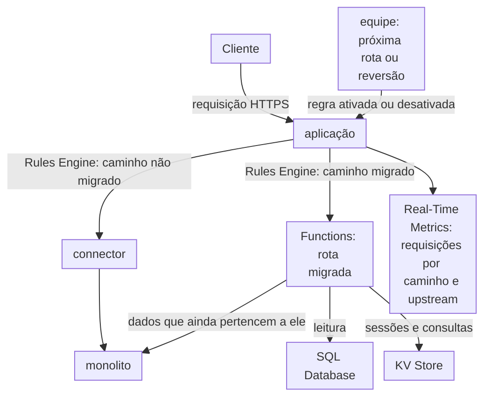

import DocCardGroup from '@aziontech/webkit/doc-card-group'
import DocCard from '@aziontech/webkit/doc-card'
import DocSteps from '@aziontech/webkit/doc-steps'
import DocStep from '@aziontech/webkit/doc-step'

Uma equipe de plataforma ou de aplicação executa uma aplicação monolítica no seu próprio data center ou em uma região de nuvem, e não pode reescrevê-la em um único projeto. A equipe coloca uma aplicação na Azion na frente do monolito, então toda rota continua chegando ao monolito até que a equipe a mova. Esta página move uma rota de leitura para uma função na Azion que lê seus dados do SQL Database, enquanto todas as outras rotas continuam chegando ao monolito por um connector, e reverte a rota desativando a regra dela. O resultado é medido pela parcela de requisições atendidas sem chegar ao monolito, pela latência das rotas migradas e por zero downtime durante cada cut-over.

Este caso de uso não cobre mover a aplicação inteira para uma nova origem em uma única etapa, nem o hardening de segurança do monolito.

## Pré-requisitos

- Uma aplicação que serve o monolito por um connector, uma regra que envia toda requisição a esse connector e um workload. Para criá-los, consulte [Primeiros passos com Applications](/pt-br/documentacao/plataforma/applications/primeiros-passos/).
- Application Accelerator nessa aplicação, que o behavior **Run Function** exige. Para ativá-lo, consulte [Ative Application Accelerator](/pt-br/documentacao/guias/performance-e-confiabilidade/cache-e-purge/cache-settings/#ative-application-accelerator). Uma aplicação nova já tem Functions ativado.
- Um personal token, para as chamadas de API. Para criar um, consulte [Personal tokens](/pt-br/documentacao/guias/plataforma/conta-e-billing/personal-tokens/).
- Os valores da sua primeira rota. Esta página move `GET /api/stores`, uma lista de endereços de lojas, para um banco de dados chamado `stores-db` com uma tabela `stores`, e usa `www.example.com` como domínio e `<monolith-ip>` como o endereço IP em que o monolito responde. Substitua cada valor pelo seu em todas as etapas.

---

## Produtos necessários

| A modernização precisa de | O que significa | Produto | Documentado em |
| --- | --- | --- | --- |
| Uma rota migrada que a Azion responde | Uma função, instanciada na aplicação, que monta a resposta da rota | Functions | [Primeiros passos com Functions](/pt-br/documentacao/plataforma/functions/primeiros-passos/) |
| O estado da rota migrada | Uma tabela que a função lê pela réplica de leitura de um banco de dados | SQL Database | [SQL Database API](/pt-br/documentacao/devtools/runtime/api-reference/sql-database/) |
| Rotas que se movem uma por vez e são revertidas | Uma regra por rota migrada, com o behavior **Run Function** e o switch **Active** dela | Application Accelerator | [Execute uma função em um caminho e reverta-o](/pt-br/documentacao/guias/desenvolvimento-de-aplicacoes/functions-e-runtime/executar-uma-funcao-em-um-caminho-e-reverter/) |
| A divisão do tráfego por rota | As requisições do dataset `workloadBreakdownMetrics` agrupadas por caminho e endereço de upstream | Real-Time Metrics | [Campos do Real-Time Metrics](/pt-br/documentacao/devtools/graphql/campos-gql-real-time-metrics/#workloadbreakdownmetrics) |

---

## Arquitetura de referência

Esta página monta a *Fachada strangler para aplicações legadas*: uma aplicação na Azion se torna o ponto de entrada único do domínio, e cada caminho migrado vai para uma função, enquanto todos os outros caminhos vão para o monolito.



Leia o diagrama da aplicação para fora. Toda requisição entra pela aplicação, e as regras dela dividem o tráfego por caminho: um caminho que ninguém moveu passa pelo connector até o monolito, e um caminho migrado vai para uma função. A função mantém seu estado no SQL Database ou no KV Store, e ainda pode chamar o monolito para dados que pertencem ao monolito. O loop de controle na parte de baixo é como as rotas se movem: a equipe ativa a regra de uma rota para movê-la e a desativa para revertê-la, e Real-Time Metrics mostra onde cada caminho é atendido.

### Fluxo de dados

1. A requisição de um cliente chega ao workload no domínio, e a aplicação executa as regras da Request Phase em ordem, lendo o caminho e o método da requisição.
2. A primeira regra corresponde a todos os caminhos e nomeia o connector para o monolito, então uma rota que ninguém moveu continua chegando ao monolito.
3. Uma regra posterior corresponde a `GET /api/stores` e executa a instância da função, e a resposta da função é o que o cliente recebe.
4. A função abre `stores-db` na réplica de leitura dele, consulta a tabela `stores` e responde com JSON. Uma rota migrada também pode ler sessões e consultas do KV Store, ou chamar a API do monolito para uma tabela que ainda pertence ao monolito.
5. Real-Time Metrics registra o caminho e o endereço de upstream de cada requisição, em que `127.0.0.1:1666` marca Azion Runtime e o endereço do monolito marca as rotas que ele ainda atende.
6. A equipe move a próxima rota com uma nova regra. Para reverter uma rota, a equipe desativa a regra dela, e as próximas requisições para esse caminho correspondem apenas à primeira regra e chegam ao monolito.

### Componentes

- **aplicação**: o Platform Resource que é o ponto de entrada do domínio. Toda requisição passa por ela, então uma rota pode se mover sem mudança de DNS nem mudança no cliente.
- **Rules Engine**: a Feature da aplicação que roteia por caminho. Uma regra para todos os caminhos nomeia o connector, e uma regra posterior por rota migrada executa a função dela. As regras que correspondem são executadas em ordem, então a regra posterior vence para o seu caminho.
- **Functions**: executam as rotas migradas no Azion Runtime. O behavior **Run Function** que as aciona precisa do Application Accelerator na aplicação.
- **connector**: o Platform Resource que é o caminho até o monolito. Toda rota que não foi migrada, e toda rota revertida, termina nele.
- **SQL Database**: guarda o estado das rotas migradas. Uma função abre um banco de dados na réplica de leitura dele, então uma rota migrada lê ali, e as escritas passam pela API da Azion ou ficam no monolito até que a tabela delas seja movida.
- **KV Store**: guarda sessões e consultas, uma opção de design para uma rota que lê um valor por uma key que a requisição carrega.
- **Cache**: armazena respostas cacheáveis dos dois lados. Uma cache setting e uma regra **Set Cache Policy** fazem cache das respostas do monolito, e uma função faz cache das próprias respostas pela Cache API.
- **Real-Time Metrics**: mostra a divisão do tráfego por rota, agrupando as requisições por caminho e endereço de upstream, em que `127.0.0.1:1666` marca Azion Runtime. Os status codes da aplicação mostram a taxa de erros durante cada cut-over.

### Outros designs para este caso de uso

- *Camada de middleware sobre uma origem legada*: para equipes que precisam de um novo comportamento antes de poderem mover qualquer código, como verificações de autenticação, personalização de respostas ou reescritas de headers e HTML. Functions são executadas antes e depois da chamada ao monolito para alterar a requisição ou a resposta, então nenhum caminho deixa de chegar ao monolito, e o monolito permanece no fluxo de requisições e no fluxo de falhas de toda rota.

---

## Configure os dados da rota

A rota migrada lê os dados de uma tabela que a equipe escreve pela API da Azion. Uma função abre SQL Database na réplica de leitura dele, então a rota lê ali e nunca escreve. Esta página move uma rota de leitura cujos dados a equipe agora mantém no SQL Database: a tabela `stores` guarda todos os endereços de lojas, e o monolito não serve mais a lista.

Para criar o banco de dados e a tabela dele:

<DocSteps>
  <DocStep title="Crie o banco de dados">

  ```bash
  curl --request POST \
    --url https://api.azion.com/v4/workspace/sql/databases \
    --header 'Accept: application/json' \
    --header 'Authorization: Token [TOKEN VALUE]' \
    --header 'Content-Type: application/json' \
    --data '{
    "name": "stores-db"
  }'
  ```

  A API responde `202` com o banco de dados, o `id` dele e `"status": "creating"`. Guarde o `id` para a próxima chamada. Enquanto o status for `creating`, o banco de dados não aceita consultas.

  </DocStep>
  <DocStep title="Crie a tabela e carregue as linhas">

  Substitua `<database-id>` pelo `id` da chamada anterior:

  ```bash
  curl --request POST \
    --url https://api.azion.com/v4/workspace/sql/databases/<database-id>/query \
    --header 'Accept: application/json' \
    --header 'Authorization: Token [TOKEN VALUE]' \
    --header 'Content-Type: application/json' \
    --data '{
    "statements": [
      "CREATE TABLE IF NOT EXISTS stores (id INTEGER, name TEXT, city TEXT);",
      "INSERT INTO stores (id, name, city) VALUES (1, '\''Downtown'\'', '\''Sao Paulo'\''), (2, '\''Harbor'\'', '\''Rio de Janeiro'\'');"
    ]
  }'
  ```

  A API responde `200` com uma entrada por statement. Leia `data[].error` em cada entrada: um statement com falha também retorna `200`, com `error` no lugar de `results`.

  </DocStep>
</DocSteps>

A tabela `stores` guarda duas linhas. Para mais statements, como uma carga a partir do banco de dados do monolito, consulte [Importe dados com o EdgeSQL Shell](/pt-br/documentacao/guias/desenvolvimento-de-aplicacoes/dados/importar-dados-edge-sql/).

---

## Configure a rota migrada

A rota migrada é uma função que responde `GET /api/stores` com as linhas da tabela `stores`. A função lê o banco de dados pelo global `Azion.Sql`, que recebe o nome do banco de dados e nenhum token.

Crie uma função chamada `stores-route` com este código e instancie-a na aplicação como `stores-route`. Para as etapas em cada interface, consulte [Primeiros passos com Functions](/pt-br/documentacao/plataforma/functions/primeiros-passos/), etapas 1 e 2.

```javascript
export default {
  async fetch(request, env, ctx) {
    const { Database } = Azion.Sql;
    try {
      const connection = await Database.open('stores-db');
      const rows = await connection.query('select id, name, city from stores order by id', []);
      const stores = [];
      let row = await rows.next();
      while (row) {
        stores.push({ id: row.getValue(0), name: row.getValue(1), city: row.getValue(2) });
        row = await rows.next();
      }
      return new Response(JSON.stringify(stores), {
        headers: { 'Content-Type': 'application/json' },
      });
    } catch (error) {
      // A failed open or query answers 503, so the client can retry and the error is visible per route.
      return new Response(JSON.stringify({ error: error.message }), {
        status: 503,
        headers: { 'Content-Type': 'application/json' },
      });
    }
  },
};
```

A função lê todas as linhas em ordem e responde com um array JSON. Uma falha ao abrir ou consultar o banco de dados responde `503`, então uma falha na rota migrada aparece como um `5xx` apenas nesse caminho.

---

## Configure o cut-over e a reversão

O cut-over é uma regra que executa a instância `stores-route` para `GET /api/stores`. Ela vem depois da regra que envia todos os caminhos ao monolito, e a resposta da função é o que o cliente recebe. A regra corresponde ao método além do caminho, então um `POST` para `/api/stores` continua chegando ao monolito.

As duas condições ficam em dois grupos de critérios, porque os grupos se unem com `and`: uma requisição só corresponde quando o caminho dela é `/api/stores` e o método é `GET`.

Crie a regra e reverta-a como [Execute uma função em um caminho e reverta-o](/pt-br/documentacao/guias/desenvolvimento-de-aplicacoes/functions-e-runtime/executar-uma-funcao-em-um-caminho-e-reverter/) descreve, com estes valores:

- **Rule name**: `strangler - GET /api/stores`.
- **Criteria**: um grupo com `${uri}` _is equal_ `/api/stores`, e um segundo grupo com `${request_method}` _is equal_ `GET`.
- **Behavior**: _Run Function_ com a instância `stores-route`, cujo ID vai em `attributes.value` na API.
- **Posição**: depois da regra que envia todos os caminhos ao monolito, onde uma nova regra é criada.
- **Reversão**: o switch **Active** da regra, `"active": false` na API. Guarde o `id` da regra para isso.

`GET /api/stores` é respondido pela função, e todas as outras requisições continuam chegando ao monolito. Uma mudança de regra leva alguns minutos para chegar a todos os data centers, então o cut-over e a reversão se espalham ao longo desse tempo, e as duas versões da rota respondem enquanto isso acontece.

---

## Verifique a configuração

- **A rota migrada responde pela Azion.** Requisite a rota:

  ```bash
  curl -s https://www.example.com/api/stores
  ```

  O corpo traz as linhas da tabela `stores`:

  ```json
  [{"id":1,"name":"Downtown","city":"Sao Paulo"},{"id":2,"name":"Harbor","city":"Rio de Janeiro"}]
  ```

- **Todas as outras rotas continuam chegando ao monolito.** Em [Azion Console](https://console.azion.com/) > **Real-Time Events**, selecione a fonte de dados _HTTP Requests_ e insira `request_uri like '/api/stores%'` em **Filter by**. Os registros `GET` trazem **Upstream Addr** `127.0.0.1:1666`, que marca Azion Runtime. Mude o filtro para outro caminho do site: os registros dele trazem o endereço do monolito, `<monolith-ip>`, com a porta.

- **As escritas continuam chegando ao monolito.** Envie um `POST` para `/api/stores`. O registro dele no Real-Time Events traz o endereço do monolito, porque a regra de cut-over corresponde apenas a `GET`.

- **A reversão se mantém.** Desative a regra, espere alguns minutos e requisite `/api/stores` de novo. A resposta vem do monolito, e os novos registros do caminho trazem `<monolith-ip>`.

Quando a função não responder, ative [Debug Rules](/pt-br/documentacao/plataforma/applications/main-settings/#debug-rules) para ver quais regras foram executadas na requisição. Quando **Run Function** não aparecer na lista de behaviors, a aplicação precisa do Application Accelerator.

---

## Medindo resultados

| Métrica | Onde ler | Como é o funcionamento correto |
| --- | --- | --- |
| Parcela de requisições atendidas sem chegar ao monolito | `workloadBreakdownMetrics` agrupado por `requestPath` e `upstreamAddr`, em intervalos de uma hora, com a soma de `requests`. As linhas com `127.0.0.1:1666` são as requisições que Azion Runtime respondeu. Veja [Consulte o dataset httpBreakdownMetrics](/pt-br/documentacao/guias/plataforma/observabilidade/consultar-dados-httpbreakdownmetrics-com-graphql/) | Cada caminho migrado passa para `127.0.0.1:1666`, e as linhas do monolito diminuem rota por rota |
| Latência das rotas migradas | O **Request Time** dos registros de HTTP Requests no Real-Time Events, filtrados pelo caminho migrado. Consulte [Fontes de dados](/pt-br/documentacao/plataforma/real-time-events/fontes-de-dados/#http-requests) | A rota migrada responde não mais devagar do que o monolito respondia para o mesmo caminho |
| Downtime durante cada cut-over | O dashboard **Status Codes** do Real-Time Metrics, filtrado pelo workload. Consulte [Detalhe as requisições por status code](/pt-br/documentacao/guias/plataforma/observabilidade/detalhar-requisicoes-por-status-code/) | O gráfico **HTTP Status Codes 5XX** fica no nível de antes do cut-over enquanto a regra se espalha |

---

## Boas práticas

- **Mova primeiro as rotas de leitura.** Uma função abre SQL Database na réplica de leitura dele, e um statement de escrita ali falha com ``Error: SQLite failure: `attempt to write a readonly database` ``. Uma rota que escreve continua chegando ao monolito, ou chama a API do monolito a partir da função, até que as escritas dela tenham um novo dono. Para a conexão somente leitura, consulte [SQL Database API](/pt-br/documentacao/devtools/runtime/api-reference/sql-database/#database).
- **Dê a cada rota migrada a sua própria regra.** Uma regra por rota faz de cada reversão um switch que não toca em nenhuma outra rota. Mantenha primeiro a regra que envia todos os caminhos ao monolito, para que uma regra desativada volte para ela.
- **Corresponda ao método além do caminho.** Um caminho costuma carregar leituras e escritas. Corresponder a `GET` move a leitura e deixa a escrita no monolito até que ela se mova por conta própria.
- **Faça bind de inteiros nas consultas.** Uma string JavaScript passada como parâmetro de consulta é recusada com ``TypeError: unknown variant `String` ``, então busque um registro por uma key numérica. Para as formas de parâmetro, consulte [Parâmetros](/pt-br/documentacao/devtools/runtime/api-reference/sql-database/#parametros).
- **Mantenha sessões e consultas no KV Store quando uma rota migrada precisar delas.** Uma key que a requisição já carrega, como um ID de sessão, é lida em uma única chamada a partir da função. Para o cliente, consulte [KV Store API](/pt-br/documentacao/devtools/runtime/api-reference/kv-store/).

---

## Guias deste caso de uso

<DocCardGroup cols={2}>
  <DocCard title="Execute uma função em um caminho e reverta-o" href="/pt-br/documentacao/guias/desenvolvimento-de-aplicacoes/functions-e-runtime/executar-uma-funcao-em-um-caminho-e-reverter/" label="Cria a regra de cut-over para GET /api/stores e a desativa para reverter a rota." />
</DocCardGroup>
