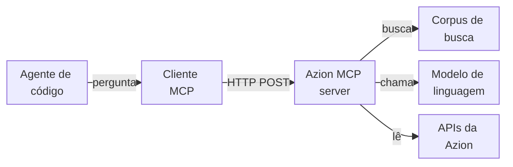

import FrameBox from '@aziontech/webkit/frame-box'
import ItemList from '@aziontech/webkit/item-list'
import DocItem from '@aziontech/webkit/doc-item'

Um agente de código responde a perguntas sobre uma plataforma com mais confiabilidade quando consegue consultar os fatos em vez de lembrá-los. O Model Context Protocol (MCP) é uma especificação aberta para essa consulta. Ele usa JSON-RPC para padronizar como uma aplicação lista e chama as ferramentas de um servidor, lê os recursos dele e busca os prompts dele. O cliente MCP do agente envia cada requisição ao servidor, e o agente lê a resposta como contexto.

O [MCP server da Azion](/pt-br/documentacao/devtools/mcp/) é um MCP server hospedado em `https://mcp.azion.com/`. Ele autentica cada requisição com o seu [personal token](/pt-br/documentacao/fundamentos/personal-tokens/) da Azion e responde com texto tirado da documentação da Azion, de exemplos de código e das referências da CLI, da API e do Terraform provider. Nenhuma ferramenta altera a sua conta. Para conectar um agente, consulte [Primeiros passos com o MCP server](/pt-br/documentacao/devtools/mcp/configuracao/). Para os termos, consulte [Glossário](/pt-br/documentacao/devtools/mcp/glossario/).

As seções cobrem o caminho da requisição, a conexão e o transporte, a autenticação, as ferramentas e os recursos, a execução das ferramentas, o conjunto de ferramentas de cada perfil de API e a descoberta OAuth.

---

## O caminho da requisição

O MCP server da Azion segue o modelo cliente-servidor do protocolo. O seu agente decide quando precisa de um fato, o cliente MCP dele transforma essa decisão em uma requisição JSON-RPC, e o servidor faz a consulta e devolve texto.

Este diagrama acompanha uma chamada de ferramenta do agente até os sistemas que o servidor alcança:



1. Você faz uma pergunta ao agente em linguagem natural, e o agente decide que uma ferramenta pode respondê-la.
2. O cliente MCP se conecta a `https://mcp.azion.com/` por HTTP e envia o seu personal token no header `Authorization` da requisição.
3. O servidor valida o token e descobre o perfil de API da sua conta, que decide as ferramentas que o cliente pode descobrir.
4. O cliente lista as ferramentas e os recursos e, em seguida, chama uma ferramenta pelo nome com argumentos JSON.
5. O servidor executa a ferramenta. Dependendo da ferramenta, ele busca em um corpus de documentos, pede a um modelo de linguagem que monte uma resposta ou lê dados das APIs da Azion com o seu token.
6. O servidor devolve o resultado como texto, e o agente usa esse texto para responder a você.

A Azion executa o servidor na própria plataforma, como uma [function](/pt-br/documentacao/plataforma/functions/) atrás de uma aplicação e de um workload. O servidor é escrito em TypeScript com o MCP SDK, e o código-fonte dele é público em [github.com/aziontech/mcp-server](https://github.com/aziontech/mcp-server). Para executar um servidor seu da mesma forma, consulte [Execute um MCP server na Azion](/pt-br/documentacao/guias/desenvolvimento-de-aplicacoes/automacao/executar-mcp-server/).

---

## Conexão e transporte

Um transporte é a forma como as mensagens MCP trafegam entre um cliente e um servidor. O MCP server da Azion usa streamable HTTP: o cliente envia cada mensagem como um `POST` HTTP para a raiz do host, e o servidor responde com uma resposta `text/event-stream` que contém um server-sent event. O servidor responde somente no host sem caminho, e uma requisição para `/mcp` retorna `404`.

A primeira requisição de uma conexão é `initialize`. Um cliente a envia como um `POST` para `https://mcp.azion.com` com os headers `Authorization: Bearer [TOKEN VALUE]`, `Content-Type: application/json` e `Accept: application/json, text/event-stream`, e com este body:

```json
{
  "jsonrpc": "2.0",
  "method": "initialize",
  "id": 1,
  "params": {
    "protocolVersion": "2025-03-26",
    "capabilities": {},
    "clientInfo": {
      "name": "my-client",
      "version": "0.1"
    }
  }
}
```

O servidor responde com o status `200`. Os dados do evento, decodificados, informam a versão do protocolo, as capacidades do servidor e o nome dele:

```json
{
  "result": {
    "protocolVersion": "2025-03-26",
    "capabilities": {
      "logging": {},
      "resources": {
        "listChanged": true
      },
      "tools": {
        "listChanged": true
      },
      "completions": {}
    },
    "serverInfo": {
      "name": "azion-mcp-server",
      "version": "1.0.0"
    }
  },
  "jsonrpc": "2.0",
  "id": 1
}
```

Em seguida, o cliente envia `notifications/initialized`, e o servidor responde `202` com o body vazio. Nenhuma resposta traz um header `Mcp-Session-Id`, porque o servidor é stateless: ele não mantém sessão entre as requisições. Cada requisição seguinte, como `tools/list` ou `tools/call`, é um `POST` independente que traz o próprio header `Authorization`.

Ser stateless tem um custo e um benefício. O servidor não consegue levar contexto de uma chamada para a próxima, então cada requisição precisa conter tudo de que o servidor precisa, incluindo o token. Em troca, qualquer requisição pode ser respondida sozinha, sem sessão para configurar ou perder.

O servidor aceita somente TLS 1.3. Um cliente construído sobre uma biblioteca TLS mais antiga falha no handshake antes que a requisição chegue ao servidor. Por exemplo, um interpretador Python compilado com LibreSSL 2.8.3 não consegue se conectar.

Alguns clientes iniciam todo MCP server como um processo local e se comunicam com ele pela entrada e saída padrão em vez de HTTP. Esses clientes chegam ao MCP server da Azion por meio do `mcp-remote`, um pacote que o `npx` baixa e executa como uma ponte local para `https://mcp.azion.com`. A ponte custa tempo: ela leva cerca de 10 a 13 segundos para se conectar, parte disso gasto na descoberta OAuth. Para os clientes que a usam, consulte [Primeiros passos com o MCP server](/pt-br/documentacao/devtools/mcp/configuracao/).

---

## Autenticação

O MCP server da Azion autentica cada requisição isoladamente, a partir do header `Authorization`. Um personal token é `azion` seguido de 35 letras e dígitos, 40 caracteres no total. Você o envia com qualquer um dos esquemas, e o servidor responde aos dois da mesma forma:

- `Authorization: Bearer [TOKEN VALUE]`
- `Authorization: Token [TOKEN VALUE]`

O servidor lê o esquema e o formato do valor para decidir como validá-lo. Um valor `Token` é sempre validado como personal token. Um valor `Bearer` no formato de um personal token é validado primeiro como personal token. Qualquer outro valor `Bearer` é testado como um JWT da Azion, que o servidor confere no endpoint `/v4/account/account` da [Azion API](/pt-br/documentacao/devtools/api/), e depois como um access token OAuth, que ele confere no endpoint `/oauth/userinfo` do Azion SSO. Por isso, um access token OAuth ou um JWT precisa usar o esquema `Bearer`.

Uma requisição que falha na autenticação recebe HTTP `401` com um body em texto simples que contém JSON, não um objeto de erro JSON-RPC, e sem header `WWW-Authenticate`. Por exemplo, uma requisição sem header `Authorization` recebe este body:

```json
{
  "message": "No authentication provided",
  "status": 401
}
```

Como o servidor não mantém sessão, um token que deixa de ser válido falha na próxima requisição, não na próxima conexão. As mensagens de um header malformado ou de um token recusado, e o que fazer em cada caso, estão em [Solucionar problemas do MCP server](/pt-br/documentacao/devtools/mcp/solucao-de-problemas/).

---

## Ferramentas e recursos

O protocolo define três tipos de capacidade que um servidor pode expor: ferramentas, que um cliente chama para obter uma resposta; recursos, que um cliente lê como arquivos; e prompts, que são templates de mensagem. O MCP server da Azion expõe ferramentas e recursos, e nenhum prompt.

Uma ferramenta é uma função que o servidor executa sob demanda. A resposta de `tools/list` descreve cada ferramenta com um `name`, um `title`, uma `description` que o agente lê para decidir quando chamá-la e um `inputSchema` escrito em JSON Schema. Em seguida, o agente envia `tools/call` com o nome da ferramenta e argumentos que seguem o schema. Por exemplo, uma chamada a `search_azion_docs_and_site` traz uma `query` como `how to configure cache`.

Um recurso é um documento que o cliente lê pela URI com `resources/read`, sem chamar uma ferramenta. As URIs do MCP server da Azion têm a forma `azion://<category>/<resource>/<item>`, como em `azion://static-site/deploy/step-0-preparation`. Esse recurso é lido como `step-0-preparation.md`, com o tipo `text/markdown`. O servidor gera o texto de um guia de deploy quando o cliente o lê, então o texto traz a data da requisição.

Os guias de site estático podem ser acessados por duas rotas. Um cliente que suporta recursos os lista e lê diretamente; um cliente que não suporta pode chamar `deploy_azion_static_site` para obter o mesmo texto. Para cada ferramenta com as entradas dela e cada URI de recurso, consulte [Ferramentas e recursos](/pt-br/documentacao/devtools/mcp/ferramentas/).

---

## Execução das ferramentas

As ferramentas do MCP server da Azion diferem no que fazem com uma requisição, e essa diferença decide quanto tempo uma chamada leva e quanto confiar na resposta dela. Nenhuma delas cria, altera ou exclui nada na sua conta.

- As ferramentas de busca, cujos nomes começam com `search_azion_`, executam a sua `query` em um corpus de documentos e devolvem as correspondências mais próximas como um array JSON. Cada documento traz o `title`, o `content` e o `source`, com a `similarity` e o `relevance_score` que o classificaram.
- `create_rules_engine` consulta os documentos de Rules Engine para o caso de uso que você indica e então faz uma chamada a um modelo de linguagem que transforma o seu objetivo em uma proposta de regra. Ela não usa o seu token, e nenhuma regra é criada.
- `create_graphql_query` busca na documentação do GraphQL e faz um modelo de linguagem escrever uma query para o seu objetivo. Depois, ela executa cada query gerada na [GraphQL API](/pt-br/documentacao/devtools/graphql/) de analytics da sua conta, com o seu token, para validá-la. Essas queries apenas leem dados, e a ferramenta faz até seis tentativas, além de chamadas de introspecção.
- `deploy_azion_static_site` devolve um texto de guia fixo. Ela não faz nenhuma chamada de rede e não usa o seu token.

As ferramentas de busca classificam os documentos pela proximidade com as palavras da query, não pelo que a query significa. Uma query ampla pode colocar em primeiro lugar um documento sobre outro produto ou outra operação, então leia o `title` de cada correspondência antes de agir com base nela.

Uma chamada a `create_graphql_query` leva mais tempo que uma busca e pode passar de 15 segundos, porque a ferramenta gera e valida cada query na sua conta. A resposta dela não é garantida. Quando nenhuma tentativa produz uma query válida, a ferramenta devolve um texto alternativo que diz que a informação não pôde ser obtida e aponta para a documentação da GraphQL API.

As duas ferramentas que usam um modelo de linguagem relatam uma falha como texto dentro de um resultado bem-sucedido, sem a flag `isError`. É o texto, não o status, que diz ao agente se a chamada funcionou. Uma chamada a uma ferramenta que o servidor não lista é diferente: ela retorna o erro JSON-RPC `-32602`.

---

## Conjunto de ferramentas por perfil de API

Quando o MCP server da Azion autentica um token, ele descobre o perfil de API da conta, `v3` ou `v4`, e o perfil decide quais ferramentas `tools/list` retorna.

Uma conta no perfil `v4` vê oito ferramentas. Uma conta no perfil `v3` vê uma nona, `search_azion_api_v3_commands`, que busca na documentação da Azion API v3. Uma conta `v4` que chama essa ferramenta pelo nome recebe o erro JSON-RPC `-32602`, o mesmo erro de qualquer ferramenta que não existe.

O perfil pertence à conta, não à configuração do cliente. Por exemplo, duas pessoas do mesmo time com a mesma configuração de agente veem listas de ferramentas diferentes quando os tokens delas pertencem a contas em perfis diferentes. Para a mensagem de erro e a lista completa de ferramentas, consulte [Ferramentas e recursos](/pt-br/documentacao/devtools/mcp/ferramentas/).

---

## Descoberta OAuth

A descoberta OAuth permite que um cliente descubra onde obter um token sem estar configurado para isso. O MCP server da Azion publica dois documentos de descoberta, e qualquer pessoa pode lê-los sem autenticação.

`/.well-known/oauth-protected-resource` indica `https://sso.azion.com` como o servidor de autorização e aceita o token somente no header da requisição. `/.well-known/oauth-authorization-server` descreve o próprio Azion SSO. Leia-o com um `GET` simples:

```bash
curl https://mcp.azion.com/.well-known/oauth-authorization-server
```

O servidor responde com o status `200` e este documento:

```json
{
  "issuer": "https://sso.azion.com",
  "authorization_endpoint": "https://sso.azion.com/oauth/authorize",
  "token_endpoint": "https://sso.azion.com/oauth/token",
  "jwks_uri": "https://sso.azion.com/oauth/jwks",
  "response_types_supported": ["code"],
  "grant_types_supported": ["authorization_code", "refresh_token"],
  "token_endpoint_auth_methods_supported": ["client_secret_post", "client_secret_basic"],
  "code_challenge_methods_supported": ["S256"],
  "scopes_supported": ["openid", "profile", "email", "offline_access"],
  "service_documentation": "https://www.azion.com/en/documentation/devtools/mcp/"
}
```

O documento anuncia o grant authorization code com PKCE (`S256`) e refresh tokens, e os escopos `openid`, `profile`, `email` e `offline_access`. Um access token emitido pelo Azion SSO chega ao servidor como um valor `Bearer`, que o servidor valida em `/oauth/userinfo`.

A descoberta é executada mesmo quando um token já está configurado. O `mcp-remote` lê os dois documentos a cada início e gasta cerca de quatro segundos com eles antes de se conectar. Quando o header `Authorization` autentica a conexão, nenhuma janela do navegador abre e nenhum login é executado.

---

## Recursos relacionados

<FrameBox>
<ItemList>
  <DocItem title="Ferramentas e recursos" href="/pt-br/documentacao/devtools/mcp/ferramentas/">Cada ferramenta com as entradas e o valor de retorno dela, e cada URI de recurso que o servidor serve.</DocItem>
  <DocItem title="Primeiros passos com o MCP server" href="/pt-br/documentacao/devtools/mcp/configuracao/">Conecte um agente de código ao servidor com um personal token e faça uma primeira chamada.</DocItem>
  <DocItem title="Solucionar problemas do MCP server" href="/pt-br/documentacao/devtools/mcp/solucao-de-problemas/">Corrija um token recusado, uma ferramenta ausente ou um cliente que não consegue se conectar.</DocItem>
  <DocItem title="Execute um MCP server na Azion" href="/pt-br/documentacao/guias/desenvolvimento-de-aplicacoes/automacao/executar-mcp-server/">Faça o build e o deploy de um servidor seu como uma function na Azion.</DocItem>
</ItemList>
</FrameBox>
