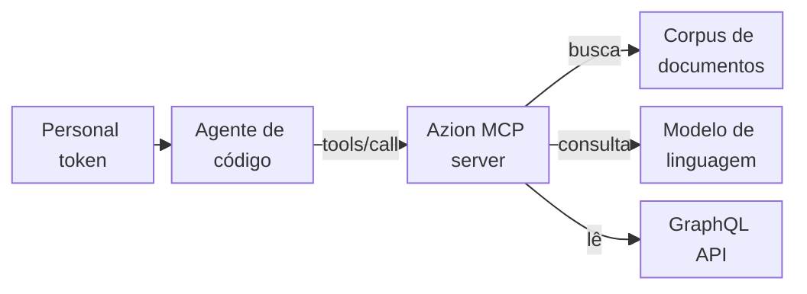

import DocButton from '~/components/webkit/DocButton.vue'
import DocCardGroup from '@aziontech/webkit/doc-card-group'
import DocCard from '@aziontech/webkit/doc-card'

Um MCP server dá a um agente de código ferramentas que ele pode chamar para consultar fatos, em vez de lembrá-los do treinamento. O [Model Context Protocol](https://modelcontextprotocol.io) (MCP) é um padrão aberto, desenvolvido pela Anthropic, que usa JSON-RPC para definir como um agente lista as ferramentas de um servidor, chama essas ferramentas e lê os recursos do servidor. O agente consulta o servidor quando uma pergunta precisa de um fato e lê a resposta como contexto, para que você não tenha que colar documentação na conversa.

O **MCP server da Azion** é um MCP server hospedado em `https://mcp.azion.com/` que responde a perguntas sobre a Azion Platform. Ele autentica cada requisição com seu [personal token](/pt-br/documentacao/fundamentos/personal-tokens/) da Azion. As respostas dele são texto extraído da documentação da Azion, de exemplos de código e das referências da [Azion CLI](/pt-br/documentacao/devtools/cli/), da [Azion API](/pt-br/documentacao/devtools/api/) e do [Azion Terraform Provider](/pt-br/documentacao/devtools/terraform/). Use o MCP server da Azion para encontrar um comando da CLI ou uma operação da API, obter um exemplo de código, criar o rascunho de uma regra do [Rules Engine](/pt-br/documentacao/plataforma/applications/rules-engine/) ou escrever uma query GraphQL para as métricas da sua conta.

<DocButton href="/pt-br/documentacao/devtools/mcp/configuracao/" label="Primeiros passos" size="medium" />
<DocButton href="/pt-br/documentacao/devtools/mcp/ferramentas/" label="Veja as ferramentas" kind="secondary" size="medium" />

---

## Chamada de ferramenta

Um agente de código chama uma ferramenta com uma requisição JSON-RPC `tools/call`. A requisição abaixo pede à ferramenta `search_azion_docs_and_site` dois documentos sobre cache. Ela é um `POST` para `https://mcp.azion.com` com os headers `Authorization: Bearer [TOKEN VALUE]`, `Content-Type: application/json` e `Accept: application/json, text/event-stream`, e com este corpo:

```json
{
  "jsonrpc": "2.0",
  "method": "tools/call",
  "id": 1,
  "params": {
    "name": "search_azion_docs_and_site",
    "arguments": {
      "query": "how to configure cache",
      "docsAmount": 2
    }
  }
}
```

O servidor responde com o status `200` e um server-sent event. Os dados desse evento, decodificados, são o resultado abaixo, com o valor de `text` cortado em `…`; o valor completo contém os dois documentos que `docsAmount` pede:

```json
{
  "result": {
    "content": [
      {
        "type": "text",
        "text": "[\n  {\n    \"title\": \"application-acceleration\",\n    \"content\": \"Title: application-acceleration\\nDescription: Application Accelerator speeds up web applications and APIs through protocol optimizations and manages dynamic content requirements.\\nMetatag Keywords: Application Accelerator, Serveless, Edg…"
      }
    ]
  },
  "jsonrpc": "2.0",
  "id": 1
}
```

- `params.name` seleciona a ferramenta, e `params.arguments` leva as entradas dela: a `query` e `docsAmount`, o número de documentos.
- `result.content` contém um item do tipo `text`. Em uma ferramenta de busca, esse texto é um array JSON de documentos, cada um com seu `title`, `content` e `source`, e com o `similarity` e o `relevance_score` que o classificaram.
- O header `Authorization` acompanha cada requisição, porque o servidor não mantém sessão entre requisições.

Se você conhece JSON-RPC 2.0, você conhece o formato das mensagens. Raramente você escreve essas requisições à mão: o cliente MCP do seu agente as escreve quando você faz uma pergunta em linguagem natural, como um destes prompts:

- `Configure Rules Engine to cache static assets for 1 year and API responses for 5 minutes.`
- `Optimize my site's Core Web Vitals scores`

---

## Caminho da requisição

Conectar o MCP server da Azion não dá ao seu agente acesso para alterar sua conta. Cada ferramenta retorna texto, e o agente decide o que fazer com ele.



1. Você adiciona o servidor à configuração do seu agente de código, com seu personal token no header `Authorization`.
2. Quando uma pergunta precisa de um fato sobre a Azion, o cliente MCP do agente envia uma requisição JSON-RPC para `https://mcp.azion.com/` como um `POST` HTTP.
3. O servidor verifica o token e lê o perfil de API da sua conta, que define as ferramentas que o agente pode listar.
4. Uma ferramenta de busca executa a `query` em um corpus de documentos da Azion. `create_rules_engine` e `create_graphql_query` também pedem a um modelo de linguagem que escreva uma proposta de regra ou uma query a partir do objetivo que você informa.
5. `create_graphql_query` executa cada query que escreve na [GraphQL API](/pt-br/documentacao/devtools/graphql/) de analytics da sua conta, com seu token, para validá-la. Essas queries apenas leem dados.
6. O servidor retorna o resultado como texto, e o agente o usa para responder a você.

Para o transporte, os dois esquemas de autenticação e os documentos de descoberta OAuth, consulte [Como o MCP server funciona](/pt-br/documentacao/devtools/mcp/como-funciona/).

---

## O que o servidor cobre

O MCP server da Azion responde a perguntas e propõe configurações. Estas são as ferramentas, os limites e as formas de acessar o servidor:

- **Ferramentas**: uma conta no perfil de API v4 vê oito ferramentas. Cinco delas buscam na documentação e no site da Azion, nos exemplos de código, nos comandos da Azion CLI, na referência da Azion API v4 e na documentação do Azion Terraform Provider. `create_rules_engine` cria o rascunho de uma regra para o Rules Engine, `create_graphql_query` escreve uma query GraphQL e `deploy_azion_static_site` retorna guias para fazer o deploy de um site estático e testar o cache dele. Uma conta no perfil de API v3 vê uma nona ferramenta, `search_azion_api_v3_commands`. [Ferramentas e recursos](/pt-br/documentacao/devtools/mcp/ferramentas/) lista as entradas e o resultado de cada ferramenta.
- **Recursos e prompts**: o servidor oferece sete recursos em Markdown em `azion://static-site/deploy/` e `azion://static-site/test-cache/`, os mesmos guias que `deploy_azion_static_site` retorna. Ele não oferece prompts, e uma requisição `prompts/list` retorna `-32601 Method not found`.
- **Somente leitura**: nenhuma ferramenta cria, altera ou exclui algo na sua conta. `create_rules_engine` retorna uma proposta e não cria nenhuma regra. O servidor também não faz deploy: os guias de site estático indicam os comandos da Azion CLI que você ou seu agente executam.
- **Respostas**: a classificação da busca é imprecisa, então o primeiro resultado pode não tratar do assunto. As ferramentas que chamam um modelo de linguagem informam uma falha como texto dentro de um resultado bem-sucedido. Cada documento de busca traz seu `source`, a página com a qual você pode conferi-lo.
- **Credencial**: cada requisição leva um personal token, como `Authorization: Bearer [TOKEN VALUE]` ou `Authorization: Token [TOKEN VALUE]`, e o servidor responde às duas formas da mesma maneira. Uma requisição sem o header recebe `401` com a mensagem `No authentication provided`. Você cria o token no [Azion Console](https://console.azion.com/).
- **Conexão**: o servidor usa o transporte streamable HTTP no host sem caminho, e uma requisição para `/mcp` retorna `404`. Ele responde a cada requisição com um server-sent event, não mantém sessão e aceita apenas TLS 1.3.
- **Clientes**: [Configuração de agentes](/pt-br/documentacao/agent-setup/) conecta Claude Code, Cursor, GitHub Copilot, Windsurf, Codex, Gemini CLI e OpenCode. [Primeiros passos com o MCP server](/pt-br/documentacao/devtools/mcp/configuracao/) conecta o Claude Code com um comando e mostra a configuração para o Kiro e para o Claude Desktop e o Warp, que acessam o servidor pela ponte `mcp-remote`.
- **Outros servidores**: um servidor de staging responde em `https://stage-mcp.azion.com` e também exige um token. A disponibilidade dele pode ser diferente da de produção, então direcione o trabalho crítico para `https://mcp.azion.com`. O código-fonte do servidor é público em [github.com/aziontech/mcp-server](https://github.com/aziontech/mcp-server), e [Execute o MCP server da Azion localmente](/pt-br/documentacao/guias/desenvolvimento-de-aplicacoes/automacao/executar-mcp-server-da-azion-localmente/) executa o servidor em `http://localhost:3333`.
- **Seu próprio servidor**: a Azion executa este servidor como uma [function](/pt-br/documentacao/plataforma/functions/). Para criar e fazer o deploy de um MCP server seu da mesma forma, consulte [Execute um MCP server na Azion](/pt-br/documentacao/guias/desenvolvimento-de-aplicacoes/automacao/executar-mcp-server/).
- **Ajuda**: [Solucionar problemas do MCP server](/pt-br/documentacao/devtools/mcp/solucao-de-problemas/) lista cada erro com a causa e a correção, [Teste o comportamento do cache com o MCP server](/pt-br/documentacao/guias/performance-e-confiabilidade/cache-e-purge/testar-cache-com-mcp/) usa os guias de cache em um site com deploy feito e o [Glossário](/pt-br/documentacao/devtools/mcp/glossario/) define os termos do servidor.

---

## Próximos passos

<DocCardGroup cols={2}>
  <DocCard title="Primeiros passos com o MCP server" href="/pt-br/documentacao/devtools/mcp/configuracao/" label="Conecte o Claude Code ao servidor e faça sua primeira pergunta." />
  <DocCard title="Como o MCP server funciona" href="/pt-br/documentacao/devtools/mcp/como-funciona/" label="Acompanhe uma chamada de ferramenta do seu agente até a resposta, passando pela autenticação." />
  <DocCard title="Ferramentas e recursos" href="/pt-br/documentacao/devtools/mcp/ferramentas/" label="Consulte as entradas e o resultado de cada ferramenta e cada URI de recurso." />
  <DocCard title="Guias e tutoriais do MCP server" href="/pt-br/documentacao/devtools/mcp/guias/" label="Execute um MCP server na Azion, execute este servidor localmente ou teste o comportamento do cache." />
</DocCardGroup>
