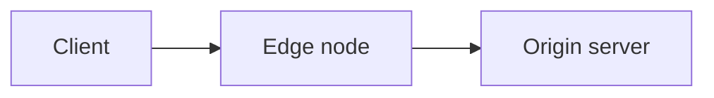

As páginas de documentação são MDX, e esta página é o vocabulário completo de componentes: cada entrada é um componente do design system, `@aziontech/webkit`, ou um wrapper fino sobre um. Um componente ausente desta página não está disponível: um import dele falha o build.

## Asides

Sem import. Asides são escritos como diretivas remark e renderizam o `DocCallout` do design system; são a construção mais comum depois dos links.

```mdx
:::note
Bucket names must be unique across all existing buckets.
:::

:::tip
**Increase limits** <br></br>
Contact [technical support](/en/documentation/services/support/) to request a higher limit for your plan.
:::

:::caution[important]
You are viewing the latest version. For accounts that are not migrated, refer to the [legacy reference](/en/documentation/products/build/edge-application/v3/).
:::
```

Tipos válidos: `note`, `tip`, `caution`, `danger`. `caution` renderiza como o tipo warning do callout.

**`:::warning` não é válido** e não renderiza como esperado. Use `:::caution`.

- Um callout contém apenas prosa inline: frases, links, código inline. Uma lista, um fence ou uma tabela dentro dele sai da caixa; coloque-os antes ou depois do aside.
- O callout não tem linha de título. O texto entre colchetes é mantido como introdução à cópia (`Você sabia? — ...`), então use-o só quando as primeiras palavras precisarem dele. Em páginas em português, localize: `:::note[nota]`, `:::tip[dica]`, `:::caution[Atenção]`.

## DocButton

A call to action da casa. Um wrapper sobre o Button do design system que mantém o estilo de botão dentro do corpo do artigo.

```mdx
import DocButton from '~/components/webkit/DocButton.vue'

<DocButton href="/pt-br/documentacao/produtos/build/applications/real-time-purge/" label="Referência de Real-Time Purge" kind="secondary" size="medium" />
```

- `href` e `label` são obrigatórios. Sem diretiva client: o botão é um link estático.
- `kind`: omita para a ação primária; `secondary` para um link de referência. `outlined`, `text` e `danger` também existem.
- Sempre `size="medium"`.
- `icon` recebe uma classe de ícone, sempre antes do label. `target="_blank"` abre um destino externo em nova aba.

## Code

Renderiza o `CodeBlock` do design system, com uma aba de linguagem e um botão de copiar. Blocos com fence renderizam o mesmo componente.

```mdx
import Code from '~/components/Code/Code.astro'

<Code lang="bash" code={`azion deploy --local`} />
```

Aceita apenas `code` e `lang`.

**O valor é um template literal de JavaScript.** Backticks e `${` dentro dele precisam de escape, e uma continuação de linha precisa de barra invertida dupla. Quando um snippet contém um dos dois, isso é motivo para usar `<Code>` em vez de um fence, porque você controla o escape.

Blocos com fence também são o estilo da casa. Use um fence para a saída que o leitor lê, e `<Code>` para a entrada que o leitor copia.

Tags de linguagem em uso: `bash`, `sh`, `json`, `javascript`, `js`, `typescript`, `ts`, `hcl`, `graphql`, `shell`, `text`, `plaintext`. Terraform é `hcl`, não `terraform`.

---

## Tabs e Fragment

O padrão multi-interface: uma tarefa, um painel por interface. Renderiza o `TabView` do design system, com todos os painéis mantidos no HTML.

```mdx
import Tabs from '~/components/tabs/Tabs'
import Code from '~/components/Code/Code.astro'

<Tabs client:visible>
    <Fragment slot="tab.console">Console</Fragment>
    <Fragment slot="tab.api">API</Fragment>

<Fragment slot="panel.console">

1. Access [Azion Console](https://console.azion.com/) > **Object Storage**.
2. Select **+ Bucket**.

</Fragment>

<Fragment slot="panel.api">

<Code lang="bash" code={`curl ...`} />

</Fragment>

</Tabs>
```

- `client:visible` é obrigatório. Sem ele, as tabs renderizam e não alternam.
- Todo `tab.x` precisa de um `panel.x` correspondente.
- **Linhas em branco ao redor de markdown dentro de um Fragment são obrigatórias**, ou o markdown renderiza como um único parágrafo literal.
- A primeira tab é o padrão, e os painéis são pareados com as tabs pela chave; coloque o Console primeiro, a menos que exista um motivo para não fazer isso.
- Chaves canônicas: `tab.console`, `tab.api`, `tab.cli`, mais `tab.apiv3` / `tab.apiv4` para APIs versionadas.
- O `sharedStore="package-managers"` opcional sincroniza a seleção entre grupos de tabs de uma página.

## Tag

Selos de status.

```mdx
import Tag from '~/components/webkit/Tag.vue'

<Tag severity="info">Preview</Tag>
```

- Sem diretiva client: o selo é HTML estático.
- `severity` é `success`, `info`, `warning` ou `danger`. `info` é o chip neutro de rótulo, usado para "Preview" e selos de produto; os outros três são cores de status.
- O label vai nos filhos. `value="Preview"` também é aceito.

## Video

Sem import. Emite o iframe mais os metadados `VideoObject` do schema.org.

```mdx
<Video
  src="https://www.youtube.com/embed/BV4jRPpADw8"
  title="Local development with Azion CLI"
  description="How the CLI supports local debugging and faster workflows."
  uploadDate="2023-10-17"
/>
```

`src` precisa ser uma URL de **embed** do YouTube. `src` e `title` são obrigatórios. Para uma captura de tela ou um arquivo de clipe, use Figura.

## Diagramas Mermaid

Um diagrama é um fence de código `mermaid`, não uma imagem. O texto chega a um agente que busca o twin em markdown; uma referência de imagem, não.

````md

````

Nomeie cada nó e cada aresta em palavras, e nunca dependa de cor sozinha para carregar uma distinção. Um diagrama nunca fica sozinho: páginas de arquitetura e de caso de uso mantêm o fluxo de dados numerado abaixo dele.

## Passos

Um passo a passo numerado: cada passo é um título com um corpo opcional, e os números vêm da ordem na página.

```mdx
import DocSteps from '@aziontech/webkit/doc-steps'
import DocStep from '@aziontech/webkit/doc-step'

<DocSteps>
  <DocStep title="Crie o bucket">

  No [Azion Console](https://console.azion.com/), acesse **Object Storage** e selecione **+ Bucket**.

  </DocStep>
  <DocStep title="Dê um nome">

  Nomes de bucket precisam ser únicos entre todos os buckets existentes.

  </DocStep>
</DocSteps>
```

- Sem diretiva client.
- Nunca escreva o número: reordenar os passos os renumera.
- Um `DocStep` precisa estar dentro de um `DocSteps`; sozinho, ele lança um erro. Linhas em branco ao redor do markdown dentro de um passo são obrigatórias.

## Figura

Uma captura de tela, um clipe ou um diagrama emoldurado, com uma introdução opcional acima e uma legenda abaixo.

```mdx
import DocFrame from '@aziontech/webkit/doc-frame'

<DocFrame
  src="/assets/docs/images/uploads/real-time-metrics-overview.png"
  alt="Visão geral do fluxo de consulta do Real-Time Metrics"
  caption="O fluxo de consulta, do console à fonte de dados."
/>
```

- `src` recebe uma imagem ou um clipe (`.mp4`, `.webm`). Dê um `alt` a uma imagem. Sem `src`, a moldura envolve os filhos, como um fence `mermaid`.
- `caption` e `hint` são strings simples; os slots de mesmo nome (`<Fragment slot="caption">`) carregam uma legenda com link ou código inline.
- `autoplay` reproduz um clipe sem som, inline e em loop, sem controles.

## Cards

Uma grade de cards de navegação, para uma página que se abre em seções.

```mdx
import DocCardGroup from '@aziontech/webkit/doc-card-group'
import DocCard from '@aziontech/webkit/doc-card'

<DocCardGroup cols={2}>
  <DocCard title="Build" href="/pt-br/documentacao/produtos/build/" label="Applications, functions e connectors." />
  <DocCard title="Secure" href="/pt-br/documentacao/produtos/secure/">Firewall, WAF e proteção contra DDoS.</DocCard>
</DocCardGroup>
```

- Sem diretiva client.
- `cols` é 2, 3 ou 4; a grade colapsa para uma coluna no celular.
- `href` transforma o card inteiro em link. `label` é a cópia; os filhos a substituem quando a cópia precisa de um link ou de código inline.
- Opcionais: `icon` recebe uma classe PrimeIcons (`pi pi-bolt`), `overline` uma linha pequena acima do título, `link` um texto de call to action em uma linha de fechamento.

## Itens relacionados

Uma lista emoldurada de linhas, cada uma com um nome e uma frase, para um leitor escolhendo o que ler em seguida.

```mdx
import ItemList from '@aziontech/webkit/item-list'
import DocItem from '@aziontech/webkit/doc-item'

<ItemList>
  <DocItem title="Cache Settings" href="/pt-br/documentacao/produtos/build/applications/cache-settings/">Como um edge node decide o que guardar e por quanto tempo.</DocItem>
  <DocItem title="Rules Engine" href="/pt-br/documentacao/produtos/build/applications/rules-engine/">Condições e comportamentos nas fases de requisição e resposta.</DocItem>
</ItemList>
```

- Sem diretiva client. `ItemList` é a moldura que traça as linhas entre os itens.
- `href` transforma a linha em link; uma URL externa recebe a seta para fora. O `icon` opcional recebe uma classe PrimeIcons.

## Entrada de changelog

Uma entrada datada: rótulo e versão à esquerda, as notas à direita, com uma âncora derivada do rótulo.

```mdx
import DocUpdate from '@aziontech/webkit/doc-update'

<DocUpdate label="10 de julho de 2026" description="Bot Manager 1.3.0" tags={['Marketplace']}>

**Bot Manager** agora traz nove novas regras estáticas e dois novos argumentos.

</DocUpdate>
```

- Sem diretiva client. Linhas em branco ao redor do markdown interno são obrigatórias.
- `label` é a âncora, em slug. Duas entradas com o mesmo rótulo precisam de valores distintos de `anchor`.
- `description` é a linha abaixo do rótulo; `tags` é um array de rótulos curtos.

## Prompt

Um bloco de texto literal que o leitor entrega a um agente, em fonte mono e com um controle de copiar. Não é um bloco de código: sem linguagem, sem highlighting.

```mdx
import DocPrompt from '@aziontech/webkit/doc-prompt'

<DocPrompt client:visible title="Experimente">Crie uma application com cache habilitado e faça o deploy.</DocPrompt>
```

- `client:visible` é obrigatório: o controle de copiar e o de expandir precisam dele.
- `kind="line"` faz uma única linha com rolagem em vez de um parágrafo limitado a quatro linhas. `title` e `icon` são opcionais.

## Glosa inline

Um termo no meio da prosa que mostra sua definição ao passar o mouse ou receber foco, com um link opcional.

```mdx
import DocTooltip from '@aziontech/webkit/doc-tooltip'

A <DocTooltip client:visible headline="Cache key" tip="O identificador que um edge node monta a partir de uma requisição." cta="Leia mais" href="/pt-br/documentacao/produtos/build/applications/cache-settings/">cache key</DocTooltip> decide o que corresponde.
```

- `client:visible` é obrigatório; sem ele o termo renderiza e nunca abre.
- `tip` é a definição, `headline` a introdução em negrito, `cta` mais `href` o link.

## Fornecidos pelo layout

`DocPageHeader` (a partir de `title` e `description` no frontmatter), `DocOnThisPage`, `DocPagination` e o contrato tipográfico `DocProse` renderizam ao redor de toda página. Nunca os escreva.

---

## Snippets compartilhados

Blocos reutilizáveis em `~/includes/snippets/`, cada um com uma variante `en/` e uma `pt/`. Note que a pasta do português é `pt/`, não `pt-br/`.

```mdx
import Apiv4Rollout from '~/includes/snippets/apiv4Rollout/en/snippet.mdx'

<Apiv4Rollout />
```

Disponíveis: `apiv4Rollout`, `JourneyAPI`, `InterfaceNote`, `LetsEncryptExpiration`, `RulesEngineExecution`.

## SectionBasicContent

O bloco de cabeçalho de uma página de vitrine de template. Importe de `~/components/SectionBasicContent/SectionBasicContent.vue`. Recebe `description` e um array `buttons`, com o resto da página em um `<Fragment slot="content">`. Cada botão recebe `label`, `link` e, opcionalmente, `severity: "secondary"`, `outlined: true`, `icon` e `target`. Um botão sem `link` não renderiza nada. Leia uma página de vitrine existente antes de usar.

## GuidesTable

Renderiza o hub de Guias e tutoriais como uma tabela de nome, última atualização e dificuldade. Usado na página de hub de uma seção de produto, e em nenhum outro lugar.

```mdx
import GuidesTable from '~/components/GuidesTable.astro'

<GuidesTable
  lang="en"
  prefixes={['/documentation/build/cache/guides/', '/documentation/build/cache/tutorials/']}
  exclude={['/documentation/build/cache/guides/']}
/>
```

- `prefixes` — prefixos de permalink cujas páginas preenchem a tabela. `exclude` remove a própria página de hub.
- A data vem do último commit do arquivo no git, lida no momento do build. Nunca escreva a data à mão. Um arquivo sem commit ou de um clone raso mostra um traço.
- A dificuldade vem do campo opcional `difficulty` do frontmatter: `Beginner`, `Intermediate` ou `Advanced`. O valor fica em inglês nas páginas dos dois idiomas; o componente localiza o rótulo.
- As linhas ordenam da mais recente para a mais antiga, depois por título.
- Os mesmos prefixos vão no campo `covers` da linha do menu, para que as páginas passem na verificação de posse da sidebar.

---

## GlossaryFilter

Filtro client-side sobre uma tabela de glossário. Usado na página de Glossário de um produto, e em nenhum outro lugar.

```mdx
import GlossaryFilter from '~/components/GlossaryFilter.astro'

<GlossaryFilter lang="pt-br">

| Termo | Definição |
| --- | --- |
| cache key | O identificador que um edge node monta a partir de uma requisição para decidir se duas requisições correspondem ao mesmo objeto em cache. |

</GlossaryFilter>
```

- O filho é uma tabela pipe de GFM, `| Termo | Definição |`. Linhas em branco ao redor dela são obrigatórias.
- `lang` localiza o placeholder do filtro e a mensagem de estado vazio: `en` ou `pt-br`.
- Cada linha do corpo recebe uma âncora derivada do termo, com ASCII-folding (`ação múltipla` → `#acao-multipla`), então uma definição aceita deep link. As âncoras existem sem JavaScript.
- O filtro é um aprimoramento progressivo: sem JavaScript, a tabela inteira renderiza. A correspondência ignora maiúsculas e acentos, sobre a linha inteira.

## Tabelas e quebras de linha

Tabelas são pipe tables de GFM simples. A rolagem horizontal é adicionada automaticamente; não as envolva você mesmo.

`<br />` ou `<br></br>`. **Um `<br>` sem fechamento quebra o build** — MDX exige toda tag fechada.

## Regras de MDX que quebram builds

- `<` e `{` soltos na prosa são interpretados como JSX. Escape-os ou use backticks.
- Toda tag precisa estar fechada ou ser autofechada.
- Nenhum H1 no corpo; o `title` o renderiza.
- `---` entre seções principais é o estilo da casa, cerca de três por página. Nunca imediatamente depois do bloco de frontmatter.
- Os imports vêm logo depois do bloco de frontmatter, antes de qualquer prosa.

## Recursos relacionados

- [Código](/pt-br/documentacao/guia-de-estilo/formatacao/codigo/) - quando um fence carrega saída e um bloco `<Code>` carrega entrada.
- [Formatação de texto](/pt-br/documentacao/guia-de-estilo/formatacao/texto/) - links, negrito, itálico e monospace ao redor dos componentes.
- [Escolher um tipo de conteúdo](/pt-br/documentacao/guia-de-estilo/conteudo/escolher-um-tipo-de-conteudo/) - os tipos de página que estes componentes servem.
