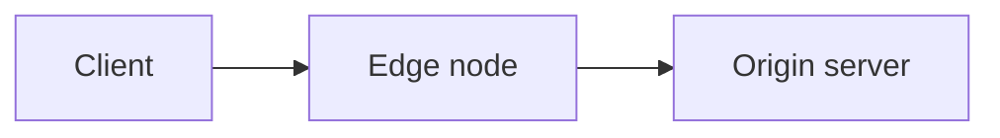

As páginas de documentação são MDX, e esta página é o vocabulário completo de componentes. Um componente ausente desta página não está disponível: um import inventado falha o build, e os componentes legados que resolvem são banidos na próxima seção, com os motivos.

## Não use estes componentes

Estes renderizam, mas não fazem parte do vocabulário deste site — legado do fork da documentação do Astro, sem manutenção, vários estilizados com variáveis de tema que este site não define mais:

`Card` · `Badge` · `FileTree` · `Checklist` · `Spoiler` · `Since` · `Button` · `TabBox` · `Breadcrumb`

Os nove compilam e emitem markup, então nada falha no build quando um deles passa. Os riscos concretos: `FileTree` injeta um bloco `<html><body>` aninhado na página; `Since` consulta o registro do npm na renderização e reporta versões do Astro; `TabBox` carrega conteúdo fixo de npm e yarn; `Card` chama um serviço externo de screenshot; `Button` duplica o `LinkButton` sem as convenções dele. Se você precisa do que um deles faria, use uma tabela, um aside ou o `LinkButton`.

## Asides

Sem import. Asides são escritos como diretivas remark, e são a construção mais comum depois dos links.

```mdx
:::note
Bucket names must be unique across all existing buckets.
:::

:::tip
**Increase limits** <br></br>
Contact [technical support](/en/documentation/services/support/) to request a higher limit for your plan.
:::

:::caution[important]
You are viewing the latest version. For accounts that are not migrated, refer to the [legacy reference](/en/documentation/products/build/edge-application/v3/).
:::
```

Tipos válidos: `note`, `tip`, `caution`, `danger`.

**`:::warning` não é válido** e não renderiza como esperado. Use `:::caution`.

O texto entre colchetes substitui o título traduzido automaticamente. Em páginas em português, localize: `:::note[nota]`, `:::tip[dica]`, `:::caution[Atenção]`.

## LinkButton

A call to action da casa.

```mdx
import LinkButton from 'azion-webkit/linkbutton'

<LinkButton severity="secondary" label="Real-Time Purge reference" link="/en/documentation/products/build/applications/real-time-purge/" />
```

Props em uso: `link`, `label`, `severity="secondary"`, `outlined`, `icon`, `iconPos`.

## Code

Wrapper sobre o expressive-code. Fornece um botão de copiar.

```mdx
import Code from '~/components/Code/Code.astro'

<Code lang="bash" code={`azion deploy --local`} />
```

Aceita apenas `code` e `lang`.

**O valor é um template literal de JavaScript.** Backticks e `${` dentro dele precisam de escape, e uma continuação de linha precisa de barra invertida dupla. Quando um snippet contém um dos dois, isso é motivo para usar `<Code>` em vez de um fence, porque você controla o escape.

Blocos com fence também são o estilo da casa. Use um fence para a saída que o leitor lê, e `<Code>` para a entrada que o leitor copia.

Tags de linguagem em uso: `bash`, `sh`, `json`, `javascript`, `js`, `typescript`, `ts`, `hcl`, `graphql`, `shell`, `text`, `plaintext`. Terraform é `hcl`, não `terraform`.

---

## Tabs e Fragment

O padrão multi-interface: uma tarefa, um painel por interface.

```mdx
import Tabs from '~/components/tabs/Tabs'
import Code from '~/components/Code/Code.astro'

<Tabs client:visible>
    <Fragment slot="tab.console">Console</Fragment>
    <Fragment slot="tab.api">API</Fragment>

<Fragment slot="panel.console">

1. Access [Azion Console](https://console.azion.com/) > **Object Storage**.
2. Select **+ Bucket**.

</Fragment>

<Fragment slot="panel.api">

<Code lang="bash" code={`curl ...`} />

</Fragment>

</Tabs>
```

- `client:visible` é obrigatório. Sem ele, as tabs renderizam e não alternam.
- Todo `tab.x` precisa de um `panel.x` correspondente.
- **Linhas em branco ao redor de markdown dentro de um Fragment são obrigatórias**, ou o markdown renderiza como um único parágrafo literal.
- O primeiro painel é o padrão; coloque o Console primeiro, a menos que exista um motivo para não fazer isso.
- Chaves canônicas: `tab.console`, `tab.api`, `tab.cli`, mais `tab.apiv3` / `tab.apiv4` para APIs versionadas.
- O `sharedStore="package-managers"` opcional sincroniza a seleção entre grupos de tabs de uma página.

## Tag

Selos de status.

```mdx
import Tag from 'primevue/tag';

<Tag severity="info" client:only="vue" value="Preview" />
```

`client:only="vue"` é obrigatório. Sem ele, o selo renderiza e não hidrata.

## Video

Sem import. Emite o iframe mais os metadados `VideoObject` do schema.org.

```mdx
<Video
  src="https://www.youtube.com/embed/BV4jRPpADw8"
  title="Local development with Azion CLI"
  description="How the CLI supports local debugging and faster workflows."
  uploadDate="2023-10-17"
/>
```

`src` precisa ser uma URL de **embed** do YouTube. `src` e `title` são obrigatórios.

## Diagramas Mermaid

Um diagrama é um fence de código `mermaid`, não uma imagem. O texto chega a um agente que busca o twin em markdown; uma referência de imagem, não.

````md

````

Nomeie cada nó e cada aresta em palavras, e nunca dependa de cor sozinha para carregar uma distinção. Um diagrama nunca fica sozinho: páginas de arquitetura e de caso de uso mantêm o fluxo de dados numerado abaixo dele.

---

## Snippets compartilhados

Blocos reutilizáveis em `~/includes/snippets/`, cada um com uma variante `en/` e uma `pt/`. Note que a pasta do português é `pt/`, não `pt-br/`.

```mdx
import Apiv4Rollout from '~/includes/snippets/apiv4Rollout/en/snippet.mdx'

<Apiv4Rollout />
```

Disponíveis: `apiv4Rollout`, `JourneyAPI`, `InterfaceNote`, `LetsEncryptExpiration`, `RulesEngineExecution`.

## SectionBasicContent

Bloco de hero, usado em páginas de vitrine de templates. Recebe `description` e um array `buttons`, com o conteúdo em um `<Fragment slot="content">`. Leia uma página de vitrine existente antes de usar.

## GuidesTable

Renderiza o hub de Guias e tutoriais como uma tabela de nome, última atualização e dificuldade. Usado na página de hub de uma seção de produto, e em nenhum outro lugar.

```mdx
import GuidesTable from '~/components/GuidesTable.astro'

<GuidesTable
  lang="en"
  prefixes={['/documentation/build/cache/guides/', '/documentation/build/cache/tutorials/']}
  exclude={['/documentation/build/cache/guides/']}
/>
```

- `prefixes` — prefixos de permalink cujas páginas preenchem a tabela. `exclude` remove a própria página de hub.
- A data vem do último commit do arquivo no git, lida no momento do build. Nunca escreva a data à mão. Um arquivo sem commit ou de um clone raso mostra um traço.
- A dificuldade vem do campo opcional `difficulty` do frontmatter: `Beginner`, `Intermediate` ou `Advanced`. O valor fica em inglês nas páginas dos dois idiomas; o componente localiza o rótulo.
- As linhas ordenam da mais recente para a mais antiga, depois por título.
- Os mesmos prefixos vão no campo `covers` da linha do menu, para que as páginas passem na verificação de posse da sidebar.

---

## GlossaryFilter

Filtro client-side sobre uma tabela de glossário. Usado na página de Glossário de um produto, e em nenhum outro lugar.

```mdx
import GlossaryFilter from '~/components/GlossaryFilter.astro'

<GlossaryFilter lang="pt-br">

| Termo | Definição |
| --- | --- |
| cache key | O identificador que um edge node monta a partir de uma requisição para decidir se duas requisições correspondem ao mesmo objeto em cache. |

</GlossaryFilter>
```

- O filho é uma tabela pipe de GFM, `| Termo | Definição |`. Linhas em branco ao redor dela são obrigatórias.
- `lang` localiza o placeholder do filtro e a mensagem de estado vazio: `en` ou `pt-br`.
- Cada linha do corpo recebe uma âncora derivada do termo, com ASCII-folding (`ação múltipla` → `#acao-multipla`), então uma definição aceita deep link. As âncoras existem sem JavaScript.
- O filtro é um aprimoramento progressivo: sem JavaScript, a tabela inteira renderiza. A correspondência ignora maiúsculas e acentos, sobre a linha inteira.

## Tabelas e quebras de linha

Tabelas são pipe tables de GFM simples. A rolagem horizontal é adicionada automaticamente; não as envolva você mesmo.

`<br />` ou `<br></br>`. **Um `<br>` sem fechamento quebra o build** — MDX exige toda tag fechada.

## Regras de MDX que quebram builds

- `<` e `{` soltos na prosa são interpretados como JSX. Escape-os ou use backticks.
- Toda tag precisa estar fechada ou ser autofechada.
- Nenhum H1 no corpo; o `title` o renderiza.
- `---` entre seções principais é o estilo da casa, cerca de três por página. Nunca imediatamente depois do bloco de frontmatter.
- Os imports vêm logo depois do bloco de frontmatter, antes de qualquer prosa.

## Recursos relacionados

- [Código](/pt-br/documentacao/guia-de-estilo/formatacao/codigo/) - quando um fence carrega saída e um bloco `<Code>` carrega entrada.
- [Formatação de texto](/pt-br/documentacao/guia-de-estilo/formatacao/texto/) - links, negrito, itálico e monospace ao redor dos componentes.
- [Escolher um tipo de conteúdo](/pt-br/documentacao/guia-de-estilo/conteudo/escolher-um-tipo-de-conteudo/) - os tipos de página que estes componentes servem.
