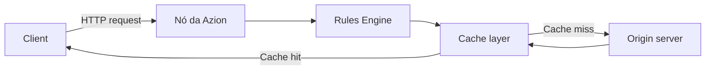

import FrameBox from '@aziontech/webkit/frame-box'
import ItemList from '@aziontech/webkit/item-list'
import DocItem from '@aziontech/webkit/doc-item'

## Propósito

Uma página de arquitetura mostra como vários produtos formam um design. O leitor quer entender o formato de uma solução antes de construí-la.

Ela aplica a forma base de **explicação**, a mesma de uma [página de conceito](/pt-br/documentacao/guia-de-estilo/conteudo/conceito/). A diferença é o assunto: uma página de conceito explica uma coisa, uma página de arquitetura explica como muitas coisas se encaixam.

## Quando usar

Escreva uma página de arquitetura quando:

- Uma solução precisa de mais de um produto, e a relação entre eles é o ponto.
- O leitor precisa ver a ordem de uma requisição ou de um dataflow para entender o design.
- Um guia fica redesenhando o mesmo sistema em texto corrido.

Não escreva uma página de arquitetura quando:

- O assunto é um produto ou uma ideia. Escreva uma [página de conceito](/pt-br/documentacao/guia-de-estilo/conteudo/conceito/).
- O leitor quer construir a coisa. Escreva um [guia multiproduto](/pt-br/documentacao/guia-de-estilo/conteudo/guias-multiproduto/) e aponte para ele daqui.
- O design não pode ser desenhado. Um design que você não consegue desenhar é um design que você ainda não entende bem o suficiente para publicar.

## Registro

Descritivo: 25 palavras por frase, voz ativa, passiva apenas quando o agente é desconhecido. Tom: explicativo, claro, sistemático. [Estrutura de frases](/pt-br/documentacao/guia-de-estilo/escrita/estrutura-de-frases/) tem as regras.

## Estrutura

O título nomeia o design como um sintagma nominal: `Content delivery on a distributed network`. O parágrafo de abertura diz qual problema o design resolve e para quem.

**Seções obrigatórias, nesta ordem**

- **`## Diagrama de arquitetura`**: o diagrama como um bloco de código `mermaid`, e depois um parágrafo que o lê.
- **`### Dataflow`**: um passo a passo numerado do que vai para onde, com no máximo seis itens.
- **`## Componentes`**: o que cada parte faz e por que está ali.
- **`## Implementação`**: links para os guias how-to, e apenas links.
- **`## Recursos relacionados`**: a seção de fechamento, uma lista de `DocItem`, cada linha com sua razão.

## Template

````mdx
import FrameBox from '@aziontech/webkit/frame-box'
import ItemList from '@aziontech/webkit/item-list'
import DocItem from '@aziontech/webkit/doc-item'

<Qual problema este design resolve, e para quem.>

## Diagrama de arquitetura

```mermaid
flowchart LR
  <o design, como texto que um agente consegue ler>
```

<Um parágrafo que lê o diagrama: o que olhar primeiro, e o que depende do quê.>

### Dataflow

1. <O que se move primeiro, e para onde vai.>
2. <O que a plataforma faz com isso.>
3. <Onde o fluxo termina.>

## Componentes

- **<Nome do componente>**: <o que faz e por que está ali>.
- **<Nome do componente>**: <o que faz e por que está ali>.

## Implementação

- [<Guia how-to que implementa este design>](<URL do guia>) - <por que o leitor o segue>.

## Recursos relacionados

<FrameBox>
<ItemList>
  <DocItem title="<Página relacionada>" href="<URL da página>"><o que o leitor encontra ali>.</DocItem>
</ItemList>
</FrameBox>
````

## Regras

- **Desenhe o diagrama em `mermaid`.** O diagrama é texto, então um agente que busca o gêmeo em markdown lê o próprio design em vez de uma referência de imagem. Não use imagem para um diagrama de arquitetura.
- **O diagrama nunca fica sozinho.** O dataflow numerado carrega o significado, e ele permanece mesmo quando o diagrama é renderizado.
- **Rotule cada nó e cada aresta com palavras**, e nunca dependa apenas de cor para carregar uma distinção.
- **Nomeie cada componente e diga por que ele está ali.** Uma lista de nomes de produto é uma lista de peças.
- **Aponte para a implementação, não a coloque aqui.** Os passos vão em um [guia multiproduto](/pt-br/documentacao/guia-de-estilo/conteudo/guias-multiproduto/).
- **Escreva só as seções que você consegue confirmar.** Uma seção obrigatória cujo conteúdo você não consegue confirmar com o time que cuida do produto fica de fora até que consiga, nunca é preenchida com um palpite.

## Exemplos

- [Implante sites Jamstack em uma rede distribuída](/pt-br/documentacao/architectures/jamstack/implantacao-aplicacoes-jamstack/): um diagrama, um dataflow numerado, os componentes envolvidos e links para a implementação.

Este trecho, de uma página em inglês, mostra a abertura, a seção do diagrama e o dataflow:

````mdx
This design delivers a site's content from locations close to users. It reduces latency and the load on the origin infrastructure. Use it when your team delivers static-heavy sites and applications.

## Architecture diagram



O diagrama mostra o caminho de uma requisição e de sua resposta em uma aplicação na rede distribuída da Azion. A requisição do cliente chega a um node na rede distribuída da Azion, onde Rules Engine e a camada de cache a processam. O conteúdo que não está em cache vem do servidor de origem, e a resposta retorna ao cliente pelo mesmo node.

### Dataflow

A request moves through the design in this order:

1. Um cliente envia uma requisição HTTP ou HTTPS para um domínio associado a uma aplicação.
2. No node da Azion, Rules Engine processa a requisição. Ele aplica políticas de cache e comportamentos de otimização de imagem na fase de request.
3. A camada de cache avalia a requisição. Em uma correspondência de cache key, o node entrega o objeto a partir do cache.
4. Em um cache miss, o node encaminha a requisição ao servidor de origem. A origem responde, e o node armazena o conteúdo em cache.
5. Antes de a resposta retornar ao cliente, Rules Engine processa as políticas da fase de response. O node então entrega o conteúdo ao usuário.
````

## Relacionados

<FrameBox>
<ItemList>
  <DocItem title="Páginas de conceito" href="/pt-br/documentacao/guia-de-estilo/conteudo/conceito/">A mesma forma base, para uma ideia em vez de um sistema.</DocItem>
  <DocItem title="Guias multiproduto" href="/pt-br/documentacao/guia-de-estilo/conteudo/guias-multiproduto/">A página que constrói o que esta descreve.</DocItem>
  <DocItem title="Imagens" href="/pt-br/documentacao/guia-de-estilo/formatacao/imagens/">Texto alternativo e caminhos de assets.</DocItem>
  <DocItem title="Escolher um tipo de conteúdo" href="/pt-br/documentacao/guia-de-estilo/conteudo/escolher-um-tipo-de-conteudo/">O catálogo completo de tipos de página.</DocItem>
</ItemList>
</FrameBox>
