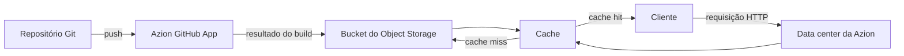

import FrameBox from '@aziontech/webkit/frame-box'
import ItemList from '@aziontech/webkit/item-list'
import DocItem from '@aziontech/webkit/doc-item'

## Propósito

Uma página de arquitetura mostra uma arquitetura de referência do catálogo de casos de uso: como produtos e recursos da plataforma se combinam em um design. O leitor quer entender o formato do design antes de construí-lo.

Ela aplica a forma base de **explicação**, a mesma de uma [página de conceito](/pt-br/documentacao/guia-de-estilo/conteudo/conceito/). A diferença é o assunto: uma página de conceito explica uma coisa, uma página de arquitetura explica como muitas coisas se encaixam.

## Quando usar

Escreva uma página de arquitetura quando:

- Um design precisa de mais de um produto ou recurso da plataforma, e a relação entre eles é o ponto.
- O leitor precisa ver a ordem de uma requisição ou de um dataflow para entender o design.
- Um guia fica redesenhando o mesmo sistema em texto corrido.

Não escreva uma página de arquitetura quando:

- O assunto é um produto ou uma ideia. Escreva uma [página de conceito](/pt-br/documentacao/guia-de-estilo/conteudo/conceito/).
- O leitor quer construir a coisa. Escreva a [página de caso de uso](/pt-br/documentacao/guia-de-estilo/conteudo/casos-de-uso/) que a constrói, ou um [guia multiproduto](/pt-br/documentacao/guia-de-estilo/conteudo/guias-multiproduto/), e aponte para ela daqui.
- O catálogo não tem entrada para o design. Proponha o design ao catálogo de casos de uso primeiro; a página vem depois da entrada.
- O design não pode ser desenhado. Um design que você não consegue desenhar é um design que você ainda não entende bem o suficiente para publicar.

## Registro

Descritivo: 25 palavras por frase, voz ativa, passiva apenas quando o agente é desconhecido. Tom: explicativo, claro, sistemático. [Estrutura de frases](/pt-br/documentacao/guia-de-estilo/escrita/estrutura-de-frases/) tem as regras.

## Estrutura

O título é o nome da arquitetura de referência no catálogo, sem alteração, traduzido na página em português. Esse nome é um sintagma nominal que nomeia o sistema construído, como `Server-rendered headless CMS website`, nunca com o sufixo *Reference Architecture*. O parágrafo de abertura é o Resumo da entrada: qual problema o design resolve, e para quem. Ele nomeia o caso de uso que o design implementa, com link para a página de caso de uso quando ela existe.

**Seções obrigatórias, nesta ordem**

- **`## Diagrama de arquitetura`**: o diagrama como um bloco de código `mermaid`, e depois um parágrafo que o lê.
- **`### Dataflow`**: um passo a passo numerado do que vai para onde, com no máximo seis itens.
- **`## Componentes`**: uma entrada por componente da entrada do catálogo, com o seu papel. Produtos entram pelo nome, recursos da plataforma em minúscula como instâncias, e features e integrações rotuladas como o catálogo as rotula.
- **`## Implementação`**: apenas links. A página de caso de uso entra aqui quando ela constrói este design, seguida dos guias e templates do Marketplace que implementam todo o design ou parte dele. Uma página de caso de uso que constrói um design irmão recebe o link no parágrafo de abertura, como o caso de uso que a arquitetura implementa, e não aqui.
- **`## Recursos relacionados`**: a seção de fechamento, uma lista de `DocItem`, cada linha com sua razão.

## Template

````mdx
import FrameBox from '@aziontech/webkit/frame-box'
import ItemList from '@aziontech/webkit/item-list'
import DocItem from '@aziontech/webkit/doc-item'

<O Resumo da entrada: qual problema este design resolve, para quem, e qual caso de uso ele implementa.>

## Diagrama de arquitetura

```mermaid
flowchart LR
  <o design, como texto que um agente consegue ler>
```

<Um parágrafo que lê o diagrama: o que olhar primeiro, e o que depende do quê.>

### Dataflow

1. <O que se move primeiro, e para onde vai.>
2. <O que a plataforma faz com isso.>
3. <Onde o fluxo termina.>

## Componentes

- **<Nome do componente>**: <o que faz e por que está ali>.
- **<Nome do componente>**: <o que faz e por que está ali>.

## Implementação

- [<Página de caso de uso, só quando ela constrói este design>](<URL da página>) - <por que o leitor a segue>.
- [<Guia ou template que implementa parte do design>](<URL>) - <qual parte ele implementa>.

## Recursos relacionados

<FrameBox>
<ItemList>
  <DocItem title="<Página relacionada>" href="<URL da página>"><o que o leitor encontra ali>.</DocItem>
</ItemList>
</FrameBox>
````

## Regras

- **Desenhe o diagrama em `mermaid`.** O diagrama é texto, então um agente que busca o gêmeo em markdown lê o próprio design em vez de uma referência de imagem. Não use imagem para um diagrama de arquitetura.
- **O diagrama nunca fica sozinho.** O dataflow numerado carrega o significado, e ele permanece mesmo quando o diagrama é renderizado.
- **Rotule cada nó e cada aresta com palavras**, e nunca dependa apenas de cor para carregar uma distinção.
- **Nomeie cada componente e diga por que ele está ali.** Uma lista de nomes de produto é uma lista de peças.
- **Aponte para a implementação, não a coloque aqui.** Os passos vão na [página de caso de uso](/pt-br/documentacao/guia-de-estilo/conteudo/casos-de-uso/) ou em um [guia multiproduto](/pt-br/documentacao/guia-de-estilo/conteudo/guias-multiproduto/).
- **Escreva só as seções que você consegue confirmar.** Uma seção obrigatória cujo conteúdo você não consegue confirmar com o time que cuida do produto fica de fora até que consiga, nunca é preenchida com um palpite.
- **Informe o permalink quando a página é publicada**, para que o campo Docs da entrada do catálogo passe a Published.

## Exemplos

- [Implante sites Jamstack](/pt-br/documentacao/casos-de-uso/construir-e-executar-aplicacoes/implantacao-aplicacoes-jamstack/): a página publicada que o catálogo liga a *Git-driven static website*. Ela traz um diagrama, um dataflow numerado, os componentes envolvidos e links para a implementação.

Este trecho mostra a abertura, a seção do diagrama e o dataflow da página *Git-driven static website*. O catálogo registra essa arquitetura de referência sob o caso de uso *Build and run marketing websites*. Nenhuma página de caso de uso foi publicada ainda, então o caso de uso é nomeado sem link:

````mdx
Um site estático cujas páginas e conteúdo vivem em um repositório Git. O Azion GitHub App constrói o site a cada push e envia o resultado para o Object Storage. Uma aplicação entrega esse resultado pelo Cache, e um build anterior pode ser reimplantado para reverter. Este design implementa o caso de uso *Build and run marketing websites*.

## Diagrama de arquitetura


```mermaid
flowchart LR
  Repo[Repositório Git] -->|push| App[Azion GitHub App]
  App -->|resultado do build| Bucket[Bucket do Object Storage]
  Client[Cliente] -->|requisição HTTP| DC[Data center da Azion]
  DC --> Cache[Cache]
  Cache -->|cache hit| Client
  Cache -->|cache miss| Bucket
  Bucket --> Cache
```

O diagrama carrega dois fluxos. O fluxo de publicação vai do repositório, pelo GitHub App, até o bucket, e só se move em um push. O fluxo de requisição vai do cliente a um data center na infraestrutura distribuída da Azion. Ali, o Cache responde com a sua cópia ou lê o arquivo no bucket.

### Dataflow

O conteúdo percorre o design nesta ordem:

1. Um push no repositório aciona o Azion GitHub App, que constrói o site.
2. O GitHub App envia o resultado do build para o bucket do Object Storage.
3. Um cliente envia uma requisição HTTP ou HTTPS ao domínio da aplicação que entrega o bucket.
4. No data center, o Cache responde à requisição com a sua cópia do arquivo quando a tem.
5. Em um cache miss, a aplicação lê o arquivo no bucket, e o Cache o guarda para a próxima requisição.
````

## Relacionados

<FrameBox>
<ItemList>
  <DocItem title="Páginas de conceito" href="/pt-br/documentacao/guia-de-estilo/conteudo/conceito/">A mesma forma base, para uma ideia em vez de um sistema.</DocItem>
  <DocItem title="Guias multiproduto" href="/pt-br/documentacao/guia-de-estilo/conteudo/guias-multiproduto/">A página que constrói o que esta descreve.</DocItem>
  <DocItem title="Imagens" href="/pt-br/documentacao/guia-de-estilo/formatacao/imagens/">Texto alternativo e caminhos de assets.</DocItem>
  <DocItem title="Escolher um tipo de conteúdo" href="/pt-br/documentacao/guia-de-estilo/conteudo/escolher-um-tipo-de-conteudo/">O catálogo completo de tipos de página.</DocItem>
</ItemList>
</FrameBox>
