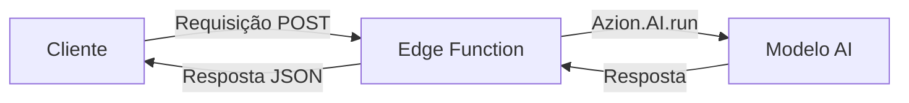

import LinkButton from 'azion-webkit/linkbutton';

Construa agentes de AI que pensam, respondem e agem. Os agentes rodam na rede global de edge da Azion, fornecendo respostas com baixa latência e escalabilidade seamless.

**O que você vai construir:** Um agente de AI conversacional que responde perguntas e mantém contexto.

**Tempo:** ~5 minutos

---

## Criar um novo projeto

<LinkButton
    label="Implantar Starter Kit"
    link="https://console.azion.com/create/azion/starter-kit-edge-ai"
    icon="ai ai-azion"  
    icon-pos="left"
/>

1. Acesse o [Console da Azion](https://console.azion.com/).
2. Clique em **+ Create**.
3. Digite um nome para sua aplicação, como `meu-primeiro-agente`.
4. Clique em **Deploy**.

Isso cria um projeto com:

- Uma **Edge Application** configurada para workloads de AI
- Uma **Function** com integração de AI Inference pré-configurada
- Código de exemplo para começar

---

## Seu primeiro agente

Após a implantação, navegue até sua função e substitua o código por este agente simples:

```javascript
async function handleRequest(request) {
  // Verifica se a requisição é POST e tem corpo JSON
  if (request.method !== "POST" || request.headers.get("content-type") !== "application/json") {
    return new Response(JSON.stringify({
      error: "A requisição deve ser POST com corpo JSON",
    }), {
      status: 400,
      headers: { "Content-Type": "application/json" },
    });
  }

  let input;
  try {
    input = await request.json();
  } catch (err) {
    return new Response(JSON.stringify({
      error: "JSON inválido no corpo da requisição",
    }), {
      status: 400,
      headers: { "Content-Type": "application/json" },
    });
  }

  // Verifica se o campo "model" está presente
  if (!input.hasOwnProperty("model")) {
    return new Response(JSON.stringify({
      error: "Campo 'model' obrigatório não encontrado",
    }), {
      status: 400,
      headers: { "Content-Type": "application/json" },
    });
  }

  const model = input["model"];

  try {
    const response = await Azion.AI.run(model, input);

    if (input.stream) {
      const { readable, writable } = new TransformStream();
      const writer = writable.getWriter();
      const encoder = new TextEncoder();
      
      (async () => {
        for await (const chunk of response) {
          await writer.write(encoder.encode(`data: ${JSON.stringify(chunk)}n`));
        }
        await writer.write(encoder.encode("data: [DONE]n"));
        await writer.close();
      })();

      return new Response(readable, {
        headers: { "Content-Type": "text/event-stream" },
      });
    } else {
      return new Response(JSON.stringify(response), {
        headers: { "Content-Type": "application/json" },
      });
    }
  } catch (e) {
    console.error(`${e.name}: ${e.message}`);

    if (e.message.includes("validation error")) {
      return new Response(JSON.stringify({
        error: `Entrada inválida para ${model}`,
      }), {
        status: 400,
        headers: { "Content-Type": "application/json" },
      });
    }

    if (e.message.includes("model not found")) {
      return new Response(JSON.stringify({
        error: `${model} não encontrado ou não permitido`,
      }), {
        status: 400,
        headers: { "Content-Type": "application/json" },
      });
    }

    return new Response(JSON.stringify({
      error: "Erro interno de AI",
    }), {
      status: 500,
      headers: { "Content-Type": "application/json" },
    });
  }
}

addEventListener("fetch", (event) => {
  event.respondWith(handleRequest(event.request));
});
```

---

## Testar seu agente

Envie uma requisição POST para o endpoint da sua função:

```bash
curl -X POST https://url-da-sua-funcao.azion.net -H "Content-Type: application/json" -d '{"model":"casperhansen/mistral-small-24b-instruct-2501-awq","messages":[{"role":"user","content":"O que é computação de borda?"}]}'
```

Resposta esperada:

```json
{
  "id": "chatcmpl-123",
  "object": "chat.completion",
  "created": 1677652288,
  "model": "Qwen/Qwen3-30B-A3B-Instruct-2507-FP8",
  "choices": [{
    "index": 0,
    "message": {
      "role": "assistant",
      "content": "Computação de borda processa dados mais próximo de sua origem, reduzindo latência e uso de banda ao trazer computação perto dos usuários finais ou dispositivos."
    },
    "finish_reason": "stop"
  }],
  "usage": {
    "prompt_tokens": 22,
    "completion_tokens": 24,
    "total_tokens": 46
  }
}
```

---

## Adicionar memória de conversação

Para manter contexto entre mensagens, você precisa gerenciar o histórico de conversação. Como as edge functions são stateless, você tem duas opções:

### Opção 1: Passar histórico no corpo da requisição

```javascript
async function handler(event) {
  const body = JSON.parse(event.request.body || '{}');
  const userMessage = body.message || 'Olá!';
  const conversationHistory = body.history || [];

  // Adiciona mensagem do usuário ao histórico
  conversationHistory.push({
    role: "user",
    content: userMessage
  });

  const modelResponse = await Azion.AI.run("Qwen/Qwen3-30B-A3B-Instruct-2507-FP8", {
    "stream": false,
    "messages": [
      {
        "role": "system",
        "content": "Você é um assistente de AI útil. Seja conciso e amigável."
      },
      ...conversationHistory
    ],
    "max_tokens": 500
  });

  const assistantMessage = modelResponse.choices[0].message.content;

  // Adiciona resposta do assistente ao histórico
  conversationHistory.push({
    role: "assistant",
    content: assistantMessage
  });

  return new Response(JSON.stringify({
    response: assistantMessage,
    history: conversationHistory
  }), {
    headers: { "Content-Type": "application/json" }
  });
}

addEventListener("fetch", handler);
```

### Opção 2: Usar KV Store para sessões persistentes

Para histórico de conversação persistente entre requisições, use [KV Store](/pt-br/documentacao/produtos/store/kv-database/) para armazenar dados de sessão com um ID de sessão único.

---

## O que acabou de acontecer?

Quando você enviou uma mensagem:

1. **Requisição** chegou na sua edge function
2. **Function** chamou `Azion.AI.run()` com sua mensagem
3. **Modelo** processou a requisição no edge
4. **Resposta** retornou ao cliente com latência mínima



### Conceitos-chave

| Conceito | O que significa |
|----------|----------------|
| **Execução no edge** | Código roda na rede distribuída da Azion, perto dos usuários |
| **Azion.AI.run()** | Método SDK para invocar modelos de AI |
| **Seleção de modelo** | Escolha entre modelos disponíveis baseado no seu caso de uso |
| **Streaming** | Habilite respostas em tempo real com `stream: true` |

---

## Adicionar chamada de ferramentas

Habilite seu agente a chamar funções externas:

```javascript
async function handler(event) {
  const body = JSON.parse(event.request.body || '{}');
  const userMessage = body.message;

  const tools = [
    {
      "type": "function",
      "function": {
        "name": "get_weather",
        "description": "Obter clima atual para um local",
        "parameters": {
          "type": "object",
          "properties": {
            "location": {
              "type": "string",
              "description": "Nome da cidade"
            }
          },
          "required": ["location"]
        }
      }
    }
  ];

  const modelResponse = await Azion.AI.run("Qwen/Qwen3-30B-A3B-Instruct-2507-FP8", {
    "stream": false,
    "messages": [
      {
        "role": "system",
        "content": "Você é um assistente útil com acesso a ferramentas."
      },
      {
        "role": "user",
        "content": userMessage
      }
    ],
    "tools": tools
  });

  // Verifica se o modelo quer chamar uma ferramenta
  if (modelResponse.choices[0].message.tool_calls) {
    const toolCall = modelResponse.choices[0].message.tool_calls[0];
    const args = JSON.parse(toolCall.function.arguments);
    
    // Executa a ferramenta (você implementaria isso)
    const weatherData = await getWeather(args.location);
    
    return new Response(JSON.stringify({
      tool: toolCall.function.name,
      location: args.location,
      weather: weatherData
    }), {
      headers: { "Content-Type": "application/json" }
    });
  }

  return new Response(JSON.stringify({
    response: modelResponse.choices[0].message.content
  }), {
    headers: { "Content-Type": "application/json" }
  });
}

async function getWeather(location) {
  // Implemente sua chamada de API de clima aqui
  return { location, temperature: "22°C", condition: "Ensolarado" };
}

addEventListener("fetch", handler);
```

---

## Solução de problemas

### Erro "Model not found"

Verifique:
1. O nome do modelo corresponde exatamente (case-sensitive)
2. Consulte os [modelos disponíveis](/pt-br/documentacao/produtos/ai/ai-inference/modelos/) para nomes corretos

### Alta latência

Tente estas soluções:
1. Habilite streaming: `"stream": true`
2. Reduza `max_tokens` para respostas mais curtas
3. Escolha um modelo menor para inferência mais rápida

### Erros de rate limit

Verifique os limites padrão:
- **300 requisições por minuto**

Contate o suporte para aumentar limites em produção.

### Timeout na função

Se sua função atinge timeout:
1. Reduza `max_tokens`
2. Simplifique seu prompt
3. Considere dividir tarefas complexas em etapas menores

---

## Próximos passos

Agora que você tem um agente funcionando, explore:

| Aprenda a | Consulte |
|-----------|----------|
| Usar diferentes modelos | [Modelos disponíveis](/pt-br/documentacao/produtos/ai/ai-inference/modelos/) |
| Implementar tool calling | [Exemplo de tool calling](/pt-br/documentacao/produtos/ai/ai-inference/modelos/mistral-3-small/#exemplo-de-tool-calling) |
| Construir aplicações RAG | [Vector Search](/pt-br/documentacao/produtos/store/sql-database/vector-search/) |
| Implantar com templates | [AI Inference Starter Kit](/pt-br/documentacao/produtos/guias/ai-inference-starter-kit/) |
