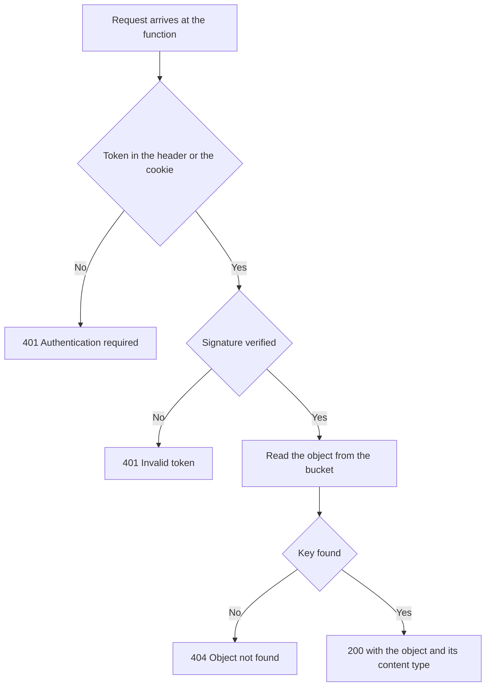

import DocCardGroup from '@aziontech/webkit/doc-card-group'
import DocCard from '@aziontech/webkit/doc-card'
import DocSteps from '@aziontech/webkit/doc-steps'
import DocStep from '@aziontech/webkit/doc-step'

Você pode colocar uma função na frente de um bucket do [Object Storage](/pt-br/documentacao/store/object-storage/), para que a função valide um JSON Web Token antes que qualquer objeto saia do bucket.

Uma requisição que carrega um token válido recebe o objeto com o seu content type. Toda outra requisição recebe HTTP `401` e o bucket nunca é lido. Um bucket que não precisa de token é servido por um connector e por uma regra do Rules Engine, o que [Use um bucket como origem de uma aplicação](/pt-br/documentacao/guias/desenvolvimento-de-aplicacoes/dados/bucket-como-connector/) cobre.

---

## Pré-requisitos

- Uma [conta Azion](https://console.azion.com/).
- A [Azion CLI](/pt-br/documentacao/devtools/cli/) instalada e autorizada.
- Node.js versão 18 ou superior.
- Um bucket que guarda os objetos a proteger, com **Workloads Access** definido como _Read Only_ ou _Read & Write_. Um bucket definido como _Restricted_ não é lido por Azion Runtime, então a função não alcança nada nele. Consulte [Criar um bucket](/pt-br/documentacao/guias/desenvolvimento-de-aplicacoes/dados/criar-e-modificar-um-bucket/).
- Um secret de assinatura para os tokens que a sua aplicação emite.

---

## Como a verificação funciona

A função responde às requisições que uma regra roteia para ela. Ela lê o token do header `Authorization` ou do cookie `auth_token`, verifica a assinatura contra o secret compartilhado e chama Object Storage somente depois que a assinatura confere. Um bucket também é alcançável pelo endpoint S3 e por um connector, e nenhum desses caminhos pede um token; a função protege o caminho em que ela está.

O fluxo abaixo mostra as duas recusas e a única rota que alcança o bucket:



---

## Crie o projeto da função

A Azion CLI cria a estrutura do projeto e o `npm` adiciona a biblioteca que verifica o token. Para configurar o projeto:

<DocSteps>
  <DocStep title="Inicialize o projeto">

  ```bash
  azion init my-auth-storage
  ```

  Nos prompts, defina **Template** como _JavaScript_ e **Runtime** como _Azion Runtime_. A Azion CLI escreve o projeto em uma pasta `my-auth-storage`.

  </DocStep>
  <DocStep title="Vá para a pasta do projeto">

  ```bash
  cd my-auth-storage
  ```

  </DocStep>
  <DocStep title="Instale a biblioteca de tokens">

  ```bash
  npm install jose
  ```

  A biblioteca `jose` verifica JSON Web Tokens em runtimes JavaScript. O `npm` a adiciona ao `package.json`.

  </DocStep>
</DocSteps>

A pasta do projeto guarda o código do template e a dependência `jose`.

---

## Escreva o handler

Abra o arquivo JavaScript principal do projeto e substitua o conteúdo dele por este handler:

```javascript
import Storage from "azion:storage";
import { jwtVerify } from "jose";

async function verifyToken(token) {
  try {
    const secretKey = new TextEncoder().encode(Azion.env.get("JWT_SECRET"));
    const { payload } = await jwtVerify(token, secretKey);
    return { valid: true, payload };
  } catch (error) {
    console.error("JWT verification failed:", error.message);
    return { valid: false, error: error.message };
  }
}

function extractToken(request) {
  // The Authorization header comes first.
  const authHeader = request.headers.get("Authorization");
  if (authHeader && authHeader.startsWith("Bearer ")) {
    return authHeader.substring(7);
  }

  // The cookie is the fallback.
  const cookieHeader = request.headers.get("Cookie");
  if (cookieHeader) {
    const cookies = cookieHeader.split(";").map(c => c.trim());
    const authCookie = cookies.find(c => c.startsWith("auth_token="));
    if (authCookie) {
      return authCookie.substring(11);
    }
  }

  return null;
}

async function handleRequest(event) {
  const request = event.request;
  const url = new URL(request.url);

  // /files/image.png reaches the bucket as the key image.png
  const objectKey = url.pathname.replace(/^\/files\//, "");

  if (!objectKey) {
    return new Response(JSON.stringify({ error: "Object key required" }), {
      status: 400,
      headers: { "Content-Type": "application/json" }
    });
  }

  const token = extractToken(request);

  if (!token) {
    return new Response(JSON.stringify({
      error: "Authentication required",
      message: "Provide a valid JWT token in Authorization header or auth_token cookie"
    }), {
      status: 401,
      headers: {
        "Content-Type": "application/json",
        "WWW-Authenticate": "Bearer"
      }
    });
  }

  const verification = await verifyToken(token);

  if (!verification.valid) {
    return new Response(JSON.stringify({
      error: "Invalid token",
      message: verification.error
    }), {
      status: 401,
      headers: { "Content-Type": "application/json" }
    });
  }

  try {
    const storage = new Storage(Azion.env.get("BUCKET_NAME"));
    const storageObject = await storage.get(objectKey);

    return new Response(storageObject.content, {
      status: 200,
      headers: {
        "Content-Type": storageObject.contentType || "application/octet-stream",
        "Content-Length": String(storageObject.contentLength ?? ""),
        "Cache-Control": "private, max-age=3600"
      }
    });
  } catch (error) {
    console.error("Storage error:", error);

    if (error.message && error.message.includes("not found")) {
      return new Response(JSON.stringify({
        error: "Object not found"
      }), {
        status: 404,
        headers: { "Content-Type": "application/json" }
      });
    }

    return new Response(JSON.stringify({
      error: "Internal server error"
    }), {
      status: 500,
      headers: { "Content-Type": "application/json" }
    });
  }
}

addEventListener("fetch", (event) => {
  event.respondWith(handleRequest(event));
});
```

Seis decisões estão no código:

- A key do objeto é o caminho da requisição com `/files/` removido, então `/files/image.png` lê a key `image.png`. Uma requisição que deixa a key vazia retorna `400` com o corpo `{"error": "Object key required"}`.
- Uma requisição sem token retorna `401`, carrega o header `WWW-Authenticate: Bearer` e nomeia os dois lugares aceitos no seu campo `message`.
- Um token que o secret não verifica retorna `401` com o corpo `{"error": "Invalid token"}` e a mensagem que `jose` levantou.
- Um token verificado lê o objeto e o retorna com o content type que Object Storage armazenou, ou `application/octet-stream` quando o objeto não carrega nenhum. `Cache-Control: private, max-age=3600` mantém a resposta fora de um cache compartilhado.
- Uma key que não está no bucket retorna `404` com o corpo `{"error": "Object not found"}`. Toda outra falha de armazenamento retorna `500`.
- `console.error` escreve `JWT verification failed:` e `Storage error:`, e as duas linhas chegam aos logs da função.

O handler lê `JWT_SECRET` e `BUCKET_NAME` com `Azion.env.get`, então nenhum dos dois valores é escrito no código.

---

## Configure as variáveis de ambiente

Crie um arquivo `.env` na raiz do projeto, com o bucket que o handler lê e o secret contra o qual ele verifica:

```text
BUCKET_NAME=your-bucket-name
JWT_SECRET=your-secret
```

:::caution[Atenção]
Nunca faça commit do arquivo `.env` nem de um secret como `JWT_SECRET` no seu repositório de código. Adicione `.env` ao seu `.gitignore`.
:::

---

## Configure o storage local para desenvolvimento

Azion Runtime responde a uma chamada local ao Object Storage a partir de uma pasta na sua máquina. Adicione um bloco `storage` ao `azion.config` para que `storage.get` resolva enquanto você desenvolve:

```javascript
storage: [
  {
    name: 'your-bucket-name',
    prefix: 'your-bucket-prefix',
    dir: './path/to/storage/files',
    workloadsAccess: 'read_only',
  },
],
```

Substitua `your-bucket-name`, `your-bucket-prefix` e `./path/to/storage/files` pelos valores do seu projeto. `workloadsAccess` é a grafia em camelCase que o arquivo de configuração usa para o nível de acesso do bucket, e `read_only` é suficiente para um handler que apenas lê.

---

## Faça o deploy da função

O deploy envia o código e `azion sync` envia os valores que o código lê. Para colocar os dois na sua conta:

<DocSteps>
  <DocStep title="Faça o deploy do projeto">

  ```bash
  azion deploy
  ```

  A Azion CLI faz o build do projeto e envia a função para a sua conta.

  </DocStep>
  <DocStep title="Envie as variáveis de ambiente">

  ```bash
  azion sync
  ```

  O handler lê `BUCKET_NAME` e `JWT_SECRET` em tempo de execução. Sem este passo, as variáveis existem apenas no seu arquivo `.env` e a função não as encontra.

  </DocStep>
</DocSteps>

A função roda na sua conta com o nome do bucket e o secret de assinatura de que ela precisa.

---

## Verifique a configuração

Assine um token com o mesmo secret, depois requisite um objeto três vezes: com o header, com o cookie e sem nenhum dos dois. Para verificar a função:

<DocSteps>
  <DocStep title="Assine um token de teste">

  Salve o script como `sign-token.mjs` na pasta do projeto, para que o Node.js o leia como um módulo, e rode com `node sign-token.mjs`:

  ```javascript
  import { SignJWT } from 'jose';

  const secret = new TextEncoder().encode('your-secret-key');

  const token = await new SignJWT({
    sub: 'user123',
    permissions: ['read:files']
  })
    .setProtectedHeader({ alg: 'HS256' })
    .setIssuedAt()
    .setExpirationTime('2h')
    .sign(secret);

  console.log(token);
  ```

  O script imprime o token assinado. Defina `secret` com o valor que você armazenou em `JWT_SECRET`, ou a função recusa todo token que o script emite.

  </DocStep>
  <DocStep title="Requisite um objeto com o header Authorization">

  ```bash
  curl -H "Authorization: Bearer YOUR_JWT_TOKEN" \
    https://your-domain.com/files/document.pdf
  ```

  A resposta carrega o objeto e o content type que Object Storage armazenou para ele.

  </DocStep>
  <DocStep title="Requisite o mesmo objeto com o cookie">

  ```bash
  curl -b "auth_token=YOUR_JWT_TOKEN" \
    https://your-domain.com/files/document.pdf
  ```

  A resposta é a mesma, o que confirma o fallback do cookie.

  </DocStep>
  <DocStep title="Requisite o objeto sem token">

  ```bash
  curl https://your-domain.com/files/document.pdf
  ```

  A função recusa a requisição com HTTP `401`:

  ```json
  {
    "error": "Authentication required",
    "message": "Provide a valid JWT token in Authorization header or auth_token cookie"
  }
  ```

  </DocStep>
</DocSteps>

Um token assinado retorna o objeto, e um token ausente ou não verificável retorna `401` sem alcançar o bucket.

---

## Próximos passos

<DocCardGroup cols={2}>
  <DocCard title="Criar um bucket" href="/pt-br/documentacao/guias/desenvolvimento-de-aplicacoes/dados/criar-e-modificar-um-bucket/" label="Crie o bucket que esta função lê e defina o seu nível de acesso." />
  <DocCard title="Use um bucket como origem de uma aplicação" href="/pt-br/documentacao/guias/desenvolvimento-de-aplicacoes/dados/bucket-como-connector/" label="Sirva um bucket por um connector e uma regra quando os objetos não precisam de token." />
  <DocCard title="API de runtime do Storage" href="/pt-br/documentacao/devtools/runtime/api-reference/storage/" label="Todos os métodos e campos do módulo azion:storage que o handler chama." />
  <DocCard title="Functions" href="/pt-br/documentacao/build/functions/" label="Como uma função é construída, implantada e roteada na Azion Platform." />
</DocCardGroup>
