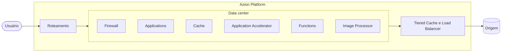

import UseCaseList from '~/components/webkit/UseCaseList.vue'
import FrameBox from '@aziontech/webkit/frame-box'
import ItemList from '@aziontech/webkit/item-list'
import DocItem from '@aziontech/webkit/doc-item'

Uma requisição para a sua aplicação não viaja até um servidor que você opera. Ela chega ao data center da infraestrutura distribuída da Azion com a melhor rota até ele, e a configuração que você salvou decide o que acontece em seguida: se a requisição é bloqueada, respondida do cache, tratada pelo seu código ou encaminhada para a sua origem. **Azion Platform** é a tecnologia integrada e o conjunto de interfaces onde essa configuração vive, e onde você constrói, protege e escala aplicações, o que inclui operá-las e monitorá-las.

A Azion inclui entrega de conteúdo e cache, mas é mais ampla que uma CDN. A mesma infraestrutura executa código de aplicação sem servidor para provisionar, filtra o tráfego que chega às suas aplicações e APIs, armazena os dados que elas leem e reporta cada requisição em tempo real. Esta página cobre onde a plataforma roda, o caminho que uma requisição percorre, o que você habilita em cada recurso desse caminho e as interfaces pelas quais você a gerencia.

---

## Infraestrutura distribuída

A Azion executa a sua configuração em data centers espalhados pelo mundo, e cada requisição é servida pelo data center com a melhor rota até ela. A rota é escolhida por latência, condições de rede e carga no momento em que a requisição chega, então dois usuários em países diferentes que pedem a mesma página são atendidos perto de onde estão, a partir da mesma configuração. Computação e dados ficam perto do usuário, o que reduz a latência e melhora a confiabilidade. Os deploys são rápidos, as funções rodam sem cold start e a visibilidade do tráfego é em tempo real. Para a lista de data centers, consulte [Our Network](https://www.azion.com/pt-br/produtos/our-network/).

## Caminho da requisição

O diagrama mostra o caminho de uma requisição, do usuário até a sua origem e de volta. Dentro da Azion Platform, a requisição é roteada para um data center, onde os recursos que você configurou são executados, e o conteúdo que o data center não consegue responder é buscado pela camada de entrega:

As requisições vão da esquerda para a direita. As respostas voltam pelo mesmo caminho.

1. A requisição do usuário chega à Azion. A Azion seleciona a melhor rota e encaminha a requisição para o data center mais próximo, com base em latência, condições de rede e carga.
2. Nesse data center, a Azion aplica a sua configuração e lógica: o workload dono do domínio, as políticas de segurança do seu firewall, o comportamento de cache e as regras da sua aplicação, e o código das funções que eles executam.
3. Quando o cache não consegue responder à requisição, a aplicação busca o conteúdo na sua origem através do seu connector. O [Tiered Cache](/pt-br/documentacao/plataforma/applications/cache/) acrescenta uma segunda camada de cache entre os data centers e a sua origem, e o [Load Balancer](/pt-br/documentacao/plataforma/connectors/load-balancer/) distribui a busca entre vários endereços.
4. A resposta é entregue ao usuário, e a requisição aparece nas suas métricas, eventos e streams.

Os recursos nesse caminho se vinculam uns aos outros: um workload vincula um firewall, uma aplicação e um conjunto de custom pages, e a aplicação busca o conteúdo por um connector. Para o diagrama interativo e a que cada recurso se anexa, consulte [Topologia dos Recursos de Plataforma](/pt-br/documentacao/fundamentos/#topologia-dos-recursos-de-plataforma).

---

## Recursos de plataforma no caminho da requisição

Tudo o que você habilita ou cria vive nos recursos do caminho da requisição. Parte disso é habilitada em um recurso que você já tem, como um rule set aplicado ao firewall ou um interruptor na aplicação; o restante são recursos que você cria por conta própria, como um bucket ou uma zona de DNS. A tabela lista cada item pelo recurso ao qual se anexa, com um link para a sua referência:

| Recurso | O que você habilita ou cria nele | Referência |
| --- | --- | --- |
| Workload | O certificado TLS vinculado ao workload e a mitigação de DDoS, que se aplica a todo workload sem nada a habilitar. | [Certificate Manager](/pt-br/documentacao/plataforma/workloads/certificate-manager/), [DDoS Protection](/pt-br/documentacao/plataforma/workloads/ddos-protection/) |
| Firewall | Um rule set de WAF aplicado ao firewall, uma instância do Bot Manager executada nele e as network lists que suas regras referenciam. | [WAF](/pt-br/documentacao/plataforma/firewall/waf/), [Bot Manager](/pt-br/documentacao/plataforma/firewall/bot-manager/), [Network Shield](/pt-br/documentacao/plataforma/firewall/network-shield/) |
| Aplicação | As configurações de cache, os interruptores de Application Accelerator e Image Processor, as funções instanciadas na aplicação e o conjunto de custom pages atribuído a ela. | [Cache](/pt-br/documentacao/plataforma/applications/cache/), [Application Accelerator](/pt-br/documentacao/plataforma/applications/application-accelerator/), [Image Processor](/pt-br/documentacao/plataforma/applications/image-processor/), [Custom Pages](/pt-br/documentacao/plataforma/workloads/custom-pages/) |
| Connector | O balanceamento entre vários endereços e o Origin Shield, que permite que só os ranges de IP da Azion alcancem a origem. | [Load Balancer](/pt-br/documentacao/plataforma/connectors/load-balancer/), [Origin Shield](/pt-br/documentacao/plataforma/connectors/origin-shield/) |
| Recursos que você cria por conta própria | Funções, buckets, bancos de dados, namespaces de chave-valor, zonas de DNS, streams e a infraestrutura que você mesmo opera com o Orchestrator. | [Functions](/pt-br/documentacao/plataforma/functions/), [Object Storage](/pt-br/documentacao/plataforma/object-storage/), [SQL Database](/pt-br/documentacao/plataforma/sql-database/), [KV Store](/pt-br/documentacao/plataforma/kv-store/), [Edge DNS](/pt-br/documentacao/plataforma/edge-dns/), [Data Stream](/pt-br/documentacao/plataforma/data-stream/), [Orchestrator](/pt-br/documentacao/plataforma/orchestrator/) |
| Dentro de uma função | Os modelos que o seu código chama e os adaptadores que você ajusta para eles. | [AI Inference](/pt-br/documentacao/plataforma/ai-inference/), [LoRA Fine-Tune](/pt-br/documentacao/plataforma/ai-inference/lora-fine-tune/) |
| Tudo acima | Os eventos brutos, as métricas e as medições de usuários reais que reportam o que a plataforma fez com cada requisição. | [Real-Time Events](/pt-br/documentacao/plataforma/real-time-events/), [Real-Time Metrics](/pt-br/documentacao/plataforma/real-time-metrics/), [Edge Pulse](/pt-br/documentacao/plataforma/edge-pulse/) |

Todo controle da tabela pode ser automatizado pela API e por infraestrutura como código. O catálogo da Azion agrupa tudo o que está na tabela em quatro categorias, Build, Store, Secure e Observe; a [página de preços](/pt-br/documentacao/fundamentos/precos/) é organizada assim.

## O que você pode construir

A mesma cadeia de recursos serve workloads muito diferentes. A Azion os organiza em cinco soluções, e os casos de uso abaixo são aqueles por onde as equipes mais costumam começar. Cada um leva à arquitetura que o implementa ou, quando ainda não há arquitetura publicada, à referência por onde ele começa.

### Construir e executar aplicações

<UseCaseList solution="build-and-run-applications" lang="pt-br" />

### Melhorar a performance e a confiabilidade das aplicações

<UseCaseList solution="improve-performance-and-reliability" lang="pt-br" />

### Construir e executar workloads de AI

<UseCaseList solution="build-and-run-ai-workloads" lang="pt-br" />

### Proteger aplicações e redes

<UseCaseList solution="secure-applications-and-networks" lang="pt-br" />

### Entregar mídia e conteúdo de streaming

<UseCaseList solution="deliver-media-and-streaming" lang="pt-br" />

[Templates e integrações](/pt-br/documentacao/plataforma/marketplace/visao-geral-templates-e-integracoes/) dão a muitos desses casos um ponto de partida implantável, os [guias](/pt-br/documentacao/guias/) cobrem frameworks e tarefas passo a passo, e [Migrar para a Azion](/pt-br/documentacao/fundamentos/migrar-para-a-azion/) cobre a mudança de uma aplicação que já roda em outro lugar.

---

## Interfaces

Você gerencia a plataforma por conta própria, por interfaces que expõem os mesmos recursos. [Azion Console](/pt-br/documentacao/guias/plataforma/conta-e-billing/conhecendo-o-azion-console/) configura recursos, provisionamento, faturamento e permissões no navegador. [Azion CLI](/pt-br/documentacao/devtools/cli/) gerencia os serviços a partir do terminal e é open source, escrita em Go. A [Azion API](https://api.azion.com/) é uma API REST sobre HTTPS para integração e automação, e o [Azion Terraform Provider](/pt-br/documentacao/devtools/terraform/) gerencia recursos da Azion como código.

Algumas origens aceitam conexões só de endereços conhecidos. Para liberar os data centers da Azion no firewall da sua origem, consulte [Como obter os ranges de IP da Azion para allowlisting no servidor de origem](/pt-br/documentacao/guias/seguranca-de-aplicacoes/bots-e-rede/obter-ranges-ip-azion/).

Para os fundamentos de arquiteturas distribuídas, assista à playlist [Introduction to Platform Foundations](https://www.youtube.com/watch?v=ZBC8h-0l1FQ&list=PL02NW2s3y10N0SQ-2mWL9WN-RWHE8atMp).

---

## Recursos relacionados

<FrameBox>
<ItemList>
  <DocItem title="Criar uma conta" href="/pt-br/documentacao/fundamentos/criar-uma-conta/">Abra a conta que reúne todos os recursos que você cria.</DocItem>
  <DocItem title="Primeiro deploy" href="/pt-br/documentacao/fundamentos/primeiro-deploy/">Coloque uma aplicação no caminho da requisição em poucos minutos.</DocItem>
  <DocItem title="Migrar para a Azion" href="/pt-br/documentacao/fundamentos/migrar-para-a-azion/">Traga uma aplicação existente e a sua infraestrutura para a Azion.</DocItem>
</ItemList>
</FrameBox>
