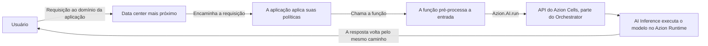

import FrameBox from '@aziontech/webkit/frame-box'
import ItemList from '@aziontech/webkit/item-list'
import DocItem from '@aziontech/webkit/doc-item'

Quando uma aplicação precisa que um modelo responda algo, ela envia a entrada e mantém a requisição aberta enquanto o modelo gera uma resposta. Em seguida, ela retorna essa resposta a quem chamou. Toda chamada de modelo tem essa forma. O que muda de uma plataforma para outra é onde o modelo executa e quanto dele você opera.

[AI Inference](/pt-br/documentacao/build/ai-inference/) executa os modelos, e quem chama um modelo é uma [função](/pt-br/documentacao/build/functions/). A função alcança um modelo através de `Azion.AI.run`, o binding de runtime que recebe um id de modelo e um corpo de requisição no formato da OpenAI. A chamada acontece dentro da execução da função, então um único trecho do seu código contém tanto a requisição que chegou quanto a resposta que o modelo produziu.

Três assuntos adjacentes têm páginas próprias. [LoRA Fine-Tune](/pt-br/documentacao/build/ai-inference/lora-fine-tune/) é a extensão que adapta um modelo com LoRA, e nomeia os modelos que a aceitam. Os vetores que um modelo de embedding retorna são armazenados e consultados com [Vector Search](/pt-br/documentacao/store/sql-database/vector-search/) no SQL Database. Para conhecer o corpo da requisição campo a campo, consulte [Invocação de modelos](/pt-br/documentacao/build/ai-inference/invocacao-de-modelos/).

Os mecanismos são a chamada de modelo em si, a cadeia de invocação, o binding e o endpoint HTTP, o que Azion executa e o que é seu, e o que essa arquitetura custa.

---

## A chamada de modelo

Uma chamada de modelo começa no código que você implanta. `Azion.AI.run` é o binding de runtime que a faz, e recebe dois argumentos: o id do modelo e o corpo da requisição no formato da OpenAI. A chamada é assíncrona, então a função a aguarda e lê a resposta do modelo no valor resolvido. Para um modelo de chat, o texto gerado fica em `choices[0].message.content` dentro dessa resposta.

O id é o único endereço de que o código precisa. Azion não publica nenhum endpoint de inferência próprio, então uma função não configura nenhuma URL base e não nomeia nenhum host para alcançar um modelo. Os ids de modelo não seguem uma forma única: alguns são um caminho de repositório, como `Qwen/Qwen3-30B-A3B-Instruct-2507-FP8`, e outros uma string em minúsculas, como `gpt-oss-20b`. Copie o id da própria página do modelo em [Modelos de AI](/pt-br/documentacao/build/ai-inference/modelos/) em vez de derivá-lo do nome do modelo.

Em torno da chamada, a função é código comum. Ela pré-processa a entrada antes de invocar o modelo e formata o que o modelo retorna antes que quem chamou veja. A mesma execução pode recuperar contexto de um armazenamento e alcançar um serviço externo. A recuperação, a chamada e a formatação da resposta acontecem dentro de uma requisição.

---

## A cadeia de invocação

Este diagrama traça uma requisição, do usuário até o modelo e de volta. Cada seta é uma passagem de uma parte da plataforma para a seguinte, e cada parte é nomeada na lista que segue.

Leia o diagrama como quatro movimentos:

1. O usuário envia uma requisição ao domínio da aplicação.
2. O data center mais próximo recebe a requisição e a encaminha para a aplicação, que aplica suas políticas e chama a função.
3. A função orquestra a inferência. Ela pré-processa a entrada e chama o modelo com `Azion.AI.run`, através da API do Azion Cells.
4. A resposta volta ao usuário pelo mesmo caminho.

Cinco partes sustentam essa cadeia. [Applications](/pt-br/documentacao/plataforma/applications/) é a camada de aplicação que recebe a requisição e aplica políticas a ela. Functions executa a lógica de inferência: orquestra a recuperação, integra serviços externos e emite a chamada de modelo. AI Inference executa os modelos, no [Azion Runtime](/pt-br/documentacao/devtools/runtime/). [Orchestrator](/pt-br/documentacao/build/orchestrator/) gerencia as requisições para a execução no Azion Cells, e Azion Cells é a parte do Orchestrator que o binding alcança. A infraestrutura distribuída da Azion é onde tudo isso executa, e por isso o data center que responde é o mais próximo do usuário.

---

## O binding e o endpoint HTTP

Uma requisição alcança um modelo por uma de duas interfaces, e as duas terminam no mesmo binding.

A primeira é o próprio binding. Dentro de uma função, o código chama `Azion.AI.run`, e nada fica entre esse código e a chamada de modelo. A função decide qual modelo responde, o que o corpo da requisição carrega e o que acontece antes e depois.

A segunda é um endpoint HTTP compatível com OpenAI, e o mecanismo por trás dele é que Azion não o hospeda. O host é a aplicação que você implanta, então o endpoint é mais uma coisa que essa aplicação serve, no domínio em que ela responde. [Invocação de modelos](/pt-br/documentacao/build/ai-inference/invocacao-de-modelos/) traz o caminho, a forma do domínio e a requisição que o endpoint aceita.

Atrás do endpoint ainda existe uma função, e ela chama `Azion.AI.run` como qualquer outra função. A segunda interface é, portanto, a primeira com uma aplicação à frente, publicada em um formato de requisição que os clientes já falam. Esse endpoint não carrega autenticação da Azion e Azion não emite nenhuma credencial para ele, então qualquer verificação que ele faça é uma que sua aplicação define.

---

## O que Azion executa e o que é seu

A cadeia de invocação cruza uma linha entre o que Azion opera e o que você implanta. Onde essa linha cai é o que indica de qual lado um problema está.

Azion executa os modelos e tudo que está abaixo deles: os próprios modelos, o hardware que os executa, Azion Runtime e a orquestração que coloca uma chamada no Azion Cells. Você não carrega nenhum modelo, não dimensiona nenhum cluster e não mantém nenhum servidor de inferência em execução. Você também não seleciona qual data center atende uma dada requisição, porque a requisição é respondida pelo mais próximo.

É seu tudo que decide o que se pergunta ao modelo. A função é o seu código: o tratamento da entrada, o prompt, o id do modelo, o corpo da requisição e a resposta que quem chamou recebe ao final. A aplicação à frente da função também é sua, junto com o domínio em que ela responde e a autenticação que ela verifica. Quando uma resposta está errada, a entrada que sua função enviou é o primeiro lugar a olhar, porque o modelo respondeu exatamente a ela.

---

## O que essa arquitetura custa

Executar um modelo de dentro de uma função mantém a requisição e a chamada de modelo em uma única execução. Três coisas pagam por isso.

A chamada de modelo acontece dentro de uma execução. A função a aguarda, então o tempo que o modelo leva para gerar é tempo que a função passa esperando, e a requisição fica aberta para os dois. Uma função que chama um modelo é, portanto, limitada por dois conjuntos de valores ao mesmo tempo: os seus próprios, em [Limites de Functions](/pt-br/documentacao/build/functions/limites/), e os do modelo, em [Limites do AI Inference](/pt-br/documentacao/build/ai-inference/limites/).

Azion também limita o lado do modelo. Azion pode encerrar um modelo que consome mais do que a memória máxima definida, ou que executa por mais tempo do que o tempo máximo permitido. Um modelo que é criado e depois não é executado por mais de três dias pode ser desprovisionado. Para saber o que cada uma dessas condições cobre, consulte [Limites do AI Inference](/pt-br/documentacao/build/ai-inference/limites/).

O endpoint compatível com OpenAI é um formato que sua aplicação serve, não um serviço que Azion opera para você. Você constrói a aplicação que o expõe, você a mantém em execução e você a protege. Azion não entrega nenhum endpoint gerenciado para apontar um cliente. O endpoint é seu para mudar, e seu para manter respondendo.

---

## Recursos relacionados

<FrameBox>
<ItemList>
  <DocItem title="Invocação de modelos" href="/pt-br/documentacao/build/ai-inference/invocacao-de-modelos/">Todos os campos que o corpo da requisição aceita, nas duas interfaces.</DocItem>
  <DocItem title="Primeiros passos com AI Inference" href="/pt-br/documentacao/build/ai-inference/primeiros-passos/">Implante uma aplicação e envie uma primeira requisição a um modelo.</DocItem>
  <DocItem title="Modelos de AI" href="/pt-br/documentacao/build/ai-inference/modelos/">O id a passar e o que cada modelo declara sobre si.</DocItem>
  <DocItem title="Limites do AI Inference" href="/pt-br/documentacao/build/ai-inference/limites/">As condições em que Azion encerra ou desprovisiona um modelo.</DocItem>
  <DocItem title="Functions" href="/pt-br/documentacao/build/functions/">O runtime que contém o binding e os limites que restringem uma chamada.</DocItem>
  <DocItem title="Arquitetura do AI Inference" href="/pt-br/documentacao/guias/ai/inferencia/ai-inference-architecture/">A forma implantada em torno de uma chamada de modelo, em que sua aplicação é o endpoint de inferência.</DocItem>
  <DocItem title="Preços" href="/pt-br/documentacao/fundamentos/precos/#ai-inference">Como o consumo de AI Inference é medido e cobrado.</DocItem>
</ItemList>
</FrameBox>
