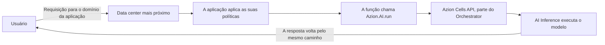

import DocButton from '~/components/webkit/DocButton.vue';
import DocCardGroup from '@aziontech/webkit/doc-card-group'
import DocCard from '@aziontech/webkit/doc-card'

Inferência é o ato de executar um modelo de AI treinado. Você envia uma entrada e o modelo retorna uma saída calculada a partir dos pesos que ele aprendeu no treinamento: um texto gerado, um ranking ou um vetor de números que representa a entrada. Um modelo não responde nada enquanto esses pesos não estiverem carregados em memória, em hardware dimensionado para eles. Um serviço de inferência assume essa parte, mantendo os modelos carregados e colocando cada um atrás de uma requisição.

**AI Inference** executa os modelos na infraestrutura distribuída da Azion, no [Azion Runtime](/pt-br/documentacao/devtools/runtime/). Um modelo não é um objeto que você cria. Você nomeia um modelo pelo id dele dentro de uma [função](/pt-br/documentacao/build/functions/), e essa chamada é o que o invoca. Use AI Inference para gerar texto a partir de um prompt, ler o texto de uma imagem, transformar um documento em um vetor para recuperação ou ranquear um conjunto de documentos em relação a uma consulta.

<DocButton href="/pt-br/documentacao/build/ai-inference/primeiros-passos/" label="Primeiros passos" size="medium" />
<DocButton href="/pt-br/documentacao/build/ai-inference/modelos/" label="Modelos de AI" kind="secondary" size="medium" />

---

## Chamada de modelo

Uma função alcança um modelo por meio de `Azion.AI.run`, o binding do runtime que recebe o id do modelo e um corpo de requisição compatível com OpenAI:

```ts
const modelResponse = await Azion.AI.run("Qwen/Qwen3-30B-A3B-Instruct-2507-FP8", {
  "stream": false,
  "messages": [
    { "role": "system", "content": "You are a helpful assistant." },
    { "role": "user", "content": "Name three European capitals." }
  ]
})

const answer = modelResponse?.choices?.[0]?.message?.content
```

- O primeiro argumento é o id do modelo, a string à qual o modelo responde. Os ids não seguem uma forma única, então copie o id declarado na página do próprio modelo em [Modelos de AI](/pt-br/documentacao/build/ai-inference/modelos/).
- O segundo argumento é o corpo da requisição. `messages` carrega a conversa e campos como `stream`, `max_tokens` e `temperature` moldam a saída. Todos os campos que um corpo aceita estão em [Invocação de modelos](/pt-br/documentacao/build/ai-inference/invocacao-de-modelos/).
- A chamada é assíncrona. A função a aguarda e o texto gerado fica em `choices[0].message.content` no valor resolvido.
- O id seleciona o modelo e o código não nomeia nenhum host, nenhuma URL base nem nenhuma credencial.

Se você já escreveu código para o formato de chat completions da OpenAI, o corpo da requisição e o objeto de resposta são os que você já conhece, e o binding é o que muda.

---

## Caminho de invocação

Uma chamada de modelo não sai da requisição que a iniciou. A função que já está tratando a requisição é a que chama o modelo, então a chamada é um passo dentro de uma execução, e não uma ida e volta a um serviço separado.



1. Um usuário envia uma requisição para o domínio da sua aplicação.
2. O data center mais próximo recebe a requisição e a encaminha para a aplicação, que aplica as suas políticas e chama a função.
3. A função pré-processa a entrada e chama o modelo com `Azion.AI.run`, por meio da Azion Cells API.
4. A resposta volta para o usuário pelo mesmo caminho.

Quatro produtos sustentam essa cadeia. [Applications](/pt-br/documentacao/plataforma/applications/) recebe a requisição e aplica políticas a ela, [Functions](/pt-br/documentacao/build/functions/) executa o código que faz a chamada, [Orchestrator](/pt-br/documentacao/build/orchestrator/) coloca a chamada na Azion Cells e AI Inference executa o modelo. Para a mesma cadeia com a linha traçada entre o que a Azion opera e o que é seu, consulte [Como AI Inference funciona](/pt-br/documentacao/build/ai-inference/como-funciona/).

---

## Escopo e limites

- **Modelos**: AI Inference executa um catálogo de modelos open source. Ele reúne large language models, vision language models que leem texto e imagens, um modelo de embedding e um reranker. Cada página de modelo declara o id ao qual o modelo responde e as capacidades que ele suporta. Para o catálogo, consulte [Modelos de AI](/pt-br/documentacao/build/ai-inference/modelos/).
- **Tamanho do contexto**: um valor por modelo, de 8k tokens a 131k tokens no catálogo. Dimensione um prompt em relação ao modelo que você chama, e não em relação ao catálogo.
- **Entrada**: todos os modelos leem texto. Os modelos cuja entrada também cobre imagens leem uma imagem passada como URL, em uma parte de conteúdo da mensagem.
- **Interfaces**: duas delas alcançam os mesmos modelos. Uma função chama `Azion.AI.run` diretamente, ou uma aplicação que você implanta serve um endpoint compatível com OpenAI em `/v1/chat/completions` no domínio dela e chama o binding por trás dele. As duas carregam o mesmo corpo de requisição, documentado em [Invocação de modelos](/pt-br/documentacao/build/ai-inference/invocacao-de-modelos/).
- **Gerenciamento**: AI Inference não tem uma superfície de gerenciamento própria nem uma API própria. Você não cria, não configura nem implanta um modelo. Você chama um modelo pelo id de dentro de uma função, então a função é o objeto que você cria e gerencia, pelas interfaces que [Functions](/pt-br/documentacao/build/functions/) declara.
- **Adaptação de modelos**: adaptar um modelo a uma tarefa com Low-Rank Adaptation é [LoRA Fine-Tune](/pt-br/documentacao/build/ai-inference/lora-fine-tune/), uma extensão do AI Inference. As páginas de modelo declaram quais modelos aceitam essa adaptação.
- **Vetores**: um modelo de embedding retorna vetores e [SQL Database](/pt-br/documentacao/store/sql-database/) os armazena e consulta. As consultas semânticas e híbridas de que um fluxo de retrieval-augmented generation se serve estão em [Vector Search](/pt-br/documentacao/store/sql-database/vector-search/).
- **Encerramento**: a Azion pode encerrar um modelo que consome mais do que a memória máxima definida ou que roda por mais tempo do que o tempo máximo permitido. Um modelo criado e depois não executado por mais de três dias pode ser desprovisionado. Para o que cada condição cobre, consulte [Limites do AI Inference](/pt-br/documentacao/build/ai-inference/limites/).
- **Observabilidade**: uma chamada de modelo roda dentro de uma função, em uma aplicação, então o que ela fez em produção é lido onde esse tráfego é lido. [Real-Time Metrics](/pt-br/documentacao/plataforma/real-time-metrics/) reporta o tráfego, e [Real-Time Events](/pt-br/documentacao/observe/real-time-events/) carrega as requisições e os logs.
- **Cobrança**: para saber como o consumo de uma chamada de modelo é medido e cobrado, consulte [Preços](/pt-br/documentacao/fundamentos/precos/#ai-inference).

Azion não hospeda nenhum endpoint de inferência e não emite nenhuma credencial para uma chamada de modelo. O endpoint compatível com OpenAI pertence a uma aplicação que você implanta, e a autenticação na frente dele é você quem define.

---

## Próximos passos

<DocCardGroup cols={2}>
  <DocCard title="Primeiros passos" href="/pt-br/documentacao/build/ai-inference/primeiros-passos/" label="Obtenha a primeira resposta de um modelo sem escrever código." />
  <DocCard title="Como funciona" href="/pt-br/documentacao/build/ai-inference/como-funciona/" label="Acompanhe uma requisição do seu domínio até o modelo e de volta." />
  <DocCard title="Modelos de AI" href="/pt-br/documentacao/build/ai-inference/modelos/" label="Escolha um modelo e copie o id ao qual ele responde." />
  <DocCard title="Invocação de modelos" href="/pt-br/documentacao/build/ai-inference/invocacao-de-modelos/" label="Consulte um campo da requisição, seu padrão ou seus limites." />
  <DocCard title="Guias de AI Inference" href="/pt-br/documentacao/build/ai-inference/guias/" label="Percorra um guia ou uma arquitetura de referência." />
  <DocCard title="Limites" href="/pt-br/documentacao/build/ai-inference/limites/" label="Descubra quando Azion encerra um modelo ou o desprovisiona." />
</DocCardGroup>
