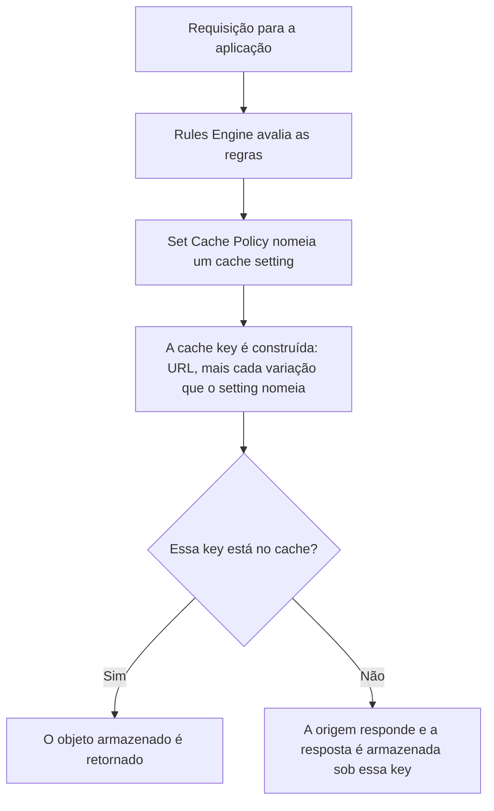

import DocButton from '~/components/webkit/DocButton.vue';
import DocCardGroup from '@aziontech/webkit/doc-card-group'
import DocCard from '@aziontech/webkit/doc-card'

Um cache responde a uma requisição a partir de uma cópia armazenada, em vez de enviá-la à origem, e encontra essa cópia com uma _cache key_: uma entrada de índice construída a partir da requisição. Quando a key é apenas a URL, o cache assume que uma URL tem uma única resposta correta. Conteúdo dinâmico quebra essa premissa. Sob uma única URL, um visitante autenticado vê o próprio carrinho, uma listagem se reordena a partir de um filtro e um layout muda em um celular. Um cache que não distingue essas respostas entrega a resposta errada ou deixa de armazenar o caminho em cache.

**Application Accelerator** é um módulo de [Applications](/pt-br/documentacao/plataforma/applications/) que coloca o resto da requisição na cache key. Um único switch em uma aplicação libera os campos que variam a key, o cache de respostas `POST` e `OPTIONS`, um TTL de cache abaixo do piso de um minuto e sete behaviors do [Rules Engine](/pt-br/documentacao/plataforma/applications/rules-engine/). Use Application Accelerator para fazer cache de uma página personalizada, de uma resposta de API que muda conforme a query string, de um catálogo que difere por dispositivo ou de uma resposta a um `POST`.

<DocButton href="/pt-br/documentacao/build/application-accelerator/primeiros-passos/" label="Primeiros passos" size="medium" />
<DocButton href="/pt-br/documentacao/build/application-accelerator/configuracoes/" label="Configurações do Application Accelerator" kind="secondary" size="medium" />

---

## O cache setting

O artefato é um **cache setting**. Ele guarda por quanto tempo o cache mantém um objeto e o que torna duas requisições diferentes, e o módulo acrescenta o próprio objeto a ele:

```json
{
  "name": "product-listing",
  "browser_cache": { "behavior": "override", "max_age": 30 },
  "modules": {
    "cache": { "behavior": "override", "max_age": 30 },
    "application_accelerator": {
      "cache_vary_by_method": ["post"],
      "cache_vary_by_querystring": {
        "behavior": "allowlist",
        "fields": ["category", "page"],
        "sort_enabled": true
      },
      "cache_vary_by_cookies": {
        "behavior": "allowlist",
        "cookie_names": ["session_id"]
      }
    }
  }
}
```

- `modules.cache.max_age` é por quanto tempo o cache mantém o objeto, em segundos. O valor `30` está abaixo do piso de 60 segundos que se aplica sem o módulo.
- Cada objeto `cache_vary_by_*` nomeia uma entrada que varia a key. `allowlist` varia pelos atributos que nomeia e ignora o resto; `ignore` é o default para os quatro.
- `sort_enabled` agrupa os mesmos argumentos, em qualquer ordem, sob uma única key.
- `cache_vary_by_method` nomeia os métodos cujas respostas são armazenadas em cache, além de `GET` e `HEAD`.

Se você já escreveu um header `Vary` ou uma regra de cache key em outra plataforma, o modelo se transfere: você está nomeando as entradas que tornam duas requisições diferentes.

---

## Como uma requisição chega a um objeto em cache

Ativar o módulo não altera o tráfego por si só. Todo controle de variação começa no modo ignore e um cache setting alcança uma requisição apenas quando uma regra do Rules Engine o aplica.



1. Uma requisição chega a uma aplicação na infraestrutura distribuída da Azion.
2. [Rules Engine](/pt-br/documentacao/plataforma/applications/rules-engine/) avalia as suas regras em relação à requisição.
3. Uma regra cujos critérios correspondem aplica um cache setting com o behavior **Set Cache Policy**.
4. A cache key é construída a partir da URL mais cada variação que esse cache setting nomeia, de modo que duas requisições que diferem apenas em um atributo que ninguém nomeou compartilham uma única key.
5. Uma key que já está no cache é respondida a partir do objeto armazenado.
6. Uma key que não está é respondida pela origem, e a resposta é armazenada sob essa key pelo TTL que o cache setting carrega.

Para saber o que cada variação acrescenta à key e o que uma variação custa, consulte [Como Application Accelerator funciona](/pt-br/documentacao/build/application-accelerator/como-funciona/).

---

## Escopo e limites

- **Variação de cache**: a key pode variar por query string, por cookie, por device group e por método de requisição. O recurso é **Advanced Cache Key**, e os quatro controles que o configuram ficam na seção **Application Accelerator** de um cache setting.
- **Métodos HTTP**: o módulo acrescenta `OPTIONS`, `POST`, `PUT`, `PATCH` e `DELETE` aos `GET` e `HEAD` que uma aplicação aceita nativamente. Desses, apenas as respostas `POST` e `OPTIONS` podem ser armazenadas em cache.
- **Rules Engine**: sete behaviors exigem o módulo — Add Cookie, Bypass Cache, Capture Match Groups, Filter Cookie, Forward Cookies, Rewrite Request e Run Function — junto com a variável `${device_group}` nos critérios de uma regra. O índice completo está em [Configurações](/pt-br/documentacao/build/application-accelerator/configuracoes/#behaviors-do-rules-engine).
- **TTL de cache**: sem o módulo, o menor TTL que uma aplicação aceita é 60 segundos; com ele, 0. O teto é 31.536.000 segundos nos dois casos, e [Tiered Cache](/pt-br/documentacao/build/cache/tiered-cache/) eleva o piso para 3 segundos. As condições estão em [Limites](/pt-br/documentacao/build/application-accelerator/limites/).
- **Interfaces**: você define o módulo e os campos dele em [Azion Console](https://console.azion.com), pela [Azion API](https://api.azion.com/), com [Azion CLI](/pt-br/documentacao/devtools/cli/), em `azion.config.js` e com Azion Lib. O campo ou a flag que cada uma usa está em [Configurações](/pt-br/documentacao/build/application-accelerator/configuracoes/).
- **Otimização de protocolo**: o módulo inclui recursos de otimização de protocolo para tráfego dinâmico.
- **Cobrança**: ativar um módulo pode gerar custos relacionados ao uso, conforme [Preços](/pt-br/documentacao/fundamentos/precos/#application-accelerator).

Application Accelerator não guarda objetos em cache e não decide por quanto tempo eles vivem. [Cache](/pt-br/documentacao/build/cache/) faz as duas coisas. Este módulo decide o que torna duas requisições diferentes, e é sobre isso que o cache constrói a key.

---

## Próximos passos

<DocCardGroup cols={2}>
  <DocCard title="Primeiros passos" href="/pt-br/documentacao/build/application-accelerator/primeiros-passos/" label="Ative o módulo e faça cache de uma listagem que varia por um argumento de query string." />
  <DocCard title="Como Application Accelerator funciona" href="/pt-br/documentacao/build/application-accelerator/como-funciona/" label="O que cada variação acrescenta à cache key e o que uma variação custa." />
  <DocCard title="Configurações do Application Accelerator" href="/pt-br/documentacao/build/application-accelerator/configuracoes/" label="Consulte um campo, um valor de enum ou um default, por interface." />
  <DocCard title="Limites" href="/pt-br/documentacao/build/application-accelerator/limites/" label="O piso e o teto do TTL de cache e as condições que movem cada um." />
  <DocCard title="Guias e tutoriais" href="/pt-br/documentacao/build/application-accelerator/guias/" label="Conclua uma tarefa: varie por cookie, faça bypass do cache, armazene em cache uma resposta POST." />
  <DocCard title="Glossário" href="/pt-br/documentacao/build/application-accelerator/glossario/" label="Consulte um termo que esta documentação usa." />
</DocCardGroup>
