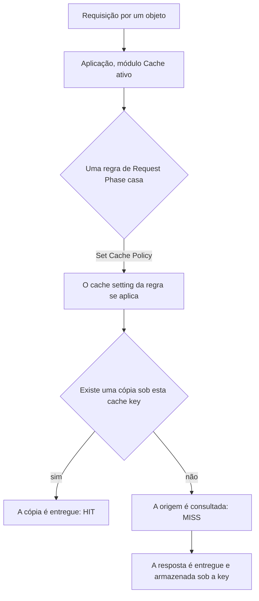

import DocButton from '~/components/webkit/DocButton.vue';
import DocCardGroup from '@aziontech/webkit/doc-card-group'
import DocCard from '@aziontech/webkit/doc-card'

Um cache mantém uma cópia de uma resposta perto das pessoas que a requisitam. A primeira requisição por um objeto percorre até o servidor de origem que o contém; a cópia é armazenada sob uma key montada a partir dessa requisição, e as requisições seguintes pelo mesmo objeto são respondidas pela cópia. Cada cópia é mantida por um tempo de vida, o TTL, e a origem só é consultada novamente quando o TTL termina ou a cópia é removida.

O **Cache** armazena essas cópias na infraestrutura distribuída da Azion, nos data centers que recebem o seu tráfego. Ele é um módulo de uma [aplicação](/pt-br/documentacao/plataforma/applications/), ativo em cada aplicação que você cria. Use o Cache para manter arquivos estáticos perto dos seus usuários, guardar uma resposta de API por alguns segundos, entregar arquivos de vídeo grandes em fragmentos, manter uma cópia respondendo enquanto a origem está fora do ar e remover uma cópia no momento em que a origem muda.

<DocButton href="/pt-br/documentacao/build/cache/primeiros-passos/" label="Primeiros passos" size="medium" />
<DocButton href="/pt-br/documentacao/build/cache/cache-settings/" label="Cache settings" kind="secondary" size="medium" />

---

## O cache setting

O que você configura é um cache setting: um objeto em uma aplicação que carrega os TTLs, o comportamento diante dos headers de cache da própria origem e as regras que decidem quando duas requisições compartilham uma cópia. A requisição abaixo cria um pela Azion API:

```json
{
  "name": "static-assets",
  "browser_cache": { "behavior": "override", "max_age": 86400 },
  "modules": {
    "cache": {
      "behavior": "override",
      "max_age": 300,
      "stale_cache": { "enabled": true },
      "large_file_cache": { "enabled": true, "offset": 1024 },
      "tiered_cache": { "enabled": true, "topology": "nearest-region" }
    }
  }
}
```

- O `browser_cache` decide o que o browser do visitante recebe instrução de guardar, e o `modules.cache.max_age`, por quanto tempo a Azion mantém a cópia dela.
- O `behavior` escolhe entre honrar os headers `Cache-Control` e `Expires` da origem e substituí-los pelo TTL do setting.
- O `stale_cache` permite que uma cópia expirada responda enquanto a origem falha, e o `large_file_cache` armazena um objeto grande em fragmentos.
- O `tiered_cache` adiciona uma segunda camada de cache entre o cache da Azion e a origem.

Se você já definiu headers `Cache-Control` em uma origem, os comportamentos `honor` e `override` são as duas escolhas que você já conhece. Para cada campo, o seu tipo e o seu padrão, consulte [Cache settings](/pt-br/documentacao/build/cache/cache-settings/).

---

## Como uma requisição chega a uma cópia

Criar um cache setting não coloca nada em cache. Uma regra do [Rules Engine](/pt-br/documentacao/plataforma/applications/rules-engine/) é o que aplica um setting às requisições, então um setting que nenhuma regra nomeia fica inerte:



1. Uma requisição chega para uma aplicação cujo módulo Cache está ativo.
2. Uma regra na request phase a casa e aplica um cache setting pelo behavior **Set Cache Policy**.
3. A Azion monta a cache key a partir da requisição: o scheme, o host, o path, a query string e qualquer variação que o setting acrescente.
4. Uma cópia armazenada sob essa key é entregue, e a resposta informa `HIT`.
5. Sem cópia armazenada, a origem é consultada, a resposta informa `MISS`, e a resposta pode ser armazenada sob a key.
6. A cópia responde as requisições seguintes até o seu TTL terminar, um purge a remover, ou uma regra enviar a requisição para fora do cache.

Para os mecanismos por trás de cada passo, consulte [Como o Cache funciona](/pt-br/documentacao/build/cache/como-funciona/). Para a key e o header que informa o status, consulte [Cache keys](/pt-br/documentacao/build/cache/cache-keys/).

---

## O que o Cache cobre

- **Interfaces.** Um cache setting é criado e gerenciado no [Azion Console](https://console.azion.com/), pela Azion API v4, pela [Azion CLI](/pt-br/documentacao/devtools/cli/), pelo `azion.config.js`, pela [Azion Lib](/en/documentation/devtools/azion-lib/application/) e pelo [Terraform](/pt-br/documentacao/devtools/terraform/applications/).
- **Métodos.** Respostas `GET` e `HEAD` são colocadas em cache nativamente. Respostas `POST` e `OPTIONS` são colocadas em cache com o [Application Accelerator](/pt-br/documentacao/build/application-accelerator/), que também eleva o piso do TTL abaixo de 60 segundos e ativa a variação de cache por query string, cookie e device group.
- **Uma URL, várias cópias.** Um setting pode armazenar uma cópia por argumento de query string, valor de cookie, device group, método da requisição, formato de imagem ou intervalo de bytes de um arquivo grande. Cada uma é uma key separada, então cada uma é purgada separadamente. Os formatos estão em [Cache keys](/pt-br/documentacao/build/cache/cache-keys/).
- **Uma segunda camada.** O [Tiered Cache](/pt-br/documentacao/build/cache/tiered-cache/) responde a um miss na primeira camada antes de a origem ser consultada, e é ativado por cache setting.
- **Remover uma cópia.** O [Real-Time Purge](/pt-br/documentacao/build/cache/real-time-purge/) remove um objeto por URL, por cache key ou por uma expressão com wildcard, de qualquer uma das camadas, antes do fim do seu TTL.
- **Limites.** O TTL de cache vai de 60 segundos, ou 0 com o Application Accelerator, até 31.536.000 segundos. Um objeto é mantido até 10 GB, e arquivos grandes são fragmentados a cada 1.024 kB. Cada limite, e os purges que cada plano inclui, estão em [Limites do Cache](/pt-br/documentacao/build/cache/limites/).
- **O que ele não faz.** O Cache armazena respostas que a sua origem ou a sua aplicação produzem; ele não executa código. Uma função que lê e escreve entradas de cache a partir do seu próprio código usa a [Cache API](/pt-br/documentacao/devtools/runtime/api-reference/cache/) do [Functions](/pt-br/documentacao/build/functions/).
- **Acompanhar.** O [Real-Time Metrics](/pt-br/documentacao/plataforma/real-time-metrics/) carrega um dataset de Cache e um de Tiered Cache, e uma resposta informa o seu próprio status por um header de debug.

---

## Próximos passos

<DocCardGroup cols={2}>
  <DocCard title="Primeiros passos" href="/pt-br/documentacao/build/cache/primeiros-passos/" label="Coloque um path da sua aplicação em cache e leia o status de cache da primeira resposta." />
  <DocCard title="Como funciona" href="/pt-br/documentacao/build/cache/como-funciona/" label="Acompanhe o TTL, o stale cache, os fragmentos, a variação e a segunda camada em uma requisição." />
  <DocCard title="Cache settings" href="/pt-br/documentacao/build/cache/cache-settings/" label="Consulte um campo, o seu tipo, o seu padrão por interface e o erro além do seu limite." />
  <DocCard title="Guias do Cache" href="/pt-br/documentacao/build/cache/guias/" label="Complete uma tarefa específica, pelo Console, pela API ou pela CLI." />
  <DocCard title="Real-Time Purge" href="/pt-br/documentacao/build/cache/real-time-purge/" label="Remova uma cópia antes do fim do seu TTL, por URL, cache key ou wildcard." />
  <DocCard title="Solução de problemas" href="/pt-br/documentacao/build/cache/solucao-de-problemas/" label="Encontre a causa quando um setting não tem efeito, ou um purge deixa uma cópia para trás." />
</DocCardGroup>
