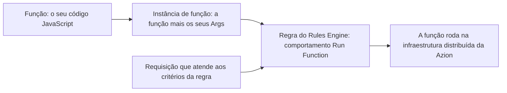

import DocButton from '~/components/webkit/DocButton.vue';
import DocCardGroup from '@aziontech/webkit/doc-card-group'
import DocCard from '@aziontech/webkit/doc-card'

Uma função é um código que roda sob demanda, quando um evento como uma requisição HTTP chega. Você escreve um handler que recebe a requisição e devolve uma resposta. A plataforma roda esse handler a cada requisição e o encerra quando a resposta é enviada, de modo que nada roda entre uma requisição e outra. Esse modelo se chama _serverless_: não há servidor para provisionar nem capacidade para planejar.

**Functions** guarda o seu código JavaScript e o executa na infraestrutura distribuída da Azion, no caminho de uma requisição a uma [aplicação](/pt-br/documentacao/plataforma/applications/) ou a um [firewall](/pt-br/documentacao/plataforma/firewall/functions/). Uma regra no [Rules Engine](/pt-br/documentacao/plataforma/applications/rules-engine/) seleciona a função e a fase da requisição que a invoca. Use Functions para construir uma API, reescrever headers de requisição e de resposta, aplicar lógica a partir dos metadados da requisição ou bloquear uma requisição antes que ela chegue à sua aplicação.

<DocButton href="/pt-br/documentacao/build/functions/primeiros-passos/" label="Primeiros passos" size="medium" />
<DocButton href="/pt-br/documentacao/build/functions/guias/" label="Guias de Functions" kind="secondary" size="medium" />

---

## Estrutura de uma função

Uma função exporta um objeto default que carrega um handler. Em uma aplicação, o handler se chama `fetch`:

```javascript
export default {
  async fetch(request, env, ctx) {
    return new Response('Hello World!');
  },
};
```

- `request` é a requisição HTTP recebida, como um objeto `Request`.
- `env` carrega as [variáveis de ambiente](/pt-br/documentacao/build/functions/environment-variables/) e os bindings disponíveis para a função.
- `ctx` é o contexto de execução. `ctx.waitUntil(promise)` estende a duração da invocação.
- Em um firewall, o handler se chama `firewall` e o contexto acrescenta `ctx.deny()`, que bloqueia a requisição imediatamente.

[Azion Runtime](/pt-br/documentacao/devtools/runtime/) é construído sobre padrões Web, então o que você sabe sobre os objetos `Request` e `Response` se aplica a uma função. Functions também aceita o padrão Service Worker, que registra o handler com `addEventListener`. Para os dois padrões e seus parâmetros, consulte [Handlers](/pt-br/documentacao/devtools/runtime/api-reference/handlers/).

---

## Caminho de invocação

Criar uma função não a executa. Uma função só roda quando uma regra invoca uma instância dela, então dois objetos ficam entre o seu código e uma requisição.



1. Você cria uma função em Functions. A função guarda o código e a mesma função pode ser instanciada em mais de uma aplicação.
2. Você cria uma [instância de função](/pt-br/documentacao/build/functions/functions-instances/) em uma aplicação ou em um firewall. A instância vincula a função e carrega os **Args**, um objeto JSON passado para o contexto de execução. O código não pode ser editado na instanciação e apenas os Args são definidos ali.
3. Você cria uma regra no Rules Engine e seleciona o comportamento **Run Function**. A regra nomeia a instância, a fase de execução e os critérios que a disparam.
4. Quando uma requisição atende aos critérios, a função roda na infraestrutura distribuída da Azion, sem cold start.

Uma instância que nenhuma regra invoca nunca roda. Para os objetos, as fases e o formato dos Args, consulte [Como Functions funciona](/pt-br/documentacao/build/functions/como-funciona/).

---

## Escopo e limites

- **Linguagem**: você escreve funções em JavaScript. Uma função também pode compilar e instanciar módulos WebAssembly por meio da [API WebAssembly](/pt-br/documentacao/devtools/runtime/api-reference/webassembly/). Um projeto TypeScript passa pelo build com o preset `Typescript` do [Azion CLI build](/pt-br/documentacao/devtools/cli/build/#preset), e o pacote `azion/utils` publica definições de tipo que o código importa.
- **Runtime**: as funções rodam no [Azion Runtime](/pt-br/documentacao/devtools/runtime/), que implementa as [Web APIs](/pt-br/documentacao/devtools/runtime/api-reference/javascript/) e um conjunto de [módulos do Node.js](/pt-br/documentacao/devtools/runtime/node/). Um `Response` aceita um `ReadableStream` como corpo, então uma função transmite a resposta ao cliente conforme ela é gerada, em vez de montar o corpo inteiro antes. Para todos os tipos de corpo, consulte [Parâmetros](/pt-br/documentacao/devtools/runtime/api-reference/response/#parametros).
- **Frameworks**: um projeto construído com um framework JavaScript suportado se torna funções quando [Azion CLI](/pt-br/documentacao/devtools/cli/) faz o build dele, por meio do [Azion Bundler](https://github.com/aziontech/bundler), o adaptador de frameworks open source. Para a lista, consulte [Compatibilidade com web frameworks](/pt-br/documentacao/devtools/runtime/frameworks/compatibilidade-frameworks/).
- **Contextos de execução**: em uma aplicação, uma função roda na fase de requisição ou na fase de resposta, e o comportamento **Run Function** requer o módulo [Application Accelerator](/pt-br/documentacao/build/application-accelerator/). Em um [firewall](/pt-br/documentacao/plataforma/firewall/functions/), uma função roda na fase de requisição e permite, nega ou descarta a requisição.
- **Serviços da plataforma**: uma função alcança [KV Store](/pt-br/documentacao/store/kv-store/), [SQL Database](/pt-br/documentacao/store/sql-database/) e [Object Storage](/pt-br/documentacao/store/object-storage/) a partir do runtime e chama modelos por meio do [AI Inference](/pt-br/documentacao/build/ai-inference/).
- **Limites**: uma invocação tem 512 MB de memória por isolate, 2 s de tempo de CPU, 5 min de tempo de relógio incluindo espera de I/O e 50 chamadas `fetch()` de saída. O campo Args comporta 100 KB. Alguns valores variam conforme o plano e a tabela completa está em [Limites](/pt-br/documentacao/build/functions/limites/).
- **Interfaces**: você cria e gerencia funções em [Azion Console](https://console.azion.com), com [Azion CLI](/pt-br/documentacao/devtools/cli/), pela [Azion API](https://api.azion.com/) e pelo [Azion Terraform Provider](/pt-br/documentacao/devtools/terraform/).
- **Desenvolvimento**: você escreve o código no [editor de código](/pt-br/documentacao/build/functions/code-editor/) em Azion Console, o [Preview deployment](/pt-br/documentacao/build/functions/preview-deployment/) envia uma requisição simulada e mostra a resposta que o código retorna antes que a função atenda tráfego, e [`azion dev`](/pt-br/documentacao/devtools/cli/dev-comando/) faz o build do projeto e o executa localmente.
- **Observabilidade**: uma função escreve mensagens de log com `console.log`, e [Real-Time Events](/pt-br/documentacao/observe/real-time-events/) e [Data Stream](/pt-br/documentacao/observe/data-stream/) carregam essa saída.
- **Cobrança**: Functions é cobrado por tempo de compute e por invocação, conforme [Preços](/pt-br/documentacao/fundamentos/precos/).

Functions não hospeda modelos de AI. AI Inference roda o modelo no Azion Runtime, e uma função o chama.

---

## Fluxos de trabalho de AI

Uma função é o componente de tempo de requisição de uma aplicação de AI na Azion. Ela chama modelos por meio do [AI Inference](/pt-br/documentacao/build/ai-inference/), que serve modelos que seguem o padrão de API da OpenAI, então um cliente escrito para esse padrão funciona sem alteração.

As peças de que um fluxo de trabalho de AI se serve estão na mesma plataforma:

- **Modelos**: AI Inference roda o modelo no Azion Runtime. Functions não hospeda modelos.
- **Recuperação**: [SQL Database](/pt-br/documentacao/store/sql-database/) armazena vetores e suporta a recuperação que combina busca vetorial e busca de texto completo, que é de onde um fluxo de retrieval-augmented generation lê.
- **Frameworks de agentes**: as funções rodam agentes construídos com LangGraph e LangChain.
- **Chamadas entre agentes**: servidores MCP permitem que os agentes chamem uns aos outros pelo protocolo Agent2Agent (A2A) do Google.

---

## Próximos passos

<DocCardGroup cols={2}>
  <DocCard title="Primeiros passos" href="/pt-br/documentacao/build/functions/primeiros-passos/" label="Rode a sua primeira função agora." />
  <DocCard title="Como Functions funciona" href="/pt-br/documentacao/build/functions/como-funciona/" label="Acompanhe uma requisição da regra até o seu código." />
  <DocCard title="Exemplos em JavaScript" href="/pt-br/documentacao/build/functions/javascript-exemplos/" label="Parta de um código que funciona." />
  <DocCard title="Guias e tutoriais de Functions" href="/pt-br/documentacao/build/functions/guias/" label="Conclua uma tarefa específica." />
  <DocCard title="Limites" href="/pt-br/documentacao/build/functions/limites/" label="Consulte um limite, um default ou um valor que varia por plano." />
  <DocCard title="Solução de problemas" href="/pt-br/documentacao/build/functions/solucao-de-problemas/" label="Encontre a causa quando uma função falha ou nunca roda." />
</DocCardGroup>
