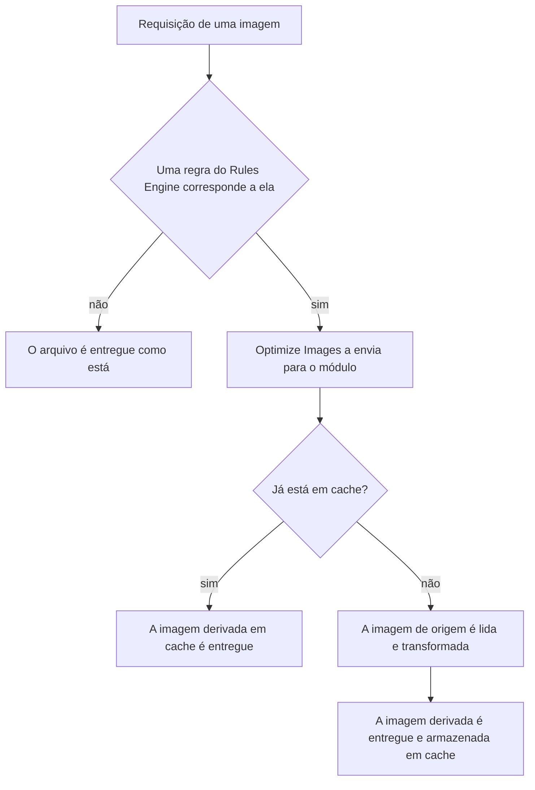

import DocButton from '~/components/webkit/DocButton.vue';
import DocCardGroup from '@aziontech/webkit/doc-card-group'
import DocCard from '@aziontech/webkit/doc-card'

Uma página que exibe a mesma fotografia em um smartphone, um laptop e um layout impresso precisa dela em três tamanhos. A resposta costumeira é produzir três arquivos, nomeá-los, armazená-los e manter os três sincronizados com o original. Transformar uma imagem sob demanda substitui isso. Um único arquivo permanece na origem, e o tamanho, o corte, a qualidade e o formato são descritos na URL que a solicita. A imagem que chega ao leitor é construída no momento em que a requisição chega, e o arquivo na origem nunca é alterado.

O **Image Processor** é um módulo do [Applications](/pt-br/documentacao/plataforma/applications/) que realiza essas transformações na infraestrutura distribuída da Azion. Uma requisição cuja URL carrega uma query string `ims` retorna uma imagem derivada construída a partir da imagem de origem. Use o Image Processor para redimensionar imagens para um layout, recortá-las em torno de um assunto, reduzir seu peso, adicionar uma marca d'água ou entregar WEBP e AVIF aos navegadores que os aceitam.

<DocButton href="/pt-br/documentacao/build/image-processor/primeiros-passos/" label="Primeiros passos" size="medium" />
<DocButton href="/pt-br/documentacao/build/image-processor/parametros-de-url/" label="Parâmetros de URL" kind="secondary" size="medium" />

---

## A transformação em uma URL

Uma transformação é uma query string acrescentada à própria URL da imagem:

```text
https://www.example.com/images/photo.jpg?ims=fit-in/400x400/filters:quality(85)
```

- `fit-in/400x400` ajusta a imagem dentro de uma caixa de 400 por 400 pixels e preserva a proporção.
- `filters:` abre um grupo de filtros, e um `:` separa um filtro do próximo.
- `quality(85)` comprime a imagem para o valor que reduz o peso sem uma alteração visível.
- Tudo antes do `?` é o caminho do arquivo que já está na sua origem.

Se você sabe como uma query string funciona, você conhece a interface. Não há etapa de upload, nenhum SDK e nenhuma segunda cópia do arquivo para gerenciar: a mesma URL com um valor `ims` diferente é uma imagem diferente, e a mesma URL sem um valor é a original.

---

## Como uma requisição se torna uma imagem derivada

Uma query string `ims` não faz nada sozinha. Uma regra do [Rules Engine](/pt-br/documentacao/plataforma/applications/rules-engine/) precisa corresponder à requisição e aplicar o comportamento **Optimize Images**, que é o que ativar o módulo disponibiliza.



1. Uma requisição chega para um caminho de imagem.
2. O Rules Engine avalia as regras da **Request Phase**, e uma regra para imagens corresponde pela extensão do arquivo.
3. A regra aplica um cache setting e o comportamento **Optimize Images**.
4. Uma imagem derivada já em cache é entregue a partir dali, e nada é processado.
5. Caso contrário, a imagem de origem é lida a partir da origem, a string `ims` é aplicada, e o resultado é entregue e armazenado em cache.

Para saber o que cada etapa custa e por que a chave de cache importa, consulte [Como Image Processor funciona](/pt-br/documentacao/build/image-processor/como-funciona/).

---

## Escopo e limites

- **Operações**: redimensionamento, corte, rotação, qualidade, marca d'água, conversão de formato, preenchimento, e qualquer combinação deles em uma única string. Cada uma delas e os valores que aceita estão em [Parâmetros de URL](/pt-br/documentacao/build/image-processor/parametros-de-url/).
- **Formatos**: JPEG, GIF, PNG, BMP, ICO, WEBP e AVIF. A conversão para WEBP ou AVIF exige que a requisição carregue o cabeçalho `Accept` correspondente, e o BMP é convertido automaticamente de acordo com o que o navegador aceita.
- **Limites em uma imagem**: um tamanho máximo de 150 MB, uma largura máxima de 3840 pixels e uma altura máxima de 2160 pixels. O volume mensal de imagens processadas é definido pelo plano de serviço. Ambos estão em [Limites](/pt-br/documentacao/build/image-processor/limites/).
- **Interfaces**: o módulo é ativado a partir do Azion Console, da Azion API, da Azion CLI e do `azion.config.js`. Cada campo e flag está em [Configurações](/pt-br/documentacao/build/image-processor/configuracoes/).
- **Cache**: uma imagem derivada é armazenada em cache sob uma chave que inclui seu valor `ims`, e uma imagem servida a partir do cache não é processada novamente. Variar o cache por uma query string exige o módulo [Application Accelerator](/pt-br/documentacao/build/application-accelerator/).
- **O que não faz**: o Image Processor não armazena nada e não aceita uploads. A imagem de origem permanece onde já está, e nenhuma imagem derivada se torna um ativo na sua conta. Para processar imagens dentro de uma função, consulte a biblioteca [WASM Image Processor](/pt-br/documentacao/devtools/azion-lib/wasm-image-processor/), que é uma superfície diferente.

---

## Próximos passos

<DocCardGroup cols={2}>
  <DocCard title="Primeiros passos" href="/pt-br/documentacao/build/image-processor/primeiros-passos/" label="Transforme sua primeira imagem agora." />
  <DocCard title="Como funciona" href="/pt-br/documentacao/build/image-processor/como-funciona/" label="Acompanhe uma requisição da regra até a imagem derivada." />
  <DocCard title="Parâmetros de URL" href="/pt-br/documentacao/build/image-processor/parametros-de-url/" label="Comece de uma string ims que funciona, e consulte o que cada uma aceita." />
  <DocCard title="Guias do Image Processor" href="/pt-br/documentacao/build/image-processor/guias/" label="Complete uma tarefa específica." />
  <DocCard title="Limites" href="/pt-br/documentacao/build/image-processor/limites/" label="Consulte um teto, um padrão ou um valor que varia por plano." />
  <DocCard title="Solução de problemas" href="/pt-br/documentacao/build/image-processor/solucao-de-problemas/" label="Encontre a causa quando uma imagem volta errada ou não processada." />
</DocCardGroup>
