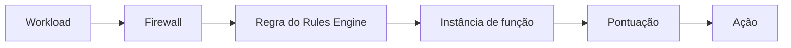

import DocButton from '~/components/webkit/DocButton.vue';
import DocCardGroup from '@aziontech/webkit/doc-card-group'
import DocCard from '@aziontech/webkit/doc-card'

O gerenciamento de bots é a prática de separar clientes automatizados de pessoas e decidir o que cada um pode fazer. Parte da automação é bem-vinda, como um mecanismo de busca indexando um catálogo. Parte não é: credential stuffing, varredura de vulnerabilidades, raspagem de estoque e abuso de checkout chegam como tráfego parecido o bastante com um navegador para passar a olho nu.

O **Bot Manager** é executado no caminho de uma requisição e a pontua. Cada regra que a requisição corresponde soma pontos e, quando o total alcança o threshold que você define, a ação que você configurou é executada: a requisição segue, ou é recusada, redirecionada, atrasada ou respondida com o seu próprio HTML. O Bot Manager não é um módulo de firewall. Ele é executado como uma **instância de função** em um [Firewall](/pt-br/documentacao/plataforma/firewall/), selecionada por uma regra do [Rules Engine for Firewall](/pt-br/documentacao/plataforma/firewall/rules-engine/), e escreve uma linha de log de report para as requisições que você escolhe registrar.

<DocButton href="/pt-br/documentacao/secure/bot-manager/primeiros-passos/" label="Primeiros passos com Bot Manager" size="medium" />
<DocButton href="/pt-br/documentacao/secure/bot-manager/guias/" label="Guias e tutoriais de Bot Manager" kind="secondary" size="medium" />

---

## Os argumentos que uma instância carrega

Um objeto JSON guarda toda a configuração. Este é o Bot Manager Lite em modo de observação, pontuando todas as requisições e não recusando nenhuma:

```json
{
  "threshold": 30,
  "action": "allow",
  "internal_logs": 2,
  "log_tag": "storefront-bots"
}
```

`threshold` é a pontuação a partir da qual `action` é executada. `action` é o que acontece nela ou acima dela. `internal_logs` decide quais requisições produzem uma linha de report, e `log_tag` é como você diferencia nos logs as linhas de uma instância das de outra.

O objeto **não é validado**. Toda chave enviada é armazenada e devolvida sem alteração, leia a função essa chave ou não, então um argumento escrito errado é aceito, devolvido exatamente como você o digitou e ignorado em silêncio enquanto a função é executada com o seu padrão. Para cada argumento e os seus valores, consulte [Argumentos](/pt-br/documentacao/secure/bot-manager/argumentos/#campos).

---

## Os objetos que uma requisição atravessa

Cinco objetos colocam uma requisição sob inspeção, e cada um nomeia o seguinte:



1. Um **workload** responde em um domínio e é vinculado a um firewall pelo seu deployment.
2. O **firewall** tem o módulo Functions ligado.
3. Uma **regra do Rules Engine** nesse firewall corresponde às requisições que você quer pontuar, e o seu comportamento `Run Function` nomeia a instância.
4. A **instância de função** é a função Bot Manager instalada mais os argumentos acima.
5. A **pontuação** que as regras produzem é comparada com o threshold, e a **ação** é executada.

Uma função instalada não pontua nada sozinha. Os cinco objetos precisam existir. Para o mecanismo completo, consulte [Como Bot Manager funciona](/pt-br/documentacao/secure/bot-manager/como-funciona/).

---

## Duas edições

O Bot Manager é entregue em duas edições de um produto só. Elas diferem no que usam para pontuar, não no que fazem com uma pontuação.

| | Bot Manager Lite | Bot Manager |
| --- | --- | --- |
| Como você obtém | Marketplace, autosserviço | Sob solicitação, pela equipe de Service Delivery |
| Planos de serviço | Incluído no Hobby e no Pro | Enterprise |
| Pontuação | 26 regras estáticas publicadas, incluindo uma verificação de reputação contra [Network Lists](/pt-br/documentacao/secure/network-shield/network-lists/) | As regras estáticas, mais uma pontuação dinâmica derivada do histórico do próprio fingerprint |

O Bot Manager Lite publica as suas regras, os incrementos de pontuação delas e as classes delas. Para essa tabela, consulte [Bot Manager Lite](/pt-br/documentacao/secure/bot-manager/bot-manager-lite/#regras).

---

## Escopo e limites

- **Três interfaces constroem os mesmos objetos.** O Azion Console, o [Azion CLI](/pt-br/documentacao/devtools/cli/) e a Azion API criam a instância e a regra. Instalar a integração a partir do Marketplace é executado no Azion Console.
- **Uma pontuação é um número, e o threshold é seu.** Nenhum máximo é publicado, então defina um threshold contra as pontuações que o seu próprio tráfego produz, e não contra um número em uma página. Para o ciclo, consulte [Boas práticas de Bot Manager](/pt-br/documentacao/secure/bot-manager/boas-praticas/).
- **O que o Bot Manager escreve, e onde.** Uma linha de report por requisição pontuada, legível no [Real-Time Events](/pt-br/documentacao/observe/real-time-events/), exibida em gráficos no [Real-Time Metrics](/pt-br/documentacao/plataforma/real-time-metrics/#bot-manager) e encaminhada pelo [Data Stream](/pt-br/documentacao/observe/data-stream/). Para os campos, consulte [Logs](/pt-br/documentacao/secure/bot-manager/logs/#campos).
- **Com o que ele funciona.** Uma ação de redirecionamento pode enviar uma requisição para um [desafio ALTCHA](/pt-br/documentacao/guias/desenvolvimento-de-aplicacoes/functions-e-runtime/altcha/); a [JavaScript Tag](/pt-br/documentacao/guias/desenvolvimento-de-aplicacoes/integracoes/javascript-tag-js-tag/) enriquece os sinais a partir dos quais um fingerprint é construído; e uma regra do Rules Engine pode aplicar rate limit ao lado da pontuação.
- **O que ele não faz.** O Bot Manager não inspeciona uma requisição em busca de vulnerabilidades de aplicação. Isso é o [Web Application Firewall](/pt-br/documentacao/secure/waf/), e os dois são executados no mesmo firewall.
- **Outros gerenciadores de bots também são executados aqui.** O [Radware Bot Manager](/pt-br/documentacao/guias/desenvolvimento-de-aplicacoes/integracoes/radware-bot-manager/) e o [DataDome Bot Protection](/pt-br/documentacao/guias/desenvolvimento-de-aplicacoes/integracoes/datadome-bot-protection/) são instalados a partir do Marketplace como funções de firewall, sob as suas próprias assinaturas.
- **Custos de uso.** O Bot Manager é cobrado por requisições e por perfis. Para as tarifas, consulte [Preços](/pt-br/documentacao/fundamentos/precos/#bot-manager); para os limites e o que cada plano inclui, consulte [Limites de Bot Manager](/pt-br/documentacao/secure/bot-manager/limites/).

---

## Próximos passos

<DocCardGroup cols={2}>
  <DocCard title="Primeiros passos com Bot Manager" href="/pt-br/documentacao/secure/bot-manager/primeiros-passos/" label="Pontue a sua primeira requisição." />
  <DocCard title="Como Bot Manager funciona" href="/pt-br/documentacao/secure/bot-manager/como-funciona/" label="Acompanhe uma requisição da regra até a ação." />
  <DocCard title="Exemplos de Bot Manager" href="/pt-br/documentacao/secure/bot-manager/exemplos/" label="Comece a partir de uma configuração que funciona." />
  <DocCard title="Guias e tutoriais de Bot Manager" href="/pt-br/documentacao/secure/bot-manager/guias/" label="Conclua uma tarefa específica." />
  <DocCard title="Limites de Bot Manager" href="/pt-br/documentacao/secure/bot-manager/limites/" label="Consulte um limite, a resposta ao ultrapassá-lo e o que cada plano inclui." />
  <DocCard title="Solucionar problemas de Bot Manager" href="/pt-br/documentacao/secure/bot-manager/solucao-de-problemas/" label="Encontre a causa quando um cliente é recusado ou quando nada é pontuado." />
</DocCardGroup>
