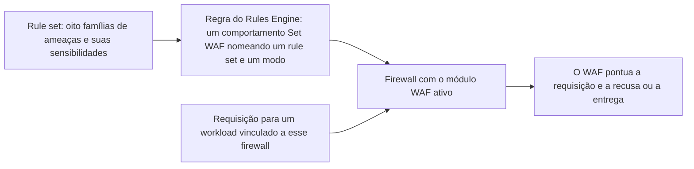

import DocButton from '~/components/webkit/DocButton.vue';
import DocCardGroup from '@aziontech/webkit/doc-card-group'
import DocCard from '@aziontech/webkit/doc-card'

Um web application firewall lê aquilo em que uma aplicação de outro modo confiaria: a query string, os headers, os cookies e o corpo de uma requisição. Ele pesa o que encontra contra padrões conhecidos por carregar ataques e recusa a requisição quando as evidências ultrapassam um limiar que você escolhe. A verificação roda na camada 7 do modelo OSI, a camada de aplicação, na frente da aplicação em vez de dentro dela. O código da aplicação não muda. Para o termo genérico, consulte o [Learning Center](https://www.azion.com/pt-br/learning/).

O **Web Application Firewall (WAF)** executa essa inspeção na infraestrutura distribuída da Azion, como um módulo do [Firewall](/pt-br/documentacao/plataforma/firewall/). O que detectar fica em um rule set, que carrega oito famílias de ameaças e o nível de sensibilidade escolhido para cada uma. Quando aplicar fica em uma regra do [Rules Engine for Firewall](/pt-br/documentacao/plataforma/firewall/rules-engine/), cujo comportamento `Set WAF` nomeia o rule set e o modo. Use o WAF para pontuar o tráfego na frente de uma aplicação, observar uma configuração antes que ela recuse qualquer coisa, isentar as requisições que a sua aplicação envia legitimamente e encontrar a regra por trás de um bloqueio.

<DocButton href="/pt-br/documentacao/secure/waf/primeiros-passos/" label="Primeiros passos" size="medium" />
<DocButton href="/pt-br/documentacao/secure/waf/guias/" label="Guias de WAF" kind="secondary" size="medium" />

---

## Estrutura de um rule set

Um rule set é o objeto que você configura. O objeto abaixo carrega a configuração padrão: todas as oito famílias de ameaças, cada uma em sensibilidade `medium`.

```json
{
  "name": "my-waf-rule-set",
  "active": true,
  "product_version": "1.0",
  "engine_settings": {
    "engine_version": "2021-Q3",
    "type": "score",
    "attributes": {
      "rulesets": [1],
      "thresholds": [
        { "threat": "cross_site_scripting", "sensitivity": "medium" },
        { "threat": "directory_traversal", "sensitivity": "medium" },
        { "threat": "evading_tricks", "sensitivity": "medium" },
        { "threat": "file_upload", "sensitivity": "medium" },
        { "threat": "identified_attack", "sensitivity": "medium" },
        { "threat": "remote_file_inclusion", "sensitivity": "medium" },
        { "threat": "sql_injection", "sensitivity": "medium" },
        { "threat": "unwanted_access", "sensitivity": "medium" }
      ]
    }
  }
}
```

- `thresholds` carrega uma entrada por família de ameaças, cada uma nomeando a família e a sensibilidade que transforma um score em um bloqueio. São oito famílias, e todas começam em `medium`.
- `rulesets` nomeia o rule set gerenciado que o engine executa, e `engine_settings.type` é `score`. Ambos aceitam um único valor, portanto as regras internas por trás das famílias pertencem à Azion e não são editadas aqui.
- `name` e `active` são os campos do próprio rule set. Nada no objeto nomeia um domínio, um path ou um método, porque um rule set não escolhe o tráfego que ele pontua.
- O Azion Console monta o mesmo objeto pelo campo **Name**, pela tabela **Threat Type Configuration** e pelo switch **Active**, e sempre escreve todas as oito famílias.

Se você já configurou um rule set gerenciado em outro lugar, o formato se transfere: você escolhe categorias e um rigor por categoria, e as regras individuais permanecem com a plataforma.

---

## Caminho de inspeção

Criar um rule set não inspeciona nada. Um rule set permanece inerte até que uma regra o aplique ao tráfego, portanto outros três objetos ficam entre a configuração acima e uma requisição.



1. Você cria um rule set. Ele guarda as oito famílias de ameaças e a sensibilidade escolhida para cada uma.
2. O firewall que vai executá-lo carrega o módulo WAF ativo. O WAF é o único módulo que um firewall não ativa por conta própria.
3. Você cria uma regra no Rules Engine for Firewall e seleciona o comportamento `Set WAF`. Os critérios da regra escolhem as requisições, e o comportamento nomeia o rule set e o modo, _Logging_ ou _Blocking_.
4. Um [workload](/pt-br/documentacao/plataforma/workloads/) que serve a sua aplicação está vinculado a esse firewall, portanto as requisições para ele executam o Rules Engine desse firewall.
5. Uma requisição cujos critérios correspondem é pontuada contra as famílias de ameaças do rule set nomeado.
6. Um score que alcança o limiar da sua família torna a requisição uma correspondência. _Blocking_ a recusa, e _Logging_ a registra e a entrega.

Um rule set que nenhuma regra nomeia nunca é executado, por mais cuidadosamente que suas famílias estejam configuradas. Para o modelo de score e o que cada modo faz, consulte [Como WAF funciona](/pt-br/documentacao/secure/waf/como-funciona/).

---

## Escopo e limites

- **Famílias de ameaças**: um rule set pontua uma requisição contra oito famílias: SQL injection, cross-site scripting, remote file inclusion, directory traversal, file upload, evading tricks, identified attack e unwanted access. Elas são sustentadas por 63 regras internas, cada uma com o seu próprio identificador. Para o que cada família cobre e o que cada regra corresponde, consulte [WAF Rule Sets](/pt-br/documentacao/secure/waf/rule-sets/).
- **Sensibilidade**: cinco níveis, definidos por família, começando em `medium`. O nível fixa o score em que essa família bloqueia, e uma sensibilidade mais alta é um limiar mais baixo, portanto ela bloqueia com menos evidência. Para os cinco níveis e seus limiares, consulte [WAF Rule Sets](/pt-br/documentacao/secure/waf/rule-sets/).
- **Modos**: um comportamento `Set WAF` aplica um rule set em `logging` ou em `blocking`. O modo pertence à regra, e não ao rule set, portanto o mesmo rule set roda em _Logging_ em um path e em _Blocking_ em outro. Para mais informações, consulte [Como WAF funciona](/pt-br/documentacao/secure/waf/como-funciona/#modos).
- **O que uma requisição bloqueada recebe**: `400` e a página de erro padrão da Azion. Nada nessa resposta nomeia o WAF, a regra que correspondeu ou o score, portanto um bloqueio é identificado pelo header `x-azion-request-id` nela e consultado depois.
- **Exceções**: uma exceção isenta uma parte de uma requisição de uma regra interna, ou de todas elas, sem baixar a sensibilidade para o resto do tráfego. O Azion Console chama o objeto de allowed rule. Para cada campo e todas as quinze match zones, consulte [WAF Exceptions](/pt-br/documentacao/secure/waf/custom-allowed-rules/).
- **Interfaces**: você cria e gerencia rule sets e exceções no **Azion Console**, que lista rule sets em **WAF Rules**, com a [Azion CLI](/pt-br/documentacao/devtools/cli/) e pela API da Azion em `https://api.azion.com/v4/workspace/wafs`. Para as superfícies de API e de CLI, consulte [WAF Rule Sets](/pt-br/documentacao/secure/waf/rule-sets/) e [WAF Exceptions](/pt-br/documentacao/secure/waf/custom-allowed-rules/).
- **Observabilidade**: uma correspondência não deixa nada na resposta, portanto toda pergunta sobre ela é respondida a partir de uma superfície de reporte. O [Real-Time Metrics](/pt-br/documentacao/plataforma/real-time-metrics/#waf) reporta requisições processadas e requisições bloqueadas ao longo do tempo, o [Real-Time Events](/pt-br/documentacao/observe/real-time-events/) retorna uma linha por requisição com as regras que corresponderam e o score que cada família alcançou, e o [Data Stream](/pt-br/documentacao/observe/data-stream/) envia esses eventos para um sistema fora da Azion. Os mesmos dados de evento são consultados pela [API GraphQL](/pt-br/documentacao/devtools/graphql/visao-geral/), e [Como integrar WAF com SIEMs](/pt-br/documentacao/produtos/secure/automatizar/integrar-siems/) cobre o envio deles para um SIEM.
- **Limites**: o WAF faz o parsing do corpo de uma requisição em cinco content types, e uma requisição cujo corpo ultrapassa 131.072 bytes, que são 128 KiB, é recusada em vez de inspecionada. Um rule set carrega uma entrada de `thresholds` por família de ameaças, e uma consulta de Tuning alcança uma janela fixa para trás. Para cada limite, a resposta acima dele e o uso que cada plano de serviço inclui, consulte [Limites de WAF](/pt-br/documentacao/secure/waf/limites/).
- **Cobrança**: o WAF é cobrado por Requests, Rule Sets e Exceptions. Para a taxa acima da quantidade que um plano inclui, consulte [Preços](/pt-br/documentacao/fundamentos/precos/#web-application-firewall).

O WAF não escolhe o tráfego que ele inspeciona. Um rule set não carrega domínio, path nem método, portanto as requisições que ele pontua são exatamente aquelas que os critérios de uma regra do Rules Engine entregam a ele.

---

## Loop de tuning

Os dois modos e as exceções funcionam como um único loop, e é ele que impede que um rule set novo recuse tráfego legítimo. Uma regra roda primeiro em _Logging_, onde toda requisição que alcança um limiar é registrada e nenhuma é recusada.

A aba **Tuning** de um rule set lista esses registros, agrupados pela regra interna que correspondeu, e filtrados por workload, path, país, endereço IP e [Network Lists](/pt-br/documentacao/secure/network-shield/network-lists/). Um registro que é uma requisição legítima é um falso positivo, e o Tuning transforma registros selecionados em allowed rules em lote, de modo que uma exceção vem da requisição que a produziu. Quando os registros param de carregar falsos positivos, a regra muda para _Blocking_.

Para a tela de Tuning e seus campos, consulte [WAF Exceptions](/pt-br/documentacao/secure/waf/custom-allowed-rules/). Para o procedimento, consulte [Ajuste um WAF rule set](/pt-br/documentacao/guias/seguranca-de-aplicacoes/firewall-e-waf/tune-waf/).

---

## Próximos passos

<DocCardGroup cols={2}>
  <DocCard title="Como WAF funciona" href="/pt-br/documentacao/secure/waf/como-funciona/" label="Acompanhe uma requisição do workload até a decisão e veja o que cada modo faz." />
  <DocCard title="WAF Rule Sets" href="/pt-br/documentacao/secure/waf/rule-sets/" label="Consulte os campos, as oito famílias de ameaças, os cinco níveis de sensibilidade e as regras internas." />
  <DocCard title="WAF Exceptions" href="/pt-br/documentacao/secure/waf/custom-allowed-rules/" label="Consulte os campos e as match zones que tiram um falso positivo do score." />
  <DocCard title="Limites de WAF" href="/pt-br/documentacao/secure/waf/limites/" label="Consulte um limite, a resposta acima dele e o uso que cada plano de serviço inclui." />
  <DocCard title="Guias e tutoriais de WAF" href="/pt-br/documentacao/secure/waf/guias/" label="Execute uma tarefa específica, de criar um rule set a fazer o tuning de um." />
  <DocCard title="Solucionar problemas de WAF" href="/pt-br/documentacao/secure/waf/solucao-de-problemas/" label="Encontre a causa quando uma requisição legítima é recusada ou nada é bloqueado." />
</DocCardGroup>
