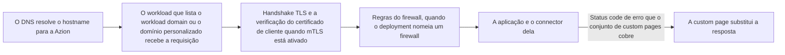

import DocButton from '~/components/webkit/DocButton.vue'
import DocCardGroup from '@aziontech/webkit/doc-card-group'
import DocCard from '@aziontech/webkit/doc-card'

O ponto de entrada de um site é a configuração que responde aos hostnames dele, os nomes como `www.example.com` que os clientes pedem. Uma consulta DNS envia o cliente até ele, e o ponto de entrada encerra a conexão Transport Layer Security (TLS), o canal criptografado no qual o servidor prova com um certificado que detém o hostname. Com TLS mútuo (mTLS), o cliente também prova a identidade dele com um certificado. O ponto de entrada então decide qual código responde à requisição, de modo que os hostnames e os certificados mudam sem nenhuma mudança nesse código.

**Workloads** é o recurso da plataforma que executa esse ponto de entrada na infraestrutura distribuída da Azion. Um workload guarda um workload domain que a Azion gera, os domínios que você adiciona, as configurações de TLS e mTLS, as portas e as versões HTTP que aceita e a infraestrutura em que roda. O deployment dele nomeia a [aplicação](/pt-br/documentacao/plataforma/applications/) que responde e, opcionalmente, o [firewall](/pt-br/documentacao/plataforma/firewall/) que inspeciona as requisições primeiro e o conjunto de custom pages que substitui as respostas de erro. Use Workloads para colocar uma aplicação no seu próprio domínio, servi-la por HTTPS com o seu certificado ou com um que a Azion solicita para você, exigir certificados de cliente ou testar uma configuração em staging antes da produção.

<DocButton href="/pt-br/documentacao/plataforma/workloads/primeiros-passos/" label="Primeiros passos" size="medium" />
<DocButton href="/pt-br/documentacao/plataforma/workloads/configuracoes/" label="Configurações de workload" kind="secondary" size="medium" />

---

## Estrutura do workload

Um workload é um objeto JSON. `azion describe workload --workload-id <workload-id> --format json` retorna um workload novo, criado com um nome e todos os padrões, como a API o armazena:

```json
{
 "active": true,
 "created_at": "2026-10-01T20:53:41.023072Z",
 "domains": [],
 "id": <workload-id>,
 "infrastructure": 1,
 "last_editor": "<your-email>",
 "last_modified": "2026-10-01T20:53:41.023046Z",
 "mtls": {
  "config": {
   "certificate": null,
   "verification": null
  },
  "enabled": false
 },
 "name": "my-workload",
 "product_version": "1.0",
 "protocols": {
  "http": {
   "http_ports": [
    80
   ],
   "https_ports": [
    443
   ],
   "quic_ports": [
    443
   ],
   "versions": [
    "http1",
    "http2",
    "http3"
   ]
  }
 },
 "tls": {
  "certificate": null,
  "ciphers": 7,
  "minimum_version": "tls_1_3"
 },
 "workload_domain": "<id>.map.azionedge.net",
 "workload_domain_allow_access": true
}
```

- `workload_domain` é o hostname somente leitura que a Azion gera na criação. `domains` guarda os seus próprios hostnames, e `workload_domain_allow_access` decide se os clientes ainda alcançam o workload domain.
- `infrastructure` é `1` para produção e `2` para staging, e define o sufixo do workload domain.
- `protocols.http` lista as versões HTTP e as portas que o workload aceita. `tls` nomeia o certificado, em que `null` seleciona o certificado SAN da Azion, junto com o conjunto de cifras e a versão mínima de TLS.
- `mtls` vem desativado em um workload novo. Ativado, ele nomeia o certificado de CA confiável com o qual os certificados de cliente são verificados e um modo de verificação.

O workload não guarda nenhuma aplicação. O deployment dele, um subobjeto em `/v4/workspace/workloads/{workload_id}/deployments`, nomeia a aplicação, o firewall e o conjunto de custom pages nas chaves `application`, `firewall` e `custom_page` de `strategy.attributes`. Se você conhece uma property de outra plataforma, o workload e o deployment dele cumprem juntos esse papel.

---

## Caminho da requisição

Criar um workload não serve nada até que o deployment dele nomeie uma aplicação. Até o deployment se propagar, o workload domain responde `404` com a página de erro HTML da Azion.



1. O cliente consulta o hostname. Um domínio personalizado aponta para o workload domain com um registro CNAME, então o DNS retorna um endereço da infraestrutura distribuída da Azion.
2. O workload que lista o hostname recebe a requisição.
3. O workload conclui o handshake TLS com o certificado, a versão mínima de TLS e o conjunto de cifras dele. Com mTLS ativado, ele também verifica o certificado de cliente.
4. Quando o deployment nomeia um firewall, o firewall executa as regras dele sobre a requisição antes da aplicação.
5. A aplicação do deployment trata a requisição e busca o conteúdo por meio do connector dela.
6. Quando o connector responde com um status code de erro que o conjunto de custom pages do deployment cobre, o cliente recebe a custom page no lugar dessa resposta.

Um workload guarda um deployment, então todo hostname do workload chega à mesma aplicação, ao mesmo firewall e ao mesmo conjunto de custom pages. Para cada etapa do caminho e o que ela custa, consulte [Como Workloads funciona](/pt-br/documentacao/plataforma/workloads/como-funciona/). Para um domínio que responde `404` ou um handshake que falha, consulte [Solucionar problemas de Workloads](/pt-br/documentacao/plataforma/workloads/solucao-de-problemas/).

---

## Recursos

Certificate Manager e Custom Pages agem sobre um workload quando você vincula um certificado a ele ou atribui um conjunto de custom pages no deployment dele. DDoS Protection age sobre todo workload, sem nada a vincular.

### Certificate Manager

Certificate Manager armazena os certificados que um workload usa para TLS: certificados de servidor que você envia com a chave privada deles e certificados de CA confiável que verificam certificados de cliente para mTLS. Ele também solicita certificados Let's Encrypt para os domínios do workload e os renova para você, armazena listas de revogação de certificados (CRLs) e cria solicitações de assinatura de certificado (CSRs). Recorra a ele quando um domínio seu precisa servir HTTPS, já que o certificado SAN da Azion cobre somente o workload domain e o Azion Custom Domain.

Para os tipos de certificado, os campos e os status deles, consulte [Certificados](/pt-br/documentacao/plataforma/workloads/certificate-manager/certificados/), para saber como a Azion emite e renova um certificado Let's Encrypt, consulte [Emissão e renovação](/pt-br/documentacao/plataforma/workloads/certificate-manager/emissao-e-renovacao/), e para vincular o seu primeiro certificado a um workload, consulte [Primeiros passos com Certificate Manager](/pt-br/documentacao/plataforma/workloads/certificate-manager/primeiros-passos/).

### Custom Pages

Custom Pages substitui a resposta de erro que um connector retorna por uma página sua, uma página por status code 4xx ou 5xx. Um conjunto de custom pages agrupa essas páginas, e cada página busca o conteúdo dela em um [connector](/pt-br/documentacao/plataforma/connectors/), mantém esse conteúdo em cache pelo próprio tempo e responde com o status code que você define. O cliente recebe a página no lugar da resposta, sem redirecionamento. Use-o quando os visitantes precisam ver a sua própria página em vez da página de erro da origem, e atribua o conjunto no deployment do workload.

Para os campos de um conjunto e das páginas dele, e os status codes que uma página pode substituir, consulte [Configurações de custom page](/pt-br/documentacao/plataforma/workloads/custom-pages/configuracoes/), e para substituir o seu primeiro `404`, consulte [Primeiros passos com Custom Pages](/pt-br/documentacao/plataforma/workloads/custom-pages/primeiros-passos/).

### DDoS Protection

Um ataque de negação de serviço (DoS) inunda um serviço com tráfego até que as requisições legítimas não consigam passar, e um ataque distribuído (DDoS) envia esse tráfego de muitas máquinas ao mesmo tempo. DDoS Protection é uma funcionalidade da plataforma, sempre ativa: a plataforma mitiga ataques DDoS em todo workload, nas camadas de rede, de transporte, de apresentação e de aplicação, sem nada a criar e nada a configurar. Para detecção e mitigação voltadas a um ataque específico, você escreve regras personalizadas no firewall que o deployment nomeia.

Para os tipos de ataque e as técnicas de mitigação, consulte [Mitigação de ataques](/pt-br/documentacao/plataforma/workloads/ddos-protection/ddos-mitigation/), e para os limites dela, consulte [Limites de Workloads](/pt-br/documentacao/plataforma/workloads/limites/#ddos-protection).

---

## Escopo e limites

- **Domínios**: um workload responde no workload domain dele, `<id>.map.azionedge.net` em produção e `<id>.preview.azionedge.net` em staging, assim que o deployment dele se propaga, antes de você ter qualquer domínio. Você adiciona domínios seus, cada um um hostname completo sem wildcard, e aponta cada um para o workload domain com um registro CNAME. Um workload de produção também pode responder em um hostname `azion.app` gratuito, que Azion Console chama de **Azion Custom Domain**, sem custo adicional. O interruptor **Workload Domain Allow Access** fecha o workload domain quando os seus próprios domínios passam a atender o tráfego. Para cada regra que um hostname segue, consulte [Configurações de workload](/pt-br/documentacao/plataforma/workloads/configuracoes/#dominios), e para os registros DNS, consulte [Aponte um domínio para um workload](/pt-br/documentacao/guias/plataforma/migracao/apontar-dominio-para-a-azion/).
- **DNS**: um workload não guarda registros DNS. A zona de um domínio fica no seu provedor de DNS ou no [Edge DNS](/pt-br/documentacao/plataforma/edge-dns/), e o workload responde aos hostnames que lista, onde quer que a zona deles esteja hospedada.
- **Infraestrutura**: o controle **Infrastructure** executa um workload na Production Network, para disponibilidade global, ou na Staging Network, para testes com propagação limitada. A escolha é fixada na criação, e um workload de staging não aceita domínio personalizado. Para saber como testar uma mudança em staging primeiro, consulte [Boas práticas de Workloads](/pt-br/documentacao/plataforma/workloads/boas-praticas/).
- **Protocolos**: um workload aceita HTTP/1.1, HTTP/2 e HTTP/3 sobre QUIC, que exige HTTPS ativado e as duas versões anteriores listadas. HTTP roda em até quatro portas, entre `80`, `8008`, `8080` e `8880`, com `80` por padrão, e HTTPS em até doze portas listadas, com `443` por padrão. Para as portas, consulte [Configurações de workload](/pt-br/documentacao/plataforma/workloads/configuracoes/#protocolos-e-portas).
- **TLS**: a versão mínima de TLS vai de TLS 1.0 a TLS 1.3, o padrão, e TLS 1.0 e 1.1 estão descontinuados. Oito conjuntos de cifras estão disponíveis, com o conjunto `7` por padrão. O certificado SAN da Azion cobre o workload domain e o hostname `azion.app`, e um domínio seu precisa de um certificado de servidor de [Certificate Manager](/pt-br/documentacao/plataforma/workloads/#certificate-manager). A Azion bloqueia a renegociação TLS e a retomada de sessão TLS (TLS resumption) por padrão. Essas configurações protegem a conexão do cliente até a Azion, enquanto a conexão com a sua origem é configurada no connector. Para os campos e as cifras de cada conjunto, consulte [Configurações de workload](/pt-br/documentacao/plataforma/workloads/configuracoes/#tls).
- **mTLS**: um workload verifica certificados de cliente com um certificado de CA confiável, com até 100 CRLs, no modo `enforce` ou `permissive`, somente em conexões HTTPS. A Azion ativa mTLS por conta, então entre em contato com o time de Vendas para ativá-lo. Para os dois modos e todos os requisitos, consulte [mTLS](/pt-br/documentacao/plataforma/workloads/mtls/).
- **Deployment**: um workload guarda um deployment, que nomeia a aplicação, obrigatória, e um firewall e um conjunto de custom pages, ambos opcionais. Azion CLI cria um deployment, mas não consegue atualizá-lo nem excluí-lo, então altere-o no Azion Console ou pela API. Para os campos dele, consulte [Configurações de workload](/pt-br/documentacao/plataforma/workloads/configuracoes/#deployment).
- **Propagação**: uma mudança salva em um workload ou no deployment dele leva vários minutos para alcançar toda a infraestrutura distribuída da Azion, sem duração garantida. Enquanto isso, as requisições podem receber a configuração antiga ou a nova. Para mais informações, consulte [Propagação](/pt-br/documentacao/plataforma/workloads/como-funciona/#propagacao).
- **Interfaces**: você cria e gerencia workloads na página **Workloads** do [Azion Console](https://console.azion.com/), pela [Azion API](https://api.azion.com/) em `/v4/workspace/workloads`, com comandos do [Azion CLI](/pt-br/documentacao/devtools/cli/) como `azion create workload` e `azion create workload-deployment`, e com os recursos `azion_workload` e `azion_workload_deployment` do [Terraform](/pt-br/documentacao/devtools/terraform/workloads/).
- **API v4**: na API v3, um único objeto Domains cumpria o papel de um workload, e as Main Settings de uma aplicação guardavam as configurações de protocolo e de TLS. Na API v4, o workload e o deployment dele os substituem. Para o mapeamento entre os dois modelos, consulte [Migração para API v4](/pt-br/documentacao/fundamentos/api-v4-migration/), e para uma conta que ainda roda a API v3, consulte [Domains](/pt-br/documentacao/plataforma/workloads/domains/).
- **Observabilidade**: a página de erro da Azion carrega um header `x-azion-request-id` que identifica a requisição. [Data Stream](/pt-br/documentacao/plataforma/data-stream/) coleta os eventos dos workloads que você associa a um stream, como mostra [Associe workloads a um stream](/pt-br/documentacao/guias/plataforma/observabilidade/data-stream-associar-workloads/).
- **Limites**: o `name` de um workload aceita até 100 caracteres, e um workload cobre até 50 domínios. Uma conta guarda 100 workloads nos planos de suporte Developer, Business e Enterprise, e 1.000 no Mission-Critical. Para cada limite e a resposta quando ele é ultrapassado, consulte [Limites de Workloads](/pt-br/documentacao/plataforma/workloads/limites/).
- **Cobrança**: Workloads é cobrado por workloads, data transfer e requisições. Cada plano inclui uma quantidade de cada um, como 10 workloads no Hobby e 20 no Pro. Para os valores, consulte [Preços](/pt-br/documentacao/fundamentos/precos/#workloads).
- **Termos**: o [glossário de Workloads](/pt-br/documentacao/plataforma/workloads/glossario/) define as palavras às quais as páginas de Workloads dão um significado específico, como workload domain, deployment, Azion custom domain e certificado de CA confiável.

---

## Próximos passos

<DocCardGroup cols={2}>
  <DocCard title="Primeiros passos" href="/pt-br/documentacao/plataforma/workloads/primeiros-passos/" label="Crie um workload, vincule a sua aplicação e envie a sua primeira requisição." />
  <DocCard title="Como funciona" href="/pt-br/documentacao/plataforma/workloads/como-funciona/" label="Acompanhe uma requisição do DNS pelo TLS e pelo deployment até a sua aplicação." />
  <DocCard title="Configurações de workload" href="/pt-br/documentacao/plataforma/workloads/configuracoes/" label="Consulte um campo, o padrão dele ou os valores que ele aceita." />
  <DocCard title="Guias e tutoriais" href="/pt-br/documentacao/plataforma/workloads/guias/" label="Conclua uma tarefa específica, de um domínio personalizado a um certificado Let's Encrypt." />
</DocCardGroup>
