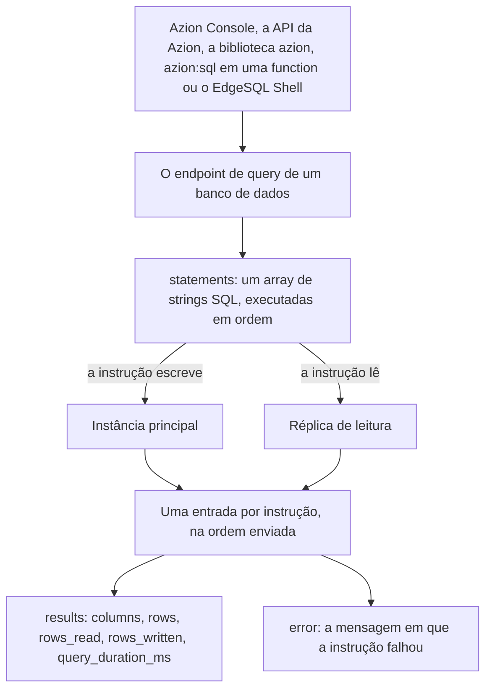

import DocButton from '~/components/webkit/DocButton.vue';
import DocCardGroup from '@aziontech/webkit/doc-card-group'
import DocCard from '@aziontech/webkit/doc-card'

Um [banco de dados relacional](https://www.azion.com/en/learning/storage-database/what-is-relational-database/) guarda registros em tabelas de linhas e colunas, em que cada coluna carrega um tipo de valor e cada linha é um registro. SQL é a linguagem que lê e altera esses registros: uma instrução descreve as linhas que você quer, e o banco de dados as encontra. Como serviço gerenciado, um banco de dados é criado por uma requisição em vez de instalado, então não há servidor para provisionar, nem engine para atualizar, nem replicação para configurar.

**SQL Database** executa esses bancos de dados na infraestrutura distribuída da Azion. Um banco de dados é um objeto que você cria por nome, e toda instrução é endereçada a um deles. Os bancos de dados são totalmente compatíveis com ACID e o dialeto é o do SQLite, então uma instrução que você já escreve roda sem alteração. Uma instância principal recebe todas as escritas, e réplicas de leitura respondem às leituras. Use SQL Database para armazenar telemetria de dispositivos IoT, acompanhar o inventário de centros de distribuição de comércio eletrônico, analisar logs de acesso em busca de ataques de segurança ou gerenciar dados de acesso.

<DocButton href="/pt-br/documentacao/store/sql-database/primeiros-passos/" label="Primeiros passos" size="medium" />
<DocButton href="/pt-br/documentacao/store/sql-database/guias/" label="Guias do SQL Database" kind="secondary" size="medium" />

---

## Instruções e resultados

SQL alcança um banco de dados por um único endpoint, que recebe um array de strings SQL e retorna uma entrada por string:

```bash
curl --request POST \
  --url https://api.azion.com/v4/workspace/sql/databases/1851/query \
  --header 'Accept: application/json' \
  --header 'Authorization: Token [TOKEN VALUE]' \
  --header 'Content-Type: application/json' \
  --data '{
  "statements": ["SELECT id, name, email FROM users;"]
}'
```

A resposta carrega as colunas, as linhas e o que a instrução custou:

```json
{
  "state": "executed",
  "data": [
    {
      "results": {
        "columns": ["id", "name", "email"],
        "rows": [[1, "Ada", "ada@example.com"]],
        "rows_read": 1,
        "rows_written": 0,
        "query_duration_ms": 0.034
      }
    }
  ]
}
```

- `statements` carrega uma ou mais strings SQL. `CREATE TABLE`, `INSERT` e `SELECT` são todos strings nesse único array, então uma única chamada mistura mudanças de schema, escritas e leituras.
- `columns` e `rows` carregam o conjunto de resultados. Cada entrada de `rows` é uma linha, com seus valores na ordem das colunas.
- `rows_read` e `rows_written` são as duas métricas que a Azion cobra, e cada instrução reporta as suas.
- Uma instrução que falha ainda responde HTTP `200`, e sua entrada carrega `error` no lugar de `results`. Leia `data[].error` antes de ler `data[].results`.

Se você conhece SQLite, você conhece o dialeto: as strings dentro do array são SQL comum. Para as instruções que o engine aceita, consulte a [referência de linguagem do SQLite](https://www.sqlite.org/lang.html).

---

## Caminho de uma instrução

Uma instrução que falha não faz a requisição falhar. A chamada responde HTTP `200` tanto se todas as instruções tiverem sucesso quanto se uma delas não tiver, então a linha de status descreve a requisição e nunca o SQL dentro dela.



1. Você cria um banco de dados com `POST /databases` e um `name`. Ele responde a instruções assim que seu `status` indica `created`, cerca de 15 segundos depois.
2. Cinco interfaces enviam instruções ao endpoint de query desse banco de dados: Azion Console, a API da Azion, a biblioteca `azion`, o módulo `azion:sql` dentro de uma [function](/pt-br/documentacao/build/functions/) e o EdgeSQL Shell.
3. O array `statements` é executado na ordem em que lista as instruções, e pelo menos 100 instruções em uma chamada são executadas com sucesso.
4. Uma instrução que escreve é aplicada na instância principal, enquanto uma leitura é respondida por uma réplica de leitura, então nada escreve diretamente em uma réplica.
5. Cada instrução retorna uma entrada em `data`, que carrega `results` com `columns`, `rows`, `rows_read`, `rows_written` e `query_duration_ms`.
6. Uma instrução que falhou carrega `error` nessa entrada, e as entradas ao redor dela continuam carregando seus resultados.

Para as instâncias, o ciclo de vida de um banco de dados e o que uma instrução custa, consulte [Como o SQL Database funciona](/pt-br/documentacao/store/sql-database/como-funciona/).

---

## O que SQL Database abrange

- **Interfaces.** Azion Console, a [API da Azion v4](/pt-br/documentacao/store/sql-database/bancos-de-dados-e-consultas/), a [biblioteca `azion`](/pt-br/documentacao/devtools/azion-lib/sql/) para Node e TypeScript, o [módulo `azion:sql`](/pt-br/documentacao/devtools/runtime/api-reference/sql-database/) dentro de uma function e o [EdgeSQL Shell](/pt-br/documentacao/store/sql-database/edgesql-shell/), uma ferramenta de linha de comando. Todas as cinco alcançam os mesmos bancos de dados.
- **Dialeto SQL.** O do SQLite, que é a razão pela qual um schema existente e uma query existente são aproveitados. Os tipos e as funções vetoriais o estendem, e nada mais.
- **Disponibilidade.** SQL Database é um produto em Preview em todos os planos de serviço. Não é habilitado por padrão em uma conta, e o acesso é solicitado por meio de um ticket de suporte. Para solicitá-lo, consulte [Suporte Técnico](/pt-br/documentacao/suporte/).
- **Limites.** O nome de um banco de dados tem de 6 a 50 caracteres, entre letras, números e o hífen, e é único na conta. Uma tabela guarda até 2.000 colunas, um vetor carrega até 65.536 dimensões e uma requisição de listagem retorna até 100 bancos de dados. A quantidade de bancos de dados, o tamanho de cada um e o armazenamento por conta são incluídos por plano. Para cada limite e o que acontece ao ultrapassá-lo, consulte [Limites do SQL Database](/pt-br/documentacao/store/sql-database/limites/).
- **Recomendações e falhas.** [Boas práticas](/pt-br/documentacao/store/sql-database/boas-praticas/) cobre a leitura da chave de erro de cada instrução, a consulta do status de um novo banco de dados antes da primeira query e a indexação de uma coluna vetorial antes da primeira query de vizinho mais próximo. Quando uma requisição de criação é rejeitada, quando uma instrução retorna `error` ou quando o EdgeSQL Shell encerra na inicialização, consulte [Solução de problemas](/pt-br/documentacao/store/sql-database/solucao-de-problemas/).
- **O que ele não faz.** SQL Database armazena registros relacionais, então arquivos não estruturados pertencem ao [Object Storage](/pt-br/documentacao/store/object-storage/) e pares de chave e valor ao [KV Store](/pt-br/documentacao/store/kv-store/). Um banco de dados não pode ser renomeado, e `active` não pode ser alterado depois da criação: `PATCH` e `PUT` respondem `405`. Azion CLI não carrega nenhum comando SQL, e o provider Terraform da Azion não publica nenhum recurso SQL.

---

## Vector search

Uma coluna vetorial guarda um embedding, a representação numérica de um texto, de uma imagem ou de outro valor, na mesma tabela das colunas comuns. Uma única instrução, portanto, filtra por uma cláusula `WHERE` e ordena por distância vetorial, e nenhum serviço separado guarda uma segunda cópia dos dados.

A coluna é declarada como um tipo blob que carrega a quantidade de dimensões, um índice a marca para busca aproximada de vizinho mais próximo e `vector_top_k` retorna as linhas mais próximas:

```sql
CREATE TABLE teams (name TEXT, year INT, stats_embedding F32_BLOB(3));
CREATE INDEX teams_idx ON teams (libsql_vector_idx(stats_embedding));
SELECT name, year FROM vector_top_k('teams_idx', vector('[82, 25, 63]'), 2) JOIN teams ON teams.rowid = id;
```

É daqui que a etapa de recuperação de uma aplicação de retrieval-augmented generation (RAG) lê: [AI Inference](/pt-br/documentacao/build/ai-inference/) serve o modelo, e o banco de dados serve as linhas que o fundamentam. Para os tipos de coluna, as funções de distância, o índice e os limites, consulte [Vector search](/pt-br/documentacao/store/sql-database/vector-search/).

---

## Próximos passos

<DocCardGroup cols={2}>
  <DocCard title="Primeiros passos" href="/pt-br/documentacao/store/sql-database/primeiros-passos/" label="Crie seu primeiro banco de dados e execute uma query no Azion Console." />
  <DocCard title="Como funciona" href="/pt-br/documentacao/store/sql-database/como-funciona/" label="Acompanhe uma instrução da chamada até a instância que a responde." />
  <DocCard title="Bancos de dados e consultas" href="/pt-br/documentacao/store/sql-database/bancos-de-dados-e-consultas/" label="Consulte um campo, uma operação, um envelope ou um código de erro." />
  <DocCard title="Vector search" href="/pt-br/documentacao/store/sql-database/vector-search/" label="Declare uma coluna vetorial, indexe-a e ordene linhas por distância." />
  <DocCard title="Guias do SQL Database" href="/pt-br/documentacao/store/sql-database/guias/" label="Execute uma tarefa específica, pelo Azion Console, pela API ou por uma function." />
  <DocCard title="Limites" href="/pt-br/documentacao/store/sql-database/limites/" label="Consulte um limite, o que acontece ao ultrapassá-lo e o que cada plano inclui." />
</DocCardGroup>
