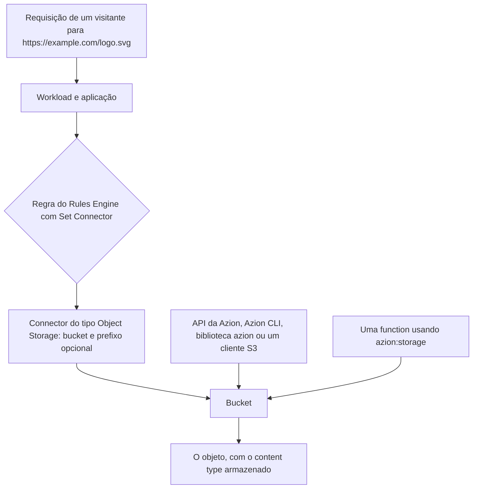

import DocButton from '~/components/webkit/DocButton.vue';
import DocCardGroup from '@aziontech/webkit/doc-card-group'
import DocCard from '@aziontech/webkit/doc-card'

O armazenamento de objetos guarda um arquivo inteiro, sob um nome que você escolhe, em um contêiner plano. Não há diretórios nem escritas parciais: um arquivo é gravado de uma vez, lido como uma unidade e substituído por inteiro. O nome é o único endereço que ele tem, então tudo o que lê o arquivo depois o lê por esse nome. O modelo serve para qualquer conteúdo gravado com pouca frequência e lido com muita, como imagens, vídeos, arquivos compactados e artefatos de build.

O **Object Storage** guarda esses arquivos na infraestrutura que a Azion opera, como objetos dentro de buckets. Um [Connector](/pt-br/documentacao/plataforma/connectors/) aponta uma aplicação para um bucket, de modo que uma requisição ao seu domínio é respondida a partir dele, e o código no [Azion Runtime](/pt-br/documentacao/devtools/runtime/api-reference/storage/) lê e grava os mesmos objetos durante uma requisição. Use o Object Storage para servir um site estático, guardar os ativos que uma aplicação entrega, receber uploads dos seus usuários ou coletar os dados que um stream produz.

<DocButton href="/pt-br/documentacao/store/object-storage/primeiros-passos/" label="Primeiros passos" size="medium" />
<DocButton href="/pt-br/documentacao/store/object-storage/guias/" label="Guias do Object Storage" kind="secondary" size="medium" />

---

## O bucket e o objeto

Um bucket é criado com um nome e um nível de acesso. Nada mais é configurado, e o bucket fica pronto assim que a requisição retorna:

```bash
curl --request POST \
  --url https://api.azion.com/v4/workspace/storage/buckets \
  --header 'Accept: application/json' \
  --header 'Authorization: Token [TOKEN VALUE]' \
  --header 'Content-Type: application/json' \
  --data '{
  "name": "site-assets-ro",
  "workloads_access": "read_only"
}'
```

Um objeto é gravado nele por chave, com o conteúdo no corpo da requisição:

```bash
curl --request POST \
  --url https://api.azion.com/v4/workspace/storage/buckets/site-assets-ro/objects/assets/logo.svg \
  --header 'Accept: application/json' \
  --header 'Authorization: Token [TOKEN VALUE]' \
  --header 'Content-Type: image/svg+xml' \
  --data-binary '@./logo.svg'
```

- `name` é único entre todas as contas Azion, tem de 6 a 63 caracteres e não pode ser alterado depois.
- `workloads_access` decide o que a plataforma da Azion pode fazer com os objetos quando uma aplicação os serve. Não restringe a API da Azion nem o protocolo S3.
- A chave do objeto é o endereço inteiro. O segmento `assets/` faz parte da chave, e não é uma pasta que precisasse existir antes.
- O content type armazenado vem do cabeçalho `Content-Type`. Sem esse cabeçalho, a Azion detecta o tipo.

Se você já usou um serviço compatível com S3, o modelo se aplica: os mesmos buckets e objetos respondem a requisições S3 assinadas com uma credencial que você cria.

---

## Como uma requisição chega a um objeto

Um objeto responde a três tipos de chamador, e cada um se autentica de um jeito:



Criar um bucket não expõe nada. Até que um connector nomeie o bucket e uma regra envie requisições para ele, os objetos só são alcançáveis por um chamador que tenha um personal token ou uma credencial S3. Esse é o passo que a maioria das primeiras configurações esquece.

O endpoint S3 é uma interface de gerenciamento, dimensionada para criar, listar e remover objetos, e não para servir tráfego. Os usuários finais alcançam os objetos por meio de uma aplicação, onde o [Cache](/pt-br/documentacao/build/cache/) mantém uma cópia e as regras da própria aplicação se aplicam.

---

## O que o Object Storage abrange

- **Interfaces.** Azion Console, a [API da Azion v4](/pt-br/documentacao/store/object-storage/buckets-e-objetos/), a [Azion CLI](/pt-br/documentacao/devtools/cli/), o [Azion Runtime](/pt-br/documentacao/devtools/runtime/api-reference/storage/), a [biblioteca `azion`](/pt-br/documentacao/devtools/azion-lib/storage/) e o [protocolo S3](/pt-br/documentacao/store/object-storage/compatibilidade-s3/). Todas as seis alcançam os mesmos buckets.
- **Compatibilidade com S3.** Dezesseis operações S3, assinadas com um access key e um secret key que você cria como credencial, limitada aos buckets e às capabilities que você indicar. Ferramentas e SDKs S3 existentes se conectam a `s3.us-east-005.azionstorage.net`.
- **Níveis de acesso.** `read_only`, `read_write` e `restricted` decidem o que a plataforma pode fazer quando uma aplicação serve um bucket.
- **Entrega.** Um Connector do tipo Object Storage, com uma regra do Rules Engine, coloca um bucket atrás de um domínio. Um prefixo no connector decide onde começa o caminho da aplicação.
- **Limites.** Nomes de bucket têm de 6 a 63 caracteres e são únicos entre todas as contas Azion; uma chave de objeto tem até 1.024 caracteres; uma listagem retorna até 1.000 chaves por página; um bucket só é excluído quando não guarda objetos e nenhum foi removido dele nas últimas 24 horas. O armazenamento e as operações são incluídos por plano. Para cada limite, consulte [Limites do Object Storage](/pt-br/documentacao/store/object-storage/limites/).
- **Região.** Os objetos são armazenados em `us-east-005`, e a região não é selecionável.
- **O que ele não faz.** O Object Storage não versiona objetos: gravar em uma chave substitui o conteúdo, e a versão anterior não pode ser recuperada. Ele guarda arquivos não estruturados em vez de registros, então consulte-os pelo seu próprio código, ou use o [SQL Database](/pt-br/documentacao/store/sql-database/) para dados relacionais e o [KV Store](/pt-br/documentacao/store/kv-store/) para pares de chave e valor.

---

## Próximos passos

<DocCardGroup cols={2}>
  <DocCard title="Primeiros passos" href="/pt-br/documentacao/store/object-storage/primeiros-passos/" label="Crie seu primeiro bucket e armazene um objeto nele." />
  <DocCard title="Como funciona" href="/pt-br/documentacao/store/object-storage/como-funciona/" label="Acompanhe um objeto da gravação até a requisição que o serve." />
  <DocCard title="Buckets e objetos" href="/pt-br/documentacao/store/object-storage/buckets-e-objetos/" label="Consulte um campo, uma operação ou o erro que uma rejeição retorna." />
  <DocCard title="Compatibilidade com S3" href="/pt-br/documentacao/store/object-storage/compatibilidade-s3/" label="Crie uma credencial e conecte uma ferramenta ou SDK S3 existente." />
  <DocCard title="Guias do Object Storage" href="/pt-br/documentacao/store/object-storage/guias/" label="Execute uma tarefa específica, pelo Azion Console, pela API ou pela CLI." />
  <DocCard title="Limites" href="/pt-br/documentacao/store/object-storage/limites/" label="Consulte um limite, o que acontece ao ultrapassá-lo e o que cada plano inclui." />
</DocCardGroup>
