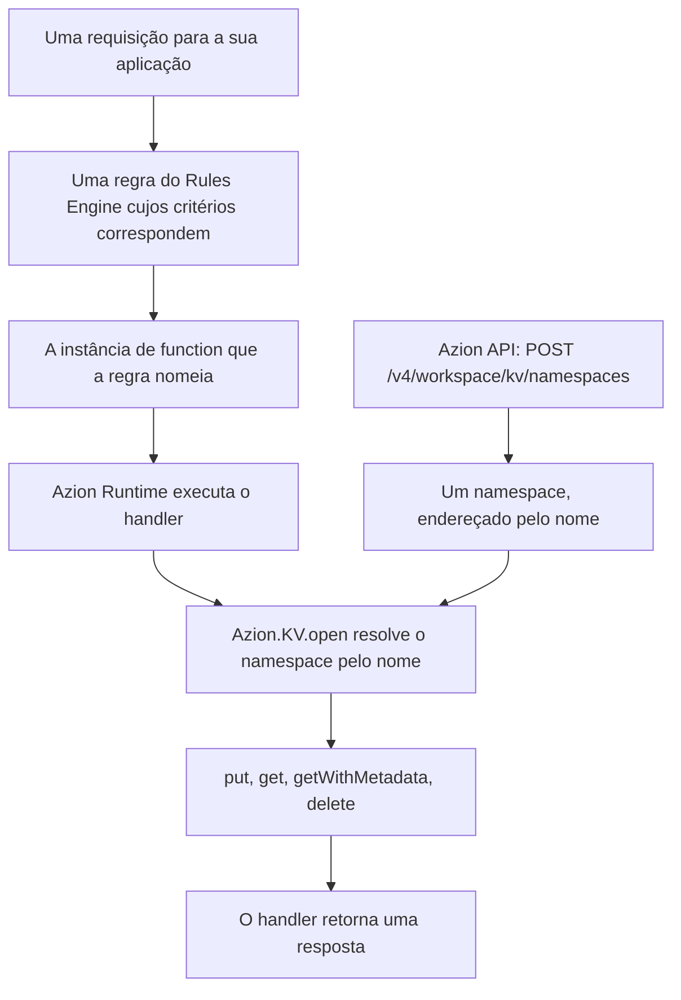

import DocButton from '~/components/webkit/DocButton.vue';
import DocCardGroup from '@aziontech/webkit/doc-card-group'
import DocCard from '@aziontech/webkit/doc-card'

Um armazenamento de chave-valor guarda cada valor sob um nome que você escolhe, e o encontra de novo apenas por esse nome. Não há tabelas, não há colunas e não há linguagem de consulta: uma leitura pede uma chave e recebe de volta o que foi escrito nela por último. Essa forma estreita é o que torna a busca barata, e é também o que ela custa, porque nada pesquisa os valores e nada lista as chaves para você.

**KV Store** executa esse modelo na infraestrutura distribuída da Azion. As chaves ficam dentro de um **namespace**, que você cria pela API da Azion e endereça pelo nome. Uma function lê e escreve essas chaves por meio de `Azion.KV`, um global do Azion Runtime que não precisa de import nem de credencial. Use KV Store para os valores pequenos de que uma requisição precisa de imediato: estado de sessão, feature flags, tabelas de roteamento e de redirecionamento, preferências por usuário e contadores de rate limit.

<DocButton href="/pt-br/documentacao/store/kv-store/primeiros-passos/" label="Primeiros passos" size="medium" />
<DocButton href="/pt-br/documentacao/store/kv-store/guias/" label="Guias do KV Store" kind="secondary" size="medium" />

---

## Chaves e valores

Uma function abre um namespace pelo nome e, em seguida, lê e escreve chaves no cliente que `open` retorna:

```javascript
export default {
  async fetch(request, env, ctx) {
    const kv = await Azion.KV.open('sessions');

    await kv.put('user-42', 'active', { metadata: { region: 'br' } });

    const value = await kv.get('user-42', 'text');
    if (value === null) {
      return new Response('No value for that key', { status: 404 });
    }

    return new Response(value);
  },
};
```

- `Azion.KV.open` é a única forma de obter um cliente, e é assíncrona. Todo cliente nomeia um namespace, porque não existe um namespace padrão.
- `put` recebe a chave, o valor e um objeto de opções. Um valor é uma string, um objeto, um `ArrayBuffer`, um `ReadableStream` ou uma visão de typed array; `metadata` acompanha o valor e volta com `getWithMetadata`.
- `get` recebe a chave e o tipo que você quer de volta: `text`, `json`, `arrayBuffer` ou `stream`. Passe um array de chaves em vez de uma só, e ele retorna um objeto indexado pelo nome.
- **Uma chave que nunca foi escrita retorna `null` em vez de lançar um erro.** Quem chama verifica isso; não é uma condição de erro.

---

## Como uma chave chega a uma function

Um namespace é criado uma vez, pela API. Tudo o que vem depois acontece dentro de uma requisição:



1. Você cria o namespace pela API da Azion. A criação é síncrona, e não há estado de provisionamento a esperar.
2. Uma requisição chega para a sua aplicação, e Rules Engine avalia as regras da fase atual.
3. Uma regra cujos critérios correspondem executa seus behaviors, e um deles seleciona uma instância de function.
4. Azion Runtime executa o handler dessa function.
5. `Azion.KV.open` resolve o namespace pelo nome. Um nome que nenhum namespace da conta carrega lança `NotFound`.
6. O handler chama `put`, `get`, `getWithMetadata` ou `delete` e retorna sua resposta.

Criar o namespace fora da requisição mantém curto o caminho da requisição, e custa a você a possibilidade de provisionar um sob demanda: uma function não pode criar o namespace de que precisa, então o nome precisa existir antes de o código que o abre ir para produção.

---

## O que KV Store cobre

- **Interfaces.** Duas. A [API da Azion](/pt-br/documentacao/store/kv-store/namespaces/) cria, lista e recupera namespaces; o [cliente `Azion.KV`](/pt-br/documentacao/store/kv-store/cliente-kv/) lê e escreve chaves dentro de uma function. **Azion Console não tem tela de KV Store**, e **Azion CLI e o provider Terraform da Azion não têm comando nem resource de KV Store**: não há o que procurar em nenhuma das três.
- **Disponibilidade.** KV Store é um produto em Preview em todos os planos de serviço. Não vem habilitado em uma conta por padrão, e o acesso é solicitado por um ticket de suporte. Para solicitá-lo, consulte [Technical Support](/pt-br/documentacao/suporte/).
- **Limites.** Um nome de namespace tem de 3 a 63 caracteres entre letras, números, hífen e underscore, e é único na conta. **Um namespace é permanente**: não pode ser renomeado, esvaziado nem excluído, então vale a pena definir o nome antes da primeira requisição. Para cada limite e o uso que cada plano inclui, consulte [Limites do KV Store](/pt-br/documentacao/store/kv-store/limites/).
- **Consistência.** Uma escrita fica visível de imediato onde ela chega e converge nos demais lugares depois, então uma leitura pode retornar o valor que uma escrita mais recente substituiu. [Como o KV Store funciona](/pt-br/documentacao/store/kv-store/como-funciona/) cobre o que isso muda no código que você escreve.
- **Recomendações e falhas.** [Boas práticas](/pt-br/documentacao/store/kv-store/boas-praticas/) cobre nomear um namespace que você não pode renomear, derivar nomes de chave quando nada as lista e ler os dois formatos de erro que a plataforma retorna. Quando uma chamada lança um erro, quando um build não consegue resolver um módulo ou quando um namespace que a API lista não é encontrado a partir de uma function, consulte [Solução de problemas](/pt-br/documentacao/store/kv-store/solucao-de-problemas/).
- **O que ele não faz.** Não há listagem de chaves, não há incremento atômico e não há operação que abranja mais de uma chave como unidade. KV Store guarda valores pequenos endereçados por nome, então arquivos não estruturados pertencem a [Object Storage](/pt-br/documentacao/store/object-storage/), registros relacionais a [SQL Database](/pt-br/documentacao/store/sql-database/) e uma resposta que você quer servir de novo a [Cache](/pt-br/documentacao/build/cache/).

---

## Próximos passos

<DocCardGroup cols={2}>
  <DocCard title="Primeiros passos" href="/pt-br/documentacao/store/kv-store/primeiros-passos/" label="Crie seu primeiro namespace e leia uma chave de volta a partir de uma function." />
  <DocCard title="Como o KV Store funciona" href="/pt-br/documentacao/store/kv-store/como-funciona/" label="Acompanhe uma chave da requisição até a function que a lê, e o que a consistência muda." />
  <DocCard title="Cliente KV" href="/pt-br/documentacao/store/kv-store/cliente-kv/" label="Consulte um método, um tipo de retorno, uma opção ou um erro que o cliente lança." />
  <DocCard title="Namespaces" href="/pt-br/documentacao/store/kv-store/namespaces/" label="Consulte um campo, uma operação, um envelope ou um código de erro na API da Azion." />
  <DocCard title="Guias do KV Store" href="/pt-br/documentacao/store/kv-store/guias/" label="Conclua uma tarefa específica com o cliente, de armazenar um valor a ler um stream." />
  <DocCard title="Limites" href="/pt-br/documentacao/store/kv-store/limites/" label="Consulte um limite, o que acontece ao ultrapassá-lo e o que cada plano inclui." />
</DocCardGroup>
