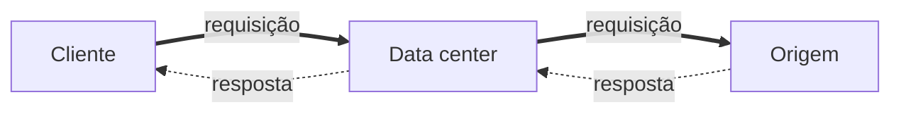
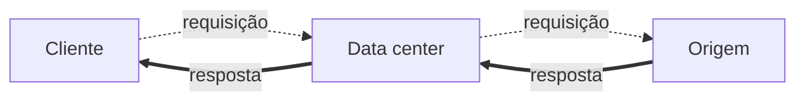
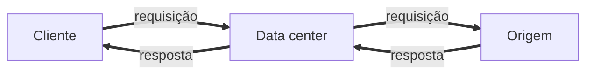
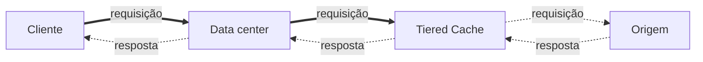
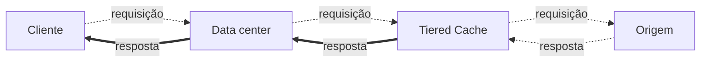
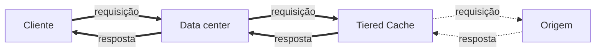
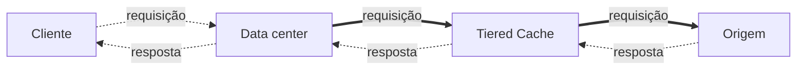
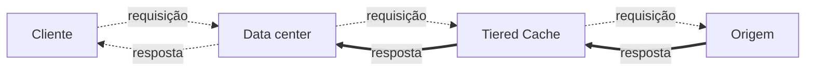
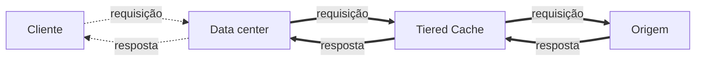

import FrameBox from '@aziontech/webkit/frame-box'
import ItemList from '@aziontech/webkit/item-list'
import DocItem from '@aziontech/webkit/doc-item'

A categoria **Build** de [Real-Time Metrics](/pt-br/documentacao/plataforma/real-time-metrics/) reúne os dashboards de quatro abas de produto: **Applications**, **Tiered Cache**, **Functions** e **Image Processor**. Selecione **Build** no dropdown de categoria para abri-los. Sem um dashboard na URL, Real-Time Metrics abre em **Build** › **Applications** › **Data Transferred**.

Cada dashboard abaixo tem uma tabela com uma linha por gráfico, na ordem em que o Console os desenha. A coluna **Agregação** traz a tag exibida sob a descrição de cada gráfico. Com **Sum**, uma entrada da legenda mostra o total no intervalo selecionado. Com **Average**, ela mostra esse total dividido pelo número de pontos. O texto sob cada tabela nomeia as séries que um gráfico desenha, o caminho dos dados que ele conta e a sua tag de variação. Essa tag compara o intervalo selecionado com a janela de mesma duração imediatamente anterior, e aparece apenas em um gráfico que desenha uma série. Cada dashboard termina com o dataset e os campos que retornam os mesmos números pela API GraphQL, para um detalhamento ou um intervalo que o gráfico não desenha. Para o intervalo de tempo e os filtros que se aplicam a todos os gráficos, consulte [Filtros e intervalo de tempo](/pt-br/documentacao/plataforma/real-time-metrics/filtros-e-intervalo-de-tempo/).

---

## Applications

A aba **Applications** mostra métricas do tráfego das aplicações de [Applications](/pt-br/documentacao/plataforma/applications/) configuradas na sua conta. Ela reúne cinco dashboards, nesta ordem no seletor de dashboard: **Data Transferred**, **Requests**, **Status Codes**, **Bandwidth Saving** e **Request Breakdown**. Os quatro primeiros leem o dataset `httpMetrics`, e **Request Breakdown** lê `httpBreakdownMetrics`.

### Data Transferred

O dashboard **Data Transferred** mede os bytes e a largura de banda que as suas aplicações movimentam, e quanto desse conteúdo o data center entrega a partir do seu cache. O gráfico **Edge Cache** conta os dados que passam por [Cache](/pt-br/documentacao/plataforma/applications/#cache), que precisa estar ativo na sua conta para reportar dados.

| Gráfico | O que mede | Unidade | Agregação |
| --- | --- | --- | --- |
| Edge Cache | Dados transferidos por Cache, divididos em dados de entrada, dados de saída e o total deles. | Bytes | Sum |
| Edge Offload | Parcela dos dados que o data center entregou a partir do seu cache, sem buscá-los na origem. | Percentual | Average |
| Saved Data | Dados que o data center entregou a partir do seu cache, sem buscá-los na origem. | Bytes | Sum |
| Missed Data | Dados que o data center entregou depois de buscá-los na origem. | Bytes | Sum |
| Total Bandwidth Usage | Largura de banda usada para entregar o seu conteúdo. | Bits por segundo | Sum |
| Bandwidth Offloaded | Parcela da largura de banda entregue a partir do cache, sem buscar o conteúdo na origem. | Percentual | Average |
| Saved Bandwidth | Largura de banda entregue a partir do cache, sem buscar o conteúdo na origem. | Bits por segundo | Sum |
| Missed Bandwidth | Largura de banda usada para buscar o conteúdo na origem e entregá-lo ao cliente. | Bits por segundo | Sum |

**Edge Cache** desenha três séries: **Data Transferred Total**, **Data Transferred Out** e **Data Transferred In**. O caminho que cada série conta depende de a aplicação usar [Tiered Cache](/pt-br/documentacao/plataforma/applications/cache/tiered-cache/), uma segunda camada de cache entre o data center e a sua origem:

| Série | Sem Tiered Cache | Com Tiered Cache |
| --- | --- | --- |
| Data Transferred In | Cliente → data center → origem | Cliente → data center → camada de Tiered Cache |
| Data Transferred Out | Origem → data center → cliente | Camada de Tiered Cache → data center → cliente |
| Data Transferred Total | Data Transferred In + Data Transferred Out | Data Transferred In + Data Transferred Out |

Cada diagrama abaixo desenha uma série. A linha de cima é a requisição, do cliente em direção à origem, e a linha de baixo é a resposta. Uma seta contínua é um trecho que a série conta, e uma seta pontilhada é um trecho que ela não conta.

1. Contado: a requisição vai do cliente ao data center e do data center à origem.
2. Não contado: a resposta que volta ao cliente, que **Data Transferred Out** conta.

1. Contado: a resposta vai da origem ao data center e do data center ao cliente.
2. Não contado: a requisição que chega à origem, que **Data Transferred In** conta.

1. Contado: a requisição, do cliente ao data center e dele à origem.
2. Contado: a resposta, da origem ao data center e de volta ao cliente.

1. Contado: a requisição vai do cliente ao data center e do data center à camada de Tiered Cache.
2. Não contados: o trecho até a origem, que a aba **Tiered Cache** conta, e a resposta, que **Data Transferred Out** conta.

1. Contado: a resposta vai da camada de Tiered Cache ao data center e do data center ao cliente.
2. Não contados: a requisição, que **Data Transferred In** conta, e o trecho que vem da origem, que a aba **Tiered Cache** conta.

1. Contado: a requisição, do cliente ao data center e dele à camada de Tiered Cache.
2. Contado: a resposta, da camada de Tiered Cache ao data center e de volta ao cliente.
3. Não contados: os dois trechos entre a camada de Tiered Cache e a origem, que a aba **Tiered Cache** conta.

Com Tiered Cache, o tráfego entre a camada de Tiered Cache e a origem é contado na aba **Tiered Cache**. **Data Transferred In** soma o tamanho de cada requisição e o soma uma segunda vez quando o conteúdo não é um cache hit. **Data Transferred Out** soma os bytes enviados e acrescenta os bytes enviados ao upstream quando o conteúdo não é um cache hit.

**Edge Offload**, **Saved Data**, **Bandwidth Offloaded** e **Saved Bandwidth** medem o conteúdo que o data center entregou ao cliente a partir do próprio cache: Cliente → data center → cliente. **Missed Data** e **Missed Bandwidth** medem o conteúdo que o data center buscou primeiro na origem: Cliente → data center → origem → data center → cliente. Um valor de offload ou de dados economizados mais alto significa que as suas políticas de cache entregam mais conteúdo a partir do cache, e a sua origem atende menos demanda. Por exemplo, se uma aplicação transfere 1 GB com um **Edge Offload** médio de 80%, o data center entregou 800 MB desse volume a partir do cache.

O Console escala cada unidade em passos de 1.000. Os gráficos de bytes exibem `B`, `kB`, `MB`, `GB` e `TB`, e os gráficos de largura de banda exibem bits por segundo como `bit/s`, `kb/s`, `Mb/s` e `Gb/s`. Os percentuais mostram duas casas decimais, como `45.67%`.

Um aumento aparece como positivo em **Edge Offload**, **Saved Data**, **Total Bandwidth Usage**, **Bandwidth Offloaded** e **Saved Bandwidth**, e como negativo em **Missed Data** e **Missed Bandwidth**. **Edge Cache** desenha três séries, então não mostra tag de variação.

Para consultar os mesmos números, use o dataset `httpMetrics`. **Edge Cache** lê `dataTransferredIn`, `dataTransferredOut` e `dataTransferredTotal`. Os outros gráficos, na ordem da tabela, leem `offload`, `savedData`, `missedData`, `bandwidthTotal`, `bandwidthOffload`, `bandwidthSavedData` e `bandwidthMissedData`. Para cada campo, consulte [Campos da API GraphQL do Real-Time Metrics](/pt-br/documentacao/devtools/graphql/campos-gql-real-time-metrics/#httpmetrics-applications-waf).

### Requests

O dashboard **Requests** conta as requisições feitas aos domínios das suas aplicações e quantas o data center respondeu a partir do seu cache. Ele também divide as requisições por método e por esquema, e mede quanto tempo elas levam.

| Gráfico | O que mede | Unidade | Agregação |
| --- | --- | --- | --- |
| Total Requests | Requisições feitas aos seus domínios, divididas por esquema. | Requisições | Sum |
| Requests Offloaded | Parcela das requisições que o data center entregou a partir do seu cache, sem buscar o conteúdo na origem. | Percentual | Average |
| Saved Requests | Requisições entregues a partir do cache, sem buscar o conteúdo na origem. | Requisições | Sum |
| Missed Requests | Requisições entregues depois de buscar o conteúdo na origem. | Requisições | Sum |
| Total Requests per Second | Requisições por segundo feitas aos seus domínios. | Requisições por segundo | Sum |
| Requests per Second Offloaded | Parcela das requisições por segundo entregues a partir do cache. | Percentual | Average |
| Saved Requests per Second | Requisições por segundo entregues a partir do cache. | Requisições por segundo | Sum |
| Missed Requests per Second | Requisições por segundo entregues depois de buscar o conteúdo na origem. | Requisições por segundo | Sum |
| Requests by Method | Requisições de cada método HTTP. | Requisições | Sum |
| Average Request Time | Tempo médio para processar uma requisição e respondê-la. | Segundos | Average |
| Requests by Scheme | Requisições de cada esquema, HTTP ou HTTPS. | Requisições | Sum |

**Total Requests** desenha três séries. **Http Requests Total** conta as requisições servidas por HTTP, e **Https Requests Total** conta as servidas por HTTPS, que criptografa e verifica a conexão. **Edge Requests Total** é a soma das duas.

**Requests Offloaded**, **Saved Requests** e os gráficos por segundo deles medem as requisições que o data center respondeu a partir do próprio cache: Cliente → data center → cliente. **Missed Requests** e **Missed Requests per Second** contam as requisições que o data center encaminhou à origem: Cliente → data center → origem → data center → cliente. Uma contagem de requisições economizadas mais alta significa que as suas políticas de cache mantêm mais requisições longe da sua origem. Por exemplo, com 5 requisições e um **Requests Offloaded** médio de 80%, o data center respondeu 4 das 5 a partir do cache. Em **Requests per Second Offloaded**, 5 requisições em um segundo a 80% significam que 4 delas vieram do cache naquele segundo.

Os gráficos por segundo dividem as requisições de cada bucket de tempo pela duração do bucket em segundos: 60 para um bucket de um minuto, 3.600 para um bucket de uma hora. O tamanho do bucket acompanha a duração do intervalo selecionado; para os intervalos, consulte [Como Real-Time Metrics funciona](/pt-br/documentacao/plataforma/real-time-metrics/como-funciona/). O Console mostra esses valores com o sufixo `/s`, como `0.026/s`.

**Requests by Method** desenha uma série por método HTTP encontrado no intervalo, como `GET`, que recupera um recurso, ou `POST`, que envia dados ao servidor. Uma requisição `HEAD` recupera as informações sobre um recurso sem o seu conteúdo. O gráfico mostra como os clientes interagem com o conteúdo dos seus domínios.

**Average Request Time** é uma duração: o tempo médio, em segundos, que o servidor ou a aplicação leva para processar uma requisição e respondê-la. O Console formata esse valor com o sufixo por segundo, como `1.7/s`, que se lê como 1,7 segundo. Use o gráfico para encontrar tendências no tempo de processamento, como um gargalo que precisa de atenção. Para reduzir esse tempo, consulte [Configure políticas de cache para uma aplicação](/pt-br/documentacao/guias/performance-e-confiabilidade/cache-e-purge/cache-settings/), [Configure a Advanced Cache Key para uma aplicação](/pt-br/documentacao/guias/performance-e-confiabilidade/cache-e-purge/advanced-cache-key/) e [Balanceie o tráfego entre múltiplas origens](/pt-br/documentacao/guias/performance-e-confiabilidade/disponibilidade/configure-multiplas-origens/).

**Requests by Scheme** desenha uma série por esquema. HTTP transporta requisições sem criptografia, que um atacante pode interceptar. HTTPS transporta requisições criptografadas para manter os dados íntegros e confidenciais. Use o gráfico para acompanhar a parcela de tráfego criptografado ao longo do tempo. Para mais informações, consulte [Configure portas HTTP e HTTPS](/pt-br/documentacao/guias/desenvolvimento-de-aplicacoes/primeiros-passos/configurar-portas/).

Um aumento aparece como positivo em **Requests Offloaded**, **Saved Requests**, **Total Requests per Second**, **Requests per Second Offloaded** e **Saved Requests per Second**. Ele aparece como negativo em **Missed Requests**, **Missed Requests per Second**, **Average Request Time** e **Requests by Scheme**. **Total Requests** desenha três séries e não mostra tag de variação. **Requests by Method** e **Requests by Scheme** mostram a tag apenas quando um único método ou um único esquema tem dados. Em **Requests by Method**, a tag não tem seta.

Para consultar os mesmos números, use o dataset `httpMetrics`. **Total Requests** lê `edgeRequestsTotal`, `httpsRequestsTotal` e `httpRequestsTotal`. Os sete gráficos seguintes, na ordem da tabela, leem `requestsOffloaded`, `savedRequests`, `missedRequests`, `edgeRequestsTotalPerSecond`, `requestsPerSecondOffloaded`, `savedRequestsPerSecond` e `missedRequestsPerSecond`. **Requests by Method** e **Requests by Scheme** somam `requests` agrupado por `requestMethod` e por `scheme`, e **Average Request Time** calcula a média de `requestTime`. Os campos `requestsHttpMethodGet`, `requestsHttpMethodPost`, `requestsHttpMethodHead` e `requestsHttpMethodOthers` retornam um total por método, com métodos como `PUT` e `PATCH` em `requestsHttpMethodOthers`. Para cada campo, consulte [Campos da API GraphQL do Real-Time Metrics](/pt-br/documentacao/devtools/graphql/campos-gql-real-time-metrics/#httpmetrics-applications-waf).

### Status Codes

O dashboard **Status Codes** soma as requisições aos domínios das suas aplicações pelo status code HTTP da resposta. Toda requisição a um domínio de uma aplicação recebe um status code, e cada gráfico conta uma classe de códigos.

| Gráfico | O que mede | Unidade | Agregação |
| --- | --- | --- | --- |
| HTTP Status Codes 2XX | Respostas de sucesso: a requisição foi recebida, entendida, aceita e processada, e o cliente recebeu o seu conteúdo. | Requisições | Sum |
| HTTP Status Codes 3XX | Redirecionamentos: o conteúdo estava em outro local, e o cliente precisou de mais uma ação para alcançá-lo. | Requisições | Sum |
| HTTP Status Codes 4XX | Erros do cliente, como uma página indisponível ou uma requisição com sintaxe incorreta. O conteúdo não foi entregue. | Requisições | Sum |
| HTTP Status Codes 5XX | Erros do servidor: a requisição parecia válida, mas o servidor falhou ao entregar um conteúdo que ainda existe. | Requisições | Sum |
| Requests by Status and Upstream Status | Requisições de cada par de status e upstream status, para os 10 pares mais frequentes. | Requisições | Sum |

**HTTP Status Codes 2XX** desenha uma série por status code de 200 a 299 encontrado no intervalo. **HTTP Status Codes 3XX** desenha uma por código de 300 a 399. **HTTP Status Codes 4XX** desenha quatro séries: **Requests Status Code 400**, **Requests Status Code 403**, **Requests Status Code 404** e **Requests Status Code 4xx**. **HTTP Status Codes 5XX** desenha **Requests Status Code 500**, **Requests Status Code 502**, **Requests Status Code 503** e **Requests Status Code 5xx**. As séries **Requests Status Code 4xx** e **Requests Status Code 5xx** contam apenas os códigos da sua classe que não têm série própria. Por exemplo, uma resposta 404 conta em **Requests Status Code 404** e nunca em **Requests Status Code 4xx**.

Os códigos que esses gráficos mostram com mais frequência:

| Status code | Significado |
| --- | --- |
| 200 | O conteúdo foi entregue corretamente. Esta é a resposta de sucesso padrão. |
| 204 | A requisição foi concluída, e não havia conteúdo para entregar. |
| 206 | Apenas parte do conteúdo foi entregue, porque o conteúdo foi dividido em partes. |
| 301 | A requisição, e toda requisição posterior, é redirecionada para outra URL. |
| 302 | A requisição é redirecionada para outra URL por um tempo limitado. |
| 304 | O conteúdo não foi modificado, então o navegador usa o arquivo que já tem. |
| 400 | O servidor não consegue processar a requisição, geralmente por causa de um erro de formato na requisição. |
| 403 | A requisição é válida, mas o usuário ou o endereço IP não tem autorização. |
| 404 | O arquivo solicitado não existe no servidor de origem. |
| 500 | O servidor encontrou um erro genérico e inesperado. |
| 502 | Um servidor que atua como gateway ou proxy recebeu uma resposta inválida da origem, geralmente porque a origem está offline. |
| 503 | O servidor não está disponível, geralmente por um curto período. |

**Requests by Status and Upstream Status** é uma tabela com três colunas. **Status** é o código da resposta que o cliente recebeu, gerado pela sua aplicação ou pela infraestrutura da Azion. Ele pode ser um sucesso 2XX, um erro do cliente 4XX ou um erro do servidor 5XX. **Upstream Status** é o código que a origem ou um serviço externo retornou, o que expõe problemas de conectividade, timeouts e falhas por trás da sua aplicação. Uma requisição que a origem não respondeu, como uma respondida a partir do cache, tem upstream status `0` na API, e uma requisição para a qual nenhum servidor de origem pode ser selecionado tem `502`. **Total** é o número de requisições com esse par de códigos. Use a tabela para descobrir qual camada retorna um erro e para detectar tendências na forma como as requisições são tratadas.

A tabela lista os 10 pares mais frequentes. Para chegar aos outros, adicione um filtro que restrinja o gráfico às requisições de que você precisa, ou consulte o dataset. Para detalhar as requisições por qualquer status code pela API GraphQL, consulte [Detalhe as requisições por status code](/pt-br/documentacao/guias/plataforma/observabilidade/detalhar-requisicoes-por-status-code/).

**HTTP Status Codes 2XX** e **HTTP Status Codes 3XX** mostram uma tag de variação, sem seta, apenas quando um único status code tem dados. Os gráficos 4XX e 5XX desenham quatro séries cada e não mostram tag de variação, e a tabela também não mostra.

Para consultar os mesmos números, use o dataset `httpMetrics`. Os gráficos 2XX e 3XX somam `requests` agrupado por `status`, limitado à sua faixa de códigos. Os gráficos 4XX e 5XX leem `requestsStatusCode400`, `requestsStatusCode403`, `requestsStatusCode404`, `requestsStatusCode4xx`, `requestsStatusCode500`, `requestsStatusCode502`, `requestsStatusCode503` e `requestsStatusCode5xx`. A tabela soma `requests` agrupado por `status` e `upstreamStatus`. Os campos de classe seguem a regra das séries: `requestsStatusCode2xx` não conta nenhuma resposta 200, 204 ou 206, porque `requestsStatusCode200`, `requestsStatusCode204` e `requestsStatusCode206` as contam. Da mesma forma, `requestsStatusCode3xx` deixa de fora as respostas 301, 302 e 304. Para cada campo, consulte [Campos da API GraphQL do Real-Time Metrics](/pt-br/documentacao/devtools/graphql/campos-gql-real-time-metrics/#httpmetrics-applications-waf).

### Bandwidth Saving

O dashboard **Bandwidth Saving** tem um gráfico: os bytes que [Image Processor](/pt-br/documentacao/plataforma/applications/#image-processor) economizou ao entregar as imagens que processou para os seus domínios. O processamento cobre redimensionamento, recorte, mudança de qualidade e todas as outras operações de Image Processor. O gráfico conta a economia em cada imagem processada do domínio.

| Gráfico | O que mede | Unidade | Agregação |
| --- | --- | --- | --- |
| Bandwidth Saving | Economia em cada transmissão de uma imagem que Image Processor processou e entregou. | Bytes | Sum |

**Bandwidth Saving** desenha uma série, **Bandwidth Images Processed Saved Data**, e um aumento aparece como positivo. O Console escala os bytes de `B` até `TB` em passos de 1.000.

Para consultar o mesmo número, leia `bandwidthImagesProcessedSavedData` do dataset `httpMetrics`. Para o campo, consulte [Campos da API GraphQL do Real-Time Metrics](/pt-br/documentacao/devtools/graphql/campos-gql-real-time-metrics/#httpmetrics-applications-waf).

### Request Breakdown

O dashboard **Request Breakdown** tem um gráfico de tabela, **IP Address Information**, que mostra de onde vêm as requisições às suas aplicações, por rede e por local. Ele lê o dataset `httpBreakdownMetrics`.

| Gráfico | O que mede | Unidade | Agregação |
| --- | --- | --- | --- |
| IP Address Information | Requisições de cada endereço IP, com a sua rede, o seu país e a sua região, para os 10 endereços mais frequentes. | Requisições | Sum |

A tabela tem cinco colunas:

- **Remote Address**: o endereço IP que fez as requisições.
- **ASN**: o Autonomous System Number, que identifica a operadora de rede ou a organização responsável pelo endereço IP.
- **Country**: o país de onde vêm as requisições.
- **Region**: a região de onde vêm as requisições.
- **Total**: o número de requisições desse endereço remoto.

A tabela lista os 10 endereços remotos com mais requisições. Para chegar aos outros, adicione um filtro que restrinja o gráfico às requisições de que você precisa. Use a tabela para encontrar padrões de tráfego regionais e atividade incomum de um país ou de uma rede, e então agir. Por exemplo, para bloquear as requisições de um endereço ou de um país, consulte [Bloqueie requisições por IP, ASN ou país](/pt-br/documentacao/guias/seguranca-de-aplicacoes/bots-e-rede/blocklists-enderecos-ip-edge/). A tabela não mostra tag de variação.

Para consultar os mesmos números, some `requests` do dataset `httpBreakdownMetrics` agrupado por `remoteAddress`, `geolocAsn`, `geolocCountryName` e `geolocRegionName`. Para cada campo, consulte [Campos da API GraphQL do Real-Time Metrics](/pt-br/documentacao/devtools/graphql/campos-gql-real-time-metrics/#httpbreakdownmetrics).

---

## Tiered Cache

A aba **Tiered Cache** mostra métricas das aplicações que usam Tiered Cache, que precisa estar ativo na sua conta para a aba reportar dados. Tiered Cache adiciona uma camada de cache entre o data center e a sua origem. A aba tem um dashboard, **Caching Offload**, então o Console não mostra seletor de dashboard.

| Gráfico | O que mede | Unidade | Agregação |
| --- | --- | --- | --- |
| Tiered Cache | Dados transferidos pela camada de Tiered Cache, divididos em dados de entrada, dados de saída e o total deles. | Bytes | Sum |
| Tiered Cache Offload | Parcela dos dados que a camada de Tiered Cache entregou ao data center sem buscá-los na origem. | Percentual | Average |

O gráfico **Tiered Cache** desenha três séries, e cada uma conta este caminho:

| Série | Caminho contado |
| --- | --- |
| Data Transferred In | Data center → camada de Tiered Cache → origem |
| Data Transferred Out | Origem → camada de Tiered Cache → data center |
| Data Transferred Total | Data Transferred In + Data Transferred Out |

Cada diagrama abaixo desenha uma série do gráfico **Tiered Cache**, com a requisição na linha de cima e a resposta na linha de baixo. Uma seta contínua é um trecho que a série conta, e uma seta pontilhada é um trecho que ela não conta.

1. Contado: a requisição vai do data center à camada de Tiered Cache e da camada de Tiered Cache à origem.
2. Não contados: os trechos do cliente, que o gráfico **Edge Cache** conta, e a resposta, que **Data Transferred Out** conta.

1. Contado: a resposta vai da origem à camada de Tiered Cache e da camada de Tiered Cache ao data center.
2. Não contados: os trechos do cliente, que o gráfico **Edge Cache** conta, e a requisição, que **Data Transferred In** conta.

1. Contado: a requisição, do data center à camada de Tiered Cache e dela à origem.
2. Contado: a resposta, da origem à camada de Tiered Cache e de volta ao data center.
3. Não contados: os dois trechos entre o cliente e o data center, que o gráfico **Edge Cache** conta.

O tráfego entre o cliente e o data center é contado pelo gráfico **Edge Cache** na aba **Applications**.

**Tiered Cache Offload** mede a parcela dos dados que a camada de Tiered Cache retornou ao data center a partir do próprio cache: data center → camada de Tiered Cache → data center. Um percentual mais alto significa que a camada de Tiered Cache responde a mais requisições que o data center não consegue atender, e a sua origem atende menos demanda. Por exemplo, se 1 GB passa pela camada de Tiered Cache com um **Tiered Cache Offload** médio de 80%, a camada entregou 800 MB desse volume a partir do cache.

Um aumento em **Tiered Cache Offload** aparece como positivo. O gráfico **Tiered Cache** desenha três séries e não mostra tag de variação. Os valores em bytes escalam de `B` até `TB`, e os percentuais mostram duas casas decimais.

Para consultar os mesmos números, use o dataset `tieredCacheMetrics`. O gráfico **Tiered Cache** lê `dataTransferredIn`, `dataTransferredOut` e `dataTransferredTotal`, e **Tiered Cache Offload** lê `offload`. Para cada campo, consulte [Campos da API GraphQL do Real-Time Metrics](/pt-br/documentacao/devtools/graphql/campos-gql-real-time-metrics/#tieredcachemetrics-tiered-cache).

---

## Functions

A aba **Functions** mostra métricas das invocações das funções de [Functions](/pt-br/documentacao/plataforma/functions/) configuradas na sua conta, e Functions precisa estar ativo para a aba reportar dados. A aba tem um dashboard, **Invocations**.

| Gráfico | O que mede | Unidade | Agregação |
| --- | --- | --- | --- |
| Total Invocations | Vezes que as suas funções executaram, divididas pelo local onde cada função está anexada. | Invocações | Sum |

Cada execução de uma função configurada conta como uma invocação. **Total Invocations** desenha duas séries: **Edge Application Invocations** conta as funções que executaram em uma aplicação, e **Edge Firewall Invocations** conta as que executaram em um firewall. O gráfico desenha duas séries, então não mostra tag de variação.

Para consultar os mesmos números, leia `edgeApplicationInvocations` e `edgeFirewallInvocations` do dataset `edgeFunctionsMetrics`. Para cada campo, consulte [Campos da API GraphQL do Real-Time Metrics](/pt-br/documentacao/devtools/graphql/campos-gql-real-time-metrics/#edgefunctionsmetrics-functions).

---

## Image Processor

A aba **Image Processor** mostra métricas das requisições das imagens que Image Processor processa. Image Processor precisa estar ativo na sua conta para a aba reportar dados. A aba tem um dashboard, **Requests**.

| Gráfico | O que mede | Unidade | Agregação |
| --- | --- | --- | --- |
| Total Requests | Requisições de imagens processadas que retornaram status 304 ou um status de 199 a 299. | Requisições | Sum |
| Total Requests per Second | Requisições por segundo de imagens processadas que retornaram status 304 ou um status de 200 a 299. | Requisições por segundo | Sum |

Os dois gráficos contam as requisições de todas as imagens processadas no domínio onde Image Processor está configurado, e ambos desenham uma série, **Requests**. **Total Requests** mantém as respostas com status 304 ou com um status de 199 a 299. **Total Requests per Second** mantém o status 304 ou um status de 200 a 299, e retorna a taxa dessas requisições por segundo. Um aumento aparece como positivo nos dois gráficos.

Para consultar os mesmos números, some `requests` do dataset `imagesProcessedMetrics`, filtrado por esses status codes. Para cada campo, consulte [Campos da API GraphQL do Real-Time Metrics](/pt-br/documentacao/devtools/graphql/campos-gql-real-time-metrics/#imagesprocessedmetrics-image-processor).

---

## Recursos relacionados

<FrameBox>
<ItemList>
  <DocItem title="Filtros e intervalo de tempo" href="/pt-br/documentacao/plataforma/real-time-metrics/filtros-e-intervalo-de-tempo/">O intervalo de tempo, os filtros e o menu do gráfico que se aplicam a todos os gráficos destes dashboards.</DocItem>
  <DocItem title="Como Real-Time Metrics funciona" href="/pt-br/documentacao/plataforma/real-time-metrics/como-funciona/">Como uma métrica chega a um gráfico e qual tamanho de bucket cada intervalo de tempo retorna.</DocItem>
  <DocItem title="Campos da API GraphQL do Real-Time Metrics" href="/pt-br/documentacao/devtools/graphql/campos-gql-real-time-metrics/">Todos os campos dos datasets citados nesta página, com o tipo e a descrição de cada um.</DocItem>
  <DocItem title="Meça o offload de cache de um domínio" href="/pt-br/documentacao/guias/plataforma/observabilidade/medir-offload-de-cache/">Consulte os valores de offload, de dados economizados e de dados perdidos de um domínio pela API GraphQL.</DocItem>
</ItemList>
</FrameBox>
