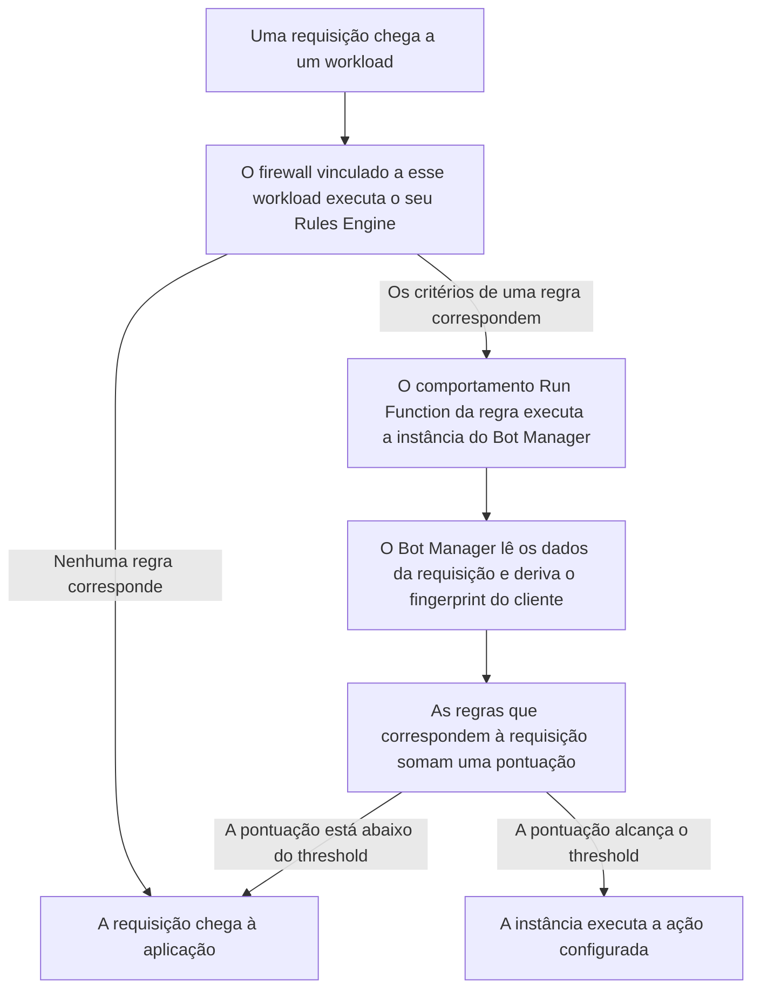

import FrameBox from '@aziontech/webkit/frame-box'
import ItemList from '@aziontech/webkit/item-list'
import DocItem from '@aziontech/webkit/doc-item'

Um script e uma pessoa chegam a uma aplicação do mesmo jeito, por HTTP, e a própria requisição é tudo o que existe para diferenciar os dois. O gerenciamento de bots pesa a evidência que uma requisição carrega: os cabeçalhos que envia, o endereço de onde veio e a sessão que apresenta. Cada verificação que encontra algo soma pontos, e os pontos somados formam uma pontuação. Quando a pontuação alcança um valor que você define, a requisição recebe uma ação em vez de ser servida. Quando fica abaixo desse valor, a aplicação recebe a requisição sem alteração.

Na Azion, essa inspeção é o [Bot Manager](/pt-br/documentacao/secure/bot-manager/), e ele não é um módulo de firewall. O Bot Manager alcança o caminho da requisição como uma instância de função: uma função instalada, instanciada em um [Firewall](/pt-br/documentacao/plataforma/firewall/) com um objeto JSON de argumentos, e executada por uma regra do [Rules Engine for Firewall](/pt-br/documentacao/plataforma/firewall/rules-engine/) cujo comportamento é **Run Function**. A instância guarda a pontuação a partir da qual o Bot Manager age e a ação que ele toma. A regra decide quais requisições são pontuadas.

Esta página cobre o mecanismo, não os valores. Os argumentos que uma instância carrega, cada um com o seu tipo e o seu padrão, estão em [Argumentos](/pt-br/documentacao/secure/bot-manager/argumentos/#campos). Os campos que o Bot Manager escreve sobre uma requisição pontuada, e os vereditos que ele registra, estão em [Logs](/pt-br/documentacao/secure/bot-manager/logs/#classificacao). As regras estáticas contra as quais o Bot Manager Lite pontua, cada uma com o seu ID e os pontos que soma, estão em [Bot Manager Lite](/pt-br/documentacao/secure/bot-manager/bot-manager-lite/#regras).

As seções abaixo seguem o caminho que uma requisição percorre, o modelo de pontuação e o que o threshold decide. Depois cobrem o fingerprint a que uma pontuação se prende, a pontuação dinâmica que só o Bot Manager executa, o estado em que um fingerprint novo começa, o par de cookies de sessão e os dois modos.

---

## O caminho que uma requisição percorre

Uma função Bot Manager instalada não pontua nada sozinha. Cinco objetos colocam uma requisição sob inspeção, e cada um nomeia o seguinte: a função instalada, um firewall com o módulo [Functions](/pt-br/documentacao/build/functions/) ligado, uma instância de função nesse firewall carregando os argumentos, uma regra do Rules Engine cujo comportamento **Run Function** nomeia essa instância e um workload vinculado ao firewall pelo seu deployment.

O diagrama abaixo acompanha uma requisição, do workload em que ela chega até a aplicação atrás dele:

1. Uma requisição chega a um [workload](/pt-br/documentacao/plataforma/workloads/), e o firewall vinculado a esse workload pelo seu deployment executa o Rules Engine contra a requisição.
2. Uma regra cujos critérios correspondem à requisição aplica os seus comportamentos. Uma regra que não corresponde não aplica nada.
3. O comportamento **Run Function** da regra que correspondeu executa uma instância de função do Bot Manager, com os argumentos que essa instância carrega.
4. O Bot Manager lê os dados que a requisição carrega, incluindo os dados de dispositivo, de navegador e de rede, e deriva o fingerprint do cliente por trás dela.
5. O Bot Manager pontua a requisição contra as suas regras e compara essa pontuação com o threshold da instância.
6. Uma pontuação igual ou acima do threshold executa a ação configurada. Uma pontuação abaixo dele deixa a requisição seguir para a aplicação.

Manter a seleção em uma regra é o que torna a inspeção direcionável: uma instância pontua as requisições que a sua regra corresponde, em vez de tudo o que o firewall vê. Isso custa um objeto e um passo. Uma instância que nenhuma regra nomeia fica inerte, quaisquer que sejam os seus argumentos, e uma regra cujos critérios nunca correspondem não pontua nada.

---

## Pontuação

O Bot Manager não decide por um sinal só. Cada regra que a requisição corresponde soma um número fixo de pontos, e a pontuação da requisição é a soma desses incrementos. Uma pontuação de `0` significa que nenhuma regra correspondeu, e uma pontuação mais alta significa que mais verificações encontraram algo.

Uma regra estática é uma validação sobre os atributos de uma única requisição, como um cabeçalho ou um dado de metadados. Ela não faz referência ao que o mesmo cliente fez antes. As verificações cobrem assinaturas de bots maliciosos, bots programados, comportamento malicioso de navegador, intenção maliciosa e reputation intelligence. Cada regra carrega um ID, que é o que nomeia uma correspondência em uma linha de report e o que permite impedir que uma regra eleve a pontuação sem tirá-la da detecção. Para mais informações, consulte [Argumentos](/pt-br/documentacao/secure/bot-manager/argumentos/#regras-desabilitadas).

Como cada regra carrega o seu próprio incremento, uma requisição que dispara várias verificações leves alcança o mesmo total de uma requisição que dispara uma verificação pesada. É isso que uma pontuação compra, e é também o que ela custa: um cliente que se parece com automação de vários jeitos pequenos é pontuado como um bot que falhou em uma verificação decisiva.

Dois registros nomeiam o que a pontuação encontrou, e nenhum dos dois é declarado pela requisição. `bot_category` é derivado das classes das regras que correspondem, unidas por vírgula. Uma requisição que corresponde a regras das classes bad bot signatures e malicious intent é registrada como `Bad Bot Signatures, Malicious Intent detected`. O veredito em si separa o tráfego legítimo dos bots bons e dos bots ruins, e carrega um quarto valor para uma requisição que o Bot Manager ainda não consegue situar. Para os valores que cada um dos dois registros assume, consulte [Logs](/pt-br/documentacao/secure/bot-manager/logs/#classificacao).

`classified` é um veredito sobre a pontuação, não uma propriedade da requisição: ele compara a pontuação com o threshold em vigor quando a requisição chegou. Uma requisição que pontuou `28` pelas mesmas cinco regras foi classificada como `legitimate` sob um threshold de `30` e como `bad bot` sob um threshold de `1`. Elevar um threshold, portanto, também reetiqueta o tráfego, além de impedir que a ação seja executada. Uma contagem de classificações só é comparável entre dois períodos quando o threshold foi o mesmo nos dois.

O Bot Manager acrescenta duas entradas que o Bot Manager Lite não tem. A primeira é o Reputation Intelligence, que cataloga o tráfego de entrada e de saída contra [Network Lists](/pt-br/documentacao/secure/network-shield/network-lists/) que a Azion mantém e atualiza. Essas listas carregam critérios como Tor exit nodes, reputação, proxies, malware e fraude. Um endereço em uma delas eleva a pontuação, então a pontuação carrega o que se sabe sobre a rede do cliente, além do que a requisição aparenta. A segunda entrada é a pontuação dinâmica, que pesa o histórico de um fingerprint em vez de uma única requisição.

Uma pontuação só tem sentido contra o threshold com que é comparada. O Bot Manager documenta um threshold de `18` como o valor de partida, e o Bot Manager Lite entrega `30`. Para onde movê-lo a partir daí é uma pergunta sobre o seu próprio tráfego, não sobre a pontuação. Para mais informações, consulte [Boas práticas de Bot Manager](/pt-br/documentacao/secure/bot-manager/boas-praticas/).

---

## Da pontuação à ação

O Bot Manager compara a pontuação de uma requisição com o argumento `threshold` da instância de função, e a comparação inclui o próprio threshold. Uma requisição cuja pontuação é igual ou maior que o threshold recebe a ação, e uma requisição abaixo dele segue para a aplicação. Uma instância guarda um threshold e uma ação, então pontuar duas fatias de tráfego contra dois thresholds exige duas instâncias, cada uma nomeada pela sua própria regra.

Sete ações estão disponíveis, e elas respondem a requisição de três jeitos diferentes. `allow` e `deny` decidem a requisição, e `deny` responde com `403` e a página de erro padrão da Azion. `random_delay` e `hold_connection` atrasam a resposta. Um atraso eleva o custo do ataque, porque o atacante espera por uma requisição em vez de fazer a seguinte, o que eleva a chance de o ataque ser abandonado. `redirect` e `custom_html` substituem a resposta, então a resposta pode carregar algo diferente da resposta da própria aplicação. Para o que cada uma das sete faz, e o segundo argumento que duas delas exigem, consulte [Argumentos](/pt-br/documentacao/secure/bot-manager/argumentos/#action).

Um desafio por trás da ação `redirect` pede ao cliente que prove ser uma pessoa, então uma requisição que a pontuação situou errado mantém um caminho de passagem. Para mais informações, consulte [Proteja uma rota com um desafio ALTCHA](/pt-br/documentacao/guias/desenvolvimento-de-aplicacoes/functions-e-runtime/altcha/).

Definir `threshold` como `0` não é um jeito de bloquear todas as requisições. Toda requisição está em `0` ou acima, então a ação configurada é executada em todas elas, e o resultado é o que a ação faz. Com `action` definido como `deny`, toda requisição é recusada. Com `action` definido como `allow`, nada é bloqueado.

---

## Fingerprints e versões do engine

Um fingerprint é o identificador que o Bot Manager deriva para o cliente por trás de uma requisição. Ele é construído a partir do que a requisição e a sessão do dispositivo carregam, como o endereço IP e o cabeçalho `User-Agent`, e o Bot Manager deriva um para cada dispositivo que vê. O fingerprint é o que faz uma pontuação ser sobre um cliente em vez de sobre uma única requisição: o mesmo fingerprint aparecendo de novo traz o que o Bot Manager já sabe sobre ele.

A versão do engine seleciona o método que o deriva. A versão `1` é o padrão, e é o fallback sempre que `engine_version` está ausente ou é inválido. A sua fonte primária é o fingerprint de cliente que a JavaScript Tag ou um SDK reporta, e a sua fonte secundária é um fingerprint de servidor JA4. A versão `2` mantém a mesma fonte primária e adota um fingerprint JA4H como secundária. O JA4H lê dados de nível mais alto, como cabeçalhos HTTP, o que reduz a colisão de fingerprints, em que dois usuários ou dispositivos distintos compartilham um fingerprint e são pontuados como uma identidade só.

Quanto mais rica a fonte, menos o engine infere. A JavaScript Tag coleta dados não sensíveis de um navegador com a única finalidade de calcular o fingerprint desse navegador, e os SDKs reportam dados de dispositivo de uma aplicação móvel. Nenhum dos dois é obrigatório, e sem um deles o fingerprint se apoia no que a requisição já carrega, o que torna uma colisão mais provável. Para mais informações, consulte [Instale a JavaScript Tag (JS TAG)](/pt-br/documentacao/guias/desenvolvimento-de-aplicacoes/integracoes/javascript-tag-js-tag/). O valor que o Bot Manager escreve em uma linha de report está documentado em [Logs](/pt-br/documentacao/secure/bot-manager/logs/#campos).

---

## A pontuação dinâmica

O Bot Manager executa um segundo método de pontuação ao lado das regras estáticas, e o Bot Manager Lite não: uma pontuação do Bot Manager Lite vem apenas das regras estáticas. O método dinâmico lê o histórico de comportamento de um fingerprint de dispositivo contra o padrão geral de tráfego do host, então ele reporta o que uma única requisição não consegue mostrar. Uma requisição que não quebra nenhuma regra ainda é anômala quando o fingerprint por trás dela se comporta de um jeito diferente do resto do tráfego daquele host.

Dois argumentos controlam o método. `dynamic_rules_tolerance` define o quão rigoroso ele é, e `disable_dynamic_rules` definido como `true` o desliga. A referência contra a qual ele compara um fingerprint é o tráfego do próprio host, então o método acompanha esse tráfego conforme ele muda. É isso que permite detectar anomalias para as quais as regras estáticas não foram escritas. Para os valores que cada argumento assume, consulte [Argumentos](/pt-br/documentacao/secure/bot-manager/argumentos/#campos).

A adaptação custa tempo. Consolidar os dados por trás de um fingerprint leva até 15 minutos, e dentro dessa janela o método não tem nada a dizer sobre um fingerprint que está vendo pela primeira vez.

O Bot Manager Lite não executa pontuação dinâmica. Ele executa o Reputation Intelligence, como regra estática: a regra `14` verifica o endereço da requisição contra as Network Lists que você nomeia nos seus argumentos e soma 6 pontos para cada lista em que o endereço é encontrado. Então a verificação de reputação está nas duas edições, e a pontuação dinâmica é o que as separa. As duas são edições de um produto só, e diferem no que usam para pontuar, não no que fazem com uma pontuação. Para mais informações, consulte [Bot Manager Lite](/pt-br/documentacao/secure/bot-manager/bot-manager-lite/#regras).

---

## Under evaluation

Um fingerprint que o Bot Manager está vendo pela primeira vez ainda não está classificado. Consolidar a pontuação de um fingerprint leva até 15 minutos. Registrar esse fingerprint como legítimo ou como bot antes disso colocaria dados imprecisos na pontuação do host. Em vez disso, o Bot Manager registra `under evaluation` para essas requisições, e é assim que um visitante que chega pela primeira vez evita ser recusado por ser novo.

Outras duas condições devolvem um fingerprint a esse estado. Um fingerprint que não é visto há 15 minutos ou mais volta para ele. O mesmo acontece com todo fingerprint de um host cujo tráfego geral parou por mais de 15 minutos. Nenhuma das duas interfere na detecção posterior. As duas dizem que os dados por trás de um veredito ficaram velhos, não que a requisição é suspeita.

O estado é uma ausência de evidência, não um achado, então um volume alto dele diz quanto tráfego o Bot Manager ainda não situou. Para os valores de veredito e o campo em que cada um é registrado, consulte [Logs](/pt-br/documentacao/secure/bot-manager/logs/#classificacao).

---

## Cookies de sessão

O Bot Manager Lite pede que um cliente carregue uma sessão. Uma requisição que chega sem uma sessão válida recebe uma resposta sem corpo e com dois cookies. `az_botm` carrega um identificador único de requisição, e `az_asm` carrega uma cópia desse mesmo valor assinada por HMAC, com a chave do argumento `session_signature_key`. Em uma requisição posterior do mesmo cliente, a função verifica os dois um contra o outro, e a divergência entre eles é o que a regra `17` pontua. As regras `15`, `16` e `17` são as três que leem o par.

O valor em `az_botm` é o `x-azion-request-id` da resposta que o definiu, então o par liga uma sessão a uma resposta identificável. Os dois cookies chegam com os mesmos atributos: `Domain` definido como o domínio do workload, `Path=/`, `Max-Age=86400`, que é 24 horas, `Secure`, `HttpOnly` e `SameSite=Lax`. `HttpOnly` mantém o par fora do alcance dos scripts da página, e `Secure` o mantém fora do HTTP simples.

O sinal custa a cooperação do cliente. Um cliente que não guarda cookies não apresenta par nenhum para verificar, então toda requisição que envia é uma primeira requisição. Um par velho também não passa em silêncio: uma requisição que chegaria à aplicação recebe uma nova troca de cookies no lugar. Esse comportamento é deliberado para um navegador e errado para um monitor ou um consumidor de API, e é para isso que o modo `api` existe. Para saber como se parece um cliente que nunca passa da troca, consulte [Solucionar problemas de Bot Manager](/pt-br/documentacao/secure/bot-manager/solucao-de-problemas/).

---

## Modos

Uma instância de função do Bot Manager é executada em um de dois modos, definidos pelo argumento `mode`. `web` é para clientes HTTP compatíveis com cookies, como navegadores, e é o padrão. `api` é para web services e tráfego de API que não carrega cookies. A comparação diferencia maiúsculas de minúsculas e é em minúsculas, então qualquer valor diferente da string `api` seleciona `web`, incluindo `API`.

No modo `api` o Bot Manager não define cookie, e toda regra que lê o par de cookies de sessão é ignorada. É isso que torna o modo utilizável na frente de uma API: um cliente que nunca guardaria um cookie não é pontuado por não guardar um. Isso também tira a sessão da evidência, então as verificações restantes carregam a decisão sozinhas, e o mesmo tráfego pontua de forma diferente nos dois modos. Para os valores que o argumento assume, consulte [Argumentos](/pt-br/documentacao/secure/bot-manager/argumentos/#campos).

---

## Recursos relacionados

<FrameBox>
<ItemList>
  <DocItem title="Argumentos" href="/pt-br/documentacao/secure/bot-manager/argumentos/#campos">O threshold, a ação, o modo e todos os outros argumentos que configuram o mecanismo desta página.</DocItem>
  <DocItem title="Logs" href="/pt-br/documentacao/secure/bot-manager/logs/">A pontuação, o fingerprint e o veredito de uma requisição, campo por campo, como o Bot Manager os registra.</DocItem>
  <DocItem title="Bot Manager Lite" href="/pt-br/documentacao/secure/bot-manager/bot-manager-lite/#regras">As regras estáticas contra as quais essa edição pontua, cada uma com o seu ID, os pontos que soma e a classe a que pertence.</DocItem>
  <DocItem title="Primeiros passos com Bot Manager" href="/pt-br/documentacao/secure/bot-manager/primeiros-passos/">O caminho mais curto de uma função instalada até uma requisição pontuada contra ela.</DocItem>
  <DocItem title="Boas práticas de Bot Manager" href="/pt-br/documentacao/secure/bot-manager/boas-praticas/">Como mover um threshold e uma ação com a evidência do seu próprio tráfego.</DocItem>
  <DocItem title="Rules Engine for Firewall" href="/pt-br/documentacao/plataforma/firewall/rules-engine/">A regra que seleciona quais requisições alcançam a instância de função e a executa.</DocItem>
  <DocItem title="Glossário" href="/pt-br/documentacao/secure/bot-manager/glossario/">O que significam pontuação, threshold, regra estática, fingerprint e o resto do vocabulário desta página.</DocItem>
</ItemList>
</FrameBox>
