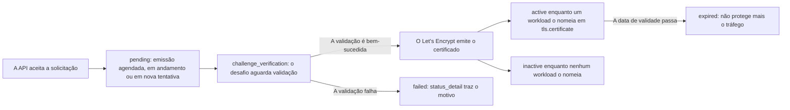

import FrameBox from '@aziontech/webkit/frame-box'
import ItemList from '@aziontech/webkit/item-list'
import DocItem from '@aziontech/webkit/doc-item'

Uma autoridade certificadora (CA) assina um certificado somente depois que o solicitante prova o controle de todos os nomes que ele contém. A prova é um desafio: um valor que a CA verifica no DNS do domínio, ou um arquivo servido no hostname. Let's Encrypt é uma CA que emite certificados válidos por 90 dias, então um certificado só continua útil enquanto alguém o renova.

Para o certificado de servidor de um workload, [Certificate Manager](/pt-br/documentacao/plataforma/workloads/#certificate-manager) assume esse trabalho. A Azion solicita o certificado ao Let's Encrypt, conclui o desafio e renova o certificado antes que ele expire. Para saber onde Certificate Manager age sobre uma requisição, consulte [Como Workloads funciona](/pt-br/documentacao/plataforma/workloads/como-funciona/#certificate-manager). Um certificado que você envia, ou que obtém de uma CA por meio de uma solicitação de assinatura de certificado (CSR), é descrito em [Certificados](/pt-br/documentacao/plataforma/workloads/certificate-manager/certificados/#campos-do-certificado).

As seções cobrem as solicitações de certificado, a validação de domínio, os certificados wildcard, os status, o tempo de emissão e as novas tentativas, e a renovação.

---

## Solicitações de certificado

Uma solicitação Let's Encrypt pede à Azion que obtenha um certificado para um conjunto de hostnames. Ela leva o hostname principal em `common_name` e, opcionalmente, outros hostnames em `alternative_names`, que o certificado lista como Subject Alternative Names (SANs). Ela também nomeia a autoridade, `lets_encrypt`, e o desafio que prova o controle dos nomes: `http` para HTTP-01 ou `dns` para DNS-01.

A Azion gera a chave do certificado. Em uma solicitação pela API, `key_algorithm` tem o padrão `ecc_384`. Para os outros algoritmos e padrões, consulte [Certificados](/pt-br/documentacao/plataforma/workloads/certificate-manager/certificados/#cadeia-de-certificados).

Você solicita um certificado no Azion Console ou pela API. As predefinições do Console _New Let's Encrypt Certificate (HTTP-01)_ e _New Let's Encrypt Certificate (DNS-01)_ aparecem em Certificate Manager e no campo **Digital Certificate** do workload. Pela API, a solicitação é `POST /v4/workspace/tls/certificates/request`. A partir do formulário do workload, o Console usa os nomes dos **Domains** do workload. Ele nomeia o certificado como `Lets Encrypt - <workload name> - <date and time>` e define `key_algorithm` como `rsa_2048`.

A API responde a uma solicitação com o `id` do certificado e o status `pending`, o que significa que a Azion agendou a emissão. O certificado aparece em Certificate Manager a partir de então, e o `id` o identifica quando você verifica o seu status.

A Azion emite certificados Let's Encrypt para domínios e subdomínios registrados no Domain Name System (DNS). Todo nome da solicitação também precisa pertencer a um domínio para o qual a conta tem permissão. Caso contrário, a solicitação é recusada com `This account cannot use certain common or alternative names because it does not have permission for their domain names.` Um hostname `azion.app` também é recusado, mesmo um que um workload da conta tenha.

Alguns clientes mais antigos não conseguem validar a cadeia de um certificado Let's Encrypt. Para saber quais clientes, e o que fazer a respeito deles, consulte [Certificados](/pt-br/documentacao/plataforma/workloads/certificate-manager/certificados/#status).

---

## Validação de domínio

O Let's Encrypt valida todos os nomes de uma solicitação antes de emitir o certificado, e o desafio da solicitação decide como. A Azion oferece suporte aos dois desafios, HTTP-01 e DNS-01, para um domínio cujo DNS está hospedado no [Edge DNS](/pt-br/documentacao/plataforma/edge-dns/) ou em outro provedor de DNS.

Com o HTTP-01, o Let's Encrypt valida o hostname por meio de um arquivo servido para ele, e a Azion executa o serviço que responde ao desafio. O DNS do domínio não precisa de registro TXT, então o desafio não pede nenhuma mudança na zona do domínio. O hostname já precisa apontar para a Azion quando você envia a solicitação. Quando a solicitação leva nomes alternativos, todos eles precisam apontar para a Azion, ou a emissão falha. A Azion agenda a emissão mesmo quando nenhum workload com o hostname está publicado e ativo. Como nenhuma mudança de DNS é necessária por nome, o HTTP-01 atende bem a uma conta que gerencia muitos domínios e hostnames.

Com o DNS-01, o Let's Encrypt valida o hostname por meio de um registro TXT no DNS do domínio, sob o nome `_acme-challenge` do hostname. Quem prepara o DNS depende de onde a zona está hospedada:

- Quando a zona está no Edge DNS, a Azion gera o registro TXT e o insere na zona. O desafio é concluído sem nenhuma ação sua.
- Quando outro provedor de DNS hospeda a zona, você adiciona um registro CNAME por hostname nesse provedor. O nome dele é `_acme-challenge.<your-domain>`, e o valor é `<your-domain>.letsencrypt.azion.com`. Por exemplo, `_acme-challenge.www.example.com` aponta para `www.example.com.letsencrypt.azion.com`.

Para os registros passo a passo, consulte [Solicite um certificado Let's Encrypt](/pt-br/documentacao/guias/seguranca-de-aplicacoes/tls-e-certificados/como-gerar-um-certificado-lets-encrypt/). Para adicionar você mesmo um registro TXT `_acme-challenge`, consulte [Adicione o registro TXT do Let's Encrypt](/pt-br/documentacao/guias/seguranca-de-aplicacoes/tls-e-certificados/registro-lets-encrypt/).

Cada desafio atende a uma situação diferente:

| Desafio | Valor de `challenge` | Use quando |
| --- | --- | --- |
| HTTP-01 | `http` | Você não controla os registros DNS do domínio, e o domínio já aponta para a Azion |
| DNS-01 | `dns` | Você controla os registros DNS do domínio, o certificado cobre um nome wildcard ou você não tem acesso direto ao servidor web |

Os dois desafios trocam uma dependência do tráfego por uma dependência do DNS. O HTTP-01 não precisa de registro, mas não consegue validar um hostname que ainda não aponta para a Azion. Por exemplo, durante uma migração para a Azion, o DNS-01 pode emitir o certificado para `www.example.com` enquanto o hostname ainda aponta para o provedor anterior. O HTTP-01 só consegue emiti-lo depois que o hostname aponta para a Azion.

---

## Certificados wildcard

Um nome wildcard, como `*.example.com`, permite que um único certificado cubra subdomínios que você não lista um a um. A Azion emite um certificado wildcard pelo desafio DNS-01, e emite e renova o certificado automaticamente.

A emissão automática precisa que a zona do domínio esteja configurada e ativa no Edge DNS, o que dá à Azion controle sobre os registros de que a validação precisa. Durante a emissão, a Azion gera o registro TXT `_acme-challenge` e o insere na zona, sem nenhuma ação sua. Quando a zona não está ativa no Edge DNS, a Azion não consegue automatizar a validação, e ela precisa ser feita manualmente.

Um certificado pode levar um nome wildcard sozinho ou ao lado de nomes específicos. Um subdomínio que o wildcard já cobre não precisa de uma entrada própria: com `*.example.com` no certificado, `blog.example.com` não precisa ser listado.

Um workload, por outro lado, lista cada hostname por completo. Os domínios dele recusam uma entrada wildcard com `The domain does not conform to the format defined in RFC 1035.` O formulário do workload solicita um certificado para os domínios do workload, então não consegue solicitar um nome wildcard. Para solicitar um com o desafio DNS-01, consulte [Solicite um certificado Let's Encrypt com a API](/pt-br/documentacao/guias/seguranca-de-aplicacoes/tls-e-certificados/como-gerar-um-certificado-lets-encrypt-via-api/).

Um certificado wildcard no lugar de um certificado por subdomínio significa menos certificados distintos para emitir. Isso reduz a chance de atingir os limites de emissão do serviço Let's Encrypt, que [Limites de Workloads](/pt-br/documentacao/plataforma/workloads/limites/#certificate-manager) indica. O custo é uma dependência do DNS: a emissão automática precisa da zona no Edge DNS, e uma zona em outro lugar significa validar manualmente. Para saber quando um certificado compartilhado por muitos subdomínios é um risco, consulte [Boas práticas de Workloads](/pt-br/documentacao/plataforma/workloads/boas-praticas/#certificate-manager).

---

## Status

Um certificado Let's Encrypt informa em que ponto está a sua emissão no campo somente leitura `status`. Os valores acompanham o certificado desde a solicitação até o seu uso em um workload.

Este diagrama acompanha um certificado, da solicitação aceita até os estados em que ele pode terminar:

1. A API aceita a solicitação e retorna `pending`, o que significa que a Azion agendou a emissão. Um certificado também aparece como `pending` enquanto a Azion processa a sua emissão ou renovação, ou tenta de novo.
2. `challenge_verification` significa que o desafio DNS-01 ou HTTP-01 está aguardando validação.
3. Depois de emitido, o certificado aparece como `active` enquanto um workload o nomeia em `tls.certificate`, e como `inactive` enquanto nenhum workload o nomeia.
4. Quando a validação falha, o certificado aparece como `failed`. O campo `status_detail` traz o motivo, como `An error has occurred while issuing the requested certificate. Please verify the following domains CNAME: www.example.com`.
5. Depois que a data de `validity` passa, o certificado aparece como `expired` e não protege mais o tráfego.

Azion Console mostra os mesmos estados. A lista de certificados marca um certificado `pending` com um ícone de aviso e um `failed` com um ícone de erro, com `status_detail` como explicação. Um certificado cuja data de `validity` já passou leva a tag **Expired**.

Um workload pode nomear um certificado que ainda não foi emitido. O campo **Digital Certificate** dele então avisa "This certificate is pending validation and HTTPS may not work until it’s validated", ou "This digital certificate failed and HTTPS cannot be used until the issue is resolved". Até que o certificado seja validado, o HTTPS nos domínios do workload pode não funcionar. Para a tabela completa de status, incluindo os certificados enviados, consulte [Certificados](/pt-br/documentacao/plataforma/workloads/certificate-manager/certificados/).

---

## Tempo de emissão e novas tentativas

A Azion faz a primeira tentativa de emitir um certificado Let's Encrypt em até 5 minutos depois que você salva as configurações do certificado. Quando uma tentativa falha, a Azion tenta de novo em um cronograma que espaça mais as tentativas quanto mais a falha dura. O cronograma aumenta a chance de sucesso enquanto se mantém dentro dos limites do serviço Let's Encrypt.

O cronograma de novas tentativas tem quatro fases:

| Fase | Quando | Tentativas |
| --- | --- | --- |
| Recuperação rápida | As 5 primeiras tentativas | Em intervalos crescentes de 5, 10, 15, 20 e 30 minutos |
| Estabilização | Dias 1 e 2 | Até 10 por dia, com 30 minutos de intervalo, até 20 nos dois primeiros dias |
| Monitoramento | Dias 3 a 7, quando a falha dura mais de 48 horas | Uma a cada 3 horas |
| Manutenção | Depois de 7 dias | Uma por dia |

A fase de recuperação rápida resolve a maioria das falhas causadas pela propagação de DNS ou por um serviço temporariamente indisponível. As fases seguintes continuam tentando, então uma correção que você faz dias depois ainda pode terminar em uma emissão automática. Quanto mais tarde a correção, mais ela espera. Depois de 48 horas, a próxima tentativa pode estar a até 3 horas, e depois de 7 dias, a até um dia.

A Azion registra por que uma tentativa falhou em `status_detail`, que a API retorna com o certificado e o Console mostra com o ícone de status. Por exemplo, um CNAME `_acme-challenge` digitado errado no seu provedor de DNS faz as primeiras tentativas falharem, e `status_detail` nomeia o hostname cujo CNAME você deve verificar. Depois que você corrige o registro, uma tentativa posterior do cronograma pode emitir o certificado. Para sintomas e as suas correções, consulte [Solucionar problemas de Workloads](/pt-br/documentacao/plataforma/workloads/solucao-de-problemas/#certificate-manager).

---

## Renovação

Um certificado Let's Encrypt expira 90 dias depois de emitido, e a Azion o renova automaticamente antes dessa data. A renovação começa 30 dias antes da expiração, quando o certificado se torna elegível para renovação. A Azion monitora os certificados que emitiu, executa a validação de novo conforme a renovação se aproxima e atualiza o certificado. O campo `renewed_at` registra quando a Azion o renovou pela última vez.

A renovação não precisa de janela de manutenção, e o certificado mantém as suas cotas, o seu faturamento e as suas permissões. Certificados wildcard são renovados da mesma forma.

A renovação depende de a validação passar de novo, então a Azion renova um certificado somente enquanto as configurações de validação dele continuam válidas e atualizadas. Por exemplo, um certificado DNS-01 de uma zona em outro provedor deixa de ser renovado depois que o seu registro `_acme-challenge` é excluído. Um certificado HTTP-01 precisa que os seus hostnames continuem apontando para a Azion.

A Azion para de renovar um certificado nestes casos:

- Você vincula, no lugar dele no workload, um certificado que enviou.
- Você altera os domínios para os quais o certificado foi solicitado. A Azion cria outro certificado a partir do conjunto alterado, e o antigo não é renovado.
- Você exclui o certificado, ou o domínio para o qual ele foi solicitado é removido da Azion. Somente esses dois eventos desativam um certificado gerenciado.

Um certificado desvinculado do seu workload continua em Certificate Manager, e você pode vinculá-lo de novo enquanto ele permanece válido. A renovação automática elimina a data de expiração como tarefa, ao custo de uma dependência. O caminho de validação que emitiu o certificado precisa continuar funcionando enquanto um workload o usar.

A Azion não renova um certificado que você envia. Para substituir um antes que expire, consulte [Boas práticas de Workloads](/pt-br/documentacao/plataforma/workloads/boas-praticas/#certificate-manager).

Let's Encrypt™ é uma marca registrada do Internet Security Research Group. Todos os direitos reservados.

---

## Recursos relacionados

<FrameBox>
<ItemList>
  <DocItem title="Certificados" href="/pt-br/documentacao/plataforma/workloads/certificate-manager/certificados/">Todos os campos de uma solicitação Let's Encrypt, a tabela completa de status e os algoritmos de chave que a Azion gera.</DocItem>
  <DocItem title="Solicite um certificado Let's Encrypt" href="/pt-br/documentacao/guias/seguranca-de-aplicacoes/tls-e-certificados/como-gerar-um-certificado-lets-encrypt/">Os passos para solicitar um certificado Let's Encrypt e preparar os registros DNS de que o seu desafio precisa.</DocItem>
  <DocItem title="Adicione o registro TXT do Let's Encrypt" href="/pt-br/documentacao/guias/seguranca-de-aplicacoes/tls-e-certificados/registro-lets-encrypt/">Os passos para adicionar o registro TXT que um desafio DNS-01 verifica.</DocItem>
  <DocItem title="Solucionar problemas de Workloads" href="/pt-br/documentacao/plataforma/workloads/solucao-de-problemas/#certificate-manager">Sintomas de um certificado que não é emitido ou renovado, com as suas causas e correções.</DocItem>
</ItemList>
</FrameBox>
