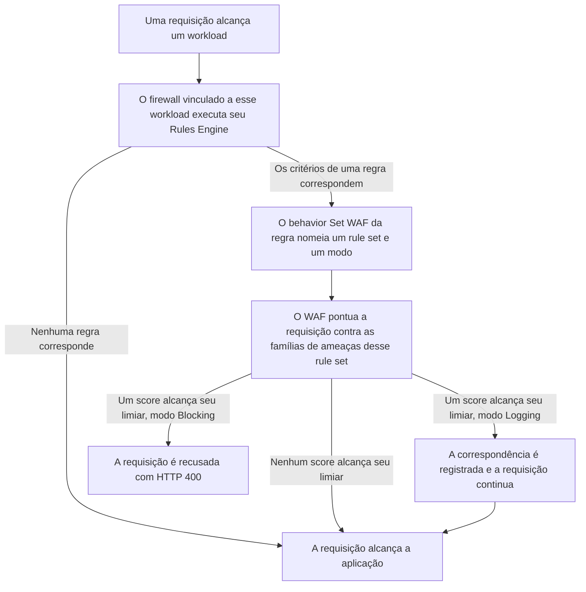

import FrameBox from '@aziontech/webkit/frame-box'
import ItemList from '@aziontech/webkit/item-list'
import DocItem from '@aziontech/webkit/doc-item'

Uma requisição pode carregar um ataque na sua query string, em um header ou no corpo que ela envia. Um web application firewall lê essas partes antes da aplicação e pesa o que encontra contra padrões de ataque conhecidos. Quando as evidências se somam, ele recusa a requisição. Quando não, a requisição alcança a aplicação sem alteração.

Na Azion, essa inspeção é o [Web Application Firewall](/pt-br/documentacao/secure/waf/), um módulo do [Firewall](/pt-br/documentacao/plataforma/firewall/). O que detectar fica em um rule set, que carrega oito famílias de ameaças e o nível de sensibilidade escolhido para cada uma. Quando aplicar fica em outro lugar: em uma regra do [Rules Engine for Firewall](/pt-br/documentacao/plataforma/firewall/rules-engine/), cujo behavior `Set WAF` nomeia um rule set e o modo em que ele roda.

Esta página cobre os mecanismos, não os valores. Os campos de um rule set, as oito famílias, os cinco níveis de sensibilidade e as regras internas estão em [WAF Rule Sets](/pt-br/documentacao/secure/waf/rule-sets/). Os campos de uma exceção e suas match zones estão em [WAF Exceptions](/pt-br/documentacao/secure/waf/custom-allowed-rules/), e o limite dentro do qual cada mecanismo opera está em [Limites de WAF](/pt-br/documentacao/secure/waf/limites/). As seções abaixo seguem o caminho que uma requisição percorre, o modelo de score e os dois modos. Depois cobrem o que o WAF lê no corpo de uma requisição, o que uma exceção subtrai, o loop de tuning e onde uma correspondência é reportada.

---

## O caminho que uma requisição percorre

Criar um rule set não inspeciona nada. Um rule set é um objeto de configuração que guarda as famílias de ameaças e suas sensibilidades, e ele permanece inerte até que algo o aplique ao tráfego. O que o aplica é uma regra do Rules Engine em um firewall. A regra seleciona requisições pelos seus próprios critérios, e o seu behavior `Set WAF` nomeia o rule set e o modo. Uma regra carrega no máximo um behavior `Set WAF`, então uma regra decide um rule set e um modo para as requisições com que ela corresponde.

Um único interruptor fica na frente de tudo isso. O WAF é o módulo que um firewall não habilita por conta própria: um firewall criado sem ele carrega o módulo desabilitado, e um rule set aplicado nesse firewall nunca roda. Para saber onde fica esse interruptor, consulte [Como definir as main settings de um firewall](/pt-br/documentacao/guias/seguranca-de-aplicacoes/firewall-e-waf/firewall-definir-main-settings/).

O diagrama abaixo segue uma requisição, do workload em que ela chega até a aplicação por trás dele:

1. Uma requisição alcança um [workload](/pt-br/documentacao/plataforma/workloads/), e o firewall vinculado a esse workload executa o seu Rules Engine contra a requisição.
2. Uma regra cujos critérios correspondem à requisição aplica os seus behaviors. Uma regra que não corresponde não aplica nada.
3. O behavior `Set WAF` da regra que correspondeu nomeia um rule set e um modo, `logging` ou `blocking`.
4. O WAF pontua a requisição contra as famílias de ameaças configuradas nesse rule set.
5. Um score que alcança o limiar da sua família torna a requisição uma correspondência. `Blocking` recusa essa requisição, e `Logging` a registra e a entrega.
6. Uma requisição que não alcançou nenhum limiar continua até a [aplicação](/pt-br/documentacao/plataforma/applications/) por trás do workload.

Manter os dois objetos separados é o que permite que um rule set rode de duas maneiras. O modo pertence ao behavior, não ao rule set. O mesmo rule set, portanto, roda em `Logging` em uma regra e em `Blocking` em outra, sobre os paths que você escolher. Isso custa um objeto e uma etapa: um rule set que nenhuma regra referencia não inspeciona nada, por mais cuidadosamente que suas famílias estejam configuradas.

---

## Score e sensibilidade

O WAF não decide com base em uma única correspondência de regra. Ele pontua. Cada regra interna que corresponde a uma requisição soma ao score da família de ameaças à qual essa regra pertence. Uma requisição que dispara um sinal fraco pontua baixo, e uma requisição que dispara vários pontua alto. A requisição é bloqueada quando um score alcança o limiar da sua família.

O score é um número por família, não um número para a requisição. Uma requisição que corresponde tanto a um sinal de SQL injection quanto a um de cross-site scripting carrega um score sob cada família. Cada score é comparado com o seu próprio limiar. Por exemplo, a query string `1' OR '1'='1` pontua sob as duas: a Azion registrou `18` para SQL injection e `32` para cross-site scripting em uma requisição desse tipo, vindos de duas regras internas que corresponderam ao mesmo argumento.

O limiar não é escrito como um número. Você escolhe um nível de sensibilidade para cada família de ameaças, e o nível fixa o score em que essa família bloqueia. [WAF Rule Sets](/pt-br/documentacao/secure/waf/rule-sets/#niveis-de-sensibilidade) carrega os cinco níveis e o score em que cada um bloqueia.

Toda família começa em `medium`. Os números correm na direção oposta à da palavra, que é a parte do produto mais frequentemente lida ao contrário. Uma sensibilidade mais alta é um limiar mais baixo: em `highest`, um score de 4 é suficiente, então menos evidência bloqueia mais requisições. Em `lowest`, uma requisição precisa de um score de 40, então ela tem que parecer muito com um ataque antes que o WAF a recuse.

O custo corre nas duas direções. Aumentar a sensibilidade pega ataques que carregam menos evidência. Também bloqueia requisições legítimas que carregam um pouco da mesma evidência, como um apóstrofo em um termo de busca. Diminuí-la mantém esse tráfego em movimento e deixa passar qualquer requisição cujo score fique abaixo do limiar. A sensibilidade é definida por família, então você pode aumentar as famílias com as quais a sua aplicação não tem razão legítima para se parecer e deixar o resto. Para o que cada família detecta e onde o seu nível é definido, consulte [WAF Rule Sets](/pt-br/documentacao/secure/waf/rule-sets/#niveis-de-sensibilidade).

---

## Modos

Um rule set é aplicado em um de dois modos, e o modo pertence à regra, não ao rule set. Em `Logging`, uma requisição que alcança um limiar é pontuada e registrada, e a aplicação a recebe como se nada tivesse correspondido. Em `Blocking`, a mesma requisição é recusada antes de alcançar a aplicação.

Uma requisição bloqueada recebe `400` e a página de erro padrão da Azion, encabeçada por **Bad Request**. Nada nessa resposta nomeia o WAF, a regra que correspondeu ou o score: não há header de WAF, e a página não carrega mensagem própria. A linha Status Code da própria página de erro mostra `0`, que é o status de uma origem que a requisição nunca alcançou.

É isso que cada modo compra e o que ele custa. `Logging` produz o registro completo do que teria sido bloqueado sem risco para uma requisição legítima, e não protege nada enquanto roda. `Blocking` protege, e todo falso positivo vira um `400` que um usuário vê, sem nada nele que diga a nenhum dos dois por quê.

Uma regra interna não é totalmente contida pelo modo. Requisições que caem sob a regra 13, formato de POST inválido, são bloqueadas em alguns casos mesmo quando o rule set roda em `Logging`. Para as regras internas e o que cada uma corresponde, consulte [WAF Rule Sets](/pt-br/documentacao/secure/waf/rule-sets/).

Outras superfícies da Azion escrevem esse mesmo modo como `learning`: o [Real-Time Events](/pt-br/documentacao/observe/real-time-events/) o reporta no campo `wafLearning`, o payload de log do [Data Stream](/pt-br/documentacao/observe/data-stream/) carrega `waf_learning`, e o `azion.config.js` o define como `wafMode`.

---

## Parsing do corpo da requisição

O WAF lê o corpo de uma requisição apenas nos formatos que consegue desmontar. Em um `POST`, ele faz o parsing do corpo quando o `Content-Type` é `application/x-www-form-urlencoded`, `multipart/form-data`, `application/json`, `application/vnd.api+json` ou `application/csp-report`. O parsing é o que permite que uma regra enderece um campo desse corpo, e o que permite que uma exceção nomeie um campo a deixar em paz.

Um corpo em outro formato não é inspecionado da mesma maneira, e também não passa sem exame. Um `Content-Type` desconhecido ou ausente em um `POST` é, por si só, um achado para as regras de conformidade de protocolo. Um rule set pode recusar uma requisição dessas com o mesmo `400`, com um corpo benigno, antes que qualquer coisa a leia.

O parsing também para em um tamanho. O teto é de 131.072 bytes, que são 128 KiB, e um corpo acima dele é recusado em vez de passar sem inspeção. Para esse limite e a resposta além dele, consulte [Limites de WAF](/pt-br/documentacao/secure/waf/limites/).

Ler apenas esses content types mantém a inspeção precisa nos formatos que uma aplicação envia. Isso custa cobertura do resto: um formato de que o WAF não faz parsing nunca é vasculhado campo a campo, e a regra que o pega lê o `Content-Type`, não o conteúdo.

---

## Exceções

Um rule set pontua toda requisição da mesma maneira, e algumas aplicações enviam legitimamente aquilo que uma regra interna foi escrita para pegar. Uma caixa de busca que aceita um apóstrofo, um campo que carrega um caractere pipe, uma API que envia um fragmento de markup: cada um alcança um limiar sem que haja nada errado. Uma exceção tira um desses do score sem baixar a sensibilidade para todo o resto.

Uma exceção nomeia a parte de uma requisição a isentar e a regra interna da qual isentá-la. A parte é uma condition: uma match zone como o valor de uma query string ou um nome específico de header. Um operator, `contains` ou `regex`, decide como o valor nessa condition é comparado. A regra é um rule ID, e o padrão dele é `0`, que significa todas as regras. O Azion Console chama uma exceção de allowed rule e a cria na aba **Allowed Rules** de um rule set.

Uma exceção é um buraco no rule set, e ela tem o tamanho que você der a ela. Restrita a uma regra, um path e um campo nomeado, ela para um falso positivo. Com o rule ID padrão e uma match zone genérica, ela tira essa zona inteira do score para toda requisição que o rule set vê. Isso custa o que custa baixar a sensibilidade, e custa em todo lugar, não na única requisição que precisava. O que ela expõe é aquilo que as regras isentas detectam. Nesse tamanho, nenhuma das oito famílias pontua nessa zona: `unwanted_access` deixa de pontuar tentativas de acesso a páginas vulneráveis ou administrativas e o uso de bots e ferramentas de varredura de segurança, e `identified_attack` deixa de pontuar ataques conhecidos contra aplicações e servidores. Escreva a exceção para o falso positivo que você tem, e remova-a quando a aplicação parar de produzir aquela requisição. Para cada campo que uma exceção carrega e cada match zone que ela pode nomear, consulte [WAF Exceptions](/pt-br/documentacao/secure/waf/custom-allowed-rules/).

---

## Tuning

Os modos e as exceções funcionam como um único loop, e o Tuning é a superfície no meio dele. Um rule set entra primeiro em `Logging`, para que toda requisição que ele bloquearia seja registrada e nenhuma seja recusada. O Tuning lista esses registros, qual regra interna correspondeu a qual requisição, em uma janela de até os últimos 3 dias. Você os filtra por workload ou domínio, path, país, endereço IP e [Network Lists](/pt-br/documentacao/secure/network-shield/network-lists/).

O que você lê ali decide o que acontece em seguida. Um registro que é um ataque real é evidência de que o rule set está fazendo o seu trabalho. Um registro que é uma requisição legítima é um falso positivo. O Tuning transforma registros selecionados em allowed rules em lote, de modo que a exceção vem da requisição que a produziu, e não de um palpite. Quando os registros param de carregar falsos positivos, a regra muda para `Blocking`.

O loop custa tempo em dois pontos. A janela guarda 3 dias, então uma evidência que ninguém lê dentro dela se perde, e um padrão de tráfego que aparece mensalmente nunca está nela. A conversão em lote é rápida porque não pergunta o que restringir: ela cria uma regra separada para cada ataque possível em cada URI que recebeu, o que é mais largo do que a exceção que você escreveria à mão. Para o procedimento, consulte [Ajuste um WAF rule set](/pt-br/documentacao/guias/seguranca-de-aplicacoes/firewall-e-waf/tune-waf/).

---

## Observabilidade

Uma correspondência do WAF não deixa nada na resposta, então toda pergunta sobre ela é respondida a partir de uma superfície de reporte. Três delas respondem perguntas diferentes. O [Real-Time Metrics](/pt-br/documentacao/plataforma/real-time-metrics/#waf) responde quanto, em requisições processadas e requisições bloqueadas ao longo do tempo. O [Real-Time Events](/pt-br/documentacao/observe/real-time-events/) responde qual requisição, uma linha por vez, com as regras internas que corresponderam e o score que cada família alcançou. O [Data Stream](/pt-br/documentacao/observe/data-stream/) responde onde mais, enviando esses eventos para um sistema fora da Azion.

Identificar um bloqueio começa pela requisição, não pela resposta. Uma requisição bloqueada é um `400` cujo upstream status é `0`, porque ela nunca alcançou uma origem. O header `x-azion-request-id` dessa resposta é o que encontra a linha dela. Essa correlação é o custo de manter a decisão fora da resposta: um usuário que foi bloqueado consegue reportar apenas uma página Bad Request, e a regra e o score são consultados depois. Para a query que retorna o score de uma requisição bloqueada, consulte [Encontre o score de uma requisição bloqueada](/pt-br/documentacao/guias/seguranca-de-aplicacoes/firewall-e-waf/como-encontrar-score-de-requisicoes-bloqueadas-pelo-waf/).

---

## Recursos relacionados

<FrameBox>
<ItemList>
  <DocItem title="WAF Rule Sets" href="/pt-br/documentacao/secure/waf/rule-sets/">Os campos, as famílias de ameaças, os níveis de sensibilidade e as regras internas por trás do score desta página.</DocItem>
  <DocItem title="WAF Exceptions" href="/pt-br/documentacao/secure/waf/custom-allowed-rules/">Cada campo e cada match zone que uma exceção carrega, e a tela de Tuning que as cria em lote.</DocItem>
  <DocItem title="Primeiros passos com WAF" href="/pt-br/documentacao/secure/waf/primeiros-passos/">O caminho mais curto de um novo rule set até uma requisição ser pontuada contra ele.</DocItem>
  <DocItem title="Limites de WAF" href="/pt-br/documentacao/secure/waf/limites/">Os limites dentro dos quais esses mecanismos operam, e o uso que cada service plan inclui.</DocItem>
  <DocItem title="Crie e aplique um WAF rule set" href="/pt-br/documentacao/guias/seguranca-de-aplicacoes/firewall-e-waf/criar-waf-rule-set/">Criar um rule set e aplicá-lo ao tráfego com um behavior Set WAF.</DocItem>
  <DocItem title="Ajuste um WAF rule set" href="/pt-br/documentacao/guias/seguranca-de-aplicacoes/firewall-e-waf/tune-waf/">O procedimento por trás do loop de tuning, de Logging a Blocking.</DocItem>
  <DocItem title="Glossário" href="/pt-br/documentacao/secure/waf/glossario/">O que significam score, limiar, família de ameaças, condition e o resto do vocabulário desta página.</DocItem>
</ItemList>
</FrameBox>
