import FrameBox from '@aziontech/webkit/frame-box'
import ItemList from '@aziontech/webkit/item-list'
import DocItem from '@aziontech/webkit/doc-item'

Um armazenamento de chave-valor guarda um valor sob um nome e devolve esse valor quando algo pede por esse nome. Não há schema sobre o valor nem consulta sobre o conjunto deles: o nome é a única entrada, então uma busca é uma leitura endereçada, e não uma pesquisa. Isso torna a leitura barata e previsível, e torna impossível qualquer coisa que não seja a busca pelo nome exato.

Na Azion, esses valores ficam em KV Store, dentro de um namespace criado pela API da Azion. Uma [function](/pt-br/documentacao/build/functions/) executando na infraestrutura distribuída da Azion abre esse namespace pelo nome e lê e escreve keys dentro dele por meio de `Azion.KV`, um global do [Azion Runtime](/pt-br/documentacao/devtools/runtime/). A API gerencia o namespace; a function alcança tudo o que está dentro dele.

Esta página cobre os mecanismos, não os valores. Os campos de um namespace, as três operações de API sobre ele e os erros que uma requisição rejeitada retorna estão em [Namespaces](/pt-br/documentacao/store/kv-store/namespaces/). Os métodos, os tipos de valor, os tipos de retorno e as opções do cliente estão em [Cliente KV](/pt-br/documentacao/store/kv-store/cliente-kv/). Os limites dentro dos quais cada mecanismo opera, e o uso que uma conta inclui, estão em [Limites do KV Store](/pt-br/documentacao/store/kv-store/limites/), e as recomendações que decorrem dos mecanismos abaixo estão em [Boas práticas](/pt-br/documentacao/store/kv-store/boas-praticas/). As seções cobrem o modelo de dados, como um valor chega a uma function, o que uma leitura garante retornar, por que as duas interfaces são separadas e sobre o que a cobrança incide.

---

## O namespace e a key

Um namespace é um espaço de keys isolado. O nome o identifica, não existe um identificador separado ao lado do nome, e toda chamada o endereça por esse nome, tanto pela API da Azion quanto por uma function. Dois namespaces na mesma conta não compartilham nada, então uma key chamada `config` em um guarda um valor sem relação com a key chamada `config` no outro.

Uma key é uma string, única dentro do seu namespace. O valor sob ela é texto, um objeto serializado em JSON, bytes brutos ou um stream, e uma escrita pode anexar metadata ao lado do valor para que uma leitura posterior retorne os dois juntos. Para os formatos que um valor assume e as opções que uma escrita aceita, consulte [Cliente KV](/pt-br/documentacao/store/kv-store/cliente-kv/).

O modelo tem dois níveis e nada além disso: um namespace e as keys dentro dele. Não há camada de agrupamento entre eles, nem índice sobre as keys, nem operação que liste o que um namespace guarda. Uma aplicação lê uma key cujo nome ela já conhece ou já monta, e é por isso que o esquema de nomes das keys carrega o peso que um schema carrega em outros lugares. Para a convenção que a Azion recomenda, consulte [Boas práticas](/pt-br/documentacao/store/kv-store/boas-praticas/).

Um valor permanece sob sua key até que algo o encerre. Um `put` na mesma key substitui o valor, um `delete` remove a key, e uma expiração definida na escrita remove a key quando ela vence. Uma leitura depois de qualquer uma dessas operações retorna `null`, exatamente como retorna para uma key que nunca foi escrita.

Um namespace não tem esse encerramento. Ele não pode ser renomeado, desativado, esvaziado nem excluído, em nenhuma interface, então uma conta mantém todo namespace que cria e o mantém sob o nome com que foi criado. Fazer do nome o identificador mantém toda chamada endereçável sem uma etapa de consulta, e custa a quem chama a possibilidade de corrigir esse nome depois.

---

## Como um valor chega a uma function

Nada no KV Store executa por conta própria. Um valor se move somente quando uma function o pede, e a function executa somente quando uma requisição alcança uma aplicação e uma regra envia essa requisição para a function. A cadeia abaixo é o que uma requisição percorre, do namespace que precisa existir antes até o valor que a function lê.

```mermaid
flowchart TD
  Api["Azion API: POST /v4/workspace/kv/namespaces"] --> Namespace["Um namespace, endereçado pelo nome"]
  Request["Uma requisição alcança a aplicação"] --> Rule["Uma regra do Rules Engine corresponde a ela"]
  Rule --> Run["A function executa no Azion Runtime"]
  Run --> Open["await Azion.KV.open, com o nome do namespace"]
  Open --> Namespace
  Open --> Client["Um cliente vinculado a esse namespace"]
  Client --> Read["get, getWithMetadata: o valor, ou null"]
  Client --> Write["put, delete: a key é escrita ou removida"]
  Read --> Near["Respondida pela infraestrutura mais próxima da requisição"]
  Write --> Spread["Aplicada onde a requisição foi atendida, depois converge"]
```

1. Um namespace é criado com `POST https://api.azion.com/v4/workspace/kv/namespaces` carregando um nome. A chamada responde `201` com esse nome, e é síncrona: não há campo de status para consultar nem espera de provisionamento.
2. Uma function que contém as chamadas `Azion.KV` é instanciada em uma aplicação.
3. Uma regra do [Rules Engine](/pt-br/documentacao/plataforma/applications/rules-engine/) nessa aplicação executa a function para as requisições que corresponderem a ela.
4. Uma requisição chega, a regra corresponde a ela e a function executa no Azion Runtime.
5. `await Azion.KV.open(name)` resolve o namespace por esse nome e retorna um cliente vinculado a ele. Um nome que a conta não possui lança um erro aqui.
6. `get`, `getWithMetadata`, `put` e `delete` atuam sobre as keys dentro desse namespace, e uma leitura é respondida pela infraestrutura mais próxima da requisição que a disparou.

Dois desses passos acontecem uma vez e os demais acontecem a cada requisição. Criar o namespace, instanciar a function e escrever a regra são feitos com antecedência; abrir o cliente e chamar um método acontecem toda vez que a function executa.

Resolver o namespace pelo nome no momento em que o cliente abre mantém a function livre de um binding e de uma credencial, e custa a quem chama uma falha que chega em tempo de execução. Um nome que não corresponde a nenhum namespace da conta lança um erro em `Azion.KV.open`, na requisição que precisava do valor, e não no deploy da function.

---

## Consistência

KV Store é eventualmente consistente. Uma escrita é aplicada onde chega e fica visível de imediato para as requisições posteriores atendidas por aquela parte da infraestrutura distribuída da Azion. As outras partes convergem para o novo valor depois, então, por uma janela após a escrita, uma leitura respondida em outro lugar retorna o valor que a escrita substituiu.

O que uma leitura garante, portanto, é que ela retorna um valor escrito naquela key, não que retorna o mais recente. A janela é limitada, e não indefinida, e não é zero: uma escrita fica visível em todos os lugares em até 60 segundos, ou no valor de `cacheTtl` quando a leitura define um. Projete para a convergência, e não para o número, porque uma carga que quebra com um valor de um minuto atrás precisa de outra abordagem, e não de uma espera mais curta.

Uma leitura pode alargar essa janela por conta própria. `cacheTtl` em `get` e `getWithMetadata` mantém o resultado em cache pelos segundos que ele indica, então toda leitura dessa key dentro desse intervalo é respondida a partir do resultado em cache, e não do store, incluindo as leituras feitas depois que uma escrita mais nova já foi aplicada. O número definido em `cacheTtl` é a defasagem que quem chama aceita em troca da leitura.

O `delete` converge do mesmo jeito. A key deixa de resolver onde o `delete` foi aplicado, e uma leitura respondida em outro lugar retorna o valor antigo até que o `delete` a alcance.

Escritas concorrentes em uma mesma key não são mescladas, e nada as ordena por você: a última escrita vence e o outro valor se perde. O cliente não tem incremento atômico nem compare-and-set, e nenhuma operação abrange mais de uma key como unidade, então nada agrupa várias escritas em uma única alteração que ou é aplicada inteira ou não é aplicada. Um valor que várias requisições atualizam ao mesmo tempo, como um contador ou um total acumulado, perde atualizações aqui em vez de acumulá-las.

Uma consequência vale ser incorporada ao código. Quem chama não lê uma key de volta para confirmar a escrita que acabou de defini-la, porque a resolução da própria promise da escrita é a confirmação, e a leitura que vem em seguida pode ser respondida por uma cópia que a escrita ainda não alcançou. Quem tratar essa leitura como uma escrita que falhou repete uma escrita que já teve sucesso. Convergir em segundo plano mantém a leitura respondível perto da requisição que a fez, e custa a quem chama a garantia de que o que se lê é o que foi escrito por último.

---

## As duas interfaces, e por que são separadas

KV Store tem exatamente duas interfaces, e elas não se sobrepõem. A Azion API v4 gerencia namespaces em `https://api.azion.com/v4/workspace/kv/namespaces`, onde cria um, lista todos e recupera um pelo nome. O cliente `Azion.KV` gerencia keys de dentro de uma function, onde as lê, escreve e exclui.

Nenhuma das duas alcança a metade da outra. O cliente não cria namespace: `Azion.KV.open` abre um que já existe, e um nome que a conta não possui lança `NotFound` em vez de criá-lo. A API não lê key: a coleção que guardaria as keys de um namespace não existe, então nenhuma chamada de API retorna um valor.

Os dois lados veem um namespace, não duas cópias dele. O namespace que uma chamada de API criou é o namespace que uma function abre sob o mesmo nome, e um valor escrito a partir de uma function está nesse mesmo namespace que a API lista.

Essa separação explica a maior parte do que surpreende quem lê sobre o produto. Uma function não consegue provisionar o próprio armazenamento, então um namespace existe antes do deploy do código que o abre. Um namespace não pode ser removido de uma function, porque não pode ser removido de jeito nenhum. E não há tela no Azion Console, comando da Azion CLI nem recurso do Terraform para nenhuma das metades: as duas interfaces acima são toda a superfície do produto.

Separá-las mantém a credencial fora da function, já que `Azion.KV` é um global de runtime alcançado sem token e sem linha de import, e custa a quem chama uma etapa de provisionamento que o código não consegue executar sozinho.

---

## Quanto custa

KV Store é cobrado em três medidores. Storage conta os dados que a conta guarda em KV Store. Keys Read conta cada key que uma leitura retorna. Keys Written conta cada key que uma escrita afeta, o que inclui um `delete` e uma atualização de metadata, além de um `put`.

Os medidores contam keys, não chamadas. Uma leitura que nomeia um array de keys é uma chamada e tantas keys quantas voltarem dela, e uma function que escreve uma key por requisição gasta uma escrita por requisição, qualquer que seja o tamanho do valor que ela armazenou.

Nada na resposta informa essas contagens. Uma leitura retorna o valor e uma escrita resolve sem nada, então o que uma chamada gastou é lido no consumo da conta, e não na própria chamada. Medir uma function contra os medidores significa, portanto, observar a conta, não interpretar um valor de retorno.

Contar keys em vez de chamadas mantém o preço proporcional aos dados que uma aplicação toca, e custa a quem chama a economia que ele poderia esperar do batching: ler dez keys em uma chamada conta as mesmas dez leituras que dez chamadas separadas contariam. Para o armazenamento e as keys que uma conta inclui em cada medidor, consulte [Limites do KV Store](/pt-br/documentacao/store/kv-store/limites/).

---

## Recursos relacionados

<FrameBox>
<ItemList>
  <DocItem title="Namespaces" href="/pt-br/documentacao/store/kv-store/namespaces/">Cada campo, operação e código de erro por trás do namespace descrito nesta página.</DocItem>
  <DocItem title="Cliente KV" href="/pt-br/documentacao/store/kv-store/cliente-kv/">Os métodos, os tipos de valor e as opções que uma function chama sobre as keys de um namespace.</DocItem>
  <DocItem title="Primeiros passos com KV Store" href="/pt-br/documentacao/store/kv-store/primeiros-passos/">Criar um primeiro namespace e ler uma key de dentro de uma function.</DocItem>
  <DocItem title="Limites do KV Store" href="/pt-br/documentacao/store/kv-store/limites/">Os limites dentro dos quais esses mecanismos operam, e o uso que cada conta inclui.</DocItem>
  <DocItem title="Boas práticas" href="/pt-br/documentacao/store/kv-store/boas-praticas/">As recomendações que decorrem da consistência eventual e de um namespace permanente.</DocItem>
  <DocItem title="Armazene e leia dados de uma função" href="/pt-br/documentacao/guias/desenvolvimento-de-aplicacoes/dados/gerenciar-com-funcoes/">O procedimento que coloca esses mecanismos dentro de uma function em execução.</DocItem>
</ItemList>
</FrameBox>
