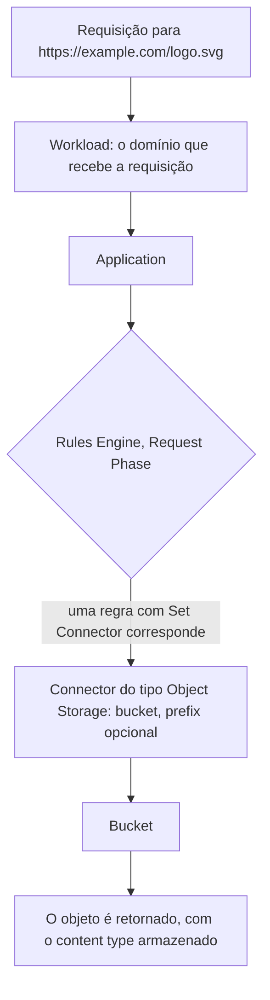

import FrameBox from '@aziontech/webkit/frame-box'
import ItemList from '@aziontech/webkit/item-list'
import DocItem from '@aziontech/webkit/doc-item'

O armazenamento de objetos mantém um arquivo inteiro, sob um nome que você escolhe, em um contêiner plano. Não há diretórios nem escritas parciais: um arquivo é escrito uma vez, lido como uma unidade e substituído por inteiro. O nome é o único endereço que ele tem, então tudo que encontra o arquivo depois o encontra por esse nome.

Na Azion, o contêiner é um bucket e o arquivo é um objeto. Um objeto carrega sua chave, seu conteúdo e o content type com que é servido. Um bucket guarda objetos diretamente, e um bucket não fica aninhado dentro de outro. Os mesmos objetos são alcançáveis pela API da Azion, pela Azion CLI, pelo Azion Runtime, pela biblioteca `azion` e pelo protocolo S3, e por uma aplicação quando um [Connector](/pt-br/documentacao/plataforma/connectors/) aponta para o bucket.

Esta página cobre os mecanismos, não os valores. Os campos e seus limites estão em [Buckets e objetos](/pt-br/documentacao/store/object-storage/buckets-e-objetos/), e a superfície S3 está em [Compatibilidade com S3](/pt-br/documentacao/store/object-storage/compatibilidade-s3/). As seções abaixo cobrem o objeto e sua chave, o caminho da requisição, os níveis de acesso, a entrega de objetos e a exclusão.

---

## O objeto e sua chave

Um upload nomeia o bucket e a chave e envia o conteúdo como corpo da requisição. Não existe uma sequência de criar e depois escrever: o objeto existe quando a requisição é bem-sucedida e não existe antes disso.

A chave é o endereço inteiro. Ela pode conter a barra, e toda interface lê um segmento inicial compartilhado como um prefixo, então `src/assets/logo.svg` aparece agrupado sob `src` e `src/assets`. Esses agrupamentos são lidos das chaves que existem; nada os cria e nada fica para trás quando a última chave sob um prefixo é removida. O custo dessa ausência de hierarquia é que uma chave não pode ser renomeada e um objeto não pode ser movido. Mudar onde um objeto aparece significa escrevê-lo sob a nova chave e excluir a antiga, que é o que uma cópia seguida de uma exclusão faz.

Escrever em uma chave que já está em uso substitui o objeto por inteiro. Não há histórico de versões nem atualização parcial, então o conteúdo anterior não pode ser recuperado. Um objeto que precisa continuar recuperável depois de uma alteração é escrito sob uma nova chave, e é por isso que um nome que carrega uma versão é a abordagem usual para conteúdo que uma aplicação serve.

O content type é fixado no upload a partir do header `Content-Type`, e a Azion o detecta quando a requisição não envia nenhum. Ele é armazenado junto com o objeto e retornado em toda leitura, então um objeto enviado com o content type errado continua sendo servido com o tipo errado até ser escrito de novo.

---

## O caminho da requisição

Dois caminhos levam ao mesmo objeto, e eles são autenticados de formas diferentes.

O **caminho de gerenciamento** é a API da Azion, a Azion CLI, a biblioteca `azion` e o protocolo S3. Ele autentica com um personal token, ou com uma credencial S3 no caso do protocolo S3, e alcança todos os buckets que a conta possui. É por ele que os objetos são criados, listados, substituídos e removidos.

O **caminho de entrega** é uma aplicação, e é por ele que um usuário final alcança um objeto. Uma requisição chega a um workload, que é dono do domínio. O workload a entrega a uma aplicação, cujo Rules Engine decide o que a responde. Uma regra com o behavior **Set Connector** envia a requisição para um connector do tipo Object Storage, que nomeia um bucket e, opcionalmente, um prefixo dentro dele:

A cadeia é o que torna um bucket alcançável, e nada disso acontece por padrão. Criar um bucket não expõe nada: até que um connector nomeie o bucket e uma regra envie requisições para ele, os objetos são alcançáveis apenas pelo caminho de gerenciamento. O prefixo no connector decide onde começa o caminho da aplicação, então um connector com o prefixo `src/assets` serve o objeto `src/assets/logo.svg` em `/logo.svg`.

Uma function é uma terceira via de entrada, em qualquer um dos caminhos. O código executado no [Azion Runtime](/pt-br/documentacao/devtools/runtime/api-reference/storage/) lê e escreve objetos com `azion:storage` durante uma requisição, que é como uma aplicação serve um objeto sobre o qual precisa decidir antes, como um objeto atrás de uma verificação de autenticação.

---

## Níveis de acesso

Um bucket carrega `workloads_access`, e esse campo decide o que a plataforma da Azion pode fazer com os objetos quando uma aplicação os serve. É uma propriedade do bucket, não de uma requisição.

| Valor | A plataforma pode |
| --- | --- |
| `read_only` | Ler objetos |
| `read_write` | Ler e escrever objetos |
| `restricted` | Nenhum dos dois, e o bucket não pode servir de origem para uma aplicação |

O nível governa apenas o caminho de entrega. Ele não restringe o caminho de gerenciamento: um token ou uma credencial S3 com permissão de escrita escreve em um bucket definido como `read_only`, porque a conta já provou quem é. Essa separação é o propósito do campo. Ela permite que um bucket seja escrito por um pipeline de deploy e apenas lido pelo público, que é o que conteúdo estático precisa.

O custo de `read_write` é que a aplicação herda a permissão. Qualquer requisição que alcança um bucket `read_write` por uma aplicação pode modificá-lo, então um bucket definido assim precisa de uma function na frente dele que decida quais requisições podem escrever. `restricted` remove o caminho de entrega por inteiro, para dados que nenhuma aplicação deve servir.

---

## Entrega de objetos

Os objetos chegam aos usuários finais por uma aplicação, não pelo endpoint S3.

O endpoint S3 é uma interface de gerenciamento. Ele responde a requisições assinadas da conta que possui a credencial, venham de onde vierem, e é dimensionado para gerenciar objetos, não para servir tráfego. Enviar usuários finais para ele, diretamente ou por uma URL pré-assinada, contorna a aplicação por completo: as requisições não passam pela infraestrutura distribuída da Azion, não são cacheadas e chegam a uma única interface de gerenciamento na taxa que a audiência produzir.

A Azion declara a consequência em contrato: alcançar os objetos sem passar por uma aplicação está sujeito a limites de taxa. Os [Termos de Serviço](/pt-br/documentacao/contratos/tds/) trazem a cláusula, e nenhuma página declara um valor para ela.

Servir os mesmos objetos por uma aplicação os coloca atrás de um workload e de um connector, onde [Cache](/pt-br/documentacao/build/cache/) pode manter uma cópia e as regras que já governam a aplicação valem. O custo é a configuração: um connector e uma regra precisam existir antes que qualquer coisa seja servida, o que o endpoint S3 não exige. Essa configuração é o que o caminho de entrega compra.

---

## Exclusão e o período de carência

Excluir um objeto é assíncrono e acontece em etapas. A requisição é aceita, a chave deixa de ser listada e uma leitura dela retorna um erro de imediato. O objeto em si é retido por um período de carência de 24 horas antes de ser removido permanentemente.

O período de carência é a razão pela qual um bucket esvaziado não pode ser excluído de imediato. Um bucket é excluído apenas quando não guarda nenhum objeto e nenhum foi removido dele nas últimas 24 horas, e os dois casos retornam o mesmo erro. Um bucket que nunca guardou um objeto é excluído na hora, que é o único caso em que a espera não se aplica.

Excluir um objeto não altera nada que aponte para ele. Um connector que nomeia o bucket continua nomeando, e uma requisição pela chave excluída é respondida pela aplicação como um objeto ausente, não como um bucket ausente.

---

## Recursos relacionados

<FrameBox>
<ItemList>
  <DocItem title="Buckets e objetos" href="/pt-br/documentacao/store/object-storage/buckets-e-objetos/">Os campos por trás de cada mecanismo desta página, com as operações e os erros.</DocItem>
  <DocItem title="Compatibilidade com S3" href="/pt-br/documentacao/store/object-storage/compatibilidade-s3/">A credencial e as operações que o caminho de gerenciamento expõe pelo protocolo S3.</DocItem>
  <DocItem title="Boas práticas" href="/pt-br/documentacao/store/object-storage/boas-praticas/">O que fazer sobre substituição, níveis de acesso e entrega, e o que cada escolha custa.</DocItem>
  <DocItem title="Usar um bucket como origem" href="/pt-br/documentacao/guias/desenvolvimento-de-aplicacoes/dados/bucket-como-connector/">O procedimento que constrói o caminho de entrega, do connector até a regra.</DocItem>
  <DocItem title="Connectors" href="/pt-br/documentacao/plataforma/connectors/">O recurso que aponta uma aplicação para um bucket e seu prefixo.</DocItem>
  <DocItem title="Limites do Object Storage" href="/pt-br/documentacao/store/object-storage/limites/">Os limites dentro dos quais esses mecanismos operam, e o uso que cada plano inclui.</DocItem>
</ItemList>
</FrameBox>
