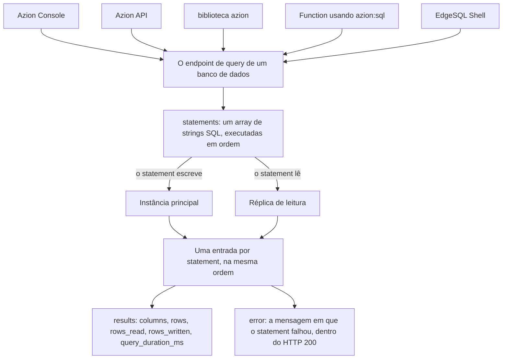

import FrameBox from '@aziontech/webkit/frame-box'
import ItemList from '@aziontech/webkit/item-list'
import DocItem from '@aziontech/webkit/doc-item'

Um banco de dados relacional guarda dados em tabelas de linhas e colunas. Toda leitura desses dados, e toda alteração neles, é escrita como um statement SQL. O statement não viaja com os dados: ele é enviado para onde os dados estão, executa ali e retorna linhas. Uma cópia dos dados recebe as alterações, e outras cópias dos mesmos dados respondem às leituras.

Na Azion, esses dados ficam em um banco de dados que você cria em SQL Database. A plataforma executa uma instância principal, que recebe todas as escritas, e réplicas de leitura, que respondem às leituras. Cinco interfaces alcançam o mesmo banco de dados: Azion Console, a API da Azion, a biblioteca `azion`, o módulo `azion:sql` dentro de uma [function](/pt-br/documentacao/build/functions/) e o EdgeSQL Shell. Qualquer uma que você use, alcançar os dados significa enviar statements SQL para o banco de dados.

Esta página cobre os mecanismos, não os valores. Os campos, as operações e os códigos de erro estão em [Bancos de dados e consultas](/pt-br/documentacao/store/sql-database/bancos-de-dados-e-consultas/). Os limites e o uso que cada plano inclui estão em [Limites do SQL Database](/pt-br/documentacao/store/sql-database/limites/), e os tipos e funções de vetor estão em [Vector Search do SQL Database](/pt-br/documentacao/store/sql-database/vector-search/). As seções abaixo cobrem o banco de dados e suas instâncias, o ciclo de vida de um banco de dados, o caminho de um statement até os dados, o custo de um statement e o dialeto SQL.

---

## O banco de dados e suas instâncias

Um banco de dados é o artefato que você cria em SQL Database. As tabelas ficam dentro dele, e todo statement é endereçado a um banco de dados, pelo identificador que a plataforma atribui a ele.

Por trás desse único banco de dados, a plataforma mantém mais de uma cópia dos dados. A instância principal recebe todas as escritas, e é a única instância em que uma escrita é aplicada. As réplicas de leitura guardam cópias dos mesmos dados e respondem às leituras, e é isso que as torna somente leitura: nada escreve diretamente em uma réplica.

Leituras e escritas escalam, assim, de forma separada. Quem lê é atendido pelas réplicas, então o tráfego de leitura não disputa a instância que aceita as escritas. Uma leitura é respondida a partir de uma cópia dos dados, e não do único lugar que toda escrita precisa alcançar.

O custo é que uma réplica é uma cópia, e não o banco de dados em si, e que toda escrita continua tendo um único destino. As réplicas adicionam capacidade de leitura e nenhuma de escrita, então o throughput de escrita pertence apenas à instância principal, por mais réplicas que respondam às leituras.

---

## O ciclo de vida de um banco de dados

Criar um banco de dados em SQL Database é assíncrono. `POST /databases` responde `202` de imediato, com `state` em `pending` no envelope e `status` em `creating` no próprio banco de dados. Os dois campos descrevem coisas diferentes: `state` descreve a requisição, e `status` descreve o recurso.

O provisionamento leva cerca de 15 segundos. O banco de dados fica utilizável quando seu `status` mostra `created`, e `GET /databases/{database_id}` é o que informa isso: uma requisição de retrieve responde `200` e não carrega chave `state` alguma. Um cliente que cria um banco de dados e o consulta na linha seguinte precisa primeiro fazer polling em `status`. Até o status mudar, um statement não tem onde executar.

A exclusão é assíncrona da mesma forma, e não espera a criação terminar. `DELETE` responde `202` com `state` em `pending`, e a plataforma aceita a chamada mesmo enquanto o status ainda é `creating`. Em segundos o banco de dados responde `404`, então o identificador para de resolver quase imediatamente.

Não há nada entre esses dois extremos. O nome é fixado na criação, e `active` só é aceito ali: `PATCH` e `PUT` respondem `405`. Para os campos, os envelopes e os códigos de erro, consulte [Bancos de dados e consultas](/pt-br/documentacao/store/sql-database/bancos-de-dados-e-consultas/).

Responder `202` e provisionar em segundo plano mantém a chamada de criação curta, e custa ao chamador a sua confirmação. A resposta da criação prova que a requisição foi aceita, nunca que o banco de dados está pronto, e `status` é o único campo que diz isso.

---

## O caminho de um statement até os dados

Os statements de uma chamada a SQL Database são executados na ordem em que o array os lista, e cada um retorna sua própria entrada. Um statement que falha, portanto, não faz a requisição falhar: a chamada ainda responde HTTP `200`, e a entrada desse statement carrega `error` no lugar de `results`.

A cadeia abaixo é o que uma única chamada percorre, da interface que a envia até a entrada em que ela retorna:

1. Um chamador envia `POST /databases/{database_id}/query` com um array `statements` contendo uma ou mais strings SQL.
2. A plataforma executa os statements na ordem em que o array os lista.
3. Um statement que escreve é aplicado na instância principal, e um statement que lê é respondido por uma réplica de leitura.
4. Cada statement produz uma entrada em `data`, na mesma ordem em que os statements foram enviados.
5. Uma entrada carrega `results`, com `columns`, `rows`, `rows_read`, `rows_written` e `query_duration_ms`, ou carrega `error` com a mensagem em que o statement falhou.
6. A resposta carrega `state` em `executed` e HTTP `200`, tanto se todos os statements funcionaram quanto se um deles falhou.

O mesmo endpoint executa todo tipo de statement. `CREATE TABLE`, `INSERT` e `SELECT` são todos strings nesse único array, então mudanças de schema, escritas e leituras compartilham um único caminho e uma única chamada pode misturá-las.

Um endpoint para todo tipo de statement mantém a superfície pequena, e custa ao chamador o sinal de falha em que ele costuma confiar. O status HTTP descreve a requisição, não o SQL, então um cliente lê `data[].error` em cada entrada antes de ler `data[].results`.

---

## O custo de um statement

Todo statement bem-sucedido informa o que leu e o que escreveu. `rows_read` e `rows_written` voltam dentro da mesma entrada que `columns` e `rows`, por statement e não por chamada, e `query_duration_ms` informa quanto tempo aquele statement executou.

Esses dois contadores são as métricas pelas quais SQL Database é cobrado, o que torna o custo de uma consulta legível na própria resposta que a retorna. Medir um statement contra uma tabela pequena antes de executá-lo contra uma grande transforma o preço em algo que você verifica, e não em algo que você descobre.

Uma interface não os repassa. A biblioteca `azion` descarta `rows_read`, `rows_written` e `query_duration_ms` do resultado da consulta, então uma conta que mede o próprio consumo pega esses três da API.

`rows_read` conta as linhas que o statement leu, não as linhas que ele retornou. Um `SELECT` que varre uma tabela grande para retornar uma única linha gasta a cota de leitura de cada linha que tocou. Uma consulta pouco seletiva, portanto, custa o mesmo se muito voltar ou se nada voltar. Para as linhas que cada plano inclui, consulte [Limites do SQL Database](/pt-br/documentacao/store/sql-database/limites/).

---

## O dialeto SQL

SQL Database usa o dialeto do SQLite, e seus bancos de dados são totalmente compatíveis com ACID. Os statements, os tipos e as funções nativas são os que o SQLite define. Um schema e as consultas sobre ele são escritos como seriam para o SQLite, então o SQL que você já conhece funciona sem uma etapa de tradução. Para a sintaxe que cada statement aceita, consulte a [referência da linguagem SQLite](https://www.sqlite.org/lang.html).

Vector Search estende esse dialeto em vez de substituí-lo. Um vetor é armazenado em uma coluna declarada com um tipo de blob de vetor, e as funções de distância são chamadas a partir de um `SELECT` comum. O índice sobre uma coluna de vetor é criado com `CREATE INDEX`, então uma busca semântica e uma consulta relacional executam contra as mesmas tabelas, na mesma chamada. Para os tipos, as funções e o índice, consulte [Vector Search](/pt-br/documentacao/store/sql-database/vector-search/).

Adotar o dialeto do SQLite por inteiro é o que torna o SQL familiar, e é também o limite. SQL escrito para um engine baseado em servidor pode usar sintaxe que o SQLite não define, então um schema que vem de um deles é portado, não colado.

---

## Recursos relacionados

<FrameBox>
<ItemList>
  <DocItem title="Bancos de dados e consultas" href="/pt-br/documentacao/store/sql-database/bancos-de-dados-e-consultas/">Cada campo, operação, envelope e código de erro por trás dos mecanismos desta página.</DocItem>
  <DocItem title="Vector Search" href="/pt-br/documentacao/store/sql-database/vector-search/">Os tipos de coluna de vetor, as funções de distância e o índice de que elas precisam.</DocItem>
  <DocItem title="Limites do SQL Database" href="/pt-br/documentacao/store/sql-database/limites/">Os limites dentro dos quais esses mecanismos operam, e o uso que cada plano inclui.</DocItem>
  <DocItem title="Boas práticas" href="/pt-br/documentacao/store/sql-database/boas-praticas/">As recomendações que decorrem desses mecanismos, e o que cada uma custa.</DocItem>
  <DocItem title="Primeiros passos com SQL Database usando Azion Console" href="/pt-br/documentacao/store/sql-database/primeiros-passos/">Criar um primeiro banco de dados e executar statements nele.</DocItem>
  <DocItem title="SQL Database API" href="/pt-br/documentacao/devtools/runtime/api-reference/sql-database/">Alcançar o mesmo banco de dados de dentro de uma function, com `azion:sql`.</DocItem>
</ItemList>
</FrameBox>
